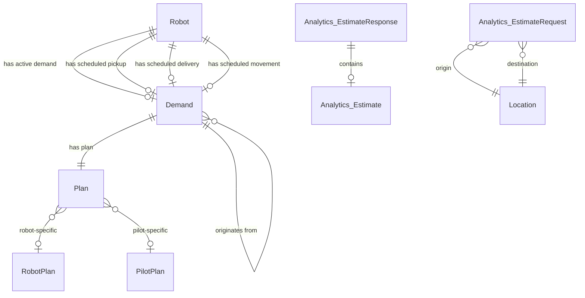
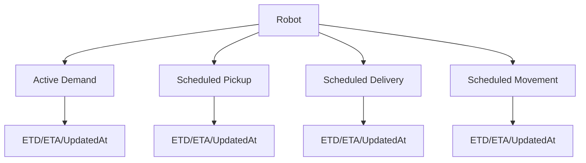
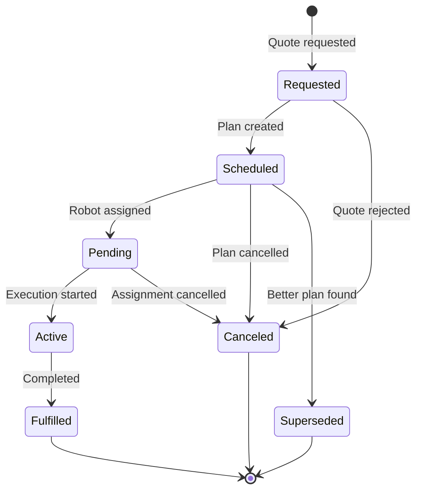

---
tags:
  - database
  - prisma
  - dispatch-engine
  - backend
---
# Dispatch Engine RDS Schema

**Database**: PostgreSQL  
**Service**: [[Dispatch Engine]]  
**Schema File**: [`service/dispatch-engine/prisma/schema.prisma`](../../../delivery-platform/service/dispatch-engine/prisma/schema.prisma)

The Dispatch Engine database manages resource planning, demand scheduling, and availability estimates for robot deliveries. It maintains the current state of robots and pilots for scheduling decisions.

## Core Domain Tables

### Resource Management
- [[Robot Planning Table]] - Robot availability and scheduling state
- [[Resource Table]] - Generic resource registry (pilots and robots)

### Demand Planning
- [[Demand Table]] - Delivery/movement demand requests
- [[Plan Table]] - Execution plans for demands
- [[RobotPlan Table]] - Robot-specific plan details
- [[PilotPlan Table]] - Pilot-specific plan details

### Analytics
- [[Analytics_EstimateRequest Table]] - Estimate request tracking
- [[Analytics_EstimateResponse Table]] - Estimate response tracking
- [[Analytics_Estimate Table]] - Estimate details

### Geography
- [[Location Dispatch Table]] - Location records for dispatch

## Schema Diagram

## Key Enums

- [[DemandType Enum]] - Delivery, Deployment, Return, Pickup
- [[DemandStatus Enum]] - Requested, Scheduled, Pending, Active, Fulfilled, Canceled, Superseded
- [[LimitingFactor Enum]] - PilotAvailability, RobotAvailability, Unroutable, etc.
- [[ResourceType Enum]] - Pilot, Robot

## Robot State Tracking

The [[Robot Planning Table]] maintains critical scheduling state:

Each robot can have:
- 1 active demand (currently executing)
- 1 scheduled pickup (next pickup to perform)
- 1 scheduled delivery (next delivery to perform)
- 1 scheduled movement (next repositioning move)

## Demand Lifecycle

## Related Concepts

- [[Dispatch Engine]] - Service using this database
- [[Demand]] - Core demand concept
- [[Supply]] - Resource availability concept
- [[Continuous Replanning]] - How plans are updated
- [[Point-to-Point (P2P) Dispatch]] - P2P dispatch feature
- [[PlannerService]] - Planning service component

