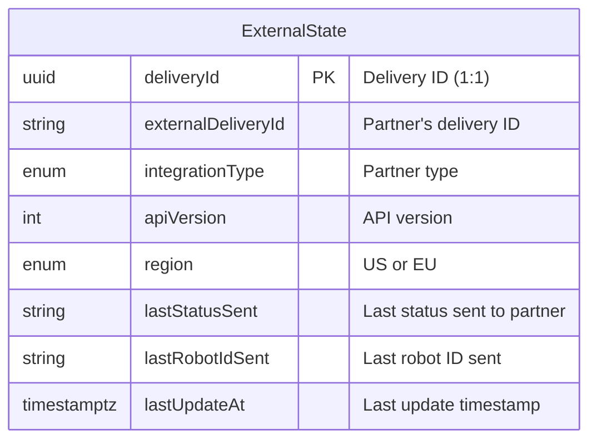
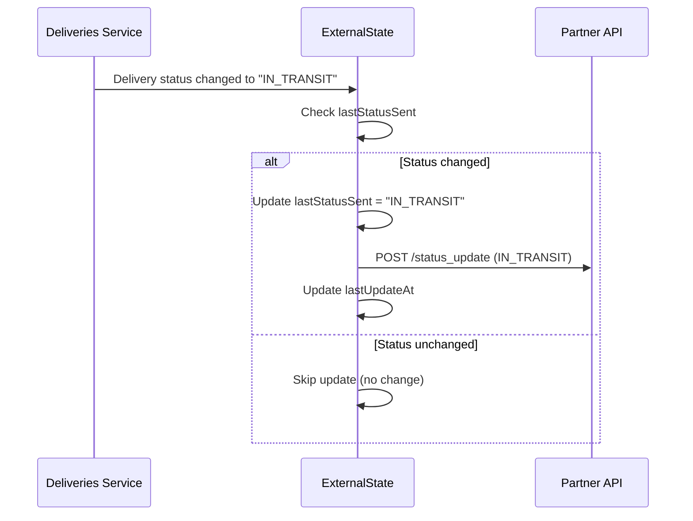

---
tags:
  - database
  - table
  - integrations
  - state-management
---
# ExternalState Table

**Database**: [[Integrations RDS Schema]]  
**Table Name**: `external_state`  
**Schema File**: [`service/integrations/prisma/schema.prisma`](../../../delivery-platform/service/integrations/prisma/schema.prisma)

Manages the bidirectional integration state between the delivery platform and external partners. This is a **1:1 table with deliveries** that tracks what status updates have been sent to partners to prevent duplicates and maintain consistency.

## Schema



## Columns

### Identifiers
- `deliveryId` (String, UUID) - Primary key, unique, references delivery in [[Deliveries Service]]
- `externalDeliveryId` (String) - Partner's external delivery identifier
- `integrationType` ([[IntegrationType Enum]]) - Type of integration
  - THREEPL, ORDERMARK, ALLY, OLO, OTTER, CHOWLY, DOORDASH, UBER, HUUVA

### API Configuration
- `apiVersion` (Int) - API version for this partner (e.g., 1, 2, 3)
- `region` ([[Region Enum]]) - Geographic region
  - US - United States endpoints
  - EU - European endpoints

### State Tracking
- `lastStatusSent` (String, nullable) - Last status value sent to partner
- `lastRobotIdSent` (String, nullable) - Last robot identifier sent to partner
- `lastUpdateAt` (DateTime, nullable) - When last update was sent

## Unique Constraints

- **Primary**: `deliveryId` (one external state per delivery)
- **Alternate**: `[externalDeliveryId, integrationType]` (unique per partner)

## Purpose: Preventing Duplicate Updates



## API Version Handling

Different partners have different API versions with different status values:

**Example: DoorDash**
- **v1 API**: Uses enum values (e.g., `DELIVERY_STATUS_HEADING_TO_LOADING_LOCATION`)
- **v2 API**: Uses string values (e.g., `heading_to_pickup`)

The `apiVersion` field determines:
1. Which endpoint to call
2. How to format the status value
3. What fields to include in payload

## Locking Pattern

External state updates use optimistic locking:

```typescript
// Pseudo-code for status update
async function sendStatusUpdate(deliveryId: string, newStatus: string) {
  return await prisma.$transaction(async (tx) => {
    // Read current state
    const state = await tx.externalState.findUnique({
      where: { deliveryId }
    });
    
    // Skip if status unchanged
    if (state.lastStatusSent === newStatus) {
      return;
    }
    
    // Send to partner
    await sendToPartnerAPI(state.externalDeliveryId, newStatus);
    
    // Update state atomically
    await tx.externalState.update({
      where: { deliveryId },
      data: {
        lastStatusSent: newStatus,
        lastUpdateAt: new Date()
      }
    });
  });
}
```

## Status Mapping

Each integration type maps internal statuses to partner-specific formats:

| Internal Status | DoorDash v1 | DoorDash v2 | Uber |
|----------------|-------------|-------------|------|
| InTransitToPartner | `DELIVERY_STATUS_HEADING_TO_LOADING_LOCATION` | `heading_to_pickup` | `en_route_to_pickup` |
| AtPickup | `DELIVERY_STATUS_WAITING_FOR_LOAD` | `at_pickup` | `at_pickup` |
| InTransit | `DELIVERY_STATUS_HEADING_TO_DROPOFF_LOCATION` | `heading_to_dropoff` | `en_route_to_dropoff` |
| Delivered | `DELIVERY_STATUS_DELIVERY_COMPLETED` | `delivered` | `delivered` |

## Use Cases

1. **Prevent Duplicates**: Don't send same status multiple times
2. **State Synchronization**: Track what partner knows about delivery
3. **Debugging**: Audit trail of status updates sent
4. **Retry Logic**: Know what status was last successful
5. **Regional Routing**: Direct to US vs EU endpoints

## Related Tables

### Status Update Audit Trail
- [[DoorDashUpdate Table]] - Inbound status updates from DoorDash (v1)
- [[DoorDashUpdateV2 Table]] - Inbound status updates from DoorDash (v2)
- [[ClientRequests Table]] - Outbound API requests
- [[ClientResponses Table]] - API responses received

## Related Concepts

- [[Integrations Service]] - Service managing external state
- [[Deliveries Service]] - Source of status changes
- [[Integration Provider Tables]] - Partner-specific tables
- [[IntegrationType Enum]] - Integration types
- [[DoorDash Integration Testing]] - Testing integration flows

