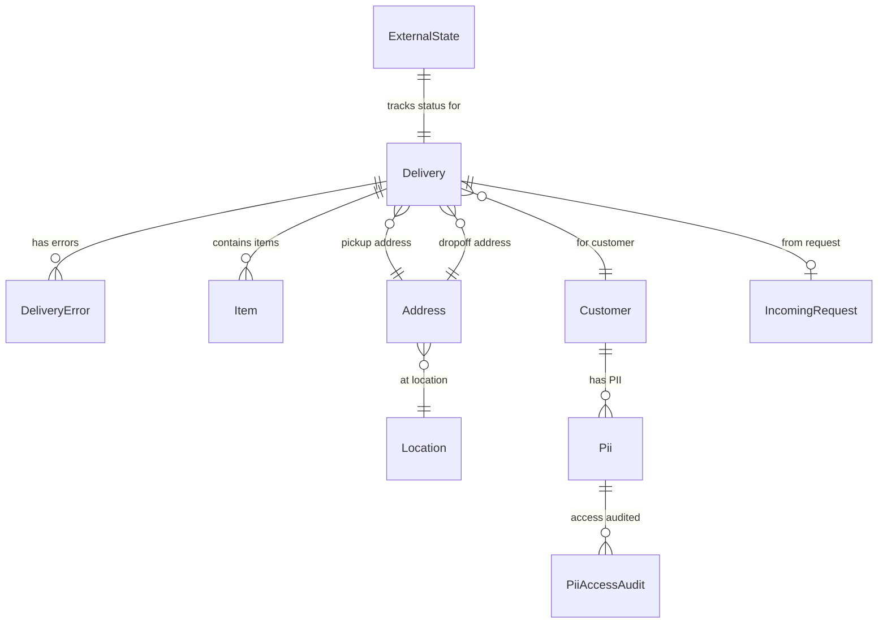
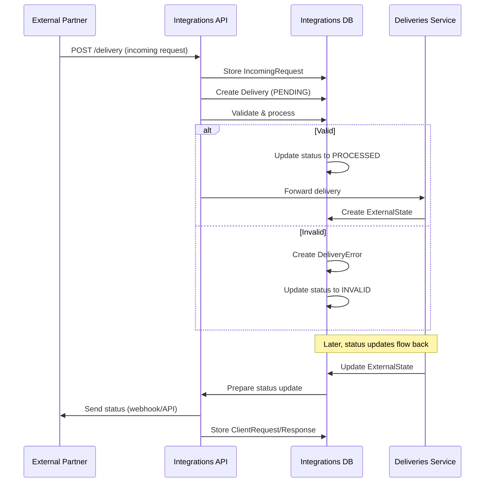

---
tags:
  - database
  - prisma
  - integrations
  - backend
---
# Integrations RDS Schema

**Database**: PostgreSQL  
**Service**: [[Integrations Service]]  
**Schema File**: [`service/integrations/prisma/schema.prisma`](../../../delivery-platform/service/integrations/prisma/schema.prisma)

The Integrations database processes incoming delivery orders from external partners (DoorDash, Uber, OLO, etc.) and manages outgoing status updates to those partners.

## Core Domain Tables

### Delivery Processing
- [[Delivery Integration Table]] - Processed delivery records from integrations
- [[DeliveryError Table]] - Validation errors for deliveries
- [[Item Table]] - Order line items

### External State Management
- [[ExternalState Table]] - Integration status tracking (1:1 with deliveries)
- [[DoorDashUpdate Table]] - DoorDash status updates (v1)
- [[DoorDashUpdateV2 Table]] - DoorDash status updates (v2)
- [[UberTransportPlan Table]] - Uber transport plan records

### Customer Data
- [[Customer Integration Table]] - Customer records
- [[Pii Table]] - Personally Identifiable Information (encrypted)
- [[PiiAccessAudit Table]] - PII access audit log

### Geography
- [[Location Integration Table]] - Geographic locations
- [[Address Table]] - Detailed address information

### API Tracking
- [[IncomingRequest Table]] - Incoming API requests
- [[ClientRequests Table]] - Outgoing API requests
- [[ClientResponses Table]] - External service responses

### Legacy Tables (Deprecated)
- [[Merchant Integration Table]] - Merchant records (deprecated)
- [[Integration Config Table]] - Integration configurations (deprecated)

## Schema Diagram

## Key Enums

- [[DeliveryStatus Integration Enum]] - PROCESSED, INVALID, PENDING, NOT_RELEVANT
- [[IntegrationType Enum]] - THREEPL, ORDERMARK, ALLY, OLO, OTTER, CHOWLY, DOORDASH, UBER, HUUVA
- [[Source Enum]] - chow_now, door_dash, grubhub, uber_eats, etc.
- [[Region Enum]] - US, EU
- [[ControlledContents Enum]] - Alcohol, Tobacco, Marijuana
- [[DoorDashDeliveryStatus Enum]] - Various DoorDash-specific statuses

## Integration Flow

## External State Management

The [[ExternalState Table]] is critical for managing bidirectional integration:

- **1:1 with deliveries**: Each delivery has exactly one external state record
- **Tracks last status sent**: Prevents duplicate status updates
- **API version aware**: Different partners have different API versions
- **Locking pattern**: Used to synchronize status update sends

## PII Protection

Customer data is split across tables:

- [[Customer Integration Table]] - Non-sensitive metadata
- [[Pii Table]] - Sensitive customer information (name, phone, address, instructions)
- [[PiiAccessAudit Table]] - Audit log of who accessed PII and when

## Related Concepts

- [[Integrations Service]] - Service using this database
- [[Deliveries Service]] - Downstream service receiving processed deliveries
- [[Integration Provider Tables]] - External provider schemas
- [[DoorDash Integration Testing]] - Testing integration flows
- [[Uber Eats Integration Testing]] - Testing integration flows

