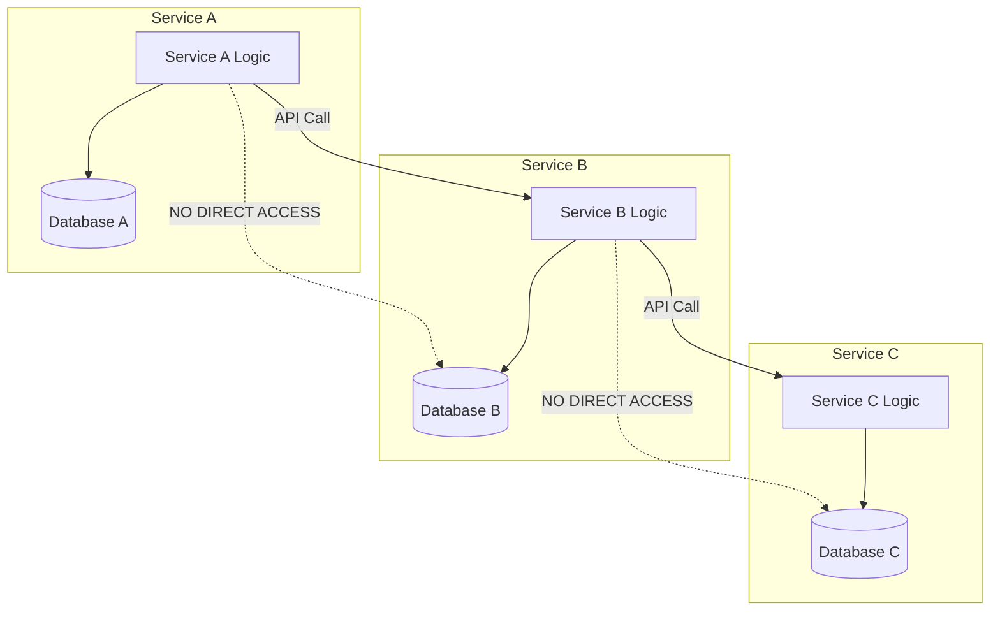
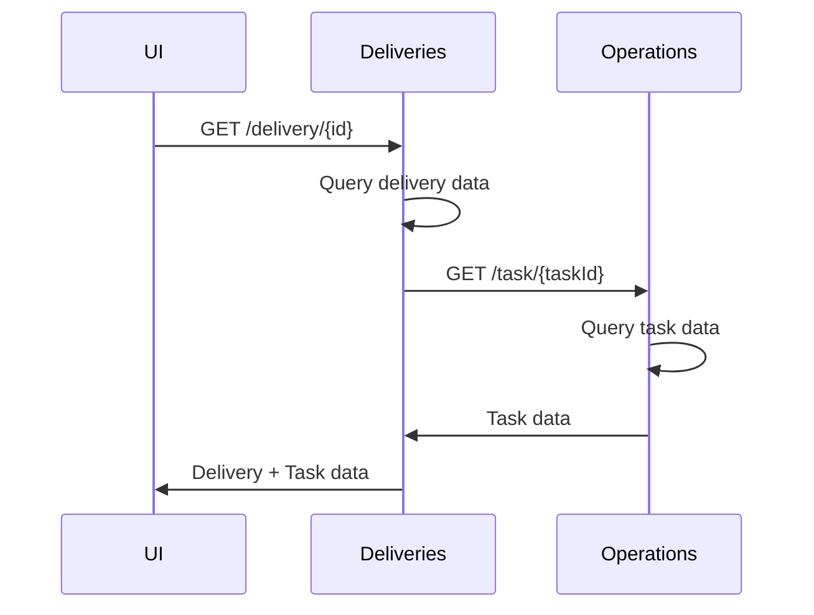
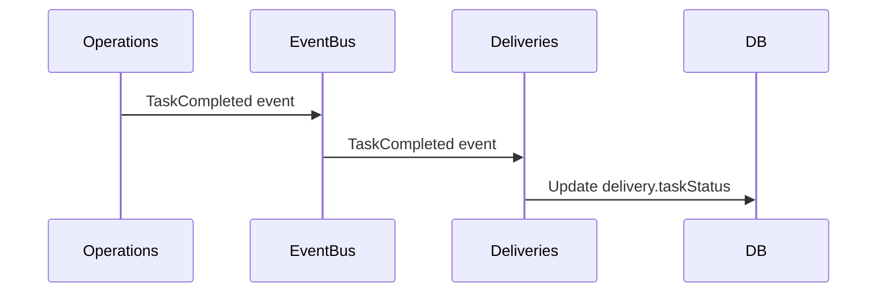
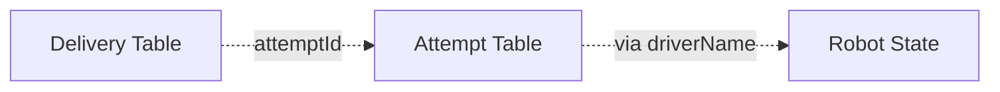
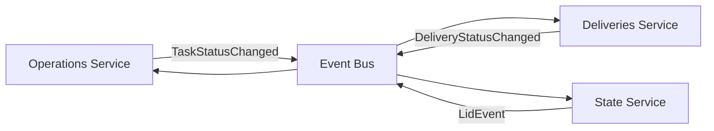
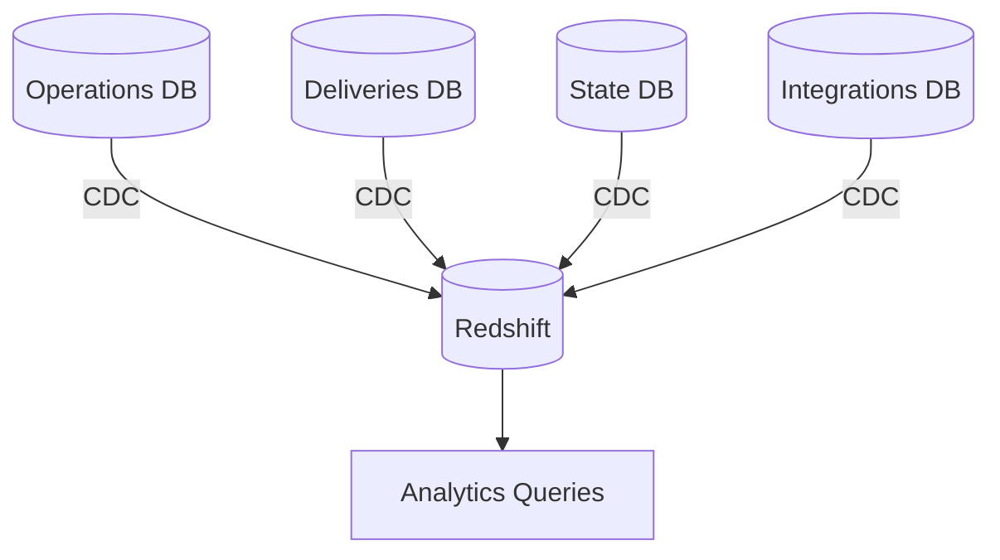

---
tags:
  - architecture
  - pattern
  - database
  - microservices
---
# Microservices Database Pattern

The delivery platform follows the **database-per-service** pattern, where each microservice owns its own database. This is a core principle of microservices architecture.

## Pattern Overview



## Key Principles

### 1. Service Owns Its Data
Each service has exclusive ownership of its database:
- Only [[Operations Service]] writes to [[Operations RDS Schema]]
- Only [[Deliveries Service]] writes to [[Deliveries V3 RDS Schema]]
- Only [[State Service]] writes to [[State RDS Schema]]

### 2. No Cross-Database Joins
Services cannot directly join tables across databases. Instead, use:
- **API calls** to fetch related data
- **Event-driven synchronization** for denormalized copies
- **Application-level joins** when needed

### 3. Data Sovereignty
Each service defines its own schema:
- [[Operations Service]] defines what a [[Task Table|Task]] means operationally
- [[Dispatch Engine]] defines what a [[Demand Table|Demand]] means for planning
- No shared schema definitions

## Data Sharing Strategies

### Strategy 1: API Calls (Synchronous)



**Pros**: Always fresh data, strong consistency  
**Cons**: Latency, coupling, availability dependency

### Strategy 2: Event-Driven Denormalization (Asynchronous)



**Example in Platform**:
- [[Deliveries Service]] stores `attemptId` in delivery record
- When attempt status changes, event updates delivery
- Delivery has denormalized `status` field

**Pros**: Fast reads, service independence  
**Cons**: Eventual consistency, duplicate data

### Strategy 3: Identifiers + Application Joins



Store foreign key identifiers across services:
- [[Delivery V3 Table]] stores `attemptId`
- [[Task Table]] stores `deliveryId`
- [[Demand Table]] stores `tripId`

Application fetches data from multiple services and joins in memory.

**Pros**: Flexible, clear ownership  
**Cons**: Multiple round trips, consistency challenges

## Common Patterns in Platform

### Pattern: Linking Keys Across Services

```typescript
// Deliveries Service
interface Delivery {
  id: string;
  latestAttemptId: string;  // Own service
  taskId?: string;          // Operations Service
  demandId?: string;        // Dispatch Engine
}

// Operations Service
interface Task {
  id: string;
  deliveryId?: string;      // Deliveries Service
  attemptId?: string;       // Deliveries Service
  robotSerial: string;      // Own service
}
```

### Pattern: Status Denormalization

Frequently accessed statuses are denormalized:

```typescript
// Deliveries Service
interface Delivery {
  status: DeliveryStatus;           // Own field
  latestAttemptId: string;          // Reference
  latestAttempt?: {                 // Denormalized for convenience
    status: AttemptStatus;
  }
}
```

### Pattern: Event-Driven State Sync

Services publish events when important state changes:



Each service subscribes to relevant events and updates its own database.

## Challenges & Solutions

### Challenge 1: Distributed Queries
**Problem**: Need to show delivery with task, attempt, and robot data  
**Solution**: 
- Backend for Frontend (BFF) pattern
- GraphQL federation
- Denormalize frequently accessed data

### Challenge 2: Referential Integrity
**Problem**: No database-level foreign key constraints across services  
**Solution**:
- Eventual consistency through events
- Soft deletes instead of hard deletes
- Cleanup jobs for orphaned references

### Challenge 3: Transactions Across Services
**Problem**: Need atomicity across multiple services  
**Solution**:
- [[Saga Pattern]] for distributed transactions
- Compensating transactions for rollback
- Idempotent operations

### Challenge 4: Data Analytics
**Problem**: Need to join data across all services for reporting  
**Solution**:
- [[Redshift Data Warehouse]] - Centralized analytics database
- ETL pipelines sync from all service databases
- Read replicas for complex queries

## Analytics Pattern



All service databases are synced to [[Redshift Data Warehouse]] where cross-service joins are performed for analytics.

## Related Concepts

- [[Database Architecture Overview]] - Overall database architecture
- [[Operations Service]] - Example service with owned database
- [[Deliveries Service]] - Example service with owned database
- [[Event Logging - Technical Design]] - Event-driven communication
- [[Redshift Data Warehouse]] - Analytics database
- [[Entity Relationship Diagram]] - Cross-service relationships

