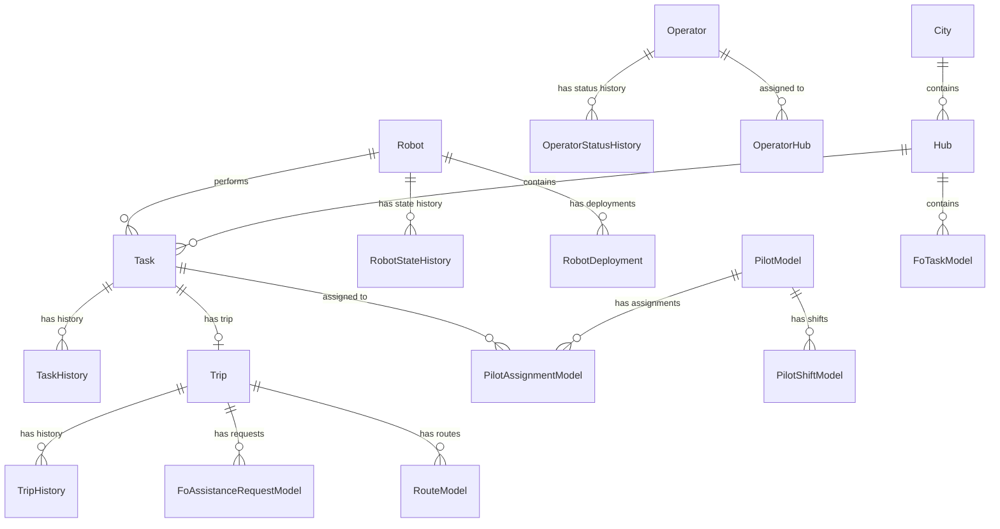

---
tags:
  - database
  - prisma
  - operations
  - backend
---
# Operations RDS Schema

**Database**: PostgreSQL  
**Service**: [[Operations Service]]  
**Schema File**: [`service/operations/prisma/schema.prisma`](../../../delivery-platform/service/operations/prisma/schema.prisma)

The Operations database manages the operational workflow for robot deliveries, including tasks, trips, pilots, field operators, and resource assignments.

## Core Domain Tables

### Task Management
- [[Task Table]] - Operational tasks for robot deliveries
- [[TaskHistory Table]] - Status change history for tasks
- [[Trip Table]] - Physical trips by robots
- [[TripHistory Table]] - Trip status change history

### Robot Management
- [[Robot Table]] - Robot device records
- [[RobotStateHistory Table]] - Operational state history
- [[RobotDeployment Table]] - Robot deployment tracking
- [[RobotCheckInHistory Table]] - Check-in/check-out events

### Operator Management
- [[Operator Table]] - Human operators (pilots, dispatch, field ops)
- [[OperatorStatusHistory Table]] - Operator status changes
- [[OperatorMobileDevice Table]] - Mobile device registrations
- [[OperatorHub Table]] - Operator-hub assignments

### Pilot System
- [[PilotModel Table]] - Pilot-specific operator data
- [[PilotShiftModel Table]] - Pilot work shifts
- [[PilotShiftStateHistoryModel Table]] - Shift status history
- [[PilotAssignmentModel Table]] - Pilot task assignments
- [[PilotAssignmentStatusHistoryModel Table]] - Assignment status history
- [[PilotReservationHistoryModel Table]] - Pilot reservation tracking

### Field Operations
- [[FoTaskModel Table]] - Field operations tasks
- [[FoSubtaskModel Table]] - Task subtasks
- [[FoTravelSubtaskModel Table]] - Travel-specific subtasks
- [[FoActionSubtaskModel Table]] - Action-specific subtasks
- [[FoTaskHistoryModel Table]] - FO task event history
- [[FoModel Table]] - Field operator records
- [[FoAssignmentModel Table]] - FO task assignments
- [[FoAssistanceRequestModel Table]] - Assistance requests during trips

### Geography
- [[Hub Table]] - Physical operational hubs
- [[City Table]] - Cities where operations occur
- [[HubPartner Table]] - Partner-hub associations
- [[Location Table]] - Generic location records
- [[LocationModel Table]] - Detailed location information
- [[TripLocationModel Table]] - Trip endpoint information

### Routing & Planning
- [[RouteModel Table]] - Route information
- [[AvailabilityQuoteModel Table]] - Availability estimates

### User Management
- [[User Table]] - User accounts
- [[OperatorModel Table]] - Operator metadata
- [[PilotCenter Table]] - Pilot call centers

## Schema Diagram

## Key Enums

- [[TaskStatus Enum]] - SCHEDULED, PENDING, IN_PROGRESS, PAUSED, ARRIVED, COMPLETED, CANCELLED
- [[TaskType Enum]] - JITP_TRIP, DEPLOYMENT_TRIP, DELIVERY_TRIP, RETURN_TRIP, NONE
- [[TripStatus Enum]] - AT_STOP, READY_TO_DEPART, IN_TRANSIT, COMPLETED, CANCELLED
- [[TripType Enum]] - JITP, DEPLOYMENT, DELIVERY, RETURN, NONE
- [[OperatorStatus Enum]] - OFFLINE, AVAILABLE, IN_BREAK
- [[OperatorRole Enum]] - PILOT, DISPATCH, SUPPORT, FIELD
- [[ShiftStatus Enum]] - ON_SHIFT, OFF_SHIFT, UNRESPONSIVE, ON_COOLDOWN, ON_BREAK
- [[PilotAssignmentStatus Enum]] - REQUESTED, ABANDONED, ACCEPTED, REJECTED, CANCELED, REVOKED, STALE
- [[RobotStateEventState Enum]] - ON_TRIP, PARKED, GROUNDED, OFF_DUTY, DEPLOYED
- [[AttemptCancellationReason Enum]] - 40+ reasons for delivery cancellation

## Related Concepts

- [[Operations Service]] - Service that uses this database
- [[Deliveries Service]] - Related delivery management
- [[Dispatch Engine]] - Uses operations data for planning

