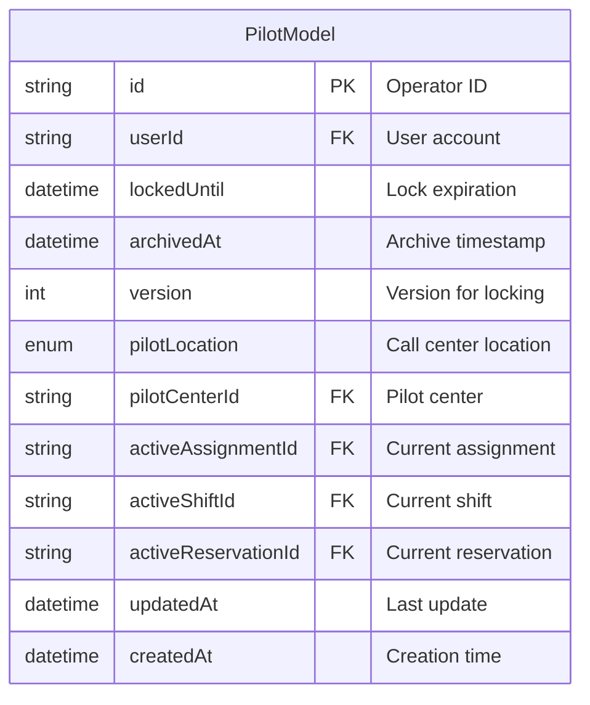
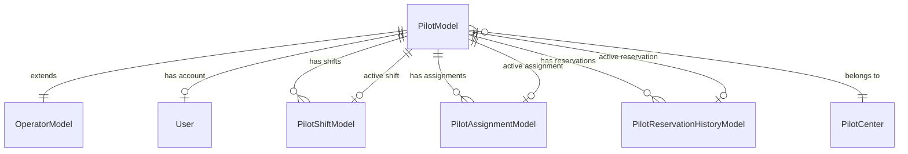
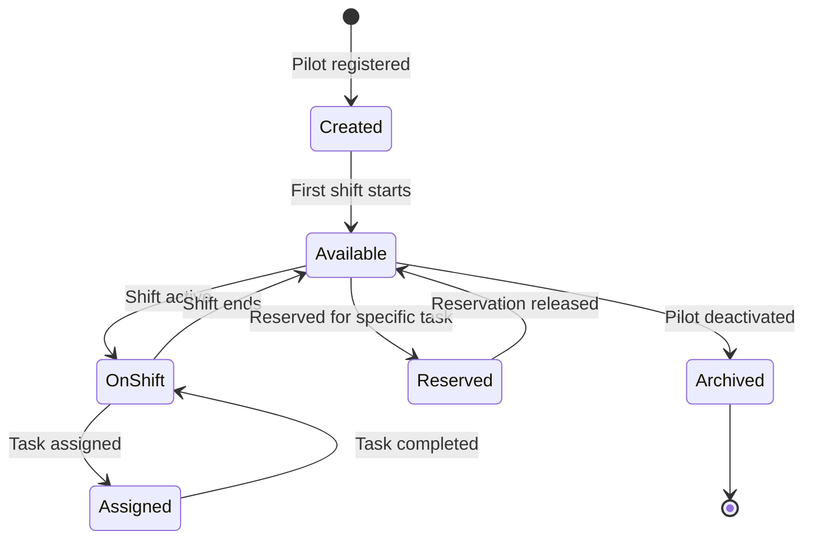

---
tags:
  - database
  - table
  - operations
  - pilot
---
# PilotModel Table

**Database**: [[Operations RDS Schema]]  
**Table Name**: `pilots` (mapped from PilotModel)  
**Schema File**: [`service/operations/prisma/schema.prisma`](../../../delivery-platform/service/operations/prisma/schema.prisma)

Stores pilot-specific operator information, including their current shift, assignment, and reservation status. Pilots are remote operators who control robots during deliveries.

## Schema

## Columns

### Identifiers
- `id` (String) - Primary key, references [[OperatorModel Table]]
- `userId` (String, nullable, unique) - Associated [[User Table]] account

### State Management
- `version` (Int) - Version number for optimistic locking in concurrent updates
- `lockedUntil` (DateTime, nullable) - Pessimistic lock expiration time
- `archivedAt` (DateTime, nullable) - When pilot was archived/deactivated

### Location
- `pilotLocation` ([[PilotLocation Enum]], nullable) - Where pilot works
  - OA_DAVAO - Operations outsourcing in Davao
  - TDCX_INDIA - TDCX India call center
  - TDCX_COLOMBIA - TDCX Colombia call center
  - US - United States based
  - TASKUS_INDIA - TaskUs India call center
- `pilotCenterId` (String, nullable) - Foreign key to [[PilotCenter Table]]

### Active References
- `activeAssignmentId` (String, nullable, unique) - Current [[PilotAssignmentModel Table|assignment]] to a task
- `activeShiftId` (String, nullable, unique) - Current [[PilotShiftModel Table|shift]]
- `activeReservationId` (String, nullable, unique) - Current [[PilotReservationHistoryModel Table|reservation]]

### Timestamps
- `createdAt` (DateTime) - Pilot record creation
- `updatedAt` (DateTime) - Last modification

## Relationships

- **Extends Operator**: One-to-one with [[OperatorModel Table]]
- **Has Account**: One-to-one (optional) with [[User Table]]
- **Has Shifts**: One-to-many with [[PilotShiftModel Table]]
- **Has Assignments**: One-to-many with [[PilotAssignmentModel Table]]
- **Has Reservations**: One-to-many with [[PilotReservationHistoryModel Table]]
- **Belongs to Center**: Many-to-one with [[PilotCenter Table]]
- **Current Assignment**: One-to-one with active [[PilotAssignmentModel Table]]
- **Current Shift**: One-to-one with active [[PilotShiftModel Table]]
- **Current Reservation**: One-to-one with active [[PilotReservationHistoryModel Table]]

## Indexes

- `version` - For optimistic locking queries
- `lockedUntil` - For finding expired locks
- `archivedAt` - For filtering active vs archived pilots

## Concurrency Control

The pilot model uses two locking mechanisms:

1. **Optimistic Locking**: `version` field increments on each update
2. **Pessimistic Locking**: `lockedUntil` timestamp prevents modifications until expiration

This ensures pilots aren't double-assigned to tasks during high-concurrency operations.

## Pilot Lifecycle

## Use Cases

1. **Pilot Assignment**: Track which pilot is assigned to which task
2. **Shift Management**: Monitor pilot work shifts and availability
3. **Resource Planning**: Reserve pilots for anticipated tasks
4. **Concurrency Control**: Prevent double-booking pilots
5. **Geographic Distribution**: Manage pilots across global call centers

## Related Concepts

- [[Operations Service]] - Service managing pilots
- [[Operator Table]] - Parent operator concept
- [[PilotShiftModel Table]] - Pilot work shifts
- [[PilotAssignmentModel Table]] - Task assignments
- [[Pilot Shift Handovers]] - Shift transition process
- [[Pilot State State Machine]] - Pilot state transitions

