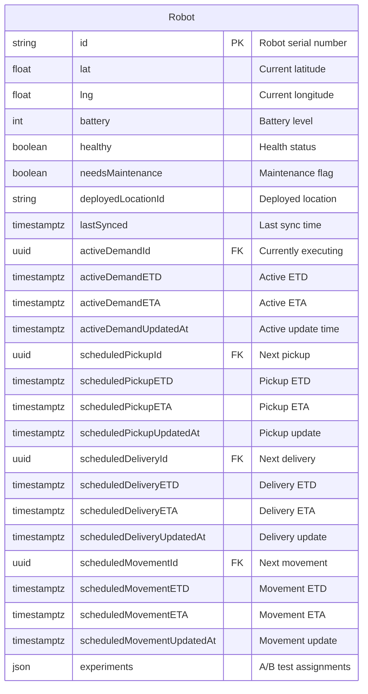
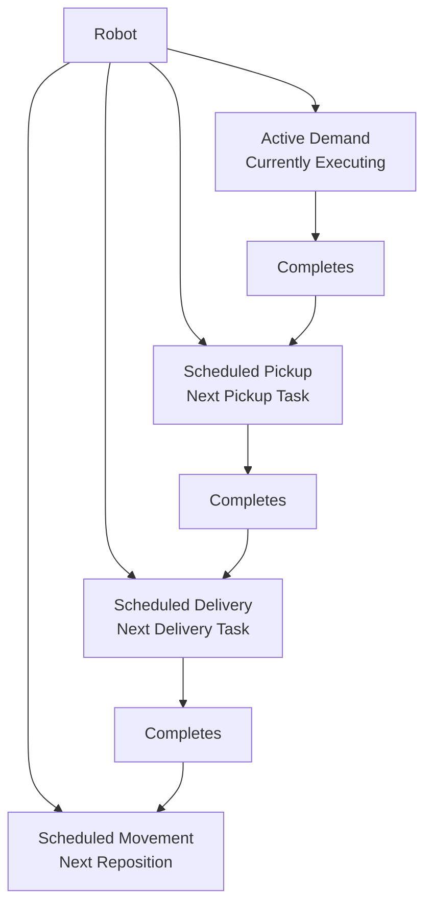
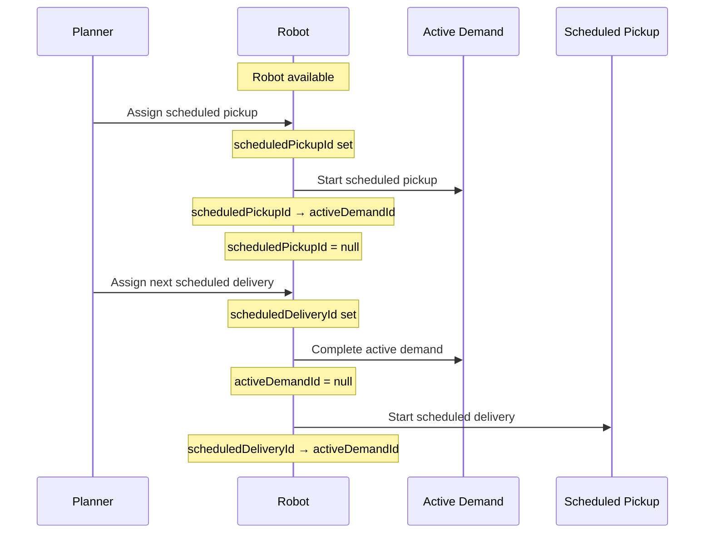

---
tags:
  - database
  - table
  - dispatch-engine
  - robot
  - planning
---
# Robot Planning Table

**Database**: [[Dispatch Engine RDS Schema]]  
**Table Name**: `robots` (mapped from Robot model)  
**Schema File**: [`service/dispatch-engine/prisma/schema.prisma`](../../../delivery-platform/service/dispatch-engine/prisma/schema.prisma)

Maintains the scheduling state of robots for dispatch planning. This is separate from the [[Robot Table]] in [[Operations RDS Schema]] - this table is specifically for planning and availability.

## Schema

## Columns

### Identifiers
- `id` (String) - Primary key, robot serial number (matches [[Robot Table]])

### Current State
- `lat` (Float) - Current GPS latitude
- `lng` (Float) - Current GPS longitude
- `battery` (Int) - Current battery level (0-100)
- `healthy` (Boolean) - Is robot operational
- `needsMaintenance` (Boolean) - Requires maintenance
- `deployedLocationId` (String, UUID) - Where robot is deployed
- `lastSynced` (DateTime with timezone) - Last state sync time

### Active Demand (Currently Executing)
- `activeDemandId` (String, UUID, nullable, unique) - Current [[Demand Table|Demand]] being executed
- `activeDemandETD` (DateTime, nullable) - Estimated time of departure
- `activeDemandETA` (DateTime, nullable) - Estimated time of arrival
- `activeDemandUpdatedAt` (DateTime, nullable) - When estimates last updated

### Scheduled Pickup (Next Pickup to Perform)
- `scheduledPickupId` (String, UUID, nullable, unique) - Next pickup [[Demand Table|Demand]]
- `scheduledPickupETD` (DateTime, nullable) - Pickup departure estimate
- `scheduledPickupETA` (DateTime, nullable) - Pickup arrival estimate
- `scheduledPickupUpdatedAt` (DateTime, nullable) - Pickup schedule update time

### Scheduled Delivery (Next Delivery to Perform)
- `scheduledDeliveryId` (String, UUID, nullable, unique) - Next delivery [[Demand Table|Demand]]
- `scheduledDeliveryETD` (DateTime, nullable) - Delivery departure estimate
- `scheduledDeliveryETA` (DateTime, nullable) - Delivery arrival estimate
- `scheduledDeliveryUpdatedAt` (DateTime, nullable) - Delivery schedule update time

### Scheduled Movement (Next Repositioning Move)
- `scheduledMovementId` (String, UUID, nullable, unique) - Next movement [[Demand Table|Demand]]
- `scheduledMovementETD` (DateTime, nullable) - Movement departure estimate
- `scheduledMovementETA` (DateTime, nullable) - Movement arrival estimate
- `scheduledMovementUpdatedAt` (DateTime, nullable) - Movement schedule update time

### Experimentation
- `experiments` (Json, default: "{}") - A/B test feature flags and assignments

## Scheduling State Model

Each robot can have up to 4 demands simultaneously:

## Demand Slot Transitions

## Use Cases

1. **Availability Checking**: Determine if robot can take new demand
2. **Route Planning**: Calculate ETAs for new demands given current schedule
3. **Continuous Replanning**: Update schedules as conditions change
4. **Capacity Management**: Track how many demands each robot has queued
5. **Experiments**: A/B test scheduling algorithms

## Synchronization

Robot state is synced from multiple sources:
- [[Operations Service]] - Task execution state
- [[Device Service]] - Hardware state (battery, location)
- [[Robot Service gRPC Endpoints]] - Real-time robot data

The `lastSynced` timestamp tracks freshness of data.

## Related Concepts

- [[Dispatch Engine]] - Service using this table
- [[Robot Table]] - Operations view of robots
- [[Demand Table]] - Demands assigned to robots
- [[Continuous Replanning]] - How schedules are updated
- [[Supply]] - Robot availability concept
- [[PlannerService]] - Service managing schedules

