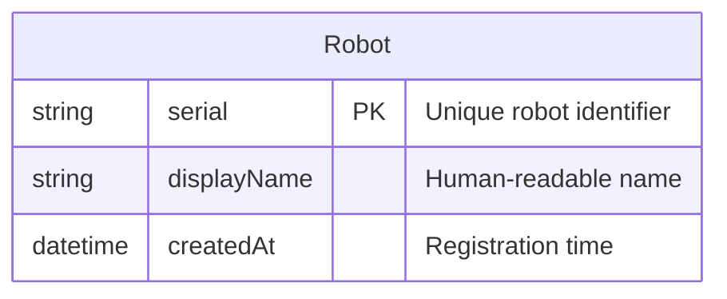
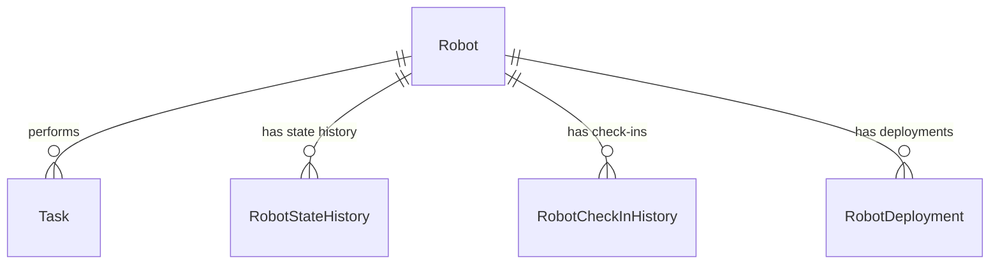

---
tags:
  - database
  - table
  - operations
  - robot
---
# Robot Table

**Database**: [[Operations RDS Schema]]  
**Table Name**: `Robot`  
**Schema File**: [`service/operations/prisma/schema.prisma`](../../../delivery-platform/service/operations/prisma/schema.prisma)

Represents a physical robot device in the fleet. This is the master robot registry for operational purposes.

## Schema

## Columns

### Identifiers
- `serial` (String) - Primary key, unique robot serial number (e.g., "R001", "ROBOT-ABC-123")
- `displayName` (String, nullable) - Human-readable name for display in UIs

### Metadata
- `createdAt` (DateTime) - When robot was registered in system

## Relationships

- **Performs Tasks**: One-to-many with [[Task Table]]
- **Has State History**: One-to-many with [[RobotStateHistory Table]]
- **Has Check-Ins**: One-to-many with [[RobotCheckInHistory Table]]
- **Has Deployments**: One-to-many with [[RobotDeployment Table]]

## Related Tables

The robot's operational state is tracked across multiple tables:

1. [[RobotStateHistory Table]] - Operational state over time (PARKED, ON_TRIP, GROUNDED, etc.)
2. [[RobotDeployment Table]] - Where robot is deployed
3. [[RobotCheckInHistory Table]] - Check-in/check-out events
4. [[Task Table]] - Tasks assigned to robot

## Use Cases

1. **Robot Registry**: Master list of all robots in fleet
2. **Task Assignment**: Link tasks to specific robots
3. **State Tracking**: Track robot operational state over time
4. **Deployment Management**: Track where robots are deployed

## Multi-Database Robot Data

Robot information is distributed across multiple services:

- **Operations Service** (this table): Operational assignments and history
- [[State Service]]: Real-time hardware state (lid, connectivity, alerts)
- [[Device Service]]: Hardware configuration and deployments
- [[Dispatch Engine]]: Planning and scheduling state

## Related Concepts

- [[Operations Service]] - Service managing robot operations
- [[Robot State State Machine]] - Robot operational states
- [[RobotStateHistory Table]] - State tracking
- [[Robot Component Heartbeats]] - Robot health monitoring
- [[Device Service]] - Robot hardware management

