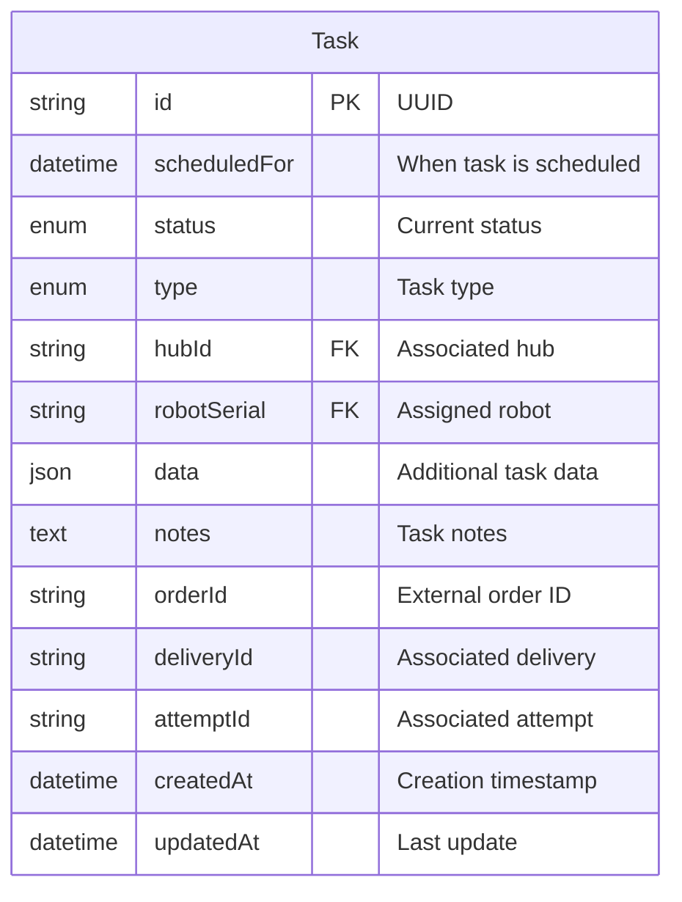
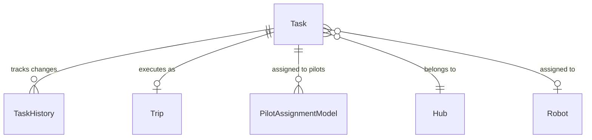

---
tags:
  - database
  - table
  - operations
  - task
---
# Task Table

**Database**: [[Operations RDS Schema]]  
**Table Name**: `Task`  
**Schema File**: [`service/operations/prisma/schema.prisma`](../../../delivery-platform/service/operations/prisma/schema.prisma)

Represents operational tasks for robot deliveries. A task is a high-level unit of work that may include one or more trips.

## Schema

## Columns

### Identifiers
- `id` (String, UUID) - Primary key, unique task identifier
- `orderId` (String, nullable) - External order reference
- `deliveryId` (String, nullable) - Associated [[Delivery]] ID from [[Deliveries Service]]
- `attemptId` (String, nullable) - Associated [[Attempt]] ID

### Assignment
- `hubId` (String) - Associated [[Hub Table|Hub]] where task is managed
- `robotSerial` (String, nullable) - Assigned [[Robot Table|Robot]] serial number

### Status & Type
- `status` ([[TaskStatus Enum]]) - Current task status
  - SCHEDULED - Task is scheduled for future
  - PENDING - Task is ready to start
  - IN_PROGRESS - Task is actively being worked
  - PAUSED - Task temporarily paused
  - ARRIVED - Robot arrived at destination
  - COMPLETED - Task successfully completed
  - CANCELLED - Task was cancelled
- `type` ([[TaskType Enum]]) - Type of task
  - JITP_TRIP - Just-in-time positioning trip
  - DEPLOYMENT_TRIP - Robot deployment to location
  - DELIVERY_TRIP - Actual delivery task
  - RETURN_TRIP - Return to hub/parking
  - NONE - Unclassified task

### Scheduling & Data
- `scheduledFor` (DateTime, nullable) - When the task should be executed
- `data` (Json, default: "{}") - Additional task metadata and configuration
- `notes` (Text, default: "") - Human-readable task notes

### Timestamps
- `createdAt` (DateTime) - Task creation timestamp
- `updatedAt` (DateTime) - Last modification timestamp

## Relationships

- **Has History**: One-to-many with [[TaskHistory Table]] for status tracking
- **Has Trip**: One-to-one with [[Trip Table]] for execution details
- **Assigned to Pilots**: One-to-many with [[PilotAssignmentModel Table]]
- **Belongs to Hub**: Many-to-one with [[Hub Table]]
- **Assigned to Robot**: Many-to-one (optional) with [[Robot Table]]

## Indexes

- `status` - For filtering by task status
- `robotSerial` - For finding tasks by robot
- `deliveryId` - For linking to delivery records
- `attemptId` - For linking to delivery attempts

## Use Cases

1. **Task Assignment**: Assign tasks to robots and pilots for execution
2. **Status Tracking**: Monitor task progression through various states
3. **Delivery Linking**: Connect operational tasks to delivery records
4. **Resource Planning**: Track what tasks are assigned to which resources

## Related Concepts

- [[Operations Service]] - Service managing tasks
- [[Trip Table]] - Physical execution of tasks
- [[Delivery]] - Business concept tasks represent
- [[Robot Table]] - Robots that execute tasks
- [[PilotAssignmentModel Table]] - Pilot assignments to tasks

