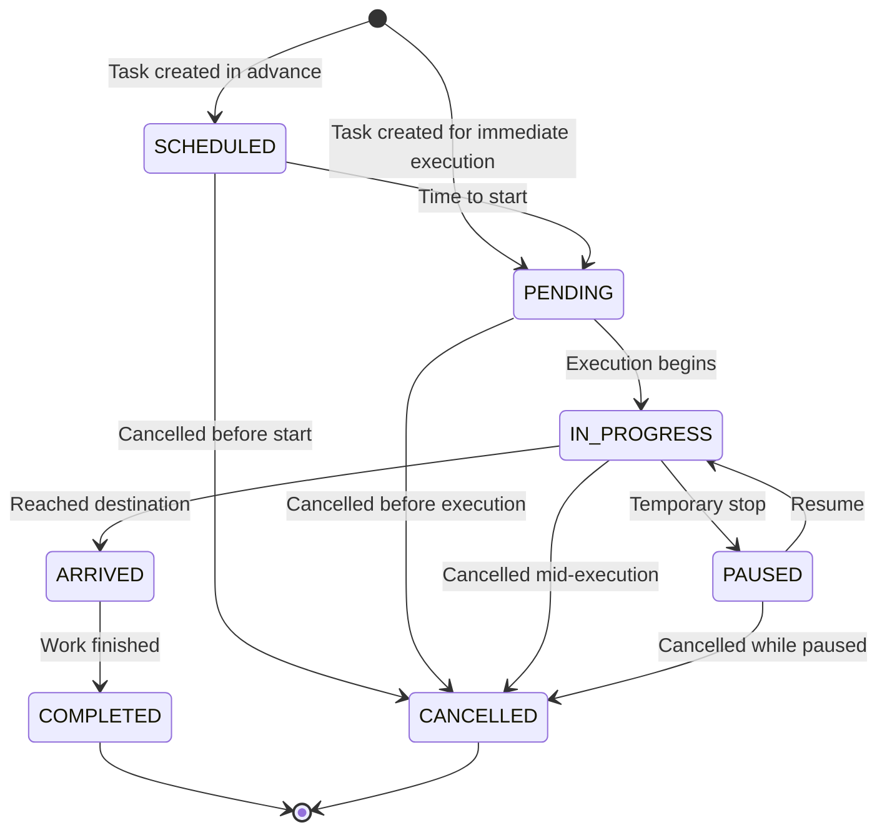

---
tags:
  - enum
  - operations
  - task
---
# TaskStatus Enum

**Database**: [[Operations RDS Schema]]  
**Used in**: [[Task Table]], [[TaskHistory Table]]  
**Schema File**: [`service/operations/prisma/schema.prisma`](../../../delivery-platform/service/operations/prisma/schema.prisma)

Enum defining the lifecycle states of a [[Task]] in the operations system.

## Values

- `SCHEDULED` - Task is scheduled for future execution
- `PENDING` - Task is ready to start (robot and pilot available)
- `IN_PROGRESS` - Task is actively being executed
- `PAUSED` - Task temporarily paused (robot stopped mid-task)
- `ARRIVED` - Robot has arrived at task destination
- `COMPLETED` - Task successfully finished
- `CANCELLED` - Task was cancelled before completion

## State Machine

## Transitions

### To SCHEDULED
- **From**: None (initial state for future tasks)
- **Trigger**: Task created with `scheduledFor` in the future

### To PENDING
- **From**: SCHEDULED
- **Trigger**: Task ready to execute (robot available, time arrived)

### To IN_PROGRESS
- **From**: PENDING, PAUSED
- **Trigger**: Robot begins movement / execution resumes

### To PAUSED
- **From**: IN_PROGRESS
- **Trigger**: Robot stopped mid-task (waiting for pilot, obstacle, etc.)

### To ARRIVED
- **From**: IN_PROGRESS
- **Trigger**: Robot reached destination

### To COMPLETED
- **From**: ARRIVED
- **Trigger**: Task work finished (delivery loaded/unloaded, etc.)

### To CANCELLED
- **From**: SCHEDULED, PENDING, IN_PROGRESS, PAUSED
- **Trigger**: Cancellation requested (user action, system timeout, delivery cancelled)

## History Tracking

Every status change is recorded in [[TaskHistory Table]] with:
- Previous and new status
- Timestamp
- Triggered by (who/what caused change)
- Reason
- Location (where change occurred)

## Related Concepts

- [[Task Table]] - Tasks with this status
- [[Task State State Machine]] - Full state machine diagram
- [[Trip Table]] - Associated trip that executes task
- [[TripStatus Enum]] - Related trip statuses
- [[Operations Service]] - Service managing task status

