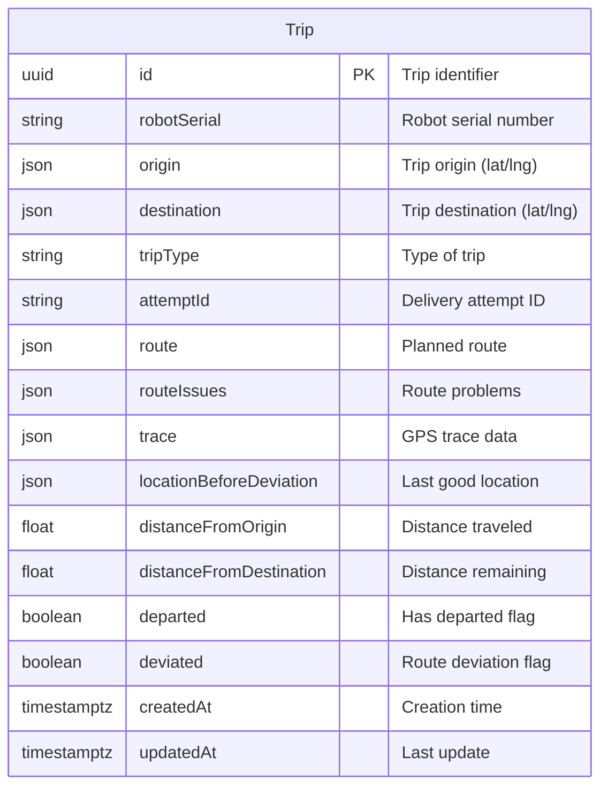
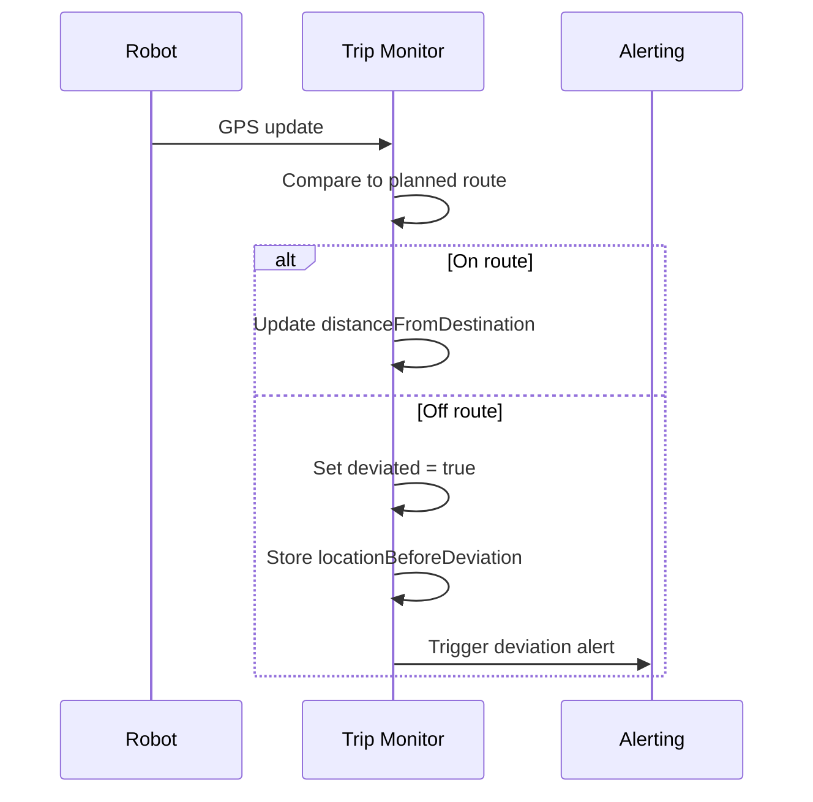

---
tags:
  - database
  - prisma
  - trip-monitor
  - backend
---
# Trip Monitor RDS Schema

**Database**: PostgreSQL  
**Service**: [[Trip Monitor Service]]  
**Schema File**: [`service/trip-monitor/prisma/schema.prisma`](../../../delivery-platform/service/trip-monitor/prisma/schema.prisma)

The Trip Monitor database tracks real-time trip progress, GPS traces, route deviations, and trip completion metrics. This is a monitoring/observability database separate from the operational [[Trip Table]] in [[Operations RDS Schema]].

## Tables

### Trip Monitoring Table
The single table in this schema:



## Columns

### Identifiers
- `id` (String, UUID) - Primary key, unique trip identifier
- `robotSerial` (String) - Robot executing the trip
- `attemptId` (String, nullable) - Associated delivery [[Attempt]] ID

### Location & Route
- `origin` (Json) - Trip start location with lat/lng and metadata
- `destination` (Json) - Trip end location with lat/lng and metadata
- `route` (Json, nullable) - Planned route waypoints
- `routeIssues` (Json, nullable) - Problems encountered with routing

### Trip Type
- `tripType` (String, nullable) - Type of trip (DELIVERY, RETURN, DEPLOYMENT, PICKUP, etc.)

### Tracking Data
- `trace` (Json) - GPS breadcrumb trail (array of positions with timestamps)
- `locationBeforeDeviation` (Json, nullable) - Last known good position before going off-route
- `distanceFromOrigin` (Float, nullable) - Meters traveled from origin
- `distanceFromDestination` (Float, nullable) - Meters remaining to destination

### Status Flags
- `departed` (Boolean) - Whether robot has left origin
- `deviated` (Boolean) - Whether robot has deviated from planned route

### Timestamps
- `createdAt` (DateTime with timezone) - Trip creation time
- `updatedAt` (DateTime with timezone) - Last update time

## GPS Trace Format

The `trace` field contains an array of GPS positions:

```json
{
  "trace": [
    {
      "lat": 37.7749,
      "lng": -122.4194,
      "timestamp": "2024-01-08T10:00:00Z",
      "accuracy": 5.0,
      "heading": 90.0,
      "speed": 1.5
    },
    {
      "lat": 37.7750,
      "lng": -122.4195,
      "timestamp": "2024-01-08T10:00:10Z",
      "accuracy": 4.5,
      "heading": 92.0,
      "speed": 1.6
    }
  ]
}
```

## Route Deviation Detection



## Use Cases

1. **Real-time Monitoring**: Track robot progress during trips
2. **Deviation Detection**: Identify when robot goes off planned route
3. **Performance Analytics**: Calculate trip duration and efficiency
4. **Debugging**: Replay trip GPS traces to diagnose issues
5. **Route Optimization**: Analyze actual vs planned routes

## Relationship to Operations

This is a **separate monitoring view** from the operational [[Trip Table]]:

| Aspect | Operations Trip Table | Trip Monitor Trip Table |
|--------|----------------------|------------------------|
| Purpose | Operational control | Observability |
| Updates | Status changes | GPS updates (frequent) |
| Data | Task linkage, timing | GPS trace, route data |
| Service | [[Operations Service]] | [[Trip Monitor Service]] |

Both tables share the same trip `id` for correlation.

## Related Concepts

- [[Trip Monitor Service]] - Service using this database
- [[Trip Table]] - Operational trip table
- [[Operations Service]] - Source of trip data
- [[Robot]] - Robots executing trips
- [[Trip State State Machine]] - Trip state transitions

