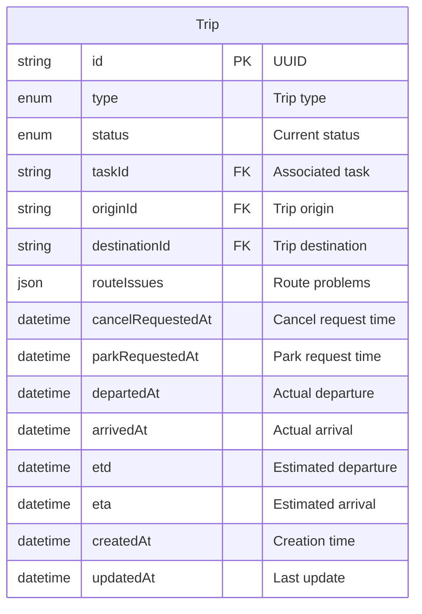
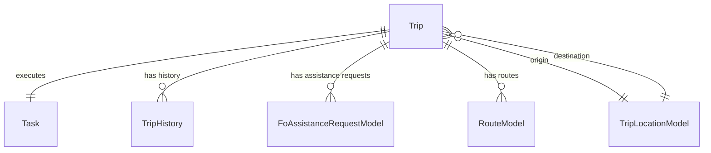
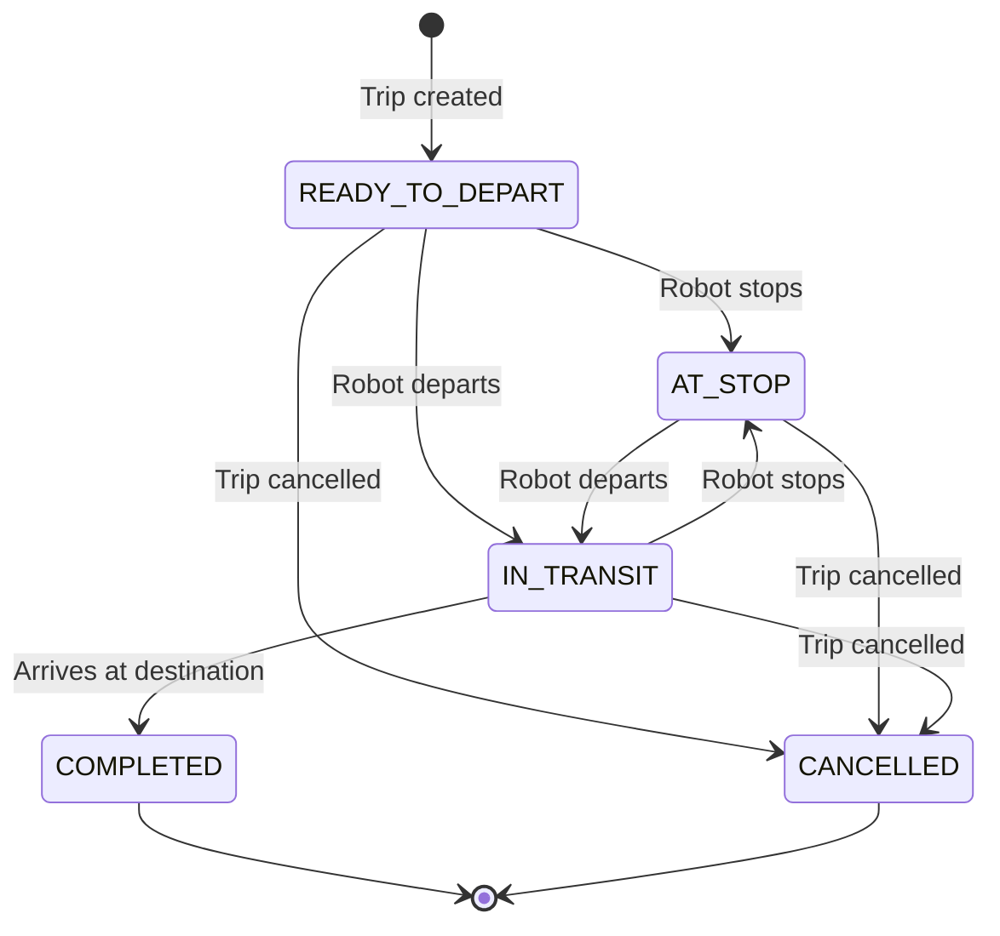

---
tags:
  - database
  - table
  - operations
  - trip
---
# Trip Table

**Database**: [[Operations RDS Schema]]  
**Table Name**: `Trip`  
**Schema File**: [`service/operations/prisma/schema.prisma`](../../../delivery-platform/service/operations/prisma/schema.prisma)

Represents a physical trip by a robot from one location to another. Each trip is associated with a [[Task Table|Task]] and tracks the actual movement, routing, and timing.

## Schema

## Columns

### Identifiers
- `id` (String, UUID) - Primary key, unique trip identifier
- `taskId` (String, unique) - Associated [[Task Table|Task]] (one-to-one relationship)

### Type & Status
- `type` ([[TripType Enum]]) - Type of trip
  - JITP - Just-in-time positioning
  - DEPLOYMENT - Robot deployment
  - DELIVERY - Delivery trip
  - RETURN - Return to hub
  - NONE - Unclassified
- `status` ([[TripStatus Enum]], default: READY_TO_DEPART) - Current trip status
  - AT_STOP - Waiting at stop
  - READY_TO_DEPART - Ready to leave
  - IN_TRANSIT - Currently moving
  - COMPLETED - Trip finished
  - CANCELLED - Trip cancelled

### Location
- `originId` (String) - Foreign key to [[TripLocationModel Table]] for trip start
- `destinationId` (String) - Foreign key to [[TripLocationModel Table]] for trip end

### Routing
- `routeIssues` (Json, nullable) - Problems encountered with routing

### Control Signals
- `cancelRequestedAt` (DateTime, nullable) - When trip cancellation was requested
- `parkRequestedAt` (DateTime, nullable) - When parking was requested

### Timing
- `departedAt` (DateTime, nullable) - Actual departure timestamp
- `arrivedAt` (DateTime, nullable) - Actual arrival timestamp
- `etd` (DateTime, nullable) - Estimated time of departure
- `eta` (DateTime, nullable) - Estimated time of arrival

### Metadata
- `createdAt` (DateTime) - Trip creation timestamp
- `updatedAt` (DateTime) - Last modification timestamp

## Relationships

- **Executes Task**: One-to-one with [[Task Table]]
- **Has History**: One-to-many with [[TripHistory Table]]
- **Has Assistance Requests**: One-to-many with [[FoAssistanceRequestModel Table]]
- **Has Routes**: One-to-many with [[RouteModel Table]]
- **Has Origin**: Many-to-one with [[TripLocationModel Table]]
- **Has Destination**: Many-to-one with [[TripLocationModel Table]]

## Indexes

- `status` - For filtering by trip status
- `type` - For filtering by trip type

## Trip Lifecycle

## Use Cases

1. **Movement Tracking**: Track robot physical movement between locations
2. **ETA Management**: Monitor estimated vs actual arrival times
3. **Route Management**: Store and track route information
4. **Assistance Management**: Handle requests for help during trips
5. **Trip Analytics**: Analyze trip performance and issues

## Related Concepts

- [[Operations Service]] - Service managing trips
- [[Task Table]] - Higher-level task that trip executes
- [[Trip Monitor Service]] - Service monitoring trip progress
- [[Robot Table]] - Robot executing the trip
- [[TripStatus Enum]] - Trip status values
- [[Trip State State Machine]] - Trip state transitions

