# 1. System Overview

This diagram illustrates the entire ecosystem: how data flows from robots and external providers into our system, how it propagates between internal services, and how it is finally consumed by internal applications and external partners.

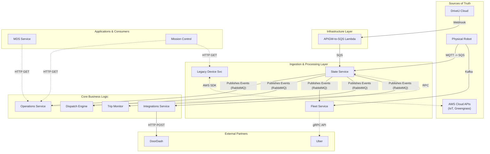

---

# 2. Data Sources & Ingestion
### 2.1 Physical Robots (MQTT)

- **Protocol**: MQTT via AWS IoT.
- **Data**: Telemetry (Location, Battery), Connectivity.
- **Ingestion**: Routed to SQS (`eventsQueueUrl`, `stateQueueUrl` defined in [`service/state/src/config/config.loader.ts`](https://github.com/cocorobotics/delivery-platform/blob/main/service/state/src/config/config.loader.ts)).

**On-Robot Publishing Flow**:
The robot runs ROS (Robot Operating System), and data is published from various sensor nodes to a central aggregator, which then forwards the data to the cloud via an MQTT bridge.

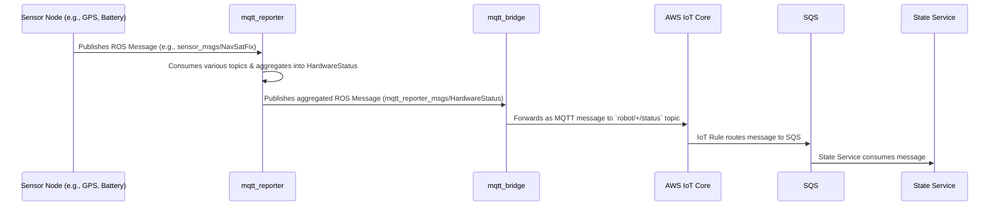

The flow is orchestrated by these key components:

1. **Sensor Nodes**: Standard ROS nodes that interface with the hardware (GPS, battery controller, etc.) and publish their data to specific topics on the internal ROS message bus.
2. **Aggregator (`mqtt_reporter`)**: The [`hardware_status_aggregator.py`](https://github.com/cocorobotics/coco-acu/blob/develop/src/hardware_fail_detection/mqtt_reporter/src/mqtt_reporter/hardware_status_aggregator.py) node subscribes to many different sensor topics. It collects and aggregates this data into a single, comprehensive `HardwareStatus` message.
3. **Bridge (`mqtt_bridge`)**: This is a generic ROS-to-MQTT bridge. It subscribes to the `HardwareStatus` ROS topic and, based on its configuration in [`topics.yaml`](https://github.com/cocorobotics/coco-acu/blob/develop/src/mqtt_bridge/config/topics.yaml), publishes the content of that message to an AWS IoT MQTT topic (e.g., `robot/123/status`). The core logic for this is in [`bridge.py`](https://github.com/cocorobotics/coco-acu/blob/develop/src/mqtt_bridge/src/mqtt_bridge/bridge.py).
4. **Backend Consumer**: As previously detailed, the message is routed via an AWS IoT Rule to an SQS queue, which is consumed by the [`IotStreamerService`](https://github.com/cocorobotics/delivery-platform/blob/main/service/state/src/iot-streamer/iot-streamer.service.ts) in the `State Service`.

### 2.2 DriveU (Teleoperation Webhooks & API)

**Role**: Provides low-latency video streaming and remote control connectivity status.

**DriveU Status Write Path**:
The following diagram shows how the raw webhook event, once ingested into SQS, gets processed and ultimately saved to DynamoDB.

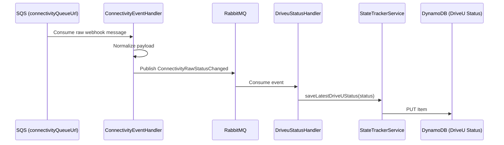

The flow is as follows:

1. **SQS Consumption**: The [`ConnectivityEventHandler`](https://github.com/cocorobotics/delivery-platform/blob/main/service/state/src/connectivity/connectivity-event.handler.ts) consumes the raw event from the `connectivityQueueUrl` SQS queue.
2. **Event Publication**: It normalizes the data and publishes a new event, `ConnectivityRawStatusChanged`, to a RabbitMQ exchange.
3. **Status Handling**: The [`DriveuStatusHandler`](https://github.com/cocorobotics/delivery-platform/blob/main/service/state/src/driveu/driveu-status.handler.ts) subscribes to this RabbitMQ exchange.
4. **Database Write**: Upon receiving an event, the handler calls the [`saveLatestDriveUStatus`](https://github.com/cocorobotics/delivery-platform/blob/main/lib/common/src/state-tracker/state-tracker.service.ts) method on the `StateTrackerService`, which is responsible for writing the final status object to DynamoDB.

**DriveU Webhook Schema**:

```tsx
// See: delivery-platform/lib/common/src/drive-u/interfaces/webhook-event.interface.ts
interface IWebhookEvent {
  eventName: 'status';
  unit: 'streamer' | 'node' | 'relay';
  status: string; // e.g., 'online', 'offline', 'connectedToNode'
  uuid: string;   // used for serial mapping
  vin: string | null;
  time: number;   // timestamp in microseconds
}

```

([`IWebhookEvent` source](https://github.com/cocorobotics/delivery-platform/blob/main/lib/common/src/drive-u/interfaces/webhook-event.interface.ts))

### 2.3 MQTT-to-Kafka Bridge

While the `State Service` consumes MQTT messages for its own processing, there is a parallel path that forwards raw telemetry directly to Kafka for the `Fleet Service`. This is handled by a dedicated bridge service.

**MQTT-to-Kafka Bridge Flow**:
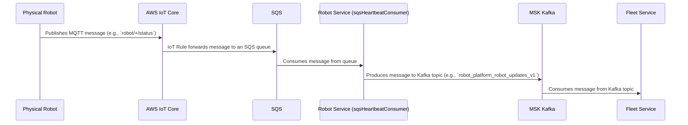

This flow acts as a high-throughput bridge to get raw robot telemetry into the Kafka ecosystem for real-time processing by consumers like the `Fleet Service`. The key component is the `robot` service:

1.  **MQTT to SQS**: An AWS IoT Rule, which was manually configured and is not present in Terraform, routes raw MQTT messages from robots to a dedicated SQS queue.
2.  **SQS Consumption**: A Go service, [`sqsHeartbeatConsumer`](https://github.com/cocorobotics/coco-services/blob/master/robot/cmd/sqs_heartbeat_consumer.go), consumes messages from this queue.
3.  **Kafka Production**: For each message it receives, this service instantiates a [`kafka.NewProducer`](https://github.com/cocorobotics/coco-services/blob/master/core/kafka/producer.go) and publishes the payload to a Kafka topic.
4.  **Fleet Service Consumption**: As documented previously, the `Fleet Service`'s [`robot_consumer`](https://github.com/cocorobotics/coco-services/blob/master/fleet/internal/consumer/robot_consumer.go) subscribes to this Kafka topic to receive the real-time telemetry.

### 2.4 AWS Greengrass (Software Management)

**Integration Flow**:

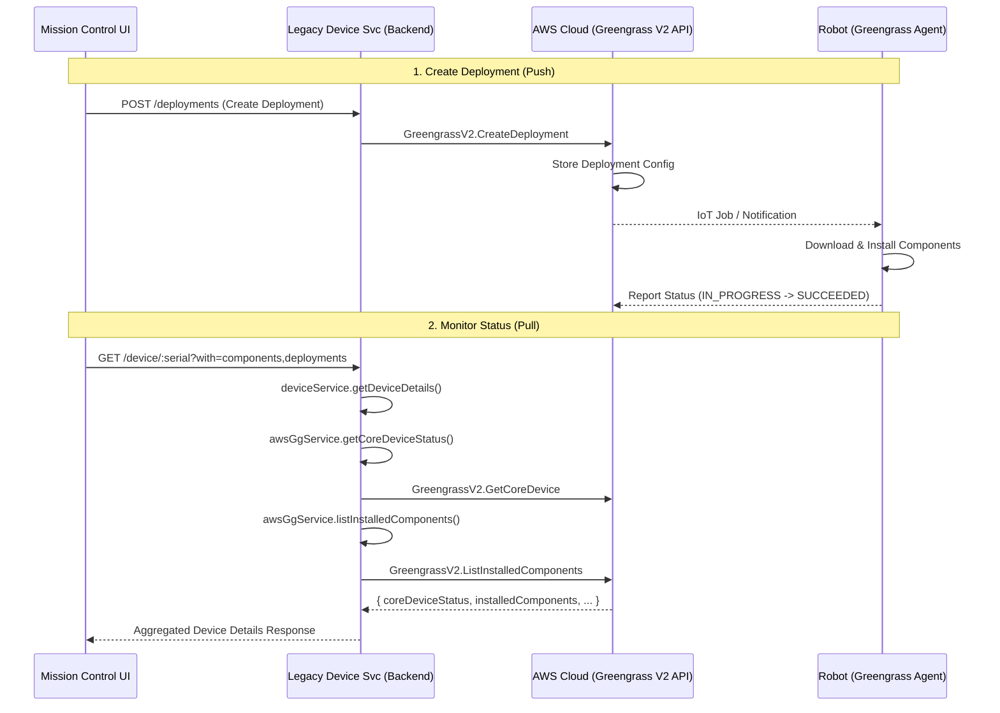

The **Legacy Device Service** (`service/device`) acts as a proxy to AWS Cloud APIs for low-level software lifecycle management, primarily serving Mission Control. This service does not have a dedicated `/greengrass` endpoint. Instead, it aggregates Greengrass data into its main device details endpoint.

The flow works as follows:

1. **API Request**: A client, like Mission Control, makes a request to the `GET /device/:serial` endpoint, optionally including `?with=components,deployments` to request detailed software information. This endpoint is handled by the [`DeviceController`](https://github.com/cocorobotics/delivery-platform/blob/main/service/device/src/device/device.controller.ts).
2. **Service Aggregation**: The controller passes the request to the [`DeviceService`](https://github.com/cocorobotics/delivery-platform/blob/main/service/device/src/device/device.service.ts). Inside the `getDeviceDetails` method, it fetches data from multiple sources.
3. **AWS SDK Calls**: The `DeviceService` uses the [`AwsGgService`](https://github.com/cocorobotics/delivery-platform/blob/main/service/device/src/aws/aws-gg.service.ts) to make several calls to the AWS Greengrass V2 API in the cloud:
    - `getCoreDeviceStatus()`: To get the basic health of the Greengrass agent.
    - `listInstalledComponents()`: To get a list of all software packages and their versions on the robot.
    - `getDetailedDeployments()`: To get the history of software deployment jobs.
4. **Response**: The `DeviceService` combines all this information into a single JSON response for the client.

**Key Schemas**:
The data structures for Greengrass objects are defined by the AWS SDK and aliased for clarity in [`service/device/src/aws/typings/aws-gg.interface.ts`](https://github.com/cocorobotics/delivery-platform/blob/main/service/device/src/aws/typings/aws-gg.interface.ts).

- **`InstalledComponent`**: Represents a piece of software running on the robot.
    - `componentName`: The name of the software package (e.g., `com.example.MyApplication`).
    - `componentVersion`: The semantic version of the package.
    - `lifecycleState`: The current status of the component (`RUNNING`, `ERRORED`, `BROKEN`, etc.).
- **`CoreDevice`**: Represents the robot's Greengrass instance itself.
    - `status`: An overall health status (`HEALTHY` or `UNHEALTHY`).
    - `lastStatusUpdateTimestamp`: The last time the device reported its status to the cloud.

---

# 3. Core Services

### 3.1 State Service: The Raw Data Processor

- **Role**: Raw event ingestion, normalization, and initial persistence.
- **Persistence**: [`StateHistory`](https://github.com/cocorobotics/delivery-platform/blob/main/service/state/prisma/schema.prisma) (PostgreSQL), DriveU Status (DynamoDB).
- **Outputs**: Publishes normalized events to RabbitMQ ([`IoT.Heartbeat`](https://github.com/cocorobotics/delivery-platform/blob/main/lib/common/src/exchanges/names.ts), [`Robots.StateChange`](https://github.com/cocorobotics/delivery-platform/blob/main/lib/common/src/exchanges/names.ts)).
- **`Robots.StateChange` Role**: Both **publishes** (on state machine transitions via [`StateTransitionSubscriber`](https://github.com/cocorobotics/delivery-platform/blob/main/service/state/src/state/state-machine/listeners/state-transition.subscriber.ts)) and **consumes** (to sync `needsMaintenance` flags set by other services via [`RobotStateChangeHandler`](https://github.com/cocorobotics/delivery-platform/blob/main/service/state/src/state/robot-state.handler.ts)).

**Processing Flow (Heartbeat Write Path)**:

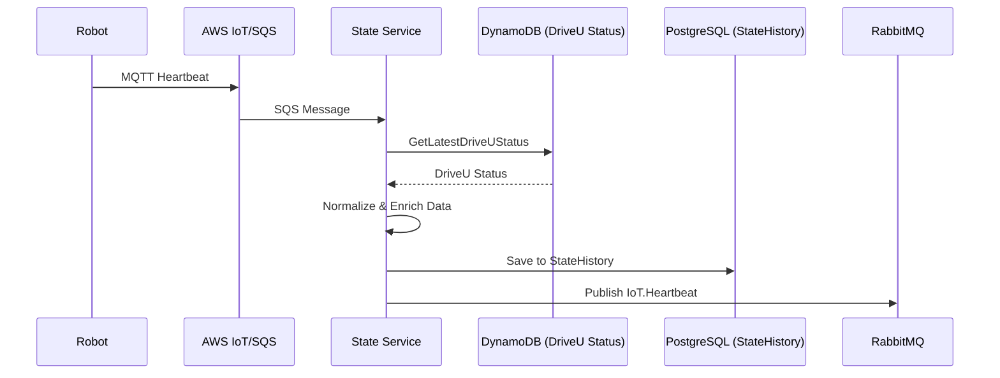

This diagram shows the main "hot path" for real-time robot telemetry. The process is as follows:

1. **Ingestion**: A robot publishes an MQTT message. An AWS IoT Rule routes it to an SQS queue (e.g., `eventsQueueUrl` defined in [`config.loader.ts`](https://github.com/cocorobotics/delivery-platform/blob/main/service/state/src/config/config.loader.ts)).
2. **Consumption**: The [`IotStreamerService`](https://github.com/cocorobotics/delivery-platform/blob/main/service/state/src/iot-streamer/iot-streamer.service.ts) in the `State Service` consumes the raw message from the queue.
3. **Enrichment**: Inside the `processMessage` method, the service enriches the raw telemetry:
    - It calls [`getLatestDriveUStatus`](https://github.com/cocorobotics/delivery-platform/blob/main/service/state/src/state-tracker/state-tracker.service.ts) on the `StateTrackerService` to fetch the most recent DriveU connectivity status from **DynamoDB**. This determines if the robot is remotely controllable.
4. **Persistence**: The enriched data is persisted to the [`StateHistory`](https://github.com/cocorobotics/delivery-platform/blob/main/service/state/prisma/schema.prisma) table in **PostgreSQL**.
5. **Fan-out**: Finally, the service uses its [`amqpConnection`](https://github.com/cocorobotics/delivery-platform/blob/main/service/state/src/iot-streamer/iot-streamer.service.ts#L44) to publish a clean, enriched [`IoT.Heartbeat`](https://github.com/cocorobotics/delivery-platform/blob/main/lib/common/src/exchanges/names.ts) event to a RabbitMQ fan-out exchange, making it available to all interested downstream services.

**State Service Schema**:

```
model StateHistory {
  serial    String
  date      DateTime
  state     String   // GROUNDED, ON_TRIP, PARKED, OFF_DUTY
  details   Json?
  @@id([serial, date])
}

```

### 3.2 Operations Service: The Business Logic Hub

- **Role**: Applies business rules (maintenance toggles, operational readiness) to raw state.
- **Persistence**: [`RobotStateHistory`](https://github.com/cocorobotics/delivery-platform/blob/main/service/operations/prisma/schema.prisma) (PostgreSQL), Ephemeral Data (Redis). The Redis cache is managed by the [`RobotEphemeralDataService`](https://github.com/cocorobotics/delivery-platform/blob/main/service/operations/src/modules/robots/services/robot-ephemeral-data.service.ts) and holds transient state like connectivity and component health.
- **Outputs**: `RobotStateHistory` updates, Redis cache updates.
- **`Robots.StateChange` Role**: The Operations Service is both the **largest publisher** and a **consumer** of this event:
    - **Consumes**: Via [`RobotStateChangeHandler`](https://github.com/cocorobotics/delivery-platform/blob/main/service/operations/src/modules/robots/handlers/robot-state-change-handler.ts) to update its `RobotStateHistory` table.
    - **Publishes** (12+ points): From [`RobotFleetManagementService`](https://github.com/cocorobotics/delivery-platform/blob/main/service/operations/src/modules/fleet-management/services/robot-fleet-management.service.ts) (deployments), [`RobotsService`](https://github.com/cocorobotics/delivery-platform/blob/main/service/operations/src/modules/robots/services/robots.service.ts) (grounding), [`PilotTripsService`](https://github.com/cocorobotics/delivery-platform/blob/main/service/operations/src/modules/trips/services/pilot-trips.service.ts) (trip updates), and [`FoTasksService`](https://github.com/cocorobotics/delivery-platform/blob/main/service/operations/src/modules/fo-tasks/fo-tasks.service.ts) (maintenance).

**Processing Flow (State Change Write Path)**:

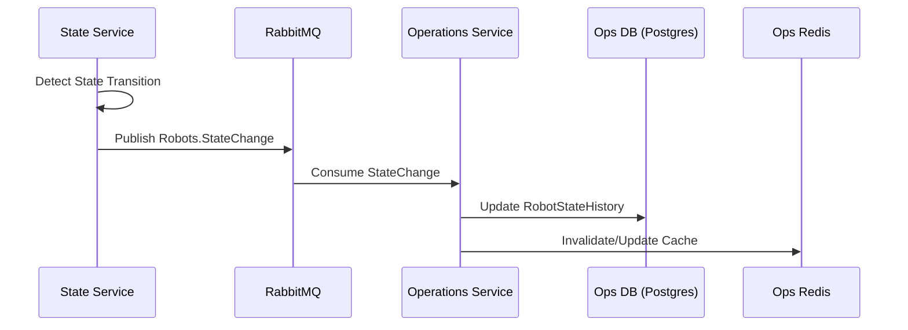

This diagram illustrates how changes in a robot's core state (e.g., from `PARKED` to `ON_TRIP`) are processed and enriched with business logic.

1. **Detection**: The [`StateService`](https://github.com/cocorobotics/delivery-platform/blob/main/service/state/src/state/state.service.ts) in the `State Service` detects a significant state transition while processing incoming telemetry.
2. **Publication**: It publishes a discrete [`Robots.StateChange`](https://github.com/cocorobotics/delivery-platform/blob/main/lib/common/src/exchanges/names.ts) event to RabbitMQ.
3. **Consumption**: A handler in the `Operations Service`, such as the [`IotHeartbeatHandler`](https://github.com/cocorobotics/delivery-platform/blob/main/service/operations/src/modules/robots/handlers/iot-heartbeat-handler.ts), consumes this event.
4. **Business Logic & Persistence**: The handler applies business rules (e.g., checking for maintenance flags via [`getRobotOperationalReadinessIssue`](https://github.com/cocorobotics/delivery-platform/blob/main/service/operations/src/modules/robots/services/robots.service.ts)) and then updates its own [`RobotStateHistory`](https://github.com/cocorobotics/delivery-platform/blob/main/service/operations/prisma/schema.prisma) table in **PostgreSQL**.
5. **Cache Update**: It also updates its **Redis** cache via the [`RobotEphemeralDataService`](https://github.com/cocorobotics/delivery-platform/blob/main/service/operations/src/modules/robots/services/robot-ephemeral-data.service.ts) to ensure subsequent on-demand reads have the freshest data.

**Operations Service Schema**:

```
model RobotStateHistory {
  robotSerial           String
  operationState        RobotStateEventState // ON_TRIP, PARKED, GROUNDED, OFF_DUTY, DEPLOYED
  needsMovement         Boolean
  undergoingMaintenance Boolean
  hasFood               Boolean
  driveable             Boolean
}

```

### 3.3 Fleet Service: The Hybrid Telemetry & Business Cache

- **Role**: Fleet management and provider integrations (Uber).
- **Data Sources**:
    - **Kafka ([`robot_consumer`](https://github.com/cocorobotics/coco-services/blob/master/fleet/internal/consumer/robot_consumer.go))**: Consumes raw robot telemetry (GPS, Battery) directly.
    - **RabbitMQ ([`legacy_robots_consumer`](https://github.com/cocorobotics/coco-services/blob/master/fleet/internal/consumer/legacy_robots_consumer/consumer.go))**: Consumes business events from the TypeScript platform.
- **Persistence**: [`fleet-robots`](https://github.com/cocorobotics/coco-services/blob/master/infra/configs/fleet/consumers/robot_consumer/values.yaml.tpl) (DynamoDB) - Aggregates telemetry + business state.
- **`Robots.StateChange` Role**: **Consumes** via [`HandleRobotsStateChange`](https://github.com/cocorobotics/coco-services/blob/master/fleet/internal/consumer/legacy_robots_consumer/robots_state_change.go) to update DynamoDB with business state (`hasFood`, `needsMaintenance`, `operationState`, `tripType`, etc.). Also consumes [`Robots.State`](https://github.com/cocorobotics/coco-services/blob/master/fleet/internal/consumer/legacy_robots_consumer/robots_state.go) and [`Robots.Deployment`](https://github.com/cocorobotics/coco-services/blob/master/fleet/internal/consumer/legacy_robots_consumer/robots_deployment.go) events.

**Processing Flow**:

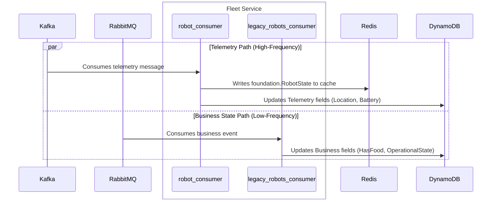

This diagram shows the dual-ingestion model of the Fleet Service, which separates high-frequency telemetry from lower-frequency business state updates.

1.  **Telemetry Path (Kafka & Redis - The "Hot Path")**:
    *   The [`robot_consumer`](https://github.com/cocorobotics/coco-services/blob/master/fleet/internal/consumer/robot_consumer.go) subscribes to high-volume telemetry from the `robot_platform_robot_updates_v1` Kafka topic.
    *   **Enrichment & Caching**: For each message, the consumer transforms the raw data into a [`foundation.RobotState`](https://github.com/cocorobotics/coco-services/blob/master/core/foundation/robot.go) struct. This involves parsing fields like location, battery, and component health. This standardized `RobotState` object is then written to a **Redis cache** with a short TTL. This provides the low-latency data needed by the `FleetLaborProviderScopeService` gRPC endpoint for real-time queries.
    *   **Telemetry Persistence**: The consumer also updates the corresponding [`FleetRobot`](https://github.com/cocorobotics/coco-services/blob/master/fleet/internal/entities/fleet_robot.go) item in the `fleet-robots` **DynamoDB** table. It specifically updates the telemetry-related fields, such as `Latitude`, `Longitude`, `BatteryPercent`, and `Healthy`.

2.  **Business State Path (RabbitMQ - The "Warm Path")**:
    *   The [`legacy_robots_consumer`](https://github.com/cocorobotics/coco-services/blob/master/fleet/internal/consumer/legacy_robots_consumer/consumer.go) subscribes to lower-frequency business state events from a RabbitMQ exchange, which are published by the `Operations Service`.
    *   **Business State Persistence**: This consumer's sole job is to update the business-related fields on the `FleetRobot` item in **DynamoDB**. It receives events that contain information not available in raw telemetry, such as `HasFood`, `NeedsMaintenance`, and the overall `OperationalState` (e.g., `ON_TRIP`, `PARKED`). This ensures that the canonical record in DynamoDB reflects both the robot's physical state and its current business context.

#### 3.3.1 Redis Cache Schema

The Fleet Service uses Redis for high-frequency caching of telemetry data.

- **Key**: `robot.heartbeat.cache.<serial>`
- **Value**: A JSON-marshalled `foundation.RobotState` struct.
- **Source Code**: The schema is defined in [`coco-services/core/foundation/robot.go`](https://github.com/cocorobotics/coco-services/blob/master/core/foundation/robot.go).
- **Logic**: The gRPC handler in [`grpc_labor_scope.go`](https://github.com/cocorobotics/coco-services/blob/master/fleet/internal/handlers/grpc/grpc_labor_scope.go) reads from this cache to serve requests for available robots.

```go
// coco-services/core/foundation/robot.go
type RobotState struct {
	Serial         string              `json:"serial"`
	Healthy        bool                `json:"healthy"`
	Battery        RobotBattery        `json:"battery"`
	Location       RobotLocation       `json:"location"`
	Components     RobotComponents     `json:"components"`
	OperationState RobotOperationState `json:"operationState"`
    // ... timestamps
}

```

#### 3.3.2 DynamoDB Schema (`fleet-robots` table)

This is the primary operational data store for the Fleet Service, aggregating telemetry and business state.

- **Source Code**: The schema is defined by the `FleetRobot` struct in [`coco-services/fleet/internal/entities/fleet_robot.go`](https://github.com/cocorobotics/coco-services/blob/master/fleet/internal/entities/fleet_robot.go).
- **Key Fields**:
    - `PK`/`SK`: `FLEETROBOT#<uuid>`
    - `Serial`: The robot's serial number.
    - `Healthy`: A boolean indicating overall health.
    - `OperationalState`: The business state from the Operations system (`ON_TRIP`, `PARKED`, etc.).
    - `Latitude`/`Longitude`: GPS coordinates.
    - `HasFood`/`NeedsMaintenance`: Business flags from the Operations system.

```go
// coco-services/fleet/internal/entities/fleet_robot.go
type FleetRobot struct {
	PK string `dynamodbav:"PK"`
	SK string `dynamodbav:"SK"`

	Serial string `dynamodbav:"Serial"`

	Healthy          bool                           `dynamodbav:"Healthy"`
	OperationalState foundation.RobotOperationState `dynamodbav:"OperationalState"`

	Latitude     float64      `dynamodbav:"Latitude"`
	Longitude    float64      `dynamodbav:"Longitude"`

	HasFood          *bool `dynamodbav:"HasFood,omitempty"`
	NeedsMaintenance *bool `dynamodbav:"NeedsMaintenance,omitempty"`

	// ... timestamps and other fields
}

```

#### 3.3.3 APIs

The Fleet Service exposes its data primarily through a **gRPC API** (and a corresponding HTTP gateway). It offers two main service scopes for consumers:

1. **`FleetLaborProviderScopeService`**: Exposes the [`Get` method](https://github.com/cocorobotics/coco-services/blob/master/fleet/internal/handlers/grpc/grpc_labor_scope.go) to provide real-time robot state (location, battery, status) by reading directly from the Redis cache. This is optimized for high-frequency requests.
2. **`FleetBeaconScopeService`**: Exposes methods like [`GetVirtualRobot` and `GetExternalRobotMappings`](https://github.com/cocorobotics/coco-services/blob/master/fleet/internal/handlers/grpc/grpc_beacon_scope.go) that query DynamoDB. This is used to link provider-specific identifiers (e.g., from Uber) to our internal `FleetRobot` entities.

### 3.4 Dispatch Engine: The Planning Supply Cache

- **Role**: Maintains a near real-time cache of available robots (`supply`) to make high-performance planning decisions without querying other services.
- **Persistence**: `Resource` table (PostgreSQL) with an in-memory/Redis cache. Robot state is stored in a `jsonb` column, using the `LegacyRobot` type as its schema.
- **Outputs**: An up-to-date `Resource` table and a populated cache that the `SupplyService` can read from.
- **`Robots.StateChange` Role**: **Consumes** via [`RobotStageChangeHandler`](https://github.com/cocorobotics/delivery-platform/blob/main/service/dispatch-engine/src/modules/eventsink/handlers/robot-stage-change.handler.ts), which transforms the event into an internal `DispatchEngine.SupplyEvent` to update the planner's robot supply cache.

**Processing Flow (Event Cache Write Path)**:
The Dispatch Engine uses a two-step internal event queue to process data. This decouples the initial event ingestion from the business logic that updates the supply cache. The repository layer is responsible for invalidating the cache upon writes to ensure data consistency.

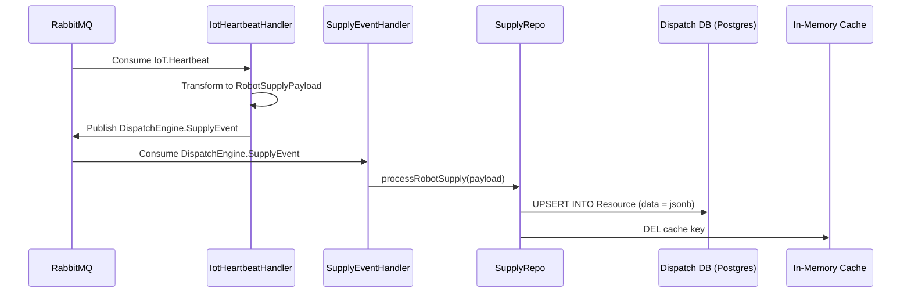

The data is handled by two main components:

1. **Ingestion Handlers**: Services like [`IotHeartbeatHandler`](https://github.com/cocorobotics/delivery-platform/blob/main/service/dispatch-engine/src/modules/eventsink/handlers/iot-heartbeat.handler.ts) and [`RobotStageChangeHandler`](https://github.com/cocorobotics/delivery-platform/blob/main/service/dispatch-engine/src/modules/eventsink/handlers/robot-stage-change.handler.ts) subscribe to external events from the `State Service`. Their sole job is to transform these events into a standardized internal `DispatchEngine.SupplyEvent` and publish it back to RabbitMQ.
2. **Supply Logic**: The [`SupplyEventHandler`](https://github.com/cocorobotics/delivery-platform/blob/main/service/dispatch-engine/src/modules/supply/handlers/supply-event.handler.ts) consumes this internal event. It uses the [`SupplyRepo`](https://github.com/cocorobotics/delivery-platform/blob/main/service/dispatch-engine/src/modules/supply/repo/supply.repo.ts) to perform an `upsert` into the `Resource` table, which also deletes the relevant key from the in-memory cache to ensure subsequent reads get fresh data.

**Dispatch Engine Schema (`LegacyRobot`)**:
This is the structure stored as a JSON object in the `Resource` table.

```tsx
// See: delivery-platform/lib/types/dispatch-engine/planner.ts
export type LegacyRobot = {
  serial: string;
  status: RobotStatus;
  battery: number;
  lastSynced: Date;
  healthy: boolean;
  deployed: ParkingLotLocation | MroLocation | PodLocation | null;
  location: Location | null;
  futureDemand: (PendingDemand | ScheduledDemand)[];
  activeDemand: PendingDemand | ActiveDemand | null;
  needsMovement: boolean | null;
  hasFood: boolean | null;
  tripType: TripType | null;
  needsMaintenance: boolean | null;
  needsPickup: boolean | null;
  driveable: boolean | null;
  operationState: RobotStateEventState | null;
  attemptCancellationReason: AttemptCancellationReason | null;
  undergoingMaintenance: boolean | null;
};

```

([`LegacyRobot` source](https://github.com/cocorobotics/delivery-platform/blob/main/lib/types/dispatch-engine/planner.ts))

### 3.5 Deliveries Service: Delivery Lifecycle Management

- **Role**: Manages delivery lifecycle and provider-specific logic.
- **`Robots.StateChange` Role**: **Publishes** during delivery lifecycle transitions via [`RobotProviderService`](https://github.com/cocorobotics/delivery-platform/blob/main/service/deliveries/src/modules/providers/robot/robot.service.ts) and [`DeliveryService`](https://github.com/cocorobotics/delivery-platform/blob/main/service/deliveries/src/modules/delivery/service/delivery.service.ts) to update `hasFood` and other flags as deliveries progress.

---

# 4. End-to-End Consumption Patterns

## 4.1 How Mission Control & MDS Get Robot State

- **Pattern**: **Aggregated Query**. Both Mission Control and the MDS Service act as clients that make on-demand HTTP requests to the `Operations Service`. The `Operations Service` serves as a facade, aggregating data from multiple sources to provide a comprehensive, real-time view of a robot's state.
- **Mission Control**: The frontend client, defined in [`device.api.ts`](https://github.com/cocorobotics/delivery-platform/blob/main/web/mission-control/src/api/device.api.ts), calls endpoints on the `Operations Service` to fetch robot details for monitoring and debugging.
- **MDS Service**: This Go-based service, defined in [`mds_handler.go`](https://github.com/cocorobotics/coco-services/blob/master/mds/internal/handlers/mds_handler.go), is responsible for compliance with city data standards. It calls the `Operations Service` to get the internal robot state and then transforms it into the required MDS format using helpers like [`normalizeVehicleState`](https://github.com/cocorobotics/coco-services/blob/master/mds/internal/handlers/transform/vehicle_status.go).

**Data Fetch Path**:

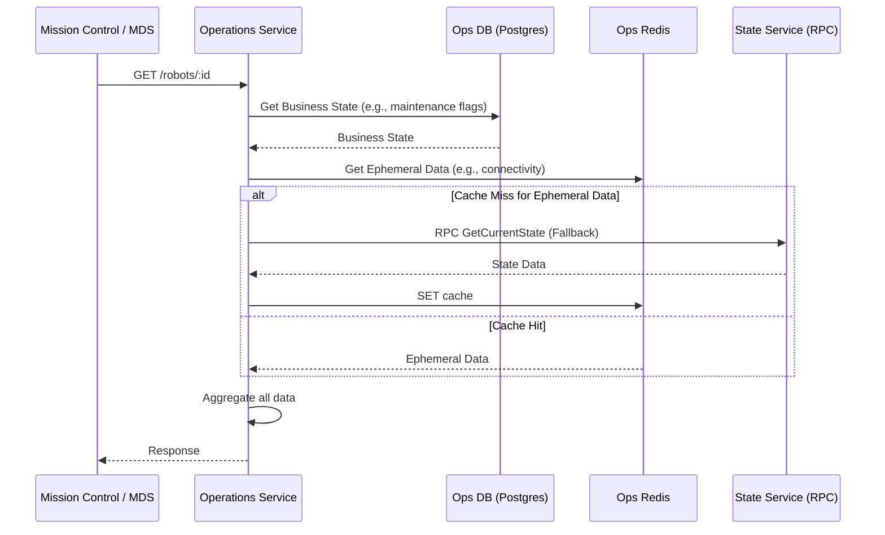

The `Operations Service`'s core aggregation logic resides within the [`RobotsService`](https://github.com/cocorobotics/delivery-platform/blob/main/service/operations/src/modules/robots/services/robots.service.ts). When a request comes in, it:

1. Fetches the latest business state (maintenance status, etc.) from its own **PostgreSQL** database.
2. Retrieves ephemeral data (connectivity, real-time health) from a **Redis** cache, managed by [`RobotEphemeralDataService`](https://github.com/cocorobotics/delivery-platform/blob/main/service/operations/src/modules/robots/services/robot-ephemeral-data.service.ts).
3. **If the cache is empty (a "cache miss"), it makes a fallback synchronous RPC call to the `State Service`** to get the most recent raw state. This is handled by the [`StateServiceRpc`](https://github.com/cocorobotics/delivery-platform/blob/main/service/operations/src/core/rpc/state-service.rpc.ts) client. This ensures data is always available, even if the cache is cold.
4. Finally, it aggregates these different data sources into a single, unified response for the client.

## 4.2 How Services Get Real-time Data from Fleet

While some services subscribe to events, others query the Fleet Service's gRPC API directly to get real-time state or mapping information. This pattern is used when a service needs immediate, specific information about a robot without maintaining its own local copy of the fleet's state. The two primary use cases are real-time telemetry for dispatching and ID resolution for provider integrations.

#### #### 4.2.1 Use Case 1: Real-time Telemetry for Dispatching

The Dispatch Engine needs the most up-to-date, low-latency state of all robots to make efficient planning decisions. It achieves this by querying the `FleetLaborProviderScope`, which reads directly from the Redis cache.

**Dispatch Engine -> Fleet Service (Labor Scope)**:
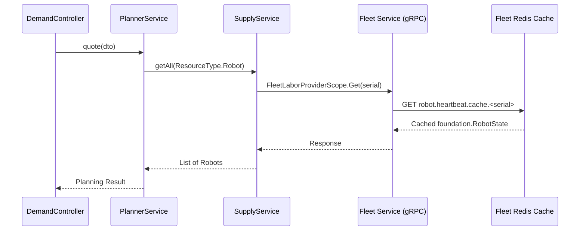

Here is the step-by-step flow:
1.  **HTTP Request**: An API call is made to the `Dispatch Engine`'s `POST /quote` endpoint to request a new delivery plan.
2.  **Controller**: The request is handled by the [`quote` method](https://github.com/cocorobotics/delivery-platform/blob/main/service/dispatch-engine/src/modules/planner/controllers/demand.controller.ts#L233) in the `DemandController`.
3.  **Planner Service**: The controller calls the [`create` method](https://github.com/cocorobotics/delivery-platform/blob/main/service/dispatch-engine/src/modules/planner/service/planner.service.ts#L187) on the `PlannerService`.
4.  **Supply Service**: To find a suitable robot, the `PlannerService` needs a list of all available robots. It calls the [`getRobots` method](https://github.com/cocorobotics/delivery-platform/blob/main/service/dispatch-engine/src/modules/supply/service/supply.service.ts#L104) on the `SupplyService`.
5.  **Fleet Client Call**: The `SupplyService` uses a client wrapper to make a `FleetLaborProviderScope.Get` gRPC call to the `Fleet Service`. This call is designed for high performance, fetching the [`foundation.RobotState`](https://github.com/cocorobotics/coco-services/blob/master/core/foundation/robot.go) object directly from the **Redis cache**.

#### #### 4.2.2 Use Case 2: ID Resolution for Provider Integrations

This flow is used by provider integrations (like Uber) to resolve an internal robot serial number into a provider-specific vehicle ID. This is necessary because external partners track our robots using their own identifiers.

**Uber Webhook -> Fleet Service (Beacon Scope)**:
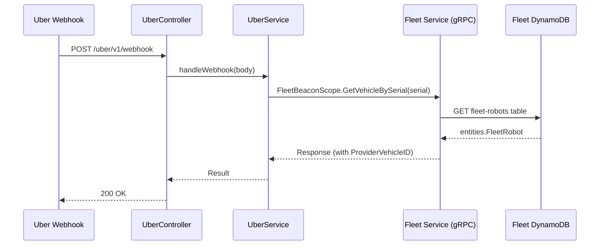

Here is the step-by-step flow:
1.  **HTTP Webhook**: Uber sends a webhook to our backend when a delivery event occurs.
2.  **Controller**: The request is received by the `Integrations Service` at the `POST /uber/v1/webhook` endpoint, which is handled by the [`HandleUberWebhook` method](https://github.com/cocorobotics/delivery-platform/blob/main/service/integrations/src/uber/uber.controller.ts) in the `UberController`.
3.  **Service Logic**: The controller calls the [`handleWebhook` method](https://github.com/cocorobotics/delivery-platform/blob/main/service/integrations/src/uber/uber.service.ts) in the `UberService`.
4.  **gRPC Call**: Inside the `UberService`, a gRPC client calls the [`GetVehicleBySerial` method](https://github.com/cocorobotics/coco-services/blob/master/fleet/internal/handlers/grpc/grpc_beacon_scope.go) on the `FleetBeaconScopeService` in the `Fleet Service`, passing the robot's serial number.
5.  **Database Query**: The `Fleet Service` queries the `fleet-robots` DynamoDB table to find the corresponding `entities.FleetRobot` record.
6.  **ID Resolution**: The `ProviderVehicleID` (the Uber-specific ID) is extracted from the record and returned to the `Integrations Service`.
7.  **Business Logic**: The `Integrations Service` can now proceed with its business logic, having resolved the correct vehicle ID.


## ## 4.3 How DoorDash Gets Status Updates

This flow is used to keep external partners like DoorDash synchronized with the state of a delivery. The crucial insight is that the process is initiated by a low-level robot heartbeat, which is then translated into a high-level business event by the `Operations Service` before being consumed by the `Integrations Service`.

**End-to-end DoorDash Status Push Path**:
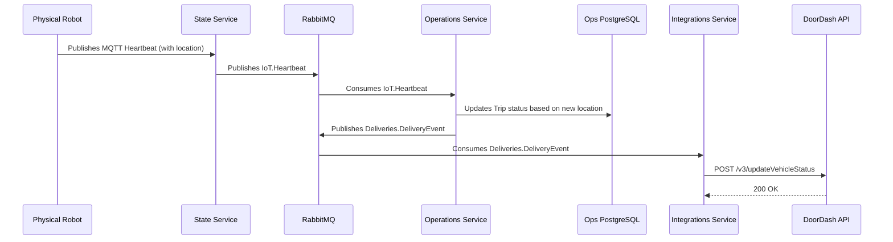

This entire flow demonstrates how a change in a robot's physical state cascades through the system to trigger external notifications:

1.  **Heartbeat Ingestion**: The `Physical Robot` sends its location via an MQTT heartbeat, which is processed by the `State Service` and published to RabbitMQ as an `IoT.Heartbeat` event.
2.  **Trip State Update (Operations Service)**:
    *   The [`Operations Service`](https://github.com/cocorobotics/delivery-platform/blob/main/service/operations/src/modules/robots/handlers/iot-heartbeat-handler.ts) consumes the `IoT.Heartbeat` event.
    *   It uses the new location data to update the status of the ongoing trip/delivery associated with that robot. This state change is persisted to the **Operations PostgreSQL database**.
    *   After successfully updating its internal state, the `Operations Service` publishes a new, higher-level `Deliveries.DeliveryEvent` to RabbitMQ. This event signifies a meaningful change in the delivery's progress.
3.  **External Push (Integrations Service)**:
    *   The [`Integrations Service`](https://github.com/cocorobotics/delivery-platform/blob/main/service/integrations/src/doordash/v3/doordash-update.service.ts) listens for `Deliveries.DeliveryEvent`.
    *   When an event is received, it transforms the internal delivery status into the format DoorDash expects, including the `vehicle_location`.
    *   Finally, it makes an HTTP POST request to the DoorDash API to update the delivery status.

**Schema (`VehicleStatus` sent to DoorDash)**:
The payload sent to DoorDash is defined by the [`VehicleStatus` type](https://github.com/cocorobotics/delivery-platform/blob/main/service/integrations/src/doordash/v3/types/API.ts). The key field that connects this flow back to the device's state is `vehicle_location`.

## ## 4.4 The Unlock & Loading Flow

This flow describes how a user action (entering a pin, receiving an automated unlock command) translates into a physical lid opening and how that event propagates through the system to affect a delivery. It also covers the subsequent physical closing of the lid.

**End-to-end Unlock Flow**:
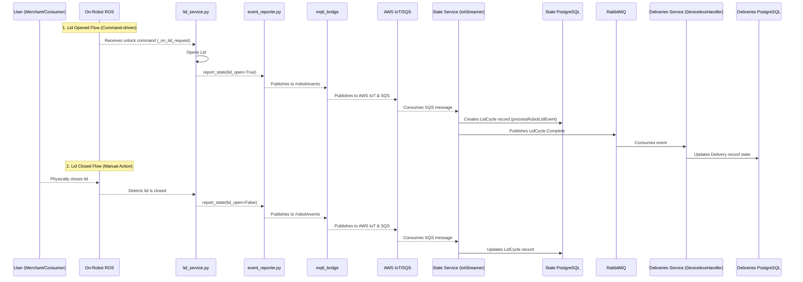

This flow is broken down into three main phases:

1.  **On-Robot Processing**:
    *   **Lid Opened (Command)**: An unlock command is sent to the robot, which is handled by the [`_on_lid_request` method](https://github.com/cocorobotics/coco-acu/blob/master/src/coco_business_logic/lid_operation/src/lid_operation/lid_service.py) in the `lid_service.py`. This service then publishes a `LID_OPENED` event via its [`report_state` method](https://github.com/cocorobotics/coco-acu/blob/master/src/coco_business_logic/lid_operation/src/lid_operation/lid_service.py).
    *   **Lid Closed (Physical)**: A user physically closes the lid. The `lid_service.py` detects this change and publishes a `LID_CLOSED` event.
    *   **Event Bridging**: The [`event_reporter.py`](https://github.com/cocorobotics/coco-acu/blob/master/src/monitoring/events/event_reporter/src/event_reporter/event_reporter.py) captures this event, validates it, and publishes it to a specific ROS topic that the [`mqtt_bridge`](https://github.com/cocorobotics/coco-acu/blob/master/src/mqtt_bridge/src/mqtt_bridge/bridge.py) is subscribed to. The bridge then forwards this event to AWS IoT.

2.  **Backend Ingestion (`State Service`)**:
    *   The `LID_OPENED`/`LID_CLOSED` event message lands in an SQS queue.
    *   The [`IotStreamerService`](https://github.com/cocorobotics/delivery-platform/blob/main/service/state/src/iot-streamer/iot-streamer.service.ts) in the `State Service` consumes the message.
    *   It calls the [`processRobotLidEvent` method](https://github.com/cocorobotics/delivery-platform/blob/main/service/state/src/lid-cycle/lid-cycle.service.ts) in the `LidCycleService`, which creates or updates a `LidCycle` record in the **State PostgreSQL database**.
    *   Upon successful processing, it publishes a `LidCycle.Complete` event to RabbitMQ.

3.  **Consumption in `Deliveries` Service**:
    *   The `Deliveries` service consumes the `LidCycle.Complete` event in its [`deviceless.handler.ts`](https://github.com/cocorobotics/delivery-platform/blob/main/service/deliveries/src/modules/deviceless/deviceless.handler.ts).
    *   This handler contains the business logic to update the state of the associated delivery in the **Deliveries PostgreSQL database**, marking it as ready for loading or completed.

---

# 5. RabbitMQ Event Reference

This section provides a comprehensive map of all RabbitMQ events relevant to device/robot state, showing who publishes each event, who consumes it, and for what purpose.

	## 5.1 Robot Telemetry & State Events
	
	| Event | Publisher(s) | Consumer(s) | Purpose |
	|-------|--------------|-------------|---------|
	| [`IoT.Heartbeat`](https://github.com/cocorobotics/delivery-platform/blob/main/lib/common/src/exchanges/names.ts) | **State Service** ([`IotStreamerService`](https://github.com/cocorobotics/delivery-platform/blob/main/service/state/src/iot-streamer/iot-streamer.service.ts)) - On every robot heartbeat | **Operations Service** ([`IotHeartbeatHandler`](https://github.com/cocorobotics/delivery-platform/blob/main/service/operations/src/modules/robots/handlers/iot-heartbeat-handler.ts)) - Update Redis cache, check geofences<br/>**Dispatch Engine** ([`IotHeartbeatHandler`](https://github.com/cocorobotics/delivery-platform/blob/main/service/dispatch-engine/src/modules/eventsink/handlers/iot-heartbeat.handler.ts)) - Update supply cache with location/battery | Real-time robot telemetry (GPS, battery, health) fan-out |
	| [`Robots.StateChange`](https://github.com/cocorobotics/delivery-platform/blob/main/lib/common/src/exchanges/names.ts) | **State Service** ([`StateTransitionSubscriber`](https://github.com/cocorobotics/delivery-platform/blob/main/service/state/src/state/state-machine/listeners/state-transition.subscriber.ts)) - On state machine transitions<br/>**Operations Service** (12+ points) - Deployments, grounding, trips, maintenance<br/>**Deliveries Service** ([`RobotProviderService`](https://github.com/cocorobotics/delivery-platform/blob/main/service/deliveries/src/modules/providers/robot/robot.service.ts)) - hasFood updates | **State Service** ([`RobotStateChangeHandler`](https://github.com/cocorobotics/delivery-platform/blob/main/service/state/src/state/robot-state.handler.ts)) - Sync needsMaintenance<br/>**Operations Service** ([`RobotStateChangeHandler`](https://github.com/cocorobotics/delivery-platform/blob/main/service/operations/src/modules/robots/handlers/robot-state-change-handler.ts)) - Update RobotStateHistory<br/>**Dispatch Engine** ([`RobotStageChangeHandler`](https://github.com/cocorobotics/delivery-platform/blob/main/service/dispatch-engine/src/modules/eventsink/handlers/robot-stage-change.handler.ts)) - Update supply cache<br/>**Fleet Service** ([`HandleRobotsStateChange`](https://github.com/cocorobotics/coco-services/blob/master/fleet/internal/consumer/legacy_robots_consumer/robots_state_change.go)) - Update DynamoDB for Uber | Business state changes (operationState, hasFood, needsMaintenance, tripType) |
	| [`Robots.Deployment`](https://github.com/cocorobotics/delivery-platform/blob/main/lib/common/src/exchanges/names.ts) | **Operations Service** ([`RobotDeploymentEventsPublisherService`](https://github.com/cocorobotics/delivery-platform/blob/main/service/operations/src/modules/fleet-management/publishers/robot-state-change-events-publisher.service.ts)) - When deploying robots | **Dispatch Engine** ([`RobotEventsHandler`](https://github.com/cocorobotics/delivery-platform/blob/main/service/dispatch-engine/src/modules/eventsink/handlers/robot-stage-change.handler.ts)) - Add to supply<br/>**Fleet Service** ([`HandleRobotsDeployment`](https://github.com/cocorobotics/coco-services/blob/master/fleet/internal/consumer/legacy_robots_consumer/robots_deployment.go)) - Update DynamoDB | Robot deployment to service area |
	| [`Robots.State`](https://github.com/cocorobotics/delivery-platform/blob/main/lib/common/src/exchanges/names.ts) | **Dispatch Engine** ([`SupplyService`](https://github.com/cocorobotics/delivery-platform/blob/main/service/dispatch-engine/src/modules/supply/service/supply.service.ts)) - On supply changes | **Fleet Service** ([`HandleRobotsState`](https://github.com/cocorobotics/coco-services/blob/master/fleet/internal/consumer/legacy_robots_consumer/robots_state.go)) - Update DynamoDB | Full robot state snapshot for external providers |
	| [`IoT.HealthStateChanged`](https://github.com/cocorobotics/delivery-platform/blob/main/lib/common/src/exchanges/names.ts) | **State Service** - When robot health changes | **Operations Service** - Ground robot if unhealthy, create FO tasks | Robot health status transitions (healthy ↔ unhealthy) |
	
	## 5.2 Connectivity Events
	
	| Event | Publisher(s) | Consumer(s) | Purpose |
	|-------|--------------|-------------|---------|
	| [`State.ConnectivityRawStatusChanged`](https://github.com/cocorobotics/delivery-platform/blob/main/lib/common/src/exchanges/names.ts) | **State Service** ([`ConnectivityEventHandler`](https://github.com/cocorobotics/delivery-platform/blob/main/service/state/src/connectivity/connectivity-event.handler.ts)) - On DriveU webhook | **State Service** ([`DriveuStatusHandler`](https://github.com/cocorobotics/delivery-platform/blob/main/service/state/src/driveu/driveu-status.handler.ts)) - Save to DynamoDB | Raw DriveU teleoperation connectivity updates |
	| [`State.ConnectivityOverallChanged`](https://github.com/cocorobotics/delivery-platform/blob/main/lib/common/src/exchanges/names.ts) | **State Service** - On connectivity state change | **Operations Service** ([`RobotStateChangeHandler`](https://github.com/cocorobotics/delivery-platform/blob/main/service/operations/src/modules/robots/handlers/robot-state-change-handler.ts)) - Update online/offline status | Aggregated connectivity status (online/offline) |
	
	## 5.3 State Machine Events
	
	| Event | Publisher(s) | Consumer(s) | Purpose |
	|-------|--------------|-------------|---------|
	| [`State.TransitionCompleted`](https://github.com/cocorobotics/delivery-platform/blob/main/lib/common/src/exchanges/names.ts) | **State Service** ([`StateTransitionSubscriber`](https://github.com/cocorobotics/delivery-platform/blob/main/service/state/src/state/state-machine/listeners/state-transition.subscriber.ts)) - On successful transition | **Operations Service** - Update trip/task state | Robot successfully transitioned (e.g., PARKED → ON_TRIP) |
	| [`State.TransitionFailed`](https://github.com/cocorobotics/delivery-platform/blob/main/lib/common/src/exchanges/names.ts) | **State Service** ([`StateTransitionSubscriber`](https://github.com/cocorobotics/delivery-platform/blob/main/service/state/src/state/state-machine/listeners/state-transition.subscriber.ts)) - On failed transition | **Operations Service** - Handle failure, alert | Robot transition rejected (invalid state change) |
	
	## 5.4 Lid Cycle Events
	
	| Event | Publisher(s) | Consumer(s) | Purpose |
	|-------|--------------|-------------|---------|
	| [`Robots.PinEntry`](https://github.com/cocorobotics/delivery-platform/blob/main/lib/common/src/exchanges/names.ts) | **State Service** ([`IotStreamerService`](https://github.com/cocorobotics/delivery-platform/blob/main/service/state/src/iot-streamer/iot-streamer.service.ts)) - On PIN_ENTRY_* event | **Deliveries Service** - Validate PIN, update attempt | Merchant/customer entered PIN on robot keypad |
	| [`Robots.LidOpen`](https://github.com/cocorobotics/delivery-platform/blob/main/lib/common/src/exchanges/names.ts) | **State Service** - On LID_OPENED event | **Deliveries Service** - Start loading timer | Robot lid was opened (for loading/unloading) |
	| [`Robots.LidClose`](https://github.com/cocorobotics/delivery-platform/blob/main/lib/common/src/exchanges/names.ts) | **State Service** - On LID_CLOSED event | **Deliveries Service** ([`RobotHandler`](https://github.com/cocorobotics/delivery-platform/blob/main/service/deliveries/src/modules/providers/robot/robot.handler.ts)) - loadRobot(), update hasFood | Robot lid was closed (loading complete) |
	| [`LidCycle.Init`](https://github.com/cocorobotics/delivery-platform/blob/main/lib/common/src/exchanges/names.ts) | **State Service** ([`LidCycleService`](https://github.com/cocorobotics/delivery-platform/blob/main/service/state/src/lid-cycle/lid-cycle.service.ts)) - On lid open | **Deliveries Service** - Track loading started | Lid cycle initiated (lid opened for loading/unloading) |
	| [`LidCycle.Complete`](https://github.com/cocorobotics/delivery-platform/blob/main/lib/common/src/exchanges/names.ts) | **State Service** ([`LidCycleService`](https://github.com/cocorobotics/delivery-platform/blob/main/service/state/src/lid-cycle/lid-cycle.service.ts)) - On lid close | **Deliveries Service** ([`DevicelessHandler`](https://github.com/cocorobotics/delivery-platform/blob/main/service/deliveries/src/modules/deviceless/deviceless.handler.ts)) - Mark loaded/delivered | Lid cycle completed successfully |
	| [`LidCycle.Timeout`](https://github.com/cocorobotics/delivery-platform/blob/main/lib/common/src/exchanges/names.ts) | **State Service** ([`LidCycleTimeoutWorker`](https://github.com/cocorobotics/delivery-platform/blob/main/service/state/src/lid-cycle/lid-cycle-timeout.worker.ts)) - Lid open too long | **Deliveries Service** - Alert, may cancel | Lid open exceeded timeout threshold |
	
	## 5.5 Delivery & Order Events
	
	| Event | Publisher(s) | Consumer(s) | Purpose |
	|-------|--------------|-------------|---------|
	| [`Deliveries.DeliveryEvent`](https://github.com/cocorobotics/delivery-platform/blob/main/lib/common/src/exchanges/names.ts) | **Deliveries Service** - On delivery state change | **Integrations Service** ([`DoorDashUpdateService`](https://github.com/cocorobotics/delivery-platform/blob/main/service/integrations/src/doordash/v3/doordash-update.service.ts)) - Push to DoorDash<br/>**Operations Service** - Trigger FO tasks | Delivery status changed (InTransit, AtDestination, Completed, etc.) |
	| [`Deliveries.AttemptUpdated`](https://github.com/cocorobotics/delivery-platform/blob/main/lib/common/src/exchanges/names.ts) | **Deliveries Service** - On attempt state change | **Operations Service** - Update trip state<br/>**Dispatch Engine** - Update demand status | Attempt status transitioned (AtPickup, LoadedWithPilot, InTransit, etc.) |
	| [`Deliveries.ProviderEtaUpdated`](https://github.com/cocorobotics/delivery-platform/blob/main/lib/common/src/exchanges/names.ts) | **Dispatch Engine** - On ETA recalculation | **Integrations Service** - Push ETA to partners | Updated ETA for delivery (for partner apps) |
	| [`Deliveries.RescueInitiated`](https://github.com/cocorobotics/delivery-platform/blob/main/lib/common/src/exchanges/names.ts) | **Deliveries Service** - When rescue flow starts | **Integrations Service** - Notify partner of rescue<br/>**Operations Service** - Create FO rescue task | Robot failed mid-delivery, rescue courier assigned |
	
	## 5.6 Operations & Trip Events
	
	| Event | Publisher(s) | Consumer(s) | Purpose |
	|-------|--------------|-------------|---------|
	| [`Operations.TripCreated`](https://github.com/cocorobotics/delivery-platform/blob/main/lib/common/src/exchanges/names.ts) | **Operations Service** - When trip is created | **Dispatch Engine** - Track active trips<br/>**Trip Monitor** - Start monitoring | New trip created (JITP, Delivery, Return, Deployment) |
	| [`Operations.TripTransitioned`](https://github.com/cocorobotics/delivery-platform/blob/main/lib/common/src/exchanges/names.ts) | **Operations Service** - On trip state change | **Deliveries Service** - Update attempt status<br/>**Dispatch Engine** - Update demand<br/>**Integrations Service** - Push to partners | Trip status changed (SCHEDULED → IN_TRANSIT → COMPLETED) |
	| [`Operations.TripRescueRequired`](https://github.com/cocorobotics/delivery-platform/blob/main/lib/common/src/exchanges/names.ts) | **Operations Service** - Robot failed with food | **Deliveries Service** - Initiate rescue flow | Robot needs rescue (unhealthy with hasFood=true) |
	| [`Operations.FoTaskCreated`](https://github.com/cocorobotics/delivery-platform/blob/main/lib/common/src/exchanges/names.ts) | **Operations Service** - When FO task created | **FO App** (via push) - Notify field operator | New field operations task (BATTERY_SWAP, UNSTUCK_BOT, etc.) |
	
	## 5.7 Dispatch Engine Internal Events
	
	| Event | Publisher(s) | Consumer(s) | Purpose |
	|-------|--------------|-------------|---------|
	| [`DispatchEngine.SupplyEvent`](https://github.com/cocorobotics/delivery-platform/blob/main/lib/common/src/exchanges/names.ts) | **Dispatch Engine** ([`IotHeartbeatHandler`](https://github.com/cocorobotics/delivery-platform/blob/main/service/dispatch-engine/src/modules/eventsink/handlers/iot-heartbeat.handler.ts), [`RobotStageChangeHandler`](https://github.com/cocorobotics/delivery-platform/blob/main/service/dispatch-engine/src/modules/eventsink/handlers/robot-stage-change.handler.ts)) - Transform external events | **Dispatch Engine** ([`SupplyEventHandler`](https://github.com/cocorobotics/delivery-platform/blob/main/service/dispatch-engine/src/modules/supply/handlers/supply-event.handler.ts)) - Update Resource table | Internal event for supply cache updates (decouples ingestion from processing) |
	| [`DispatchEngine.DemandEvent`](https://github.com/cocorobotics/delivery-platform/blob/main/lib/common/src/exchanges/names.ts) | **Dispatch Engine** - On demand changes | **Dispatch Engine** - Internal planner coordination | Demand created/updated/cancelled |
	
	## 5.8 Event Flow Summary Diagram
	
	```mermaid
	graph LR
	    subgraph "Event Sources"
	        Robot[Robot MQTT]
	        DriveU[DriveU Webhook]
	        API[API Calls]
	    end
	    
	    subgraph "State Service (Publisher)"
	        SS[State Service]
	    end
	    
	    subgraph "RabbitMQ Events"
	        HB[IoT.Heartbeat]
	        SC[Robots.StateChange]
	        LC[LidCycle.*]
	        CONN[State.Connectivity*]
	    end
	    
	    subgraph "Consumers"
	        OPS[Operations Service]
	        DE[Dispatch Engine]
	        DEL[Deliveries Service]
	        FLEET[Fleet Service]
	        INT[Integrations Service]
	    end
	    
	    Robot --> SS
	    DriveU --> SS
	    SS --> HB
	    SS --> SC
	    SS --> LC
	    SS --> CONN
	    
	    HB --> OPS
	    HB --> DE
	    SC --> OPS
	    SC --> DE
	    SC --> FLEET
	    LC --> DEL
	    CONN --> OPS
	    
	    OPS -->|Robots.StateChange| SC
	    OPS -->|Deliveries.DeliveryEvent| INT
	    DEL -->|Robots.StateChange| SC
	```
	
	## 5.9 Key Event Patterns
	
	1. **Fan-out Pattern**: `IoT.Heartbeat` and `Robots.StateChange` are consumed by multiple services, each maintaining their own view of robot state.
	
	2. **Event Transformation**: The Dispatch Engine consumes external events (`IoT.Heartbeat`, `Robots.StateChange`) and transforms them into internal `DispatchEngine.SupplyEvent` for processing.
	
	3. **Bidirectional Publishing**: State Service and Operations Service both publish AND consume `Robots.StateChange`, enabling cross-service state synchronization.
	
	4. **Cascade Pattern**: Robot heartbeat → `IoT.Heartbeat` → Operations updates → `Deliveries.DeliveryEvent` → Integrations pushes to partners.
	
	5. **Eventual Consistency**: Each consumer maintains its own database/cache, creating an eventually consistent system across PostgreSQL (State, Operations, Dispatch), DynamoDB (Fleet), and Redis (Operations, Fleet, Dispatch).


# Events

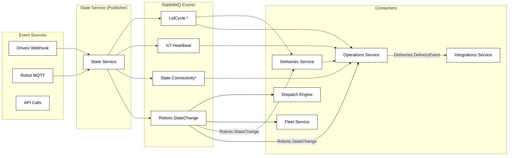

## Key Event Patterns

1. Fan-out Pattern: IoT.Heartbeat and Robots.StateChange are consumed by multiple services, each maintaining their own view of robot state. 
    
2. Event Transformation: The Dispatch Engine consumes external events (IoT.Heartbeat, Robots.StateChange) and transforms them into internal DispatchEngine. SupplyEvent for processing. 
    
3. Bidirectional Publishing: State Service and Operations Service both publish AND consume Robots.StateChange, enabling cross-service state synchronization. 
    
4. Cascade Pattern: Robot heartbeat → IoT.Heartbeat → Operations updates → Deliveries.DeliveryEvent → Integrations pushes to partners. 
    
5. Eventual Consistency: Each consumer maintains its own database/cache, creating an eventually consistent system across PostgreSQL (State, Operations, Dispatch), DynamoDB (Fleet), and Redis (Operations, Fleet, Dispatch).
    

  

6. ## Robot Telemetry & State Events
    

|Event|Publisher(s)|Consumer(s)|Purpose|
|---|---|---|---|
|[IoT.Heartbeat](https://github.com/cocorobotics/delivery-platform/blob/main/lib/common/src/exchanges/names.ts)|State Service ([IotStreamerService](https://github.com/cocorobotics/delivery-platform/blob/main/service/state/src/iot-streamer/iot-streamer.service.ts)) - On every robot heartbeat|Operations Service ([IotHeartbeatHandler](https://github.com/cocorobotics/delivery-platform/blob/main/service/operations/src/modules/robots/handlers/iot-heartbeat-handler.ts)) - Update Redis cache, check geofences<br><br>Dispatch Engine ([IotHeartbeatHandler](https://github.com/cocorobotics/delivery-platform/blob/main/service/dispatch-engine/src/modules/eventsink/handlers/iot-heartbeat.handler.ts)) - Update supply cache with location/battery|Real-time robot telemetry (GPS, battery, health) fan-out|
|[Robots.StateChange](https://github.com/cocorobotics/delivery-platform/blob/main/lib/common/src/exchanges/names.ts)|State Service ([StateTransitionSubscriber](https://github.com/cocorobotics/delivery-platform/blob/main/service/state/src/state/state-machine/listeners/state-transition.subscriber.ts)) - On state machine transitions<br><br>Operations Service (12+ points) - Deployments, grounding, trips, maintenance<br><br>Deliveries Service ([RobotProviderService](https://github.com/cocorobotics/delivery-platform/blob/main/service/deliveries/src/modules/providers/robot/robot.service.ts)) - hasFood updates|State Service ([RobotStateChangeHandler](https://github.com/cocorobotics/delivery-platform/blob/main/service/state/src/state/robot-state.handler.ts)) - Sync needsMaintenance<br><br>Operations Service ([RobotStateChangeHandler](https://github.com/cocorobotics/delivery-platform/blob/main/service/operations/src/modules/robots/handlers/robot-state-change-handler.ts)) - Update RobotStateHistory<br><br>Dispatch Engine ([RobotStageChangeHandler](https://github.com/cocorobotics/delivery-platform/blob/main/service/dispatch-engine/src/modules/eventsink/handlers/robot-stage-change.handler.ts)) - Update supply cache<br><br>Fleet Service ([HandleRobotsStateChange](https://github.com/cocorobotics/coco-services/blob/master/fleet/internal/consumer/legacy_robots_consumer/robots_state_change.go)) - Update DynamoDB for Uber|Business state changes (operationState, hasFood, needsMaintenance, needsMovement, attemptCancellationReason, tripType, undergoingMaintenance, needsPickup)|
|[Robots.Deployment](https://github.com/cocorobotics/delivery-platform/blob/main/lib/common/src/exchanges/names.ts)|Operations Service ([RobotDeploymentEventsPublisherService](https://github.com/cocorobotics/delivery-platform/blob/main/service/operations/src/modules/fleet-management/publishers/robot-state-change-events-publisher.service.ts)) - When deploying robots|Dispatch Engine ([RobotEventsHandler](https://github.com/cocorobotics/delivery-platform/blob/main/service/dispatch-engine/src/modules/eventsink/handlers/robot-stage-change.handler.ts)) - Add to supply<br><br>Fleet Service ([HandleRobotsDeployment](https://github.com/cocorobotics/coco-services/blob/master/fleet/internal/consumer/legacy_robots_consumer/robots_deployment.go)) - Update DynamoDB|Robot deployment to service area|
|[Robots.State](https://github.com/cocorobotics/delivery-platform/blob/main/lib/common/src/exchanges/names.ts)|Dispatch Engine ([SupplyService](https://github.com/cocorobotics/delivery-platform/blob/main/service/dispatch-engine/src/modules/supply/service/supply.service.ts)) - On supply changes|Fleet Service ([HandleRobotsState](https://github.com/cocorobotics/coco-services/blob/master/fleet/internal/consumer/legacy_robots_consumer/robots_state.go)) - Update DynamoDB|Full robot state snapshot for external providers|
|[IoT.HealthStateChanged](https://github.com/cocorobotics/delivery-platform/blob/main/lib/common/src/exchanges/names.ts)|State Service - When robot health changes|Operations Service - Ground robot if unhealthy, create FO tasks|Robot health status transitions (healthy ↔ unhealthy)|

2. ## Connectivity Events
    

|Event|Publisher(s)|Consumer(s)|Purpose|
|---|---|---|---|
|[State.ConnectivityRawStatusChanged](https://github.com/cocorobotics/delivery-platform/blob/main/lib/common/src/exchanges/names.ts)|State Service ([ConnectivityEventHandler](https://github.com/cocorobotics/delivery-platform/blob/main/service/state/src/connectivity/connectivity-event.handler.ts)) - On DriveU webhook|State Service ([DriveuStatusHandler](https://github.com/cocorobotics/delivery-platform/blob/main/service/state/src/driveu/driveu-status.handler.ts)) - Save to DynamoDB|Raw DriveU teleoperation connectivity updates|
|[State.ConnectivityOverallChanged](https://github.com/cocorobotics/delivery-platform/blob/main/lib/common/src/exchanges/names.ts)|State Service - On connectivity state change|Operations Service ([RobotStateChangeHandler](https://github.com/cocorobotics/delivery-platform/blob/main/service/operations/src/modules/robots/handlers/robot-state-change-handler.ts)) - Update online/offline status|Aggregated connectivity status (online/offline)|

3. ## State Machine Events
    

|Event|Publisher(s)|Consumer(s)|Purpose|
|---|---|---|---|
|[State.TransitionCompleted](https://github.com/cocorobotics/delivery-platform/blob/main/lib/common/src/exchanges/names.ts)|State Service ([StateTransitionSubscriber](https://github.com/cocorobotics/delivery-platform/blob/main/service/state/src/state/state-machine/listeners/state-transition.subscriber.ts)) - On successful transition|Operations Service - Update trip/task state|Robot successfully transitioned (e.g., PARKED → ON_TRIP)|
|[State.TransitionFailed](https://github.com/cocorobotics/delivery-platform/blob/main/lib/common/src/exchanges/names.ts)|State Service ([StateTransitionSubscriber](https://github.com/cocorobotics/delivery-platform/blob/main/service/state/src/state/state-machine/listeners/state-transition.subscriber.ts)) - On failed transition|Operations Service - Handle failure, alert|Robot transition rejected (invalid state change)|

4. ## Lid Cycle Events
    

|Event|Publisher(s)|Consumer(s)|Purpose|
|---|---|---|---|
|[Robots.PinEntry](https://github.com/cocorobotics/delivery-platform/blob/main/lib/common/src/exchanges/names.ts)|State Service ([IotStreamerService](https://github.com/cocorobotics/delivery-platform/blob/main/service/state/src/iot-streamer/iot-streamer.service.ts)) - On PIN_ENTRY_* event|Deliveries Service - Validate PIN, update attempt|Merchant/customer entered PIN on robot keypad|
|[Robots.LidOpen](https://github.com/cocorobotics/delivery-platform/blob/main/lib/common/src/exchanges/names.ts)|State Service - On LID_OPENED event|Deliveries Service - Start loading timer|Robot lid was opened (for loading/unloading)|
|[Robots.LidClose](https://github.com/cocorobotics/delivery-platform/blob/main/lib/common/src/exchanges/names.ts)|State Service - On LID_CLOSED event|Deliveries Service ([RobotHandler](https://github.com/cocorobotics/delivery-platform/blob/main/service/deliveries/src/modules/providers/robot/robot.handler.ts)) - loadRobot(), update hasFood|Robot lid was closed (loading complete)|
|[LidCycle.Init](https://github.com/cocorobotics/delivery-platform/blob/main/lib/common/src/exchanges/names.ts)|State Service ([LidCycleService](https://github.com/cocorobotics/delivery-platform/blob/main/service/state/src/lid-cycle/lid-cycle.service.ts)) - On lid open|Deliveries Service - Track loading started|Lid cycle initiated (lid opened for loading/unloading)|
|[LidCycle.Complete](https://github.com/cocorobotics/delivery-platform/blob/main/lib/common/src/exchanges/names.ts)|State Service ([LidCycleService](https://github.com/cocorobotics/delivery-platform/blob/main/service/state/src/lid-cycle/lid-cycle.service.ts)) - On lid close|Deliveries Service ([DevicelessHandler](https://github.com/cocorobotics/delivery-platform/blob/main/service/deliveries/src/modules/deviceless/deviceless.handler.ts)) - Mark loaded/delivered|Lid cycle completed successfully|
|[LidCycle.Timeout](https://github.com/cocorobotics/delivery-platform/blob/main/lib/common/src/exchanges/names.ts)|State Service ([LidCycleTimeoutWorker](https://github.com/cocorobotics/delivery-platform/blob/main/service/state/src/lid-cycle/lid-cycle-timeout.worker.ts)) - Lid open too long|Deliveries Service - Alert, may cancel|Lid open exceeded timeout threshold|

5. ## Delivery & Order Events
    

|Event|Publisher(s)|Consumer(s)|Purpose|
|---|---|---|---|
|[Deliveries.DeliveryEvent](https://github.com/cocorobotics/delivery-platform/blob/main/lib/common/src/exchanges/names.ts)|Deliveries Service - On delivery state change|Integrations Service ([DoorDashUpdateService](https://github.com/cocorobotics/delivery-platform/blob/main/service/integrations/src/doordash/v3/doordash-update.service.ts)) - Push to DoorDash<br><br>Operations Service - Trigger FO tasks|Delivery status changed (InTransit, AtDestination, Completed, etc.)|
|[Deliveries.AttemptUpdated](https://github.com/cocorobotics/delivery-platform/blob/main/lib/common/src/exchanges/names.ts)|Deliveries Service - On attempt state change|Operations Service - Update trip state<br><br>Dispatch Engine - Update demand status|Attempt status transitioned (AtPickup, LoadedWithPilot, InTransit, etc.)|
|[Deliveries.ProviderEtaUpdated](https://github.com/cocorobotics/delivery-platform/blob/main/lib/common/src/exchanges/names.ts)|Dispatch Engine - On ETA recalculation|Integrations Service - Push ETA to partners|Updated ETA for delivery (for partner apps)|
|[Deliveries.RescueInitiated](https://github.com/cocorobotics/delivery-platform/blob/main/lib/common/src/exchanges/names.ts)|Deliveries Service - When rescue flow starts|Integrations Service - Notify partner of rescue<br><br>Operations Service - Create FO rescue task|Robot failed mid-delivery, rescue courier assigned|

6. ## Operations & Trip Events
    

|Event|Publisher(s)|Consumer(s)|Purpose|
|---|---|---|---|
|[Operations.TripCreated](https://github.com/cocorobotics/delivery-platform/blob/main/lib/common/src/exchanges/names.ts)|Operations Service - When trip is created|Dispatch Engine - Track active trips<br><br>Trip Monitor - Start monitoring|New trip created (JITP, Delivery, Return, Deployment)|
|[Operations.TripTransitioned](https://github.com/cocorobotics/delivery-platform/blob/main/lib/common/src/exchanges/names.ts)|Operations Service - On trip state change|Deliveries Service - Update attempt status<br><br>Dispatch Engine - Update demand<br><br>Integrations Service - Push to partners|Trip status changed (SCHEDULED → IN_TRANSIT → COMPLETED)|
|[Operations.TripRescueRequired](https://github.com/cocorobotics/delivery-platform/blob/main/lib/common/src/exchanges/names.ts)|Operations Service - Robot failed with food|Deliveries Service - Initiate rescue flow|Robot needs rescue (unhealthy with hasFood=true)|
|[Operations.FoTaskCreated](https://github.com/cocorobotics/delivery-platform/blob/main/lib/common/src/exchanges/names.ts)|Operations Service - When FO task created|FO App (via push) - Notify field operator|New field operations task (BATTERY_SWAP, UNSTUCK_BOT, etc.)|

7. ## Dispatch Engine Internal Events
    

|Event|Publisher(s)|Consumer(s)|Purpose|
|---|---|---|---|
|[DispatchEngine.SupplyEvent](https://github.com/cocorobotics/delivery-platform/blob/main/lib/common/src/exchanges/names.ts)|Dispatch Engine ([IotHeartbeatHandler](https://github.com/cocorobotics/delivery-platform/blob/main/service/dispatch-engine/src/modules/eventsink/handlers/iot-heartbeat.handler.ts), [RobotStageChangeHandler](https://github.com/cocorobotics/delivery-platform/blob/main/service/dispatch-engine/src/modules/eventsink/handlers/robot-stage-change.handler.ts)) - Transform external events|Dispatch Engine ([SupplyEventHandler](https://github.com/cocorobotics/delivery-platform/blob/main/service/dispatch-engine/src/modules/supply/handlers/supply-event.handler.ts)) - Update Resource table|Internal event for supply cache updates (decouples ingestion from processing)|
|[DispatchEngine.DemandEvent](https://github.com/cocorobotics/delivery-platform/blob/main/lib/common/src/exchanges/names.ts)|Dispatch Engine - On demand changes|Dispatch Engine - Internal planner coordination|Demand created/updated/cancelled|

## Robots.StateChange Event Map

### Publishers

|Service|GitHub Link|Trigger / Purpose|
|---|---|---|
|State Service|[state-transition.subscriber.ts:66-79](https://github.com/cocorobotics/delivery-platform/blob/main/service/state/src/state/state-machine/listeners/state-transition.subscriber.ts#L66-L79)|Publishes when robot state machine transitions occur (GROUNDED, OFF_DUTY, ON_TRIP, PARKED). Also sets needsMaintenance=true when entering GROUNDED state and needsMaintenance=false when leaving it.|
|Operations Service|[robots.service.ts:825-829](https://github.com/cocorobotics/delivery-platform/blob/main/service/operations/src/modules/robots/services/robots.service.ts#L825-L829)|When a robot is grounded due to assistance request|
|Operations Service|[robots.service.ts:849-853](https://github.com/cocorobotics/delivery-platform/blob/main/service/operations/src/modules/robots/services/robots.service.ts#L849-L853)|When a robot is grounded (general case)|
|Operations Service|[robot-fleet-management.service.ts:121-126](https://github.com/cocorobotics/delivery-platform/blob/main/service/operations/src/modules/fleet-management/services/robot-fleet-management.service.ts#L121-L126)|When a robot is undeployed (OFF_DUTY)|
|Operations Service|[robot-fleet-management.service.ts:331-336](https://github.com/cocorobotics/delivery-platform/blob/main/service/operations/src/modules/fleet-management/services/robot-fleet-management.service.ts#L331-L336)|When robots are deployed to parking lot (PARKED)|
|Operations Service|[pilot-trips.service.ts:225-230](https://github.com/cocorobotics/delivery-platform/blob/main/service/operations/src/modules/trips/services/pilot-trips.service.ts#L225-L230)|When a pilot trip starts (ON_TRIP, hasFood, needsMovement)|
|Operations Service|[pilot-trips.service.ts:168](https://github.com/cocorobotics/delivery-platform/blob/main/service/operations/src/modules/trips/services/pilot-trips.service.ts#L168)|When trip is cancelled/parked after assistance request|
|Operations Service|[pilot-trips.service.ts:260-265](https://github.com/cocorobotics/delivery-platform/blob/main/service/operations/src/modules/trips/services/pilot-trips.service.ts#L260-L265)|When resuming a trip (ON_TRIP, needsMovement)|
|Operations Service|[pilot-trips.repository.ts:659-664](https://github.com/cocorobotics/delivery-platform/blob/main/service/operations/src/modules/trips/repositories/pilot-trips.repository.ts#L659-L664)|When trip is updated (ON_TRIP, needsMovement, tripType)|
|Operations Service|[pilot-trips.publisher.ts:137-142](https://github.com/cocorobotics/delivery-platform/blob/main/service/operations/src/modules/trips/publishers/pilot-trips.publisher.ts#L137-L142)|When pilot trip completes (PARKED, hasFood=false)|
|Operations Service|[pilot-trips.publisher.ts:151-156](https://github.com/cocorobotics/delivery-platform/blob/main/service/operations/src/modules/trips/publishers/pilot-trips.publisher.ts#L151-L156)|When pilot trip is cancelled (PARKED)|
|Operations Service|[fo-tasks.service.ts:313-316](https://github.com/cocorobotics/delivery-platform/blob/main/service/operations/src/modules/fo-tasks/fo-tasks.service.ts#L313-L316)|When FO arrives at bot for maintenance (undergoingMaintenance=true)|
|Operations Service|[fo-tasks.service.ts:176-180](https://github.com/cocorobotics/delivery-platform/blob/main/service/operations/src/modules/fo-tasks/fo-tasks.service.ts#L176-L180)|When maintenance tasks are scheduled/cancelled (sets needsMaintenance, needsPickup)|
|Operations Service|[delivery.handlers.ts:64](https://github.com/cocorobotics/delivery-platform/blob/main/service/operations/src/modules/fo-tasks/handlers/delivery.handlers.ts#L64)|When delivery terminates, updates needsMaintenance based on pending tasks|
|Operations Service|[delivery.handlers.ts:113](https://github.com/cocorobotics/delivery-platform/blob/main/service/operations/src/modules/fo-tasks/handlers/delivery.handlers.ts#L113)|When delivery completes, updates needsMaintenance based on pending tasks|
|Deliveries Service|[robot.service.ts:565-572](https://github.com/cocorobotics/delivery-platform/blob/main/service/deliveries/src/modules/providers/robot/robot.service.ts#L565-L572)|When robot is loaded with food (hasFood=true, needsMovement=true, tripType=DELIVERY, ON_TRIP)|
|Deliveries Service|[delivery.service.ts:1384-1388](https://github.com/cocorobotics/delivery-platform/blob/main/service/deliveries/src/modules/delivery/service/delivery.service.ts#L1384-L1388)|When rescue attempt fails (hasFood=false)|

### Subscribers

|Service|GitHub Link|Purpose|
|---|---|---|
|State Service|[robot-state.handler.ts:18-29](https://github.com/cocorobotics/delivery-platform/blob/main/service/state/src/state/robot-state.handler.ts#L18-L29)|Syncs needsMaintenance flag from other services into State Service's robot state|
|Operations Service|[robot-state-change-handler.ts:52-68](https://github.com/cocorobotics/delivery-platform/blob/main/service/operations/src/modules/robots/handlers/robot-state-change-handler.ts#L52-L68)|Updates robot state history in Operations DB with all operational state fields (needsMovement, hasFood, tripType, operationState, needsMaintenance, needsPickup, undergoingMaintenance, driveable)|
|Dispatch Engine|[robot-stage-change.handler.ts:100-143](https://github.com/cocorobotics/delivery-platform/blob/main/service/dispatch-engine/src/modules/eventsink/handlers/robot-stage-change.handler.ts#L100-L143)|Transforms external Robots.StateChange event into internal DispatchEngine.SupplyEvent to update the dispatch planner's robot supply cache|

  

# Tables

### Dispatch Engine Service (delivery-platform/service/dispatch-engine)

|Table Name|Description|
|---|---|
|robots|Core robot state for dispatch (location, battery, health, scheduled demands)|
|robot_plans|Robot scheduling plans for demand fulfillment|

### Operations Service (delivery-platform/service/operations)

|Table Name|Description|
|---|---|
|Robot|Core robot entity (serial, display name, relationships)|
|RobotStateHistory|Tracks robot operational state changes (ON_TRIP, PARKED, GROUNDED, etc.)|
|RobotDeployment|Robot deployment history to locations|
|RobotCheckInHistory|Field operator check-in/check-out records for robots|

### Deliveries Service (delivery-platform/service/deliveries)

|Table Name|Description|
|---|---|
|robot_trips|Robot trip records (deprecated - migrated to other tables)|
|robot_trip_history|Historical robot trip status changes|
|robot_quotes|Robot delivery quotes|
|RobotDelivery / RobotDeliveryHistory|Early delivery models (deprecated)|

### State Service (delivery-platform/service/state)

|Table Name|Description|
|---|---|
|StateHistory|Robot state machine transitions (keyed by serial)|
|Connectivity / ConnectivityHistory|Robot connectivity status (IoT, DriveU)|
|LidCycle / LidCycleEventHistory|Robot lid open/close cycles|

  

### Config Service (coco-services/config)

|Table Name|Description|
|---|---|
|robot_location|Physical locations where robots operate (parking lots, hubs)|
|robot_location_tag|Tags associated with robot locations|

  

---

## DynamoDB Tables (Fleet Service)

### Fleet Service (coco-services/fleet + coco-infra)

|Table Name|Description|
|---|---|
|fleet-robots|Primary robot telemetry and state storage|
|fleet-legacy-robot-updates|Legacy robot update events|
|fleet-robot-heartbeats|Robot heartbeat records|
|fleet-virtual-robots|Virtual robot mappings for providers|
|uber-robot-state-updates|Uber-specific robot state sync|

  

---

## Summary by Data Domain

|Definition|Table|Service|Description|
|---|---|---|---|
|[schema.prisma:212](https://github.com/cocorobotics/delivery-platform/blob/main/service/operations/prisma/schema.prisma#L212)|Robot|Operations|Registry / Maintenance Tasks|
|[dynamodb.tf:244](https://github.com/cocorobotics/coco-infra/blob/main/environments/prod/applications/us-west-2/fleet/service/dynamodb.tf#L244)|fleet-robots|Fleet|Registry|
|[schema.prisma:19](https://github.com/cocorobotics/delivery-platform/blob/main/service/state/prisma/schema.prisma#L19)|StateHistory|State|State transitions|
|[schema.sql:36](https://github.com/cocorobotics/coco-services/blob/master/config/sqitch/deploy/schema.sql#L36)|robot_location|Config|Configuration for locations where robots can be deployed/undeployed|
|[schema.sql:16](https://github.com/cocorobotics/coco-services/blob/master/config/sqitch/deploy/schema.sql#L16)|robot_location_tag|Config|Same|
|[schema.prisma:349](https://github.com/cocorobotics/delivery-platform/blob/main/service/operations/prisma/schema.prisma#L349)|RobotDeployment|Operations|Tracking robots’ deployment state|
|[schema.prisma:370](https://github.com/cocorobotics/delivery-platform/blob/main/service/operations/prisma/schema.prisma#L370)|RobotCheckInHistory|Operations|Tracking robots’ check in into MROs|
|[migration.sql:204](https://github.com/cocorobotics/delivery-platform/blob/main/service/deliveries/prisma/migrations/20211217210247_refactor_models_add_olo_configs/migration.sql#L204)|robot_trips|Deliveries||
|[migration.sql:215](https://github.com/cocorobotics/delivery-platform/blob/main/service/deliveries/prisma/migrations/20211217210247_refactor_models_add_olo_configs/migration.sql#L215)|robot_trip_history|Deliveries||
|[migration.sql:2](https://github.com/cocorobotics/delivery-platform/blob/main/service/deliveries/prisma/migrations/20220812100048_store_robot_quotes/migration.sql#L2)|robot_quotes|Deliveries||
|[schema.prisma:136](https://github.com/cocorobotics/delivery-platform/blob/main/service/dispatch-engine/prisma/schema.prisma#L136)|robot_plans|Dispatch Engine|Planning & Supply|
|[schema.prisma:46](https://github.com/cocorobotics/delivery-platform/blob/main/service/dispatch-engine/prisma/schema.prisma#L46)|robots|Dispatch Engine|Planning & Supply|
|[schema.prisma:230](https://github.com/cocorobotics/delivery-platform/blob/main/service/operations/prisma/schema.prisma#L230)|RobotStateHistory|Operations|History of maintenance|
|[schema.prisma:62](https://github.com/cocorobotics/delivery-platform/blob/main/service/state/prisma/schema.prisma#L62)|Connectivity|State||
|[schema.prisma:74](https://github.com/cocorobotics/delivery-platform/blob/main/service/state/prisma/schema.prisma#L74)|ConnectivityHistory|State||
|[schema.prisma:107](https://github.com/cocorobotics/delivery-platform/blob/main/service/state/prisma/schema.prisma#L107)|LidCycle|State||
|[schema.prisma:121](https://github.com/cocorobotics/delivery-platform/blob/main/service/state/prisma/schema.prisma#L121)|LidCycleEventHistory|State||
|[dynamodb.tf:103](https://github.com/cocorobotics/coco-infra/blob/main/environments/prod/applications/us-west-2/fleet/service/dynamodb.tf#L103)|fleet-robot-heartbeats|Fleet||
|[dynamodb.tf:1](https://github.com/cocorobotics/coco-infra/blob/main/environments/prod/applications/us-west-2/fleet/service/dynamodb.tf#L1)|fleet-legacy-robot-updates|Fleet||
|[dynamodb.tf:198](https://github.com/cocorobotics/coco-infra/blob/main/environments/prod/applications/us-west-2/fleet/service/dynamodb.tf#L198)|fleet-virtual-robots|Fleet||
|[dynamodb.tf:126](https://github.com/cocorobotics/coco-infra/blob/main/environments/prod/applications/us-west-2/fleet/service/dynamodb.tf#L126)|uber-robot-state-updates|Fleet||
|[schema.prisma:688](https://github.com/cocorobotics/delivery-platform/blob/9e006cda24b680a7d1f14ee6d32af0d061aea6b0/service/operations/prisma/schema.prisma#L668)|FoTaskModel|Operations|Manages field tasks (e.g., BATTERY_SWAP, UNSTUCK_BOT).|
|[schema.prisma:144](https://github.com/cocorobotics/delivery-platform/blob/3f79e499b43e2ad00a9a4c8ce2da81eb72d76d78/service/operations/prisma/schema.prisma#L144)|FoAssistanceRequestModel|Operations|Tracks help requests triggered by robot failures during trips.|
|[schema.prisma:144](https://github.com/cocorobotics/delivery-platform/blob/3f79e499b43e2ad00a9a4c8ce2da81eb72d76d78/service/state/prisma/schema.prisma#L144)|PinEntryEvent|State|Logs PIN entry attempts on physical robot keypads.|
|||||

  
  
**