# System Overview

This diagram illustrates the entire ecosystem: how data flows from robots and external providers into our system, how it propagates between internal services, and how it is finally consumed by internal applications and external partners.

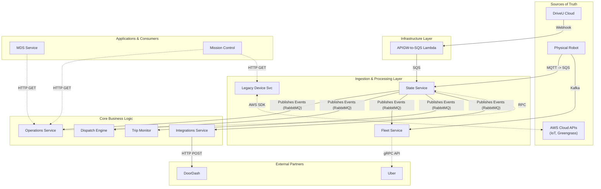

---

## Phase 1: Sources & Ingestion

The data lifecycle begins with raw telemetry and status updates from the physical world.

### Physical Robots (MQTT)

- **Protocol**: MQTT via AWS IoT.
- **Data**: Telemetry (Location, Battery), Connectivity.
- **Ingestion**: Routed to SQS (`eventsQueueUrl`, `stateQueueUrl` defined in [`service/state/src/config/config.loader.ts`](https://github.com/cocorobotics/delivery-platform/blob/main/service/state/src/config/config.loader.ts)).

**On-Robot Publishing Flow**:
The robot runs ROS (Robot Operating System), and data is published from various sensor nodes to a central aggregator, which then forwards the data to the cloud via an MQTT bridge.

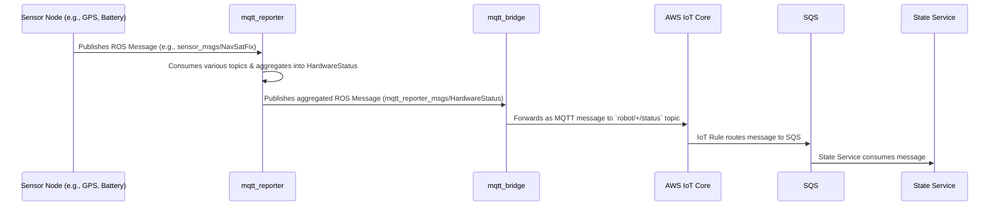

The flow is orchestrated by these key components:

1. **Sensor Nodes**: Standard ROS nodes that interface with the hardware (GPS, battery controller, etc.) and publish their data to specific topics on the internal ROS message bus.
2. **Aggregator (`mqtt_reporter`)**: The [`hardware_status_aggregator.py`](https://github.com/cocorobotics/coco-acu/blob/develop/src/hardware_fail_detection/mqtt_reporter/src/mqtt_reporter/hardware_status_aggregator.py) node subscribes to many different sensor topics. It collects and aggregates this data into a single, comprehensive `HardwareStatus` message.
3. **Bridge (`mqtt_bridge`)**: This is a generic ROS-to-MQTT bridge. It subscribes to the `HardwareStatus` ROS topic and, based on its configuration in [`topics.yaml`](https://github.com/cocorobotics/coco-acu/blob/develop/src/mqtt_bridge/config/topics.yaml), publishes the content of that message to an AWS IoT MQTT topic (e.g., `robot/123/status`). The core logic for this is in [`bridge.py`](https://github.com/cocorobotics/coco-acu/blob/develop/src/mqtt_bridge/src/mqtt_bridge/bridge.py).
4. **Backend Consumer**: As previously detailed, the message is routed via an AWS IoT Rule to an SQS queue, which is consumed by the [`IotStreamerService`](https://github.com/cocorobotics/delivery-platform/blob/main/service/state/src/iot-streamer/iot-streamer.service.ts) in the `State Service`.

### DriveU (Teleoperation)

**Role**: Provides low-latency video streaming and remote control connectivity status.

**DriveU Status Write Path**:
The following diagram shows how the raw webhook event, once ingested into SQS, gets processed and ultimately saved to DynamoDB.

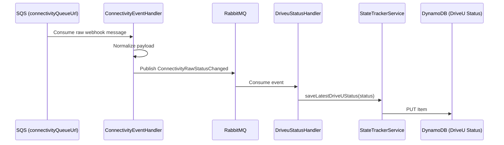

The flow is as follows:

1. **SQS Consumption**: The [`ConnectivityEventHandler`](https://github.com/cocorobotics/delivery-platform/blob/main/service/state/src/connectivity/connectivity-event.handler.ts) consumes the raw event from the `connectivityQueueUrl` SQS queue.
2. **Event Publication**: It normalizes the data and publishes a new event, `ConnectivityRawStatusChanged`, to a RabbitMQ exchange.
3. **Status Handling**: The [`DriveuStatusHandler`](https://github.com/cocorobotics/delivery-platform/blob/main/service/state/src/driveu/driveu-status.handler.ts) subscribes to this RabbitMQ exchange.
4. **Database Write**: Upon receiving an event, the handler calls the [`saveLatestDriveUStatus`](https://github.com/cocorobotics/delivery-platform/blob/main/lib/common/src/state-tracker/state-tracker.service.ts) method on the `StateTrackerService`, which is responsible for writing the final status object to DynamoDB.

**DriveU Webhook Schema**:

```tsx
// See: delivery-platform/lib/common/src/drive-u/interfaces/webhook-event.interface.ts
interface IWebhookEvent {
  eventName: 'status';
  unit: 'streamer' | 'node' | 'relay';
  status: string; // e.g., 'online', 'offline', 'connectedToNode'
  uuid: string;   // used for serial mapping
  vin: string | null;
  time: number;   // timestamp in microseconds
}

```

([`IWebhookEvent` source](https://github.com/cocorobotics/delivery-platform/blob/main/lib/common/src/drive-u/interfaces/webhook-event.interface.ts))

### Physical Robots (MQTT to Kafka Bridge)

While the `State Service` consumes MQTT messages for its own processing, there is a parallel path that forwards raw telemetry directly to Kafka for the `Fleet Service`. This is handled by a dedicated bridge service.

**MQTT-to-Kafka Bridge Flow**:
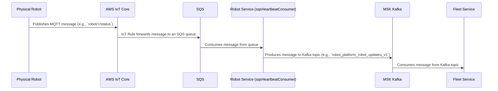

This flow acts as a high-throughput bridge to get raw robot telemetry into the Kafka ecosystem for real-time processing by consumers like the `Fleet Service`. The key component is the `robot` service:

1.  **MQTT to SQS**: An AWS IoT Rule, which was manually configured and is not present in Terraform, routes raw MQTT messages from robots to a dedicated SQS queue.
2.  **SQS Consumption**: A Go service, [`sqsHeartbeatConsumer`](https://github.com/cocorobotics/coco-services/blob/master/robot/cmd/sqs_heartbeat_consumer.go), consumes messages from this queue.
3.  **Kafka Production**: For each message it receives, this service instantiates a [`kafka.NewProducer`](https://github.com/cocorobotics/coco-services/blob/master/core/kafka/producer.go) and publishes the payload to a Kafka topic.
4.  **Fleet Service Consumption**: As documented previously, the `Fleet Service`'s [`robot_consumer`](https://github.com/cocorobotics/coco-services/blob/master/fleet/internal/consumer/robot_consumer.go) subscribes to this Kafka topic to receive the real-time telemetry.

### AWS Greengrass (Software Management)

**Integration Flow**:

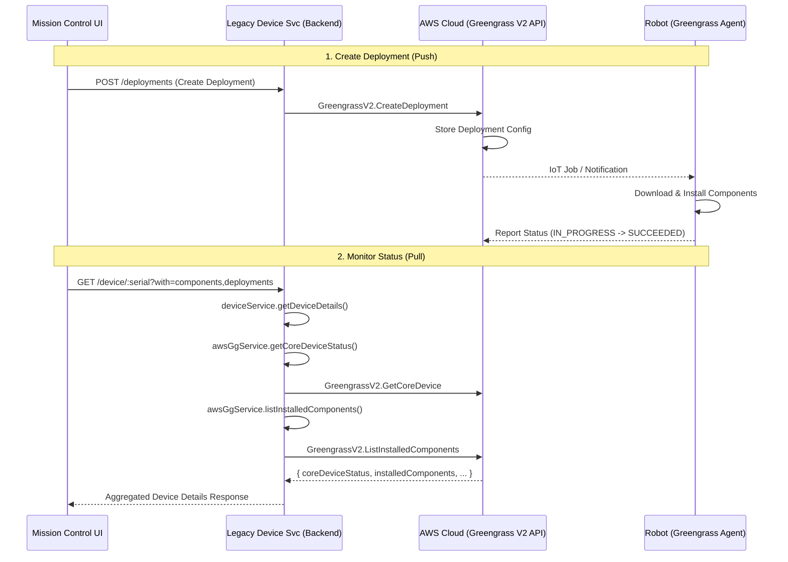

The **Legacy Device Service** (`service/device`) acts as a proxy to AWS Cloud APIs for low-level software lifecycle management, primarily serving Mission Control. This service does not have a dedicated `/greengrass` endpoint. Instead, it aggregates Greengrass data into its main device details endpoint.

The flow works as follows:

1. **API Request**: A client, like Mission Control, makes a request to the `GET /device/:serial` endpoint, optionally including `?with=components,deployments` to request detailed software information. This endpoint is handled by the [`DeviceController`](https://github.com/cocorobotics/delivery-platform/blob/main/service/device/src/device/device.controller.ts).
2. **Service Aggregation**: The controller passes the request to the [`DeviceService`](https://github.com/cocorobotics/delivery-platform/blob/main/service/device/src/device/device.service.ts). Inside the `getDeviceDetails` method, it fetches data from multiple sources.
3. **AWS SDK Calls**: The `DeviceService` uses the [`AwsGgService`](https://github.com/cocorobotics/delivery-platform/blob/main/service/device/src/aws/aws-gg.service.ts) to make several calls to the AWS Greengrass V2 API in the cloud:
    - `getCoreDeviceStatus()`: To get the basic health of the Greengrass agent.
    - `listInstalledComponents()`: To get a list of all software packages and their versions on the robot.
    - `getDetailedDeployments()`: To get the history of software deployment jobs.
4. **Response**: The `DeviceService` combines all this information into a single JSON response for the client.

**Key Schemas**:
The data structures for Greengrass objects are defined by the AWS SDK and aliased for clarity in [`service/device/src/aws/typings/aws-gg.interface.ts`](https://github.com/cocorobotics/delivery-platform/blob/main/service/device/src/aws/typings/aws-gg.interface.ts).

- **`InstalledComponent`**: Represents a piece of software running on the robot.
    - `componentName`: The name of the software package (e.g., `com.example.MyApplication`).
    - `componentVersion`: The semantic version of the package.
    - `lifecycleState`: The current status of the component (`RUNNING`, `ERRORED`, `BROKEN`, etc.).
- **`CoreDevice`**: Represents the robot's Greengrass instance itself.
    - `status`: An overall health status (`HEALTHY` or `UNHEALTHY`).
    - `lastStatusUpdateTimestamp`: The last time the device reported its status to the cloud.

---

## Phase 2: Processing & Persistence

Once ingested, data is normalized, enriched with business logic, and persisted.

### State Service (The Processor)

- **Role**: Raw event ingestion, normalization, and initial persistence.
- **Persistence**: [`StateHistory`](https://github.com/cocorobotics/delivery-platform/blob/main/service/state/prisma/schema.prisma) (PostgreSQL), DriveU Status (DynamoDB).
- **Outputs**: Publishes normalized events to RabbitMQ ([`IoT.Heartbeat`](https://github.com/cocorobotics/delivery-platform/blob/main/lib/common/src/exchanges/names.ts), [`Robots.StateChange`](https://github.com/cocorobotics/delivery-platform/blob/main/lib/common/src/exchanges/names.ts)).

**Processing Flow (Heartbeat Write Path)**:

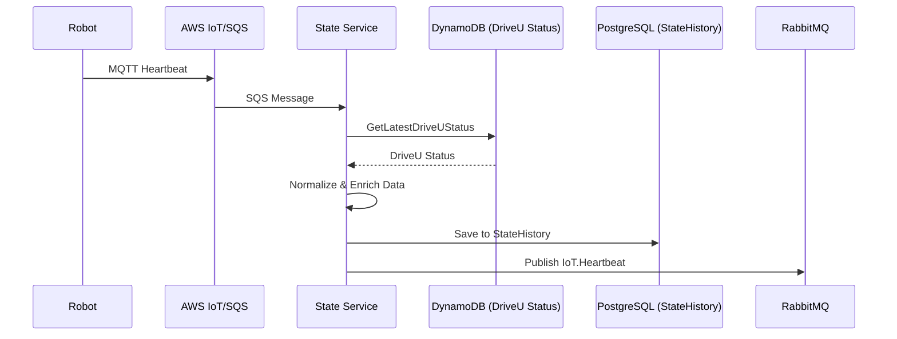

This diagram shows the main "hot path" for real-time robot telemetry. The process is as follows:

1. **Ingestion**: A robot publishes an MQTT message. An AWS IoT Rule routes it to an SQS queue (e.g., `eventsQueueUrl` defined in [`config.loader.ts`](https://github.com/cocorobotics/delivery-platform/blob/main/service/state/src/config/config.loader.ts)).
2. **Consumption**: The [`IotStreamerService`](https://github.com/cocorobotics/delivery-platform/blob/main/service/state/src/iot-streamer/iot-streamer.service.ts) in the `State Service` consumes the raw message from the queue.
3. **Enrichment**: Inside the `processMessage` method, the service enriches the raw telemetry:
    - It calls [`getLatestDriveUStatus`](https://github.com/cocorobotics/delivery-platform/blob/main/service/state/src/state-tracker/state-tracker.service.ts) on the `StateTrackerService` to fetch the most recent DriveU connectivity status from **DynamoDB**. This determines if the robot is remotely controllable.
4. **Persistence**: The enriched data is persisted to the [`StateHistory`](https://github.com/cocorobotics/delivery-platform/blob/main/service/state/prisma/schema.prisma) table in **PostgreSQL**.
5. **Fan-out**: Finally, the service uses its [`amqpConnection`](https://github.com/cocorobotics/delivery-platform/blob/main/service/state/src/iot-streamer/iot-streamer.service.ts#L44) to publish a clean, enriched [`IoT.Heartbeat`](https://github.com/cocorobotics/delivery-platform/blob/main/lib/common/src/exchanges/names.ts) event to a RabbitMQ fan-out exchange, making it available to all interested downstream services.

**State Service Schema**:

```
model StateHistory {
  serial    String
  date      DateTime
  state     String   // GROUNDED, ON_TRIP, PARKED, OFF_DUTY
  details   Json?
  @@id([serial, date])
}

```

### Operations Service (The Business Logic)

- **Role**: Applies business rules (maintenance toggles, operational readiness) to raw state.
- **Persistence**: [`RobotStateHistory`](https://github.com/cocorobotics/delivery-platform/blob/main/service/operations/prisma/schema.prisma) (PostgreSQL), Ephemeral Data (Redis). The Redis cache is managed by the [`RobotEphemeralDataService`](https://github.com/cocorobotics/delivery-platform/blob/main/service/operations/src/modules/robots/services/robot-ephemeral-data.service.ts) and holds transient state like connectivity and component health.
- **Outputs**: `RobotStateHistory` updates, Redis cache updates.

**Processing Flow (State Change Write Path)**:

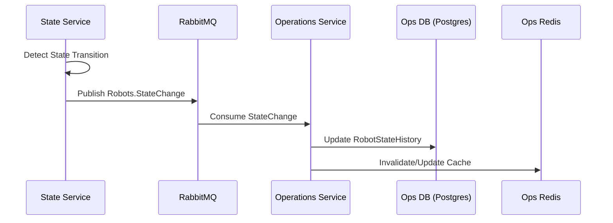

This diagram illustrates how changes in a robot's core state (e.g., from `PARKED` to `ON_TRIP`) are processed and enriched with business logic.

1. **Detection**: The [`StateService`](https://github.com/cocorobotics/delivery-platform/blob/main/service/state/src/state/state.service.ts) in the `State Service` detects a significant state transition while processing incoming telemetry.
2. **Publication**: It publishes a discrete [`Robots.StateChange`](https://github.com/cocorobotics/delivery-platform/blob/main/lib/common/src/exchanges/names.ts) event to RabbitMQ.
3. **Consumption**: A handler in the `Operations Service`, such as the [`IotHeartbeatHandler`](https://github.com/cocorobotics/delivery-platform/blob/main/service/operations/src/modules/robots/handlers/iot-heartbeat-handler.ts), consumes this event.
4. **Business Logic & Persistence**: The handler applies business rules (e.g., checking for maintenance flags via [`getRobotOperationalReadinessIssue`](https://github.com/cocorobotics/delivery-platform/blob/main/service/operations/src/modules/robots/services/robots.service.ts)) and then updates its own [`RobotStateHistory`](https://github.com/cocorobotics/delivery-platform/blob/main/service/operations/prisma/schema.prisma) table in **PostgreSQL**.
5. **Cache Update**: It also updates its **Redis** cache via the [`RobotEphemeralDataService`](https://github.com/cocorobotics/delivery-platform/blob/main/service/operations/src/modules/robots/services/robot-ephemeral-data.service.ts) to ensure subsequent on-demand reads have the freshest data.

**Operations Service Schema**:

```
model RobotStateHistory {
  robotSerial           String
  operationState        RobotStateEventState // ON_TRIP, PARKED, GROUNDED, OFF_DUTY, DEPLOYED
  needsMovement         Boolean
  undergoingMaintenance Boolean
  hasFood               Boolean
  driveable             Boolean
}

```

### Fleet Service (The Hybrid Consumer)

- **Role**: Fleet management and provider integrations (Uber).
- **Data Sources**:
    - **Kafka ([`robot_consumer`](https://github.com/cocorobotics/coco-services/blob/master/fleet/internal/consumer/robot_consumer.go))**: Consumes raw robot telemetry (GPS, Battery) directly.
    - **RabbitMQ ([`legacy_robots_consumer`](https://github.com/cocorobotics/coco-services/blob/master/fleet/internal/consumer/legacy_robots_consumer/consumer.go))**: Consumes business events from Operations System (HasFood, NeedsMaintenance).
- **Persistence**: [`fleet-robots`](https://github.com/cocorobotics/coco-services/blob/master/infra/configs/fleet/consumers/robot_consumer/values.yaml.tpl) (DynamoDB) - Aggregates telemetry + business state.

**Processing Flow**:

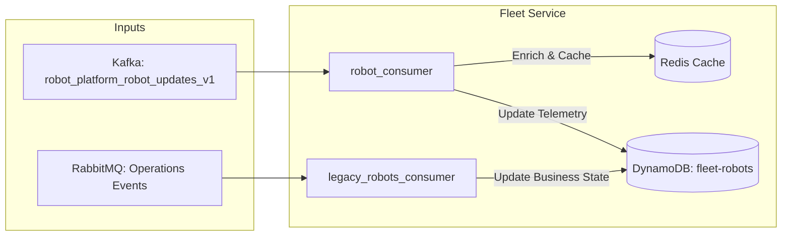

This diagram shows the dual-ingestion model of the Fleet Service, which separates high-frequency telemetry from lower-frequency business state updates.

1. **Telemetry Path (High-Frequency)**: Raw telemetry (location, battery, etc.) is consumed from the `robot_platform_robot_updates_v1` Kafka topic by the [`robot_consumer`](https://github.com/cocorobotics/coco-services/blob/master/fleet/internal/consumer/robot_consumer.go). This consumer writes the data to a Redis cache for fast, low-latency access and also persists it to the `fleet-robots` DynamoDB table.
2. **Business State Path (Low-Frequency)**: Slower-moving business state changes (e.g., `hasFood`, `needsMaintenance`) are consumed from a RabbitMQ exchange (populated by the Operations Service) by the [`legacy_robots_consumer`](https://github.com/cocorobotics/coco-services/blob/master/fleet/internal/consumer/legacy_robots_consumer/consumer.go). This consumer updates the corresponding fields on the existing robot item in the `fleet-robots` DynamoDB table.

This hybrid approach allows the service to handle high-volume telemetry efficiently via Kafka while still reacting to important business events propagated through RabbitMQ.

### Redis Cache Schema

The Fleet Service uses Redis for high-frequency caching of telemetry data.

- **Key**: `robot.heartbeat.cache.<serial>`
- **Value**: A JSON-marshalled `foundation.RobotState` struct.
- **Source Code**: The schema is defined in [`coco-services/core/foundation/robot.go`](https://github.com/cocorobotics/coco-services/blob/master/core/foundation/robot.go).
- **Logic**: The gRPC handler in [`grpc_labor_scope.go`](https://github.com/cocorobotics/coco-services/blob/master/fleet/internal/handlers/grpc/grpc_labor_scope.go) reads from this cache to serve requests for available robots.

```go
// coco-services/core/foundation/robot.go
type RobotState struct {
	Serial         string              `json:"serial"`
	Healthy        bool                `json:"healthy"`
	Battery        RobotBattery        `json:"battery"`
	Location       RobotLocation       `json:"location"`
	Components     RobotComponents     `json:"components"`
	OperationState RobotOperationState `json:"operationState"`
    // ... timestamps
}

```

### DynamoDB Schema (`fleet-robots` table)

This is the primary operational data store for the Fleet Service, aggregating telemetry and business state.

- **Source Code**: The schema is defined by the `FleetRobot` struct in [`coco-services/fleet/internal/entities/fleet_robot.go`](https://github.com/cocorobotics/coco-services/blob/master/fleet/internal/entities/fleet_robot.go).
- **Key Fields**:
    - `PK`/`SK`: `FLEETROBOT#<uuid>`
    - `Serial`: The robot's serial number.
    - `Healthy`: A boolean indicating overall health.
    - `OperationalState`: The business state from the Operations system (`ON_TRIP`, `PARKED`, etc.).
    - `Latitude`/`Longitude`: GPS coordinates.
    - `HasFood`/`NeedsMaintenance`: Business flags from the Operations system.

```go
// coco-services/fleet/internal/entities/fleet_robot.go
type FleetRobot struct {
	PK string `dynamodbav:"PK"`
	SK string `dynamodbav:"SK"`

	Serial string `dynamodbav:"Serial"`

	Healthy          bool                           `dynamodbav:"Healthy"`
	OperationalState foundation.RobotOperationState `dynamodbav:"OperationalState"`

	Latitude     float64      `dynamodbav:"Latitude"`
	Longitude    float64      `dynamodbav:"Longitude"`

	HasFood          *bool `dynamodbav:"HasFood,omitempty"`
	NeedsMaintenance *bool `dynamodbav:"NeedsMaintenance,omitempty"`

	// ... timestamps and other fields
}

```

### APIs

The Fleet Service exposes its data primarily through a **gRPC API** (and a corresponding HTTP gateway). It offers two main service scopes for consumers:

1. **`FleetLaborProviderScopeService`**: Exposes the [`Get` method](https://github.com/cocorobotics/coco-services/blob/master/fleet/internal/handlers/grpc/grpc_labor_scope.go) to provide real-time robot state (location, battery, status) by reading directly from the Redis cache. This is optimized for high-frequency requests.
2. **`FleetBeaconScopeService`**: Exposes methods like [`GetVirtualRobot` and `GetExternalRobotMappings`](https://github.com/cocorobotics/coco-services/blob/master/fleet/internal/handlers/grpc/grpc_beacon_scope.go) that query DynamoDB. This is used to link provider-specific identifiers (e.g., from Uber) to our internal `FleetRobot` entities.

### Dispatch Engine (The Planner's Cache)

- **Role**: Maintains a near real-time cache of available robots (`supply`) to make high-performance planning decisions without querying other services.
- **Persistence**: `Resource` table (PostgreSQL) with an in-memory/Redis cache. Robot state is stored in a `jsonb` column, using the `LegacyRobot` type as its schema.
- **Outputs**: An up-to-date `Resource` table and a populated cache that the `SupplyService` can read from.

**Processing Flow (Event Cache Write Path)**:
The Dispatch Engine uses a two-step internal event queue to process data. This decouples the initial event ingestion from the business logic that updates the supply cache. The repository layer is responsible for invalidating the cache upon writes to ensure data consistency.

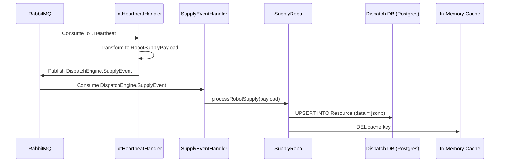

The data is handled by two main components:

1. **Ingestion Handlers**: Services like [`IotHeartbeatHandler`](https://github.com/cocorobotics/delivery-platform/blob/main/service/dispatch-engine/src/modules/eventsink/handlers/iot-heartbeat.handler.ts) and [`RobotStageChangeHandler`](https://github.com/cocorobotics/delivery-platform/blob/main/service/dispatch-engine/src/modules/eventsink/handlers/robot-stage-change.handler.ts) subscribe to external events from the `State Service`. Their sole job is to transform these events into a standardized internal `DispatchEngine.SupplyEvent` and publish it back to RabbitMQ.
2. **Supply Logic**: The [`SupplyEventHandler`](https://github.com/cocorobotics/delivery-platform/blob/main/service/dispatch-engine/src/modules/supply/handlers/supply-event.handler.ts) consumes this internal event. It uses the [`SupplyRepo`](https://github.com/cocorobotics/delivery-platform/blob/main/service/dispatch-engine/src/modules/supply/repo/supply.repo.ts) to perform an `upsert` into the `Resource` table, which also deletes the relevant key from the in-memory cache to ensure subsequent reads get fresh data.

**Dispatch Engine Schema (`LegacyRobot`)**:
This is the structure stored as a JSON object in the `Resource` table.

```tsx
// See: delivery-platform/lib/types/dispatch-engine/planner.ts
export type LegacyRobot = {
  serial: string;
  status: RobotStatus;
  battery: number;
  lastSynced: Date;
  healthy: boolean;
  deployed: ParkingLotLocation | MroLocation | PodLocation | null;
  location: Location | null;
  futureDemand: (PendingDemand | ScheduledDemand)[];
  activeDemand: PendingDemand | ActiveDemand | null;
  needsMovement: boolean | null;
  hasFood: boolean | null;
  tripType: TripType | null;
  needsMaintenance: boolean | null;
  needsPickup: boolean | null;
  driveable: boolean | null;
  operationState: RobotStateEventState | null;
  attemptCancellationReason: AttemptCancellationReason | null;
  undergoingMaintenance: boolean | null;
};

```

([`LegacyRobot` source](https://github.com/cocorobotics/delivery-platform/blob/main/lib/types/dispatch-engine/planner.ts))

---

## Phase 3: Consumption & Access

Finally, services and applications read this data to perform their functions.

### Dispatch Engine (Event-Driven Read)

**Planning Read Path**:

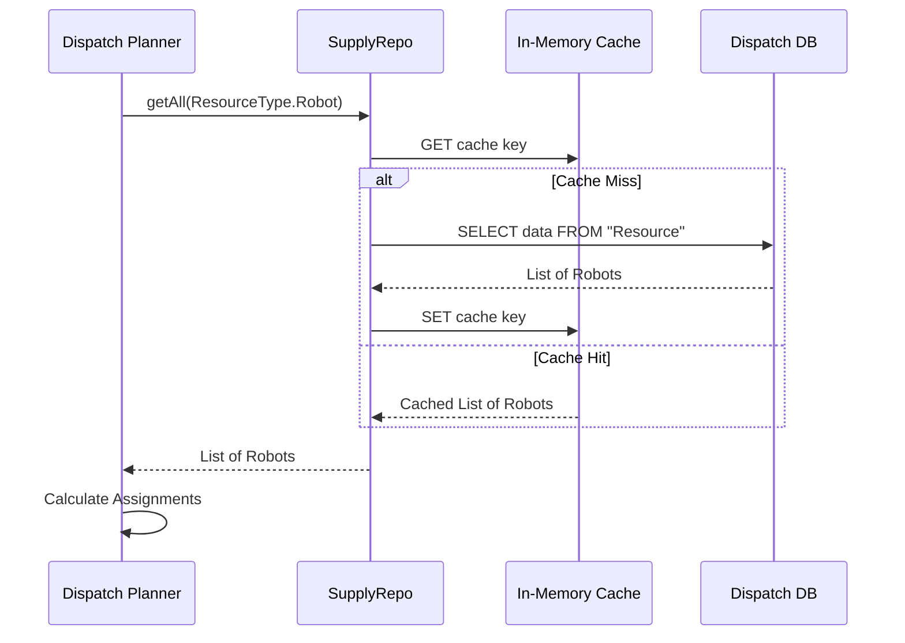

The diagram above illustrates the **cache-aside** pattern used by the `Dispatch Engine` for high-performance reads. The flow is as follows:

1. **Request**: The [`SupplyService`](https://github.com/cocorobotics/delivery-platform/blob/main/service/dispatch-engine/src/modules/supply/service/supply.service.ts) begins a planning cycle and needs the current state of all robots. It calls the [`getAll`](https://github.com/cocorobotics/delivery-platform/blob/main/service/dispatch-engine/src/modules/supply/repo/supply.repo.ts#L334) method in the `SupplyRepo`.
2. **Cache Check**: The `SupplyRepo` first checks its local **in-memory cache** to see if the requested robot data is already available. This cache is configured in the [`PlannerModule`](https://github.com/cocorobotics/delivery-platform/blob/main/service/dispatch-engine/src/modules/planner/planner.module.ts) and is managed by the NestJS `CacheModule`.
3. **Cache Hit**: If the data is in the cache (a "cache hit"), it is returned directly to the `SupplyService`, and the database is not queried.
4. **Cache Miss**: If the data is not in the cache (a "cache miss"), the `SupplyRepo` proceeds to query the **Dispatch DB** (PostgreSQL) to get the authoritative state.
5. **Cache Set**: Before returning the data to the service, the `SupplyRepo` writes the result into the cache. This ensures that the next request for this data will be a cache hit.
6. **Return Data**: The `SupplyService` receives the list of robots and proceeds with its planning logic.
- **Pattern**: **Event Sourcing with Cache-Aside**. The Dispatch Engine uses its `SupplyRepo` to read the list of available robots. This repository implements a cache-aside strategy: it first attempts to fetch the data from an **in-memory cache**. If the cache is empty, it queries the PostgreSQL database, populates the cache with the result, and then returns the data. This provides high performance for frequent reads while ensuring data consistency through cache invalidation on writes.
- **Critical Usage**: The planning logic, found in the [`SupplyService`](https://github.com/cocorobotics/delivery-platform/blob/main/service/dispatch-engine/src/modules/supply/service/supply.service.ts), calls `repo.getAll()`, which abstracts away the caching logic. It runs a series of `usabilityChecks` on the returned data to filter for robots that are online, healthy, and available.

The event consumption logic is handled by subscribers like:

- [`IotHeartbeatHandler`](https://github.com/cocorobotics/delivery-platform/blob/main/service/dispatch-engine/src/modules/eventsink/handlers/iot-heartbeat.handler.ts): Processes connectivity and telemetry updates.
- [`RobotStageChangeHandler`](https://github.com/cocorobotics/delivery-platform/blob/main/service/dispatch-engine/src/modules/eventsink/handlers/robot-stage-change.handler.ts): Processes changes in the robot's fundamental state (e.g., `PARKED`, `ON_TRIP`).

### Mission Control & MDS (On-Demand Read)

**Data Fetch Path**:

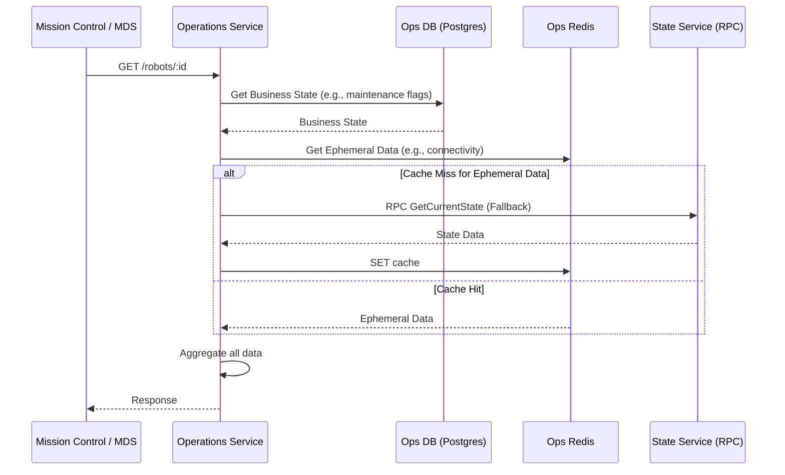

- **Pattern**: **Aggregated Query**. Both Mission Control and the MDS Service act as clients that make on-demand HTTP requests to the `Operations Service`. The `Operations Service` serves as a facade, aggregating data from multiple sources to provide a comprehensive, real-time view of a robot's state.
- **Mission Control**: The frontend client, defined in [`device.api.ts`](https://github.com/cocorobotics/delivery-platform/blob/main/web/mission-control/src/api/device.api.ts), calls endpoints on the `Operations Service` to fetch robot details for monitoring and debugging.
- **MDS Service**: This Go-based service, defined in [`mds_handler.go`](https://github.com/cocorobotics/coco-services/blob/master/mds/internal/handlers/mds_handler.go), is responsible for compliance with city data standards. It calls the `Operations Service` to get the internal robot state and then transforms it into the required MDS format using helpers like [`normalizeVehicleState`](https://github.com/cocorobotics/coco-services/blob/master/mds/internal/handlers/transform/vehicle_status.go).

The `Operations Service`'s core aggregation logic resides within the [`RobotsService`](https://github.com/cocorobotics/delivery-platform/blob/main/service/operations/src/modules/robots/services/robots.service.ts). When a request comes in, it:

1. Fetches the latest business state (maintenance status, etc.) from its own **PostgreSQL** database.
2. Retrieves ephemeral data (connectivity, real-time health) from a **Redis** cache, managed by [`RobotEphemeralDataService`](https://github.com/cocorobotics/delivery-platform/blob/main/service/operations/src/modules/robots/services/robot-ephemeral-data.service.ts).
3. **If the cache is empty (a "cache miss"), it makes a fallback synchronous RPC call to the `State Service`** to get the most recent raw state. This is handled by the [`StateServiceRpc`](https://github.com/cocorobotics/delivery-platform/blob/main/service/operations/src/core/rpc/state-service.rpc.ts) client. This ensures data is always available, even if the cache is cold.
4. Finally, it aggregates these different data sources into a single, unified response for the client.

### Fleet Service (On-Demand Read)

**Fleet Service Data Fetch Path**:

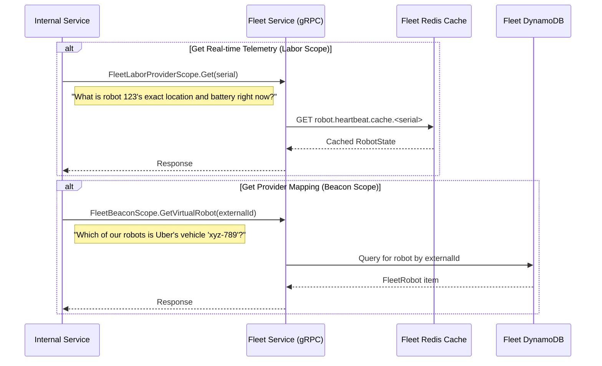

- **Pattern**: **RPC/On-Demand Query**. While some services subscribe to events, others query the Fleet Service's gRPC API directly to get real-time state or mapping information. This pattern is used when a service needs immediate, specific information about a robot without maintaining its own local copy of the fleet's state.
- **Consumers & Use Cases**: The consumers are typically other backend services responsible for integrations or provider-specific logic.
    - **Provider Integrations (e.g., Uber)**: When an event comes from an external provider that references their own vehicle ID, a service calls the `FleetBeaconScopeService` to translate that ID into an internal robot serial number.
    - **Real-time State Checks**: A service might need the most up-to-date location or status of a specific robot before performing an action. It would call the `FleetLaborProviderScopeService` to get this low-latency data from the Redis cache.

### Integrations Service (Event-Driven Push)
**DoorDash Status Push Path**:
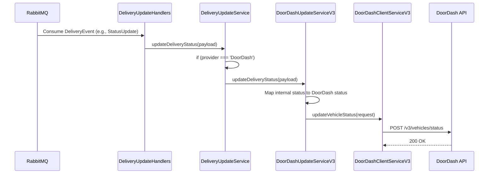

-   **Pattern**: **Event-Driven Push**. The `Integrations Service` listens for internal business events and acts as a facade that pushes state updates to external partners in the format they require. This decouples our internal domain from the specific API requirements of each partner.
-   **Consumers & Use Cases**: This flow is used to keep external partners like DoorDash synchronized with the state of a delivery that is being dispatched through their platform.

The process is as follows:
1.  **Event Consumption**: The [`DeliveryUpdateHandlers`](https://github.com/cocorobotics/delivery-platform/blob/main/service/integrations/src/delivery-updates/delivery-update.handlers.ts) subscribe to various event types from the `Deliveries.DeliveryEvent` RabbitMQ exchange.
2.  **Routing**: The handler calls the [`DeliveryUpdateService`](https://github.com/cocorobotics/delivery-platform/blob/main/service/integrations/src/delivery-updates/delivery-update.service.ts), which inspects the event payload to identify the provider (e.g., `DoorDash`). It then routes the event to the appropriate provider-specific service.
3.  **Transformation**: The [`DoorDashUpdateServiceV3`](https://github.com/cocorobotics/delivery-platform/blob/main/service/integrations/src/doordash/v3/doordash-update.service.ts) contains the core business logic for the DoorDash integration. It transforms our internal delivery status into the specific status that the DoorDash API expects (e.g., `HEADING_TO_DROPOFF_LOCATION`).
4.  **API Call**: Finally, it uses the [`DoorDashClientServiceV3`](https://github.com/cocorobotics/delivery-platform/blob/main/service/integrations/src/doordash/v3/doordash-client.service.ts) to make an outbound `POST` request to the DoorDash API to update the vehicle's status.

While the payload is delivery-centric, it includes the robot's real-time location, making it a relevant consumer of device data.

**DoorDash API Schema (`VehicleStatus`)**:
```typescript
// See: delivery-platform/service/integrations/src/doordash/v3/types/API.ts
export type VehicleStatus = {
  vehicle_location: Location;
  elevation?: number;
  vehicle_id: string;
  delivery_status: ExternalDoorDashDeliveryStatusV3;
  dropoff_location?: Location;
  delivery_failure: FailureReason | null;
  eta_to_dropoff: number;
  eta_to_pickup_location?: number;
};
```
