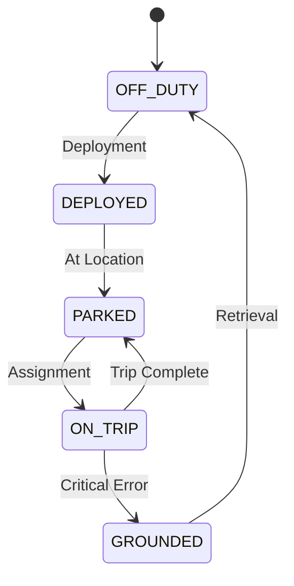
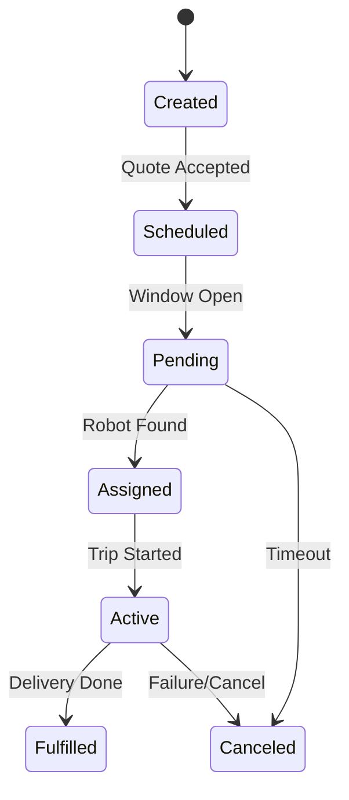
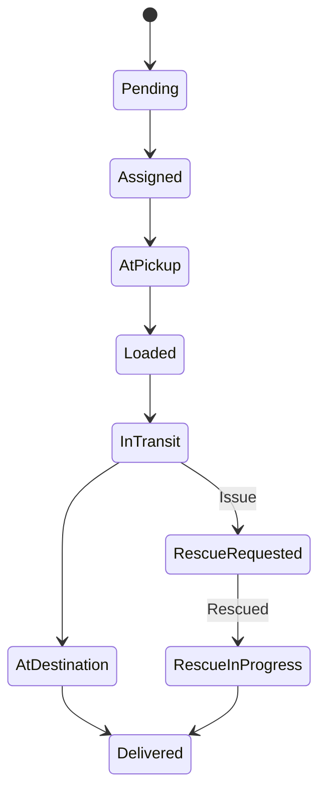
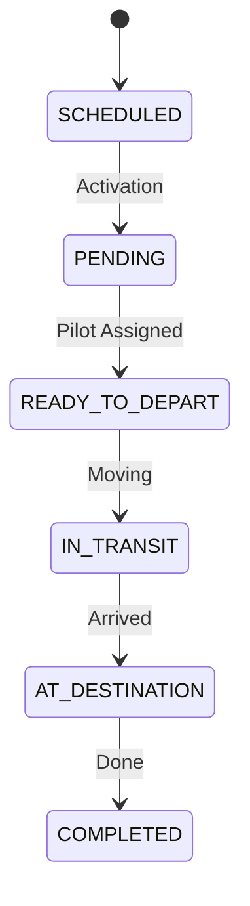
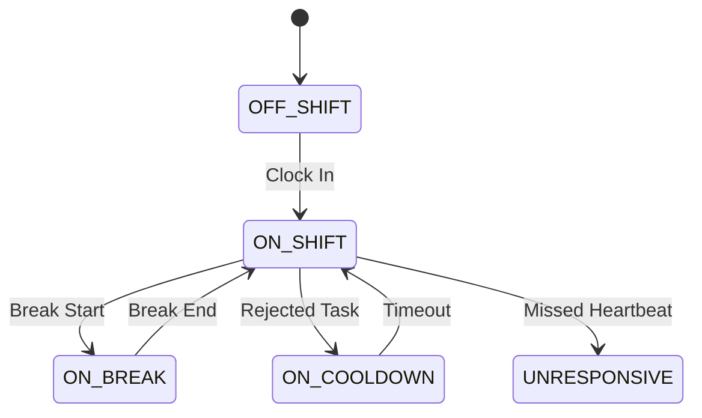
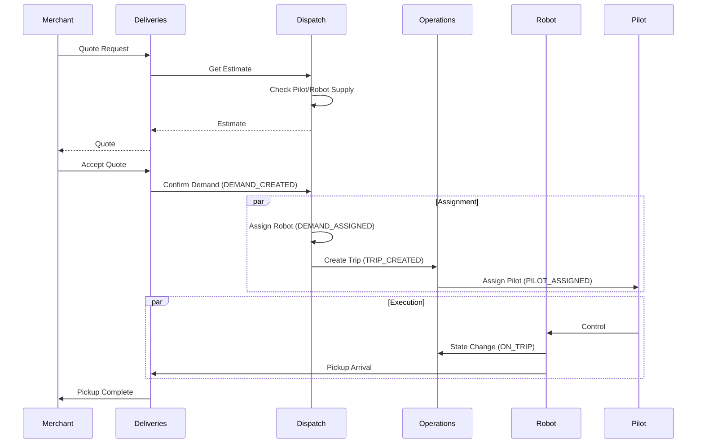
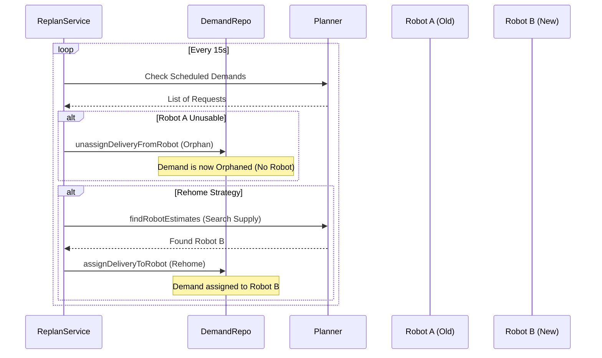

# Observability & Lifecycle Analysis

**Objective**: Document the lifecycles, state machines, and key events for the core components of the delivery platform (Robot, Demand, Delivery, Trip, Pilot) to inform the "Log-Driven Analytical Metrics" implementation.

---

## 1. Robot (Supply)
**Service**: `operations`
**Key Files**:
- `src/modules/robots/services/robots.service.ts`
- `src/modules/robots/handlers/robot-state-change-handler.ts`
- `lib/common/src/robot-state/event.ts`

### Lifecycle & States
The robot state is primarily tracked via `RobotStateEventState` (Operations State) and `RobotAvailabilityStatus`.



**States (`RobotStateEventState`)**:
- `ON_TRIP`: Robot is executing a task.
- `PARKED`: Robot is stationary and waiting.
- `GROUNDED`: Robot is disabled due to issues.
- `OFF_DUTY`: Robot is not available for dispatch.
- `DEPLOYED`: Robot is in the field but available.

**Key Transitions**:
- `updateRobotState(serial, data)`: Central method for state changes.
- RabbitMQ Handler: `handleRobotState` listens to `Exchanges.Names.Robots.StateChange`.

### Observability Requirements
- **Events**:
    - `ROBOT_STATE_CHANGED`: Critical for tracking utilization (Time-in-State).
    - `ROBOT_HEARTBEAT`: (High volume, maybe metric only)
- **Context**:
    - `robot_id` (serial)
    - `trip_type` (if on trip)
    - `battery_level`
    - `location` (lat/long - maybe generic "zone" or "market" for analytics)

**Critical Gap Identified**:
- The `StateChangeEvent` payload (used for transitions) **lacks** `tripId` and `deliveryId`.
- The `StateEvent` payload (used for full state broadcast) **contains** `activeDemandId` and `tripId`.
- **Recommendation**: We must ensure `StateChangeEvent` is enriched with `activeDemandId` or we must rely on joining with `Trip` logs using timestamps.

---

## 2. Demand (Order)
**Service**: `dispatch-engine`
**Key Files**:
- `src/modules/demand/service/demand.service.ts`
- `src/modules/demand/repo/demand.repo.ts`

### Lifecycle & States
Demand represents the "need" for a robot, typically triggered by an order.



**States (`DemandStatus`)**:
- `Created`
- `Scheduled`
- `Pending`
- `Assigned` (Linked to a Robot Plan)
- `Active`
- `Fulfilled`
- `Canceled`

**Key Transitions**:
- `createDemand`: Initial creation.
- `assignDeliveryToRobot`: Key moment where Supply meets Demand.
- `unassignDeliveryFromRobot`: Disruption event.

### Observability Requirements
- **Events**:
    - `DEMAND_CREATED`: Start of the SLA clock.
    - `DEMAND_ASSIGNED`: "Matched" timestamp.
    - `DEMAND_FULFILLED` / `DEMAND_CANCELED`: End of lifecycle.
- **Context**:
    - `demand_id`
    - `merchant_id` (Critical for Merchant SLAs)
    - `robot_id` (when assigned)
    - `delivery_id` (link to Delivery service)

**Data Availability Confirmed**:
- `DemandRepo` persists `features` JSON column.
- `deliveryId` and `merchantId` are explicitly stored in `features`.
- Code already extracts `features['deliveryId']` for logging orphaned demands (e.g., `DemandRepo.assignDeliveryToRobot`).

---

## 3. Delivery (Execution)
**Service**: `deliveries`
**Key Files**:
- `src/modules/delivery/service/delivery.service.ts`
- `src/modules/delivery/workers/delivery-status/delivery-status.worker.ts`

### Lifecycle & States
The high-level business transaction. It aggregates multiple "Attempts".



**States (`DeliveryStatus`)**:
- `InProgress`
- `RescueRequested` / `RescueInProgress` (Exception flows)
- `Completed`
- `Canceled`

**Granular States (`AttemptStatus`)**:
- `Pending` → `Assigned` → `InTransitToPartner` → `AtPickup` → `PickupInProgress` → `Loaded` → `InTransit` → `AtDestination` → `Delivered`.

### Observability Requirements
- **Events**:
    - `DELIVERY_PICKUP_ARRIVAL`: Robot at merchant.
    - `DELIVERY_PICKUP_COMPLETED`: Food in robot.
    - `DELIVERY_DROPOFF_COMPLETED`: Success.
    - `DELIVERY_RESCUE_REQUESTED`: Failure signal.
- **Context**:
    - `delivery_id`
    - `merchant_id`
    - `customer_id` (hashed/anon)
    - `robot_id`

---

## 4. Trip (Movement)
**Service**: `operations` (Pilot Trips)
**Key Files**:
- `src/modules/trips/services/pilot-trips.service.ts`
- `src/modules/trips/definitions/models.ts`

### Lifecycle & States
A Trip is a specific movement task, often requiring a Pilot. A single Delivery might involve multiple Trips (Pickup Trip, Dropoff Trip, Rescue Trip).



**States (`TripState`)**:
- `SCHEDULED`
- `PENDING`
- `READY_TO_DEPART`
- `IN_TRANSIT`
- `AT_DESTINATION`
- `COMPLETED`
- `CANCELED`

**Trip Types**:
- `DELIVERY`
- `RETURN`
- `DEPLOYMENT`
- `PICKUP` (JITP - Just In Time Pickup)

### Observability Requirements
- **Events**:
    - `TRIP_CREATED`: Demand for movement.
    - `TRIP_STARTED` (Departed): Movement begins.
    - `TRIP_COMPLETED` (Arrived): Movement ends.
    - `PILOT_TRIP_ACTIVATED`: Pilot takes control.
- **Context**:
    - `trip_id`
    - `robot_id`
    - `pilot_id` (if piloted)
    - `trip_type`

---

## 5. Pilot (Human)
**Service**: `operations`
**Key Files**:
- `src/modules/pilots/pilot-management/services/pilots.service.ts`
- `src/modules/pilots/pilot-assignments/services/assignments.service.ts`
- `src/modules/pilots/pilot-management/definitions/shift-fsm.defintion.ts`

### Lifecycle & States
Pilots have "Shifts" (availability) and "Assignments" (tasks).



**Shift States (`ShiftStatus`)**:
- `ON_SHIFT`
- `ON_BREAK`
- `ON_COOLDOWN`
- `UNRESPONSIVE`
- `OFF_SHIFT`

**Assignment Logic**:
- Managed by `AssignmentService`.
- Matches Pilots to Trips.

### Observability Requirements
- **Events**:
    - `PILOT_SHIFT_STARTED` / `ENDED`: Availability window.
    - `PILOT_ASSIGNMENT_STARTED`: Pilot matched to Trip.
    - `PILOT_BREAK_STARTED`: Unavailability.
- **Context**:
    - `pilot_id`
    - `call_center` (e.g., 'BOGOTA', 'MANILA') - Critical for Cost/Ops analytics.
    - `shift_id`

---

## 6. End-to-End System Flows

The true complexity lies in how these components interact. We must capture the "handoff" events to trace a delivery's full lifecycle.



### Flow A: Inception (Quote -> Demand)
1.  **Quote Request** (`QUOTE_REQUESTED`): Merchant/Integration asks "Can we do this?".
2.  **Estimation** (`PlannerService.estimate`): Checks `RobotAvailability` and `PilotAvailability`.
    *   *Gap*: If this fails, we need to know WHY (No Robots? No Pilots? Unroutable?).
3.  **Quote Response** (`QUOTE_GENERATED`): Returns fee and ETA.
4.  **Acceptance** (`QUOTE_ACCEPTED`): Trigger for creating `Delivery` and `Demand`.

### Flow B: Assignment (Demand -> Robot)
1.  **Demand Created** (`DEMAND_CREATED`): System acknowledges the need.
2.  **Matching** (`PlannerService` / `DemandRepo.assignRobot`): Finds the best robot.
3.  **Assignment** (`DEMAND_ASSIGNED`): Robot is "booked".
    *   *Critical Link*: `demand_id` ↔ `robot_id`.

### Flow C: Execution (Trip -> Pilot -> Movement)
1.  **Trip Creation** (`TRIP_CREATED`): System generates a movement task (e.g. "Go to Merchant").
2.  **Pilot Matching** (`AssignmentService.assignTrips`): Finds an available pilot.
3.  **Pilot Assignment** (`PILOT_ASSIGNMENT_STARTED`): Pilot accepts the task.
    *   *Critical Link*: `trip_id` ↔ `pilot_id`.
4.  **Movement** (`TRIP_STARTED` → `TRIP_COMPLETED`): Robot physically moves.

### Flow D: Delivery (The Business Transaction)
1.  **Pickup Trip** (Flow C) completes → **Pickup Arrival**.
2.  **Handover** (`DELIVERY_PICKUP_COMPLETED`): Food is loaded.
3.  **Dropoff Trip** (Flow C) starts.
4.  **Completion** (`DELIVERY_DROPOFF_COMPLETED`): Customer receives food.

---

## 7. Replanning (Orphaned Demands)
**Service**: `dispatch-engine`
**Key Files**:
- `src/modules/planner/service/replan.service.ts`
- `src/modules/planner/cron/replan.worker.ts`

### Lifecycle
"Replanning" occurs when a robot assigned to a task becomes unavailable (e.g., hardware failure, low battery, disconnection). The system "orphans" the demand and attempts to "rehome" it to a new robot.



### Impact on Analytics
- **Split Sessions**: A single `delivery_id` can be serviced by Robot A for the pickup and Robot B for the dropoff.
- **Metric Skew**: Simple aggregation by `robot_id` on a delivery might double-count or misattribute time if the handoff isn't tracked.
- **Critical Events**:
    - `DEMAND_REPLAN_ORPHANED`: Indicates a supply failure.
    - `DEMAND_REPLAN_REHOMED`: Indicates successful recovery (but potential delay).
    - `DEMAND_REPLAN_FAILED`: Indicates service failure (likely leads to cancellation).

---

## 8. Context Propagation Strategy

To successfully "Sessionize" these flows in Redshift, we must propagate IDs across boundaries.

**Mandatory Context Rules**:
1.  **Quote/Demand Logs**: Must carry `merchant_id`.
2.  **Trip Logs**: Must carry `delivery_id` (if applicable) and `robot_id`.
3.  **Pilot Assignment Logs**: Must carry `trip_id` (which links to `delivery_id`).

**The "Golden Thread"**:
`Merchant ID` → `Quote ID` → `Delivery ID` → `Demand ID` → `Trip ID` → `Pilot ID`.

If any link in this chain is broken in the logs, we lose the ability to attribute costs/performance (e.g., "How much pilot time did Merchant X consume?").

---

## 9. Data Model & Relations

Mapped from Prisma schemas to confirm foreign key relationships.

### 9.1 Dispatch Engine Schema (`dispatch-engine`)
*   **Demand**:
    *   `id` (PK)
    *   `active_demand_id` (FK to Robot.activeDemandId) - *Inverse relation on Robot*
*   **Robot**:
    *   `id` (PK)
    *   `activeDemand` (FK -> Demand)
    *   `activeDemandId` (Scalar)
*   **Plan**:
    *   `demandId` (FK -> Demand)
    *   `robotPlanId` (FK -> RobotPlan)
    *   `pilotPlanId` (FK -> PilotPlan)
*   **RobotPlan**:
    *   `serial` (Links to Robot ID)

### 9.2 Operations Schema (`operations`)
*   **Task** (Trip):
    *   `id` (PK)
    *   `deliveryId` (FK -> External Delivery ID)
    *   `robotSerial` (FK -> Robot ID)
    *   `orderId` (FK -> External Order ID)
*   **PilotAssignment**:
    *   `pilotId` (FK -> Pilot)
    *   `taskId` (FK -> Task/Trip)

### 9.3 Delivery Schema (`deliveries`)
*   **Delivery**:
    *   `id` (PK)
    *   `quoteId` (FK -> Quote)
*   **Quote**:
    *   `merchantId` (FK -> Merchant)

### The Verified Join Path
To link **Pilot Efficiency** to **Merchant**:
1.  **Pilot Log** (`pilot_id`) -> **Assignment Log** (`trip_id`).
2.  **Trip Log** (`trip_id` / `task_id`) -> contains `delivery_id` and `order_id`.
3.  **Delivery Log** (`delivery_id`) -> contains `quote_id`.
4.  **Quote Log** (`quote_id`) -> contains `merchant_id`.

**Conclusion**: The "Golden Thread" is supported by the data model, but we must ensure these IDs are present in the *logs* at the boundaries (Assignments, Trip Creation) to avoid expensive 4-way joins on every query.

---

## 10. Code Tracing: Critical Paths

### 10.1 Quote & Demand Confirmation
**File**: `delivery-platform/service/deliveries/src/modules/providers/robot/robot.service.ts`
- Method: `request` (calls `engine.confirmDemand`)
- **Transition**: Quote -> Demand.
- **Log Opportunity**: Log `DEMAND_CONFIRMED` with `quote_id` and `merchant_id` here.
- **Data Availability**:
    - `params.merchantId`: **Available**.
    - `quote.id`: **Available**.
    - `delivery.id` (returned from confirmDemand): **Available** inside `RobotProviderService.request`.

### 10.2 Demand Assignment
**File**: `delivery-platform/service/dispatch-engine/src/modules/demand/repo/demand.repo.ts`
- Method: `assignRobot`
- **Transition**: Demand (Pending) -> Demand (Assigned).
- **Log Opportunity**: Log `DEMAND_ASSIGNED` with `demand_id` and `robot_id`.
- **Data Availability**:
    - `demandId`: **Available**.
    - `serial` (Robot ID): **Available**.
    - `demand` object (fetched via `this.get(demandId)`): **Available**. This object contains `features` which often holds `merchantId` and `deliveryId`. We should explicitly log those features.

### 10.3 Trip Activation
**File**: `delivery-platform/service/operations/src/modules/trips/services/pilot-trips.service.ts`
- Method: `activatePilotTrip`
- **Transition**: Trip (Scheduled) -> Trip (Active).
- **Log Opportunity**: Existing log "Trip is not scheduled - ignore activation request". We should add `TRIP_ACTIVATED` with `trip_id` and `robot_id`.
- **Data Availability**:
    - `tripId`: **Available**.
    - `botSerial`: **Available**.
    - `trip` object: **Available** (fetched from repo). Need to check if `trip.deliveryId` is populated on the fetched entity. (Prisma `include` might be needed).

### 10.4 Pilot Assignment
**File**: `delivery-platform/service/operations/src/modules/pilots/pilot-assignments/repositories/repo.service.ts`
- Method: `savePilotAssignedToTrip`
- **Transition**: Pilot (Available) -> Pilot (Assigned).
- **Log Opportunity**: Existing log `[AssignmentEvents] Saving pilot assigned to trip`. Enhance this with structured event `PILOT_ASSIGNED`.
- **Context Available**: `tripId`, `pilotId`, `meta.deliveryId`, `meta.orderId`. **Excellent** - `deliveryId` is already here!

### 10.5 RabbitMQ Payloads
**File**: `delivery-platform/lib/common/src/exchanges/payload.types.ts`
- **RobotStateChange**: Contains `serial`, `tripType`, `operationState`. **Missing**: `tripId` or `deliveryId`. This makes it hard to link robot state *directly* to a delivery without a time-window join.
- **TripCreated**: Contains `tripId`, `botSerial`, `deliveryMetadata` (which has `deliveryId`). **Good**.
- **TaskCreated**: Linked to operations.

**Conclusion**: We have strong context in `Trip` and `Assignment` events. The weakest link is `RobotStateChange` which is "stateless" w.r.t the business transaction. We will rely on `Trip` start/end times to "sessionize" the robot state.

---

## 11. Existing Interceptors & Patterns

### 11.1 Interceptors
**File**: `operations/src/core/http/interceptors/logging.interceptor.ts`
- Current behavior: Logs basic Request/Event metadata (`requestId`).
- **Opportunity**: Can be enhanced to extract `AnalyticsContext` fields if we standardize the payload.

### 11.2 FileLoggerWrapper
**File**: `dispatch-engine/src/shared/file-logger.interceptor.ts`
- **Pattern**: This file explicitly lists "known fields" to extract from logs:
  ```typescript
  const knownFields = [
    'deviceId', 'deliveryId', 'externalDeliveryId', 'demandId',
    'merchantId', 'tripId', 'attemptId', 'pilotId'
  ];
  ```
- **Validation**: This proves the team already values these specific IDs. We should adopt this exact list for our `AnalyticsContext`.
