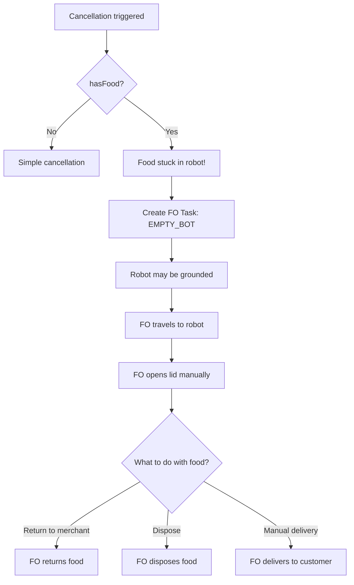
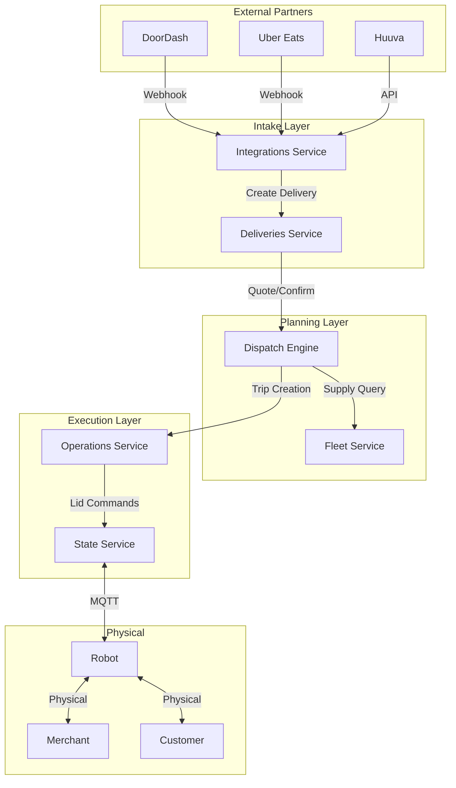
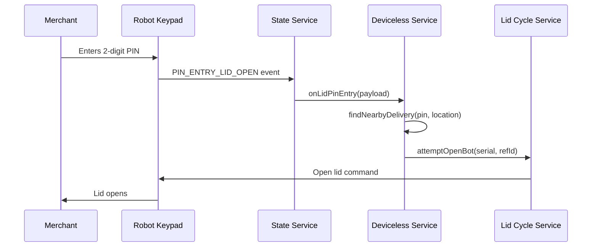
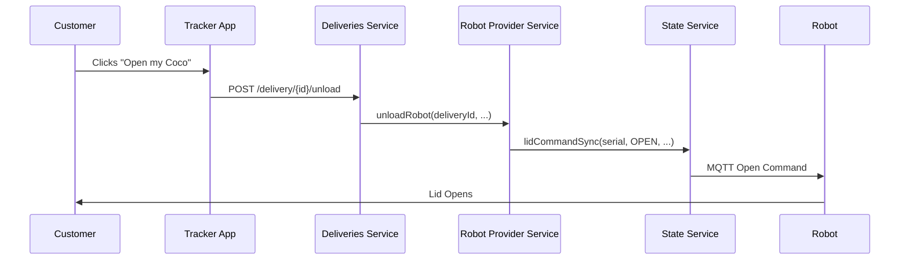
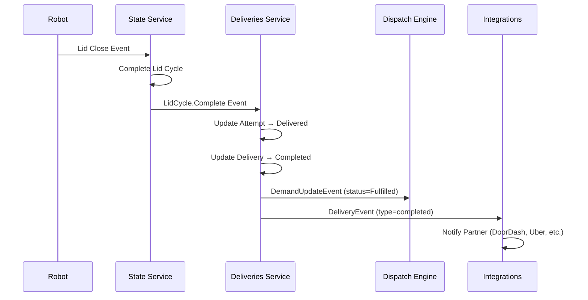
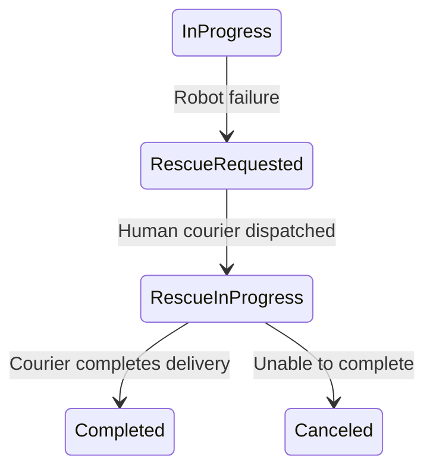
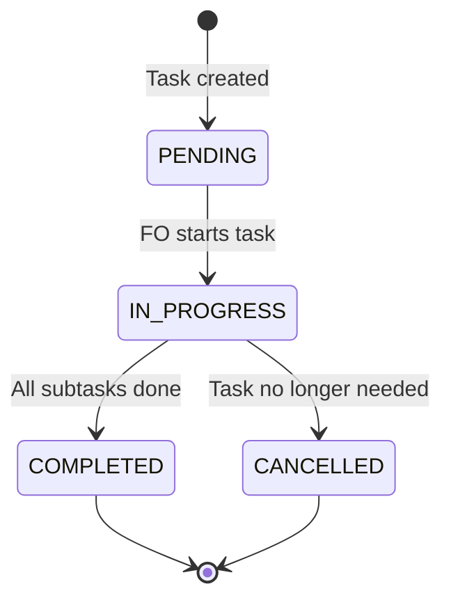
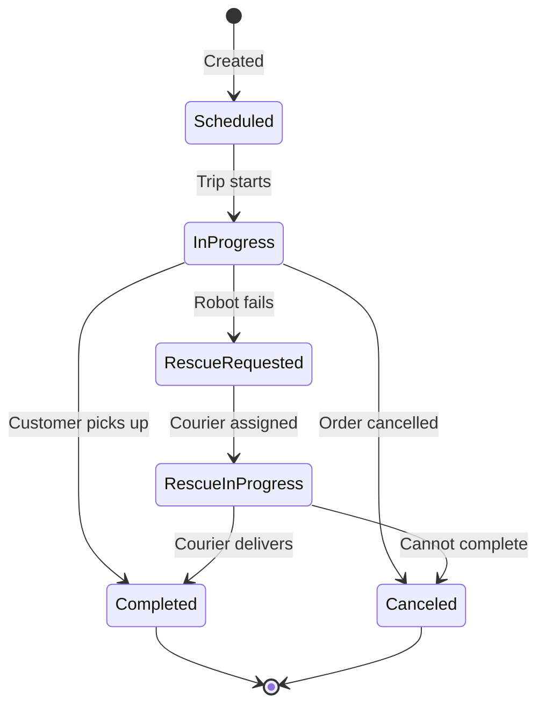
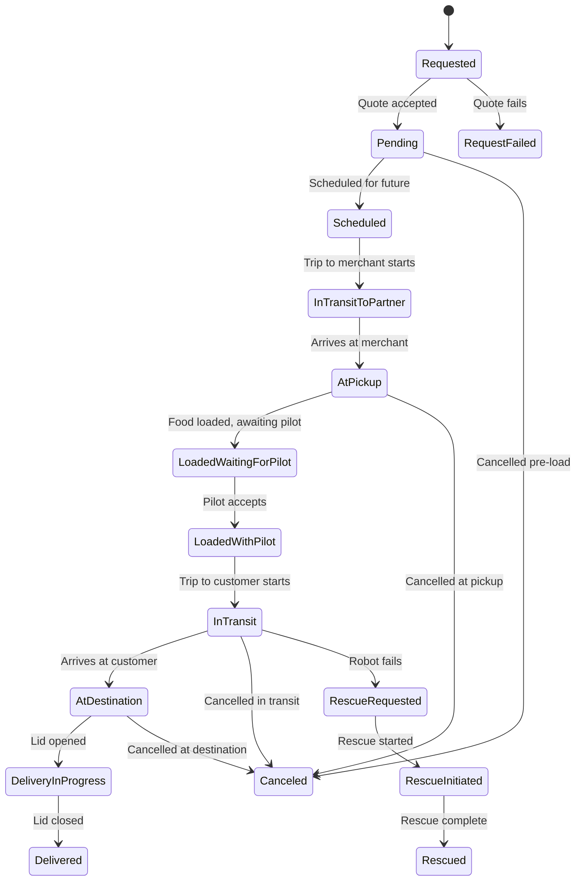
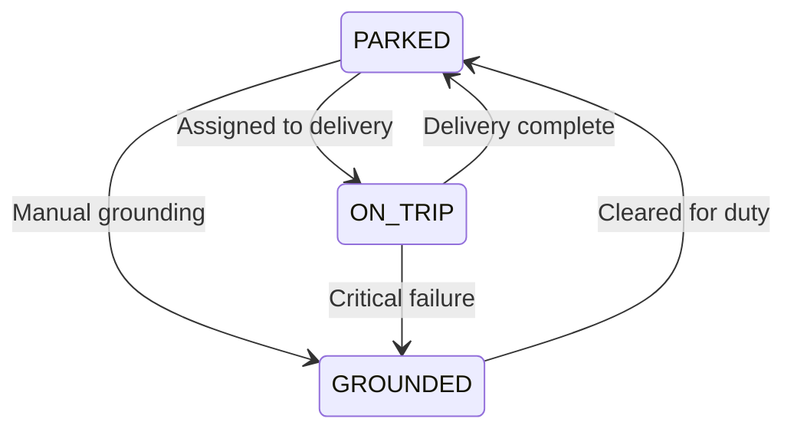

# The Life of an Order

This document provides an exhaustive walkthrough of a delivery order's complete lifecycle—from creation through fulfillment or failure. It covers all the edge cases, failure modes, and recovery mechanisms that make up our delivery system.

---

## Table of Contents
0. [**End-to-End Flow Diagram**](#0-end-to-end-flow-diagram) ⭐
1. [System Overview](#1-system-overview)
2. [Order Creation & Intake](#2-order-creation--intake)
3. [Quoting & Acceptance](#3-quoting--acceptance)
4. [Dispatch & Robot Assignment](#4-dispatch--robot-assignment)
5. [The Loading Phase](#5-the-loading-phase)
6. [In-Transit: Robot to Customer](#6-in-transit-robot-to-customer)
7. [Customer Pickup](#7-customer-pickup)
8. [Order Fulfillment](#8-order-fulfillment)
9. [Cancellation Scenarios](#9-cancellation-scenarios)
10. [Robot Health & Failure Modes](#10-robot-health--failure-modes)
11. [Rescue & Recovery Flows](#11-rescue--recovery-flows)
12. [Field Operations Tasks](#12-field-operations-tasks)
13. [Notifications Throughout the Lifecycle](#13-notifications-throughout-the-lifecycle)
14. [Appendix: State Machines](#appendix-state-machines)

---

## 0. End-to-End Flow Diagram

This is the complete lifecycle of a successful delivery, from demand to fulfillment.

```mermaid
flowchart TD
    subgraph INTAKE["📥 INTAKE PHASE"]
        A[Partner sends delivery request<br/>DoorDash/Uber/Huuva] --> B{Integration Service<br/>receives webhook}
        B --> C[Store PII via Privacy Service]
        C --> D[Request Quote from Deliveries Service]
    end

    subgraph QUOTE["📊 QUOTING PHASE"]
        D --> E[Dispatch Engine: estimate]
        E --> F{Filter Available Robots}
        F --> |For each robot| F1[Is robot healthy?]
        F1 --> |No| F2[Skip robot]
        F1 --> |Yes| F3[Is robot busy?<br/>activeDemand != null]
        F3 --> |Yes| F2
        F3 --> |No| F4[Does robot need maintenance?]
        F4 --> |Yes| F2
        F4 --> |No| F5[Is robot within range?]
        F5 --> |No| F2
        F5 --> |Yes| F6[Robot is eligible ✓]
        
        F6 --> G{Filter Available Pilots}
        G --> G1[Is pilot on shift?]
        G1 --> |No| G2[Skip pilot]
        G1 --> |Yes| G3[Is pilot on break?]
        G3 --> |Yes| G2
        G3 --> |No| G4[Is pilot already assigned?]
        G4 --> |Yes| G2
        G4 --> |No| G5[Does experience level qualify?]
        G5 --> |No| G2
        G5 --> |Yes| G6[Pilot is eligible ✓]
        
        F6 --> H[Calculate Routes via Maps Service]
        G6 --> H
        H --> H1[Pickup → Dropoff route]
        H --> H2[Dropoff → Return route]
        H1 --> I[Generate Time Estimates]
        H2 --> I
        I --> J{Can we fulfill?}
        J --> |No robots| J1[LimitingFactor: RobotAvailability]
        J --> |No pilots| J2[LimitingFactor: PilotAvailability]
        J --> |No route| J3[LimitingFactor: Unroutable]
        J --> |Outside zone| J4[LimitingFactor: NotRobotAddressable]
        J --> |Yes| K[Return Quote with ETA]
    end

    subgraph ACCEPT["✅ ACCEPTANCE PHASE"]
        K --> L{Partner accepts quote?}
        L --> |No| L1[Quote rejected - End]
        L --> |Yes| M[PlannerService.create]
        M --> M1[Create Demand records]
        M1 --> M2[Assign robot to scheduledDeliveryId]
        M2 --> M3[Create Trip in Operations Service]
        M3 --> N{Is robot at pickup location?}
        N --> |Yes| O[Skip JITP - robot ready]
        N --> |No| P[Schedule JITP Trip<br/>Just-In-Time Pickup]
    end

    subgraph JITP["🚗 JITP PHASE (if needed)"]
        P --> Q[Create Pickup Demand]
        Q --> R[Trip status: SCHEDULED]
        R --> S[Pilot assigned to JITP]
        S --> T[Trip status: READY_TO_DEPART]
        T --> U[Pilot starts JITP]
        U --> V[Trip status: IN_TRANSIT]
        V --> W{JITP Issues?}
        W --> |Robot unhealthy| W1[Reassign robot or cancel]
        W --> |Route blocked| W2[Pilot reports, may cancel]
        W --> |Taking too long| W3[Watchdog monitors]
        W --> |Success| X[Robot arrives at merchant]
    end

    subgraph ATMERCHANT["🏪 AT MERCHANT PHASE"]
        O --> X
        X --> Y[Attempt status: AtPickup]
        Y --> Y1[Set unlock PIN on robot]
        Y1 --> Y2[Notify merchant<br/>SMS/Tablet/App]
        Y2 --> Z{Load Type?}
        Z --> |DoorDash| Z1[2-digit PIN<br/>Deviceless Flow]
        Z --> |Uber| Z2[4-digit PIN<br/>Magic Lid Flow]
        Z --> |QR enabled| Z3[QR Code Scan]
        Z --> |Pinless| Z4[Proximity Touch]
    end

    subgraph LOADING["📦 LOADING PHASE"]
        Z1 --> AA[Merchant enters PIN on keypad]
        Z2 --> AA
        Z3 --> AB[Merchant scans QR<br/>Web app opens lid]
        Z4 --> AC[Merchant touches keypad<br/>Proximity unlocks]
        
        AA --> AD{PIN_ENTRY_LID_OPEN event}
        AB --> AD
        AC --> AD
        
        AD --> AE{Lid opens successfully?}
        AE --> |No - stuck| AE1[Pilot troubleshoots<br/>or FO Request]
        AE1 --> AE2[Cancel with HardwareIssue]
        AE --> |Yes| AF[LID_OPENED event<br/>LidCycle initiated]
        
        AF --> AG[Merchant loads food]
        AG --> AH{Lid open too long?<br/>> 5 minutes}
        AH --> |Yes| AH1[Warning logged<br/>Possible stranger opened]
        AH --> |No| AI[Merchant closes lid]
        AH1 --> AI
        
        AI --> AJ{Lid closes successfully?}
        AJ --> |No - latch failed| AJ1[Feature flag: ignore or retry]
        AJ --> |Yes| AK[PIN_ENTRY_LID_CLOSE event]
        AJ1 --> AK
        
        AK --> AL[LidCycle: COMPLETE]
        AL --> AM[Robots.LidClose event published]
        AM --> AN[RobotHandlers.handleLidCloseEvent]
        AN --> AO[loadRobot called]
        AO --> AP[Attempt status: LoadedWaitingForPilot]
        AP --> AQ[hasFood = true]
        AQ --> AR[Unset unlock PIN]
    end

    subgraph PILOTCONNECT["👨‍✈️ PILOT CONNECTS"]
        AR --> AS[Pilot assigned to Delivery Trip]
        AS --> AT[Pilot accepts trip]
        AT --> AU[Attempt status: LoadedWithPilot]
        AU --> AV[Trip status: READY_TO_DEPART]
    end

    subgraph DELIVERY["🚀 DELIVERY PHASE"]
        AV --> AW[Pilot starts trip]
        AW --> AX[Trip status: IN_TRANSIT]
        AX --> AY[Robot travels to customer]
        AY --> AZ{Delivery Issues?}
        AZ --> |Robot unhealthy| BA[May trigger rescue]
        AZ --> |Robot stuck| BB[Pilot requests FO]
        AZ --> |Route blocked| BC[Pilot reroutes or escalates]
        AZ --> |Taking too long| BD[Watchdog: IsDeliveryLate]
        BA --> BE{Food loaded?}
        BE --> |Yes| BF[Rescue flow - FO retrieves food]
        BE --> |No| BG[Reassign robot]
        AZ --> |Success| BH[Robot arrives at customer]
    end

    subgraph ATCUSTOMER["🏠 AT CUSTOMER PHASE"]
        BH --> BI[Trip status: AT_DESTINATION]
        BI --> BJ[Attempt status: AtDestination]
        BJ --> BK[Customer SMS: "Coco has arrived!"]
        BK --> BL[Schedule reminder SMS]
        BL --> BM[Customer approaches robot]
        BM --> BN{How does customer unlock?}
        BN --> |App button| BO["Open my Coco" in tracker]
        BN --> |PIN| BP[Enter PIN on keypad]
        BO --> BQ[API: unloadRobotForDelivery]
        BP --> BQ
        BQ --> BR[lidCommandSync: OPEN]
        BR --> BS{Lid opens?}
        BS --> |No| BT[Customer support escalation]
        BS --> |Yes| BU[LID_OPENED event]
        BU --> BV[Attempt status: DeliveryInProgress]
    end

    subgraph PICKUP["🎁 CUSTOMER PICKUP"]
        BV --> BW[Customer retrieves food]
        BW --> BX{Customer closes lid?}
        BX --> |Physical close| BY[LID_CLOSED event]
        BX --> |Button on robot| BY
        BX --> |Doesn't close| BZ[Reminders continue<br/>Pilot may close remotely]
        BZ --> BY
        BY --> CA[LidCycle: COMPLETE at destination]
    end

    subgraph FULFILL["✅ FULFILLMENT"]
        CA --> CB[Attempt status: Delivered]
        CB --> CC[Delivery status: Completed]
        CC --> CD[hasFood = false]
        CD --> CE[Dispatch: DemandStatus.Fulfilled]
        CE --> CF[Partner notified: DeliveryEvent.completed]
        CF --> CG[Cancel pending FO tasks]
    end

    subgraph RETURN["🔙 RETURN PHASE"]
        CG --> CH{Next delivery scheduled?}
        CH --> |Yes| CI[Start new delivery flow]
        CH --> |No| CJ[Schedule Return Trip]
        CJ --> CK[Pilot connects for return]
        CK --> CL[Robot returns to parking lot]
        CL --> CM[Trip status: COMPLETED]
        CM --> CN[Robot state: PARKED]
        CN --> CO[Robot available for next delivery]
    end

    style INTAKE fill:#e1f5fe
    style QUOTE fill:#fff3e0
    style ACCEPT fill:#e8f5e9
    style JITP fill:#fce4ec
    style ATMERCHANT fill:#f3e5f5
    style LOADING fill:#fff8e1
    style PILOTCONNECT fill:#e0f2f1
    style DELIVERY fill:#e8eaf6
    style ATCUSTOMER fill:#fbe9e7
    style PICKUP fill:#f1f8e9
    style FULFILL fill:#c8e6c9
    style RETURN fill:#d1c4e9
```

### Step-by-Step Breakdown

#### Phase 1: Intake (Events: Webhook received)
| Step | Event/State Change | Service | Code Reference |
|------|-------------------|---------|----------------|
| 1.1 | Partner webhook received | Integrations | [`huuva.service.ts`](service/integrations/src/huuva/huuva.service.ts) |
| 1.2 | PII stored | Privacy Service | `createPii()` |
| 1.3 | Quote requested | Deliveries → Dispatch | `getQuote()` |

#### Phase 2: Quoting (Events: Estimate generated)
| Step | Event/State Change | Service | Code Reference |
|------|-------------------|---------|----------------|
| 2.1 | `PlannerService.estimate()` | Dispatch Engine | [`planner.service.ts`](service/dispatch-engine/src/modules/planner/service/planner.service.ts) |
| 2.2 | Filter robots: `healthy`, `!activeDemand`, `!needsMaintenance` | Dispatch Engine | [`planner.lib.ts`](service/dispatch-engine/src/modules/planner/service/planner.lib.ts) |
| 2.3 | Filter pilots: `OnShift`, `!OnBreak`, `experienceLevel` | Dispatch Engine | `Planner.generatePilotSeries()` |
| 2.4 | Calculate routes | Maps Service | `maps.route()` |
| 2.5 | Return `LimitingFactor` or `DemandQuote` | Dispatch Engine | `LimitingFactor` enum |

#### Phase 3: Acceptance (Events: Demand created)
| Step | Event/State Change | Service | Code Reference |
|------|-------------------|---------|----------------|
| 3.1 | Quote accepted | Integrations | `acceptQuote()` |
| 3.2 | `PlannerService.create()` | Dispatch Engine | `create()` method |
| 3.3 | `Demand` created with status `Scheduled` | Dispatch Engine | `DemandStatus.Scheduled` |
| 3.4 | Robot assigned: `scheduledDeliveryId` | Dispatch Engine | `assignRobot()` |
| 3.5 | `Trip` created | Operations | `createTrip()` |
| 3.6 | JITP scheduled if robot not at pickup | Dispatch Engine | `DemandType.Pickup` |

#### Phase 4: JITP (Events: Pickup trip execution)
| Step | Event/State Change | Service | Code Reference |
|------|-------------------|---------|----------------|
| 4.1 | Trip `SCHEDULED` → `PENDING` | Operations | `TripState.PENDING` |
| 4.2 | Pilot assigned | Operations | `assignPilot()` |
| 4.3 | Trip `READY_TO_DEPART` → `IN_TRANSIT` | Operations | `TripState.IN_TRANSIT` |
| 4.4 | Robot arrives at merchant | Operations | Geofence check |

#### Phase 5: At Merchant (Events: AtPickup)
| Step | Event/State Change | Service | Code Reference |
|------|-------------------|---------|----------------|
| 5.1 | `AttemptStatus.AtPickup` | Deliveries | `handleAttemptUpdate()` |
| 5.2 | Unlock PIN set on robot | State Service | [`pin.service.ts`](service/deliveries/src/modules/providers/robot/pin.service.ts) `setPin()` |
| 5.3 | Merchant notified | Deliveries | SMS notification |

#### Phase 6: Loading (Events: LidCycle)
| Step | Event/State Change | Service | Code Reference |
|------|-------------------|---------|----------------|
| 6.1 | PIN entered on keypad | Robot | MQTT event |
| 6.2 | `PIN_ENTRY_LID_OPEN` event | State Service | [`iot-streamer.service.ts`](service/state/src/iot-streamer/iot-streamer.service.ts) |
| 6.3 | `Robots.PinEntry` published | State Service | `processRobotPinEvent()` |
| 6.4 | `LidCycle` initiated | State Service | [`lid-cycle.service.ts`](service/state/src/lid-cycle/lid-cycle.service.ts) |
| 6.5 | Lid open > 5 min warning | Deliveries | [`delivery-health-monitor.worker.ts`](service/deliveries/src/modules/watchdog/health-monitor/delivery-health-monitor.worker.ts) |
| 6.6 | `PIN_ENTRY_LID_CLOSE` event | State Service | `isPinEntryLidClosedEventMeta()` |
| 6.7 | `LidCycle.Complete` | State Service | `LidCycleEvent.LID_CYCLE_COMPLETE` |
| 6.8 | `Robots.LidClose` published | State Service | RabbitMQ |
| 6.9 | `RobotHandlers.handleLidCloseEvent` | Deliveries | [`robot.handler.ts`](service/deliveries/src/modules/providers/robot/robot.handler.ts) |
| 6.10 | `loadRobot()` called | Deliveries | [`robot.service.ts`](service/deliveries/src/modules/providers/robot/robot.service.ts) |
| 6.11 | `AttemptStatus.LoadedWaitingForPilot` | Deliveries | `AttemptTransitioned` event |
| 6.12 | `hasFood = true` published | Operations | `publishRobotStateUpdated()` |
| 6.13 | Unlock PIN unset | Deliveries | `unsetPin()` |

#### Phase 7: Pilot Connects (Events: LoadedWithPilot)
| Step | Event/State Change | Service | Code Reference |
|------|-------------------|---------|----------------|
| 7.1 | Pilot assigned to delivery trip | Operations | `assignPilot()` |
| 7.2 | Pilot accepts | Operations | `acceptTrip()` |
| 7.3 | `AttemptStatus.LoadedWithPilot` | Deliveries | State transition |
| 7.4 | `TripState.READY_TO_DEPART` | Operations | Trip update |

#### Phase 8: Delivery Trip (Events: IN_TRANSIT)
| Step | Event/State Change | Service | Code Reference |
|------|-------------------|---------|----------------|
| 8.1 | Pilot starts trip | Operations | `startTrip()` |
| 8.2 | `TripState.IN_TRANSIT` | Operations | Trip status update |
| 8.3 | `AttemptStatus.InTransit` | Deliveries | State transition |
| 8.4 | Customer notified: "In Transit" | Deliveries | `NotificationEvent.InTransit` SMS |
| 8.5 | ETA updates published | Dispatch Engine | `ProviderEtaUpdated` |
| 8.6 | Watchdog monitors for delays | Deliveries | [`watchdog.service.ts`](service/deliveries/src/modules/watchdog/service/watchdog.service.ts) |

#### Phase 9: At Customer (Events: AtDestination)
| Step | Event/State Change | Service | Code Reference |
|------|-------------------|---------|----------------|
| 9.1 | Robot arrives at dropoff | Operations | Geofence check |
| 9.2 | `TripState.AT_DESTINATION` | Operations | Trip update |
| 9.3 | `AttemptStatus.AtDestination` | Deliveries | State transition |
| 9.4 | Customer SMS: "Coco has arrived!" | Deliveries | [`customer.sms.robot.narrative.ts`](service/deliveries/src/modules/notifications/narratives/customer.sms.robot.narrative.ts) |
| 9.5 | Reminder SMS scheduled | Deliveries | `scheduleReminder()` |

#### Phase 10: Customer Pickup (Events: DeliveryInProgress → Delivered)
| Step | Event/State Change | Service | Code Reference |
|------|-------------------|---------|----------------|
| 10.1 | Customer clicks "Open my Coco" | Tracker App | [`useUnlockCoco.ts`](web/tracker/src/hooks/useUnlockCoco.ts) |
| 10.2 | API: `unloadRobotForDelivery()` | Deliveries | [`delivery.service.ts`](service/deliveries/src/modules/delivery/service/delivery.service.ts) |
| 10.3 | `lidCommandSync(OPEN)` | State Service | MQTT command |
| 10.4 | `LID_OPENED` event | State Service | LidCycle updated |
| 10.5 | `AttemptStatus.DeliveryInProgress` | Deliveries | State transition |
| 10.6 | Customer retrieves food | Physical | — |
| 10.7 | Lid closed (physical/button/remote) | Robot | — |
| 10.8 | `LID_CLOSED` event | State Service | LidCycle completed |
| 10.9 | `AttemptStatus.Delivered` | Deliveries | State transition |

#### Phase 11: Fulfillment (Events: Completed)
| Step | Event/State Change | Service | Code Reference |
|------|-------------------|---------|----------------|
| 11.1 | `DeliveryStatus.Completed` | Deliveries | Final status |
| 11.2 | `hasFood = false` published | Operations | `publishRobotStateUpdated()` |
| 11.3 | `DemandStatus.Fulfilled` | Dispatch Engine | `markFulfilled()` |
| 11.4 | Partner notified | Integrations | `DeliveryEvent.completed` |
| 11.5 | FO tasks cancelled | Operations | `cancelTasksForDelivery()` |
| 11.6 | Reminders cancelled | Deliveries | `cancelReminders()` |

#### Phase 12: Return (Events: Return trip or next delivery)
| Step | Event/State Change | Service | Code Reference |
|------|-------------------|---------|----------------|
| 12.1 | Check for next scheduled delivery | Dispatch Engine | `scheduledDeliveryId` |
| 12.2 | If none: Create Return Demand | Dispatch Engine | `DemandType.Return` |
| 12.3 | Pilot connects for return | Operations | Trip assignment |
| 12.4 | Robot returns to parking lot | Physical | — |
| 12.5 | `TripState.COMPLETED` | Operations | Final trip status |
| 12.6 | `RobotState.PARKED` | Operations | Robot available |

### Failure Points & Recovery

The diagram above shows the happy path. Here are the key failure points and how they're handled:

#### During Quoting
| Failure | Detection | Response | Code |
|---------|-----------|----------|------|
| No healthy robots | `Planner.findEligibleRobot()` returns empty | Return `LimitingFactor.RobotAvailability` | Quote rejected |
| No available pilots | `Planner.generatePilotSeries()` empty | Return `LimitingFactor.PilotAvailability` | Quote rejected |
| Address not routable | `maps.route()` fails | Return `LimitingFactor.Unroutable` | Quote rejected |
| Outside delivery zone | Geofence check fails | Return `LimitingFactor.NotRobotAddressable` | Quote rejected |

#### During JITP
| Failure | Detection | Response | Code |
|---------|-----------|----------|------|
| Robot becomes unhealthy | Heartbeat shows `healthy=false` | Reassign robot or cancel | `RobotEventsHandler` |
| Robot offline | DriveU connectivity lost | Reassign robot or cancel | `StateTrackerService` |
| Route blocked | Pilot reports obstruction | Reroute or escalate to FO | `AttemptCancellationReason.RouteBlocked` |
| Taking too long | Watchdog condition | Alert or cancel | `IsPickupLate` condition |

#### During Loading
| Failure | Detection | Response | Code |
|---------|-----------|----------|------|
| Lid won't open | No `LID_OPENED` event | Pilot troubleshoots, then FO | `HardwareIssue` cancellation |
| Wrong PIN entered | `expected != entered` | Play failure sound | `triggerVerifyFailureSound()` |
| Stranger opens lid | Lid open > 5 min pre-load | Warning logged | `handleLidOpenTooLong()` |
| Lid timeout | No close within threshold | `LidCycle.Timeout` event | `LidCycleTimeoutWorker` |
| Latch failure | `lid_successfully_closed=false` | Feature flag: ignore or retry | `magic-lid-ignore-latch-failure` |
| Robot needs maintenance | `needsMaintenance=true` | Block load, return error | `LoadAttemptedRpcHandler` |

#### During Delivery Trip
| Failure | Detection | Response | Code |
|---------|-----------|----------|------|
| Robot becomes unhealthy | Heartbeat shows `healthy=false` | Rescue flow (FO retrieves food) | `RescueRequested` |
| Robot stuck | Pilot reports or sensors | FO task: `UNSTUCK_BOT` | `FoTaskType.UNSTUCK_BOT` |
| Robot flipped | Accelerometer detection | FO task: `UNFLIP_BOT` | `FoTaskType.UNFLIP_BOT` |
| Delivery late | Watchdog: `IsDeliveryLate` | Alert, may change provider | `CHANGE_PROVIDER` action |
| Pilot error | Pilot reports issue | May cancel with `PilotError` | `AttemptCancellationReason.PilotError` |

#### At Customer
| Failure | Detection | Response | Code |
|---------|-----------|----------|------|
| Lid won't open | Open command fails | Customer support escalation | API error |
| Customer unresponsive | No lid activity after reminders | May cancel | `CustomerUnresponsive` |
| Customer doesn't close lid | Lid remains open | Reminders, pilot may close remotely | `ReminderEvent` |
| Lid stuck open | Mechanical failure | FO task created | `HardwareIssue` |

#### Post-Load Cancellation (Food Stuck)
When a delivery is cancelled after food has been loaded (`hasFood=true`):



**Code Reference**: [`fo-tasks.factory.ts`](service/operations/src/modules/fo-tasks/fo-tasks.factory.ts) - `EmptyTheBotOptions`

---

## 1. System Overview

The order lifecycle involves multiple services working in concert:



**Key Entities**:
- **Delivery**: The high-level order record. Has a status like `Scheduled`, `InProgress`, `Completed`, or `Canceled`.
- **Attempt**: A specific effort to fulfill a delivery. A delivery may have multiple attempts (e.g., robot attempt followed by a rescue attempt).
- **Demand**: The Dispatch Engine's representation of work to be done.
- **Trip**: The Operations Service's representation of a robot/pilot task.

---

## 2. Order Creation & Intake

### 2.1 Entry Points

Orders enter the system through three main pathways:

1. **Partner Integrations (DoorDash, Uber Eats, Huuva)**: External partners send order requests via webhooks to the [`Integrations Service`](https://github.com/cocorobotics/delivery-platform/blob/main/service/integrations/). The service normalizes the request and forwards it to the Deliveries Service.

2. **Merchant UI Direct Orders**: Merchants can create orders directly through the Merchant UI, which calls the Deliveries Service API.

3. **Storefront Orders**: Orders placed through Coco's own ordering platform.

### 2.2 The Create Flow

When an order comes in, the Integrations Service:

1. **Stores PII** via the Privacy Service (addresses, phone numbers are redacted)
2. **Requests a Quote** from the Deliveries Service
3. **Validates SLA** (checks if estimated pickup time meets requirements)
4. **Accepts the Quote** to create the delivery

```typescript
// From huuva.service.ts - representative of all integrations
async createDelivery(request: DeliveryRequest): Promise<CocoDelivery | Error> {
  // 1. Save PII
  const customerId = await this.privacy.createPii({ ... });
  
  // 2. Get quote
  const quote = await this.getQuote(piiRedactedRequest);
  
  // 3. Validate SLA
  const slaFailureReason = await this.getSLAFailureReason(request, quote);
  if (slaFailureReason) {
    return new BadRequestException(slaFailureReason);
  }
  
  // 4. Accept quote
  const delivery = await this.acceptQuote(quote.id);
  return delivery;
}
```

**Source**: [`service/integrations/src/huuva/huuva.service.ts`](https://github.com/cocorobotics/delivery-platform/blob/main/service/integrations/src/huuva/huuva.service.ts)

---

## 3. Quoting & Acceptance

### 3.1 The Quote Process

When the Deliveries Service receives a quote request, it:

1. **Validates the request** (merchant exists, address is serviceable, etc.)
2. **Calls the Dispatch Engine** to get an estimate
3. **Returns estimated pickup/dropoff times** to the caller

The Dispatch Engine's [`PlannerService.estimate()`](https://github.com/cocorobotics/delivery-platform/blob/main/service/dispatch-engine/src/modules/planner/service/planner.service.ts) method:

1. **Loads current supply** (available robots and pilots)
2. **Calculates routes** (pickup to dropoff, dropoff to return)
3. **Generates time estimates** for each leg of the journey
4. **Returns a quote** with estimated times and the assigned robot

### 3.2 Quote Failure Reasons (Limiting Factors)

If we cannot fulfill an order, the quote returns a `LimitingFactor`:

```typescript
enum LimitingFactor {
  PilotAvailability,           // No pilots on shift
  RobotAvailability,           // No healthy robots available
  RobotDeliveriesDisabledByOperatingZone,
  RobotDeliveriesDisabledByMerchant,
  OutsideAvailabilityWindow,   // Outside operating hours
  Unroutable,                  // Cannot find a path
  NotRobotAddressable,         // Address not in robot delivery zone
  Unknown
}
```

**Source**: [`service/dispatch-engine/prisma/schema.prisma`](https://github.com/cocorobotics/delivery-platform/blob/main/service/dispatch-engine/prisma/schema.prisma)

### 3.3 Quote Acceptance

When a quote is accepted (`PlannerService.create()`):

1. **Creates Demand records** in the Dispatch Engine DB
2. **Creates Trip records** in the Operations Service
3. **Schedules the robot** for the delivery
4. **Returns a confirmed delivery** with ETA

---

## 4. Dispatch & Robot Assignment

### 4.1 Supply Management

The Dispatch Engine maintains a real-time view of available resources:

- **Robots**: Serial, location, battery, health status, current assignment
- **Pilots**: Shift status, experience level, current assignment

Supply is updated via:
- **IoT Heartbeats**: Robot telemetry published every few seconds
- **Robot State Changes**: Published by Operations Service
- **Pilot Status Updates**: Shift start/end, break status

### 4.2 The Assignment Algorithm

The planner evaluates robots based on:

1. **Proximity** to the pickup location
2. **Battery level** (sufficient for the trip)
3. **Health status** (must pass health check)
4. **Current workload** (not already assigned)
5. **Maintenance flags** (`needsMaintenance`, `undergoingMaintenance`)

### 4.3 Robot Reassignment

If an assigned robot becomes unavailable *before* the trip starts:

1. **Detection**: During replan, system identifies the robot is unusable
2. **Orphaning**: The demand is marked as orphaned
3. **Re-planning**: System attempts to find a replacement robot
4. **Logging**: Event logged with `oldDeviceId`, `newDeviceId`, `demandId`

**Reassignment Triggers**:
- Robot goes offline
- Robot becomes unhealthy
- Battery drops below threshold
- Robot is grounded for maintenance

**Source**: [`service/dispatch-engine/src/modules/planner/handlers/external-demand-update.handler.ts`](https://github.com/cocorobotics/delivery-platform/blob/main/service/dispatch-engine/src/modules/planner/handlers/external-demand-update.handler.ts)

---

## 5. The Loading Phase

### 5.1 Robot Arrival at Merchant

When the robot arrives at the pickup location:

1. **Attempt status** transitions to `AtPickup`
2. **Merchant notification** is sent (SMS, app notification, tablet alert)
3. **Unlock PIN** is set on the robot (if applicable)
4. **Load timer** starts (to track long loads)

### 5.2 How the Merchant Identifies the Robot

Merchants identify which robot to load via:

1. **Merchant Tablet**: Shows the robot serial and order details
2. **QR Code**: Merchant scans a QR code to see active orders
3. **Robot Display**: The robot's screen may show order information
4. **Physical Marking**: Robots have visible serial numbers

### 5.3 Opening the Lid for Loading

There are multiple mechanisms for opening the robot lid:

| Method | How It Works | Primary Use Case |
|--------|--------------|------------------|
| **2-Digit PIN (Deviceless)** | Merchant enters PIN on robot keypad → Backend validates → Sends open command | Standard merchant loading |
| **4-Digit PIN (Magic Lid)** | Merchant enters PIN → Firmware validates locally → Opens without backend command | Uber Eats orders |
| **Pinless/Proximity** | Any touch on keypad → Firmware opens if proximity detected | High-trust merchants |
| **QR Scan** | Merchant scans QR → Web app triggers backend open command | Fallback/alternative |

**PIN Flow (2-Digit)**:


**Source**: [`service/deliveries/src/modules/deviceless/deviceless.service.ts`](https://github.com/cocorobotics/delivery-platform/blob/main/service/deliveries/src/modules/deviceless/deviceless.service.ts)

### 5.4 Closing the Lid After Loading

The lid can be closed in several ways:

1. **Physical Close**: Merchant physically pushes the lid closed
2. **Robot Button**: Press the close button on the robot
3. **Automatic**: After a timeout (feature-flagged)
4. **App/Web**: Via merchant app or QR web interface

When the lid closes, the system:
1. **Receives `LidClose` event** from the robot
2. **Completes the lid cycle** (marks `LID_CYCLE_COMPLETE`)
3. **Transitions attempt status** to `LoadedWaitingForPilot`
4. **Unsets the PIN** (so it can't be used again)
5. **Publishes state updates** (hasFood=true, tripType=DELIVERY)

### 5.5 Load Validation

Before marking the robot as loaded, the system validates:

```typescript
// From load-attempted-rpc.handler.ts
async checkRobotAvailabilityOnRobotLoadAttempted(data) {
  // Check robot is not on another trip
  if (robotCurrentTask != null) { ... }
  
  // Check robot doesn't need maintenance
  if (latestRobotStateHistory?.needsMaintenance) {
    return { error: "Robot needs maintenance", success: false };
  }
  
  // Check robot isn't undergoing maintenance
  if (latestRobotStateHistory?.undergoingMaintenance) {
    return { error: "Robot undergoing maintenance", success: false };
  }
}
```

**Source**: [`service/operations/src/modules/fleet-management/handlers/load-attempted-rpc.handler.ts`](https://github.com/cocorobotics/delivery-platform/blob/main/service/operations/src/modules/fleet-management/handlers/load-attempted-rpc.handler.ts)

---

## 6. In-Transit: Robot to Customer

### 6.1 Trip Execution

Once loaded:

1. **Attempt status** → `LoadedWithPilot` (when pilot accepts)
2. **Trip status** → `IN_TRANSIT`
3. **Robot state** → `ON_TRIP`

The pilot remotely controls the robot while monitoring:
- Camera feeds
- GPS location
- Battery level
- Obstacle sensors

### 6.2 Customer Notifications

SMS notifications are sent at key points:

| Event | Message Example |
|-------|-----------------|
| **Confirmed** | "Your order from [merchant] will be delivered by Coco..." |
| **InTransit** | "Coco has left [merchant] and is heading your way!" |
| **Arrived** | "Coco has arrived! Use the Coco app to open Coco's lid and enjoy!" |

**Reminder Flow**: If the customer doesn't pick up:
- **First Reminder**: Sent after configurable delay
- **Second Reminder**: Sent after additional delay

**Source**: [`service/deliveries/src/modules/notifications/narratives/customer.sms.robot.narrative.ts`](https://github.com/cocorobotics/delivery-platform/blob/main/service/deliveries/src/modules/notifications/narratives/customer.sms.robot.narrative.ts)

### 6.3 ETA Updates

Throughout transit, the system publishes ETA updates:
- **ProviderEtaUpdated**: Real-time ETA based on current location
- **Watchdog monitoring**: Detects late deliveries

---

## 7. Customer Pickup

### 7.1 Robot Arrival at Customer

When the robot reaches the dropoff:

1. **Attempt status** → `AtDestination`
2. **Customer SMS** sent ("Coco has arrived!")
3. **Customer reminders** scheduled
4. **Unload timer** starts

### 7.2 How the Customer Knows Which Robot

Customers identify their robot via:

1. **Tracking Link**: Shows robot location and serial
2. **SMS**: Contains link to tracker
3. **Robot Display**: Shows order confirmation code
4. **Physical Proximity**: Customer walks to the robot location shown in app

### 7.3 Opening the Lid for Pickup

Customers unlock the robot using:

1. **PIN Entry**: Customer enters their unlock PIN on robot keypad
2. **App Button**: "Open my Coco" button in tracker web app
3. **Pinless**: Touch keypad if pinless unlock is enabled

**Customer Unlock Flow**:


**Source**: [`service/deliveries/src/modules/delivery/service/delivery.service.ts`](https://github.com/cocorobotics/delivery-platform/blob/main/service/deliveries/src/modules/delivery/service/delivery.service.ts)

### 7.4 Closing the Lid After Pickup

The lid closes via:

1. **Physical Close**: Customer pushes lid closed
2. **Robot Button**: Press close button
3. **Auto-Close**: After timeout (if feature enabled)
4. **Pilot Control**: Pilot can close remotely via controller

**Important**: The system tracks whether the lid successfully latched:
```typescript
// From iot-streamer.service.ts
if (!event.meta.lid_successfully_closed && ignoreFailure) {
  this.logger.info('Lid failed to latch, but will send anyway');
}
```

### 7.5 What If Customer Doesn't Close Lid?

If the customer leaves the lid open:

1. **Reminders** continue to be sent
2. **Pilot intervention**: Pilot may close lid remotely
3. **Timeout**: Eventually, system may auto-close or escalate
4. **Watchdog**: Detects stuck delivery state

---

## 8. Order Fulfillment

### 8.1 When Is an Order "Fulfilled"?

An order is marked as **Delivered** when:

1. **Lid cycle completes at destination** (open → close)
2. **Attempt status** → `Delivered`
3. **Delivery status** → `Completed`

The completion flow:


### 8.2 State Transitions for Completion

```
AttemptStatus.AtDestination
    → AttemptStatus.DeliveryInProgress (lid opened)
    → AttemptStatus.Delivered (lid closed)

DeliveryStatus.InProgress
    → DeliveryStatus.Completed
```

### 8.3 Post-Delivery Actions

After fulfillment:

1. **Robot state** → `hasFood: false`
2. **Dispatch Engine** → Updates supply, clears demand
3. **Operations Service** → Clears trip assignment
4. **Partner Notification** → Status update sent to DoorDash/Uber
5. **FO Tasks Cancelled** → Any pending EMPTY_BOT tasks are cancelled
6. **Analytics** → Events logged for reporting

---

## 9. Cancellation Scenarios

### 9.1 Cancellation Reasons

There are many reasons an order might be cancelled:

```typescript
enum AttemptCancellationReason {
  // Hardware Issues
  HardwareIssue,
  BotFlipped,
  BotStuck,
  BotHit,
  
  // Software Issues
  SoftwareIssue,
  
  // Merchant Issues
  MerchantError,
  MerchantRequested,
  MerchantTabletIssue,
  MerchantUnresponsive,
  LargeOrder,
  LongLoad,
  
  // Customer Issues
  CustomerRequested,
  CustomerRequested_Unable,
  CustomerRequested_Unwilling,
  CustomerUnresponsive,
  CustomerBlacklisted,
  IdCheck,
  
  // Supply Issues
  PilotAvailability,
  RobotAvailability,
  RobotDeliveriesDisabledByMerchant,
  RobotDeliveriesDisabledByOperatingZone,
  
  // Environmental
  WeatherConditions,
  TerrainIssue,
  Obstruction,
  RouteBlocked,
  
  // Other
  CourierFailure,
  RoutingFailed,
  NotRobotAddressable,
  BotRescue,
  DeliveryWatchdog,
  Other
}
```

**Source**: [`service/operations/prisma/schema.prisma`](https://github.com/cocorobotics/delivery-platform/blob/main/service/operations/prisma/schema.prisma)

### 9.2 Pre-Load Cancellation

**Scenario**: Order is cancelled before food is loaded into robot.

**Impact**: Low. No food is stuck.

**Flow**:
1. Cancel request received (from partner, merchant, or internal)
2. Attempt status → `Canceled`
3. Delivery status → `Canceled`
4. Robot released for other orders
5. Partner notified

### 9.3 Post-Load Cancellation (Food Stuck in Bot)

**Scenario**: Order is cancelled after food has been loaded.

**Impact**: High. Food is stuck in the robot.

**Flow**:
1. Cancel request received
2. System checks: `hasFood == true`?
3. **FO Task created**: `EMPTY_BOT` task assigned to field operator
4. Robot may be grounded until emptied
5. Attempt status → `Canceled`
6. Delivery status → `Canceled`

```typescript
// FO Task creation for stuck food
if (options instanceof EmptyTheBotOptions) {
  return await this.buildEmptyTheBotTask(options);
}
```

**Source**: [`service/operations/src/modules/fo-tasks/fo-tasks.factory.ts`](https://github.com/cocorobotics/delivery-platform/blob/main/service/operations/src/modules/fo-tasks/fo-tasks.factory.ts)

### 9.4 Cancellation Due to Supply Issues

If we run out of robots or pilots mid-delivery:

1. **Watchdog detects** the issue (delivery is late)
2. **Cancellation triggered** with reason `RobotAvailability` or `PilotAvailability`
3. **Rescue flow** may be initiated (fallback to human courier)
4. **Partner notified** of the failure

### 9.5 Watchdog-Initiated Cancellation

The Delivery Watchdog monitors for stuck/late deliveries:

```typescript
// Watchdog conditions
[ConditionLabel.IsDeliveryLate]: (params) => {
  return (delivery, eta) => deliveryIsLate(delivery, eta, params.timeBuffer);
};

[ConditionLabel.IsFoodInTransit]: () => {
  return (delivery) => foodHasBeenLoaded(delivery);
};
```

Actions the watchdog can take:
- `CHANGE_PROVIDER`: Switch to human courier
- `CANCEL_DELIVERY`: Cancel the order
- `CREATE_TICKET`: Create support ticket
- `NOTIFY_CUSTOMER`: Send update to customer

**Source**: [`service/deliveries/src/modules/watchdog/service/conditions.ts`](https://github.com/cocorobotics/delivery-platform/blob/main/service/deliveries/src/modules/watchdog/service/conditions.ts)

---

## 10. Robot Health & Failure Modes

### 10.1 What Makes a Robot "Healthy"?

Robot health is determined by the aggregated status of its components:

```typescript
interface RobotHealth {
  healthy: boolean;
  components: {
    [componentName: string]: {
      status: 'OK' | string;
      timestamp: number;
      error: any;
    }
  }
}
```

### 10.2 Monitored Components

Key components monitored for health:

| Component | Heartbeat Frequency | Examples of Failures |
|-----------|---------------------|----------------------|
| **GPS** | 10 seconds | Signal loss, accuracy issues |
| **Camera** | 10 seconds | Obstructed, offline |
| **Battery** | 10 seconds | Low charge, not charging |
| **Lid/Cargo** | On event | Won't open, won't close, latch failure |
| **Motor/Base** | 10 seconds | Movement issues |
| **PCU (Power Control)** | 10 seconds | Power distribution issues |
| **Emergency Button** | 10 seconds | Button stuck |
| **Connectivity** | Continuous | DriveU offline, MQTT disconnected |

**Source**: [`obsidian/reference/Robot Component Heartbeats.md`](obsidian/reference/Robot Component Heartbeats.md)

### 10.3 How Health Affects Orders

When a robot becomes unhealthy:

**Before Loading**:
- Robot removed from available supply
- If assigned, demand is orphaned and reassigned
- No immediate order impact if replacement found

**After Loading (Food in Bot)**:
- **Critical situation**: Food is stuck
- Trip may be cancelled
- FO task created to empty bot
- Rescue flow initiated if possible
- Robot grounded for maintenance

### 10.4 Health State Change Notifications

When health state changes, Slack alerts are sent:

```typescript
// From process-message.handler.ts
const msg = [
  `:alert: *Device ${data.serial} became unhealthy*`,
  `*EffectiveSince*: ${new Date(data.processedAt).toISOString()}`,
  `Unhealthy components:`,
];
for (const [name, component] of Object.entries(data.components)) {
  if (!component.error) continue;
  msg.push(`- *${name}* (${component.status}): ${JSON.stringify(component.error)}`);
}
```

**Source**: [`service/state/src/notification/process-message.handler.ts`](https://github.com/cocorobotics/delivery-platform/blob/main/service/state/src/notification/process-message.handler.ts)

### 10.5 Lid Malfunction

If the lid is malfunctioning:

1. **Pilot troubleshooting**: Pilot can try opening/closing via controller (X to open, A to close)
2. **Multiple attempts**: System recommends 2-3 attempts before escalating
3. **FO Request**: If issue persists, pilot requests Field Ops
4. **Robot grounded**: Marked for maintenance
5. **Cancellation reason**: `HardwareIssue`

```typescript
// From LidMalfunction.tsx (Pilot UI)
<RequestFieldOps
  type="Vehicle"
  subtype="Lid malfunction"
  cancellationReason={AttemptCancellationReason.HardwareIssue}
  foTaskTypes={[FoAssistanceRequestType.BOT_RESCUE]}
  needsGrounding={true}
/>
```

---

## 11. Rescue & Recovery Flows

### 11.1 What Triggers a Rescue?

A rescue is needed when:
- Robot becomes unhealthy mid-trip
- Robot is stuck/flipped
- Prolonged connectivity loss
- Hardware failure prevents completion

### 11.2 Rescue Flow Overview



### 11.3 Robot Reassignment (Pre-Load)

If a robot becomes unavailable before food is loaded:

1. Dispatch Engine detects the issue during replan
2. Demand is orphaned
3. New robot assigned (if available)
4. Original robot released
5. Minimal customer impact

### 11.4 Rescue with Food (Post-Load)

If a robot fails with food inside:

1. **FO Notified**: Field Operator task created
2. **FO Travels to Robot**: Using current GPS location
3. **Food Retrieved**: FO opens lid manually
4. **Delivery Options**:
   - FO completes delivery manually (becomes rescue courier)
   - Food returned to merchant
   - Order cancelled and refunded

### 11.5 Swap Bot Flow

In some cases, we can swap the robot mid-delivery:

1. FO retrieves food from broken robot
2. FO loads food into healthy replacement robot
3. Delivery continues with new robot
4. Original robot grounded for maintenance

---

## 12. Field Operations Tasks

### 12.1 FO Task Types

```typescript
enum FoTaskType {
  // Robot Service
  PUT_UP_FLAG,
  BATTERY_SWAP,
  PARKING_LOT_BATTERY_SWAP,
  CLEAN_CAMERA,
  CLEAN_INSOLE,
  EMPTY_BOT,
  RETURN_TO_PARKING_LOT,
  
  // Incident Response
  MOVE_BOT_FROM_CROSSWALK,
  UNSTUCK_BOT,
  UNFLIP_BOT,
  BOT_HIT,
  
  // Merchant Response
  TABLET_ISSUE,
  QR_ISSUE,
  
  // On Trip Rescue
  DELIVERY_RESCUE,
  BOT_PICKUP,
  SWAP_BOT,
}
```

### 12.2 When FO Tasks Are Created

| Scenario | Task Type | Trigger |
|----------|-----------|---------|
| Food stuck in cancelled delivery | `EMPTY_BOT` | Cancellation with hasFood=true |
| Robot stuck | `UNSTUCK_BOT` | Pilot request or sensor detection |
| Robot flipped | `UNFLIP_BOT` | Accelerometer detection |
| Robot hit | `BOT_HIT` | Collision sensor |
| Low battery | `BATTERY_SWAP` | Battery level threshold |
| Delivery rescue needed | `DELIVERY_RESCUE` | Robot failure with active delivery |
| End of day pickup | `BOT_PICKUP` | Scheduled EOD |

### 12.3 Task Lifecycle



### 12.4 Task and Delivery Coordination

When a delivery ends:
```typescript
// From delivery.handlers.ts
async handleDeliveryTermination(payload) {
  if (payload.delivery.status === DeliveryStatus.Completed) {
    // Cancel any pending EMPTY_BOT tasks (no longer needed)
    await this.service.cancelTasksForDelivery(payload.delivery.id, FoTaskType.EMPTY_BOT);
  }
  // Activate any scheduled tasks for this delivery
  await this.service.activateTasksForDelivery(payload.delivery.id);
}
```

---

## 13. Notifications Throughout the Lifecycle

### 13.1 Customer Notifications

| Stage                 | Channel | Message                                   |
| --------------------- | ------- | ----------------------------------------- |
| Order Confirmed       | SMS     | "Your order will be delivered by Coco..." |
| Robot Leaves Merchant | SMS     | "Coco has left and is heading your way!"  |
| Robot Arrives         | SMS     | "Coco has arrived! Open the lid..."       |
| First Reminder        | SMS     | "Coco is ready and waiting..."            |
| Second Reminder       | SMS     | "Coco is still excited to meet you..."    |
| Cancelled             | SMS     | "Your delivery has been canceled..."      |

### 13.2 Merchant Notifications

- **Tablet alerts**: Order details displayed
- **App notifications**: Push notifications for new orders
- **SMS fallback**: If tablet unavailable

### 13.3 Internal Notifications

- **Slack alerts**: Device health changes, critical failures
- **Datadog metrics**: Real-time monitoring
- **Support tickets**: Created for issues requiring intervention

---

## Appendix: State Machines

### Delivery Status States



### Attempt Status States



### Robot State States



---

## Related Documentation

- [[Delivery & Dispatch Flow]]
- [[Delivery Status State Machine]]
- [[Robot Loading Overview]]
- [[Dispatch Engine Architecture]]
- [[Field Op Performs Robot Maintenance Flow]]
- [[Customer Unlocks Robot for Pickup Flow]]
- [[Watchdog System]]


