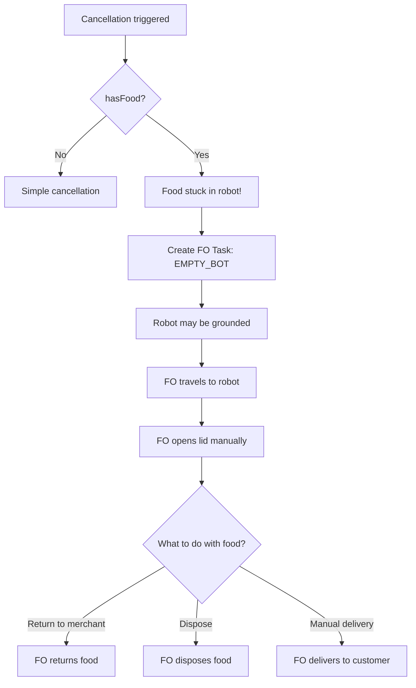
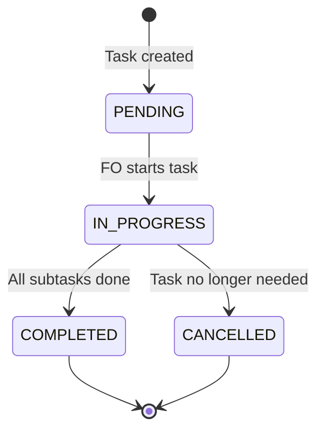
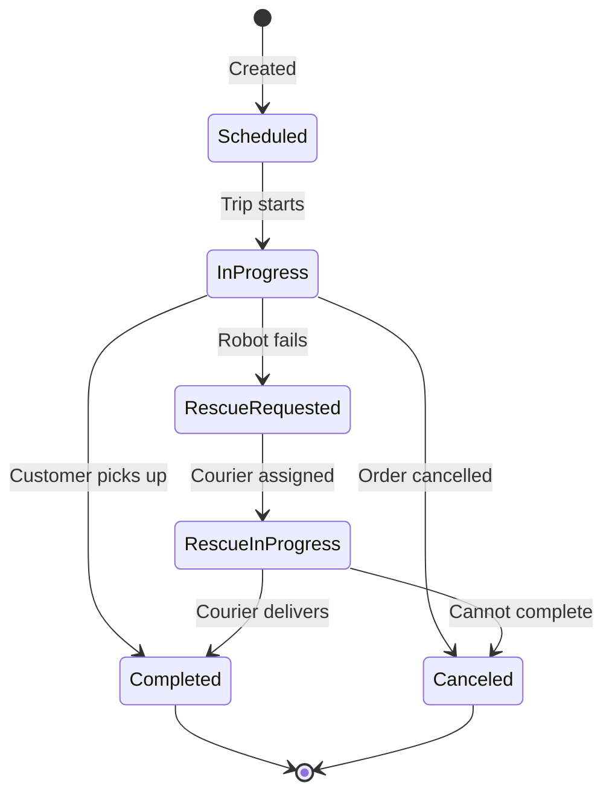
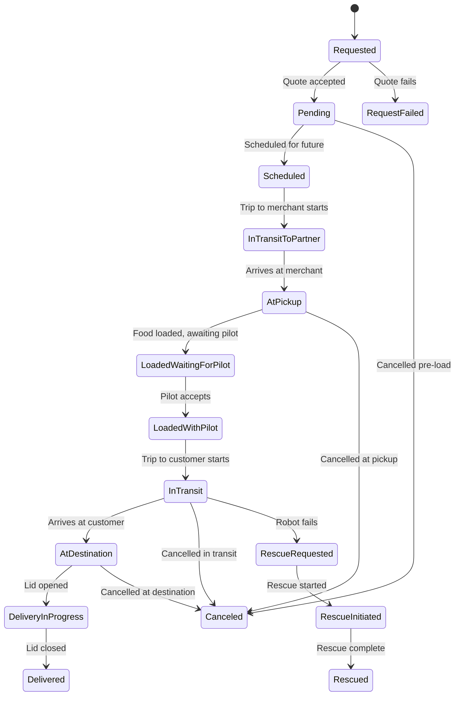
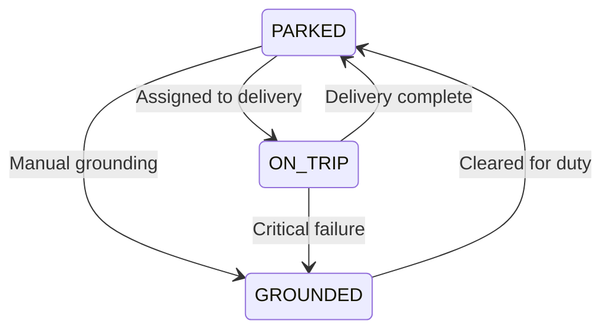

# The Life of an Order

This document provides an exhaustive walkthrough of a delivery order's complete lifecycle-from creation through fulfillment or failure. It covers all the edge cases, failure modes, and recovery mechanisms that make up our delivery system.

---

## Table of Contents
1. [**End-to-End Flow Diagram**](#1-end-to-end-flow-diagram) ⭐ *Complete lifecycle with all decision points*
2. [Key Concepts](#2-key-concepts) *Entities and services overview*
3. [Cancellation Scenarios](#3-cancellation-scenarios) *All 40+ cancellation reasons*
4. [Robot Health & Failure Modes](#4-robot-health--failure-modes) *Component monitoring and health checks*
5. [Field Operations Tasks](#5-field-operations-tasks) *FO task types and triggers*
6. [Appendix: State Machines](#6-appendix-state-machines) *Delivery, Attempt, Robot, and Trip states*

---

## 1. End-to-End Flow Diagram

This is the complete lifecycle of a successful delivery, from demand to fulfillment.

```mermaid
flowchart TD
    subgraph INTAKE["📥 INTAKE PHASE"]
        A[Partner sends delivery request<br/>DoorDash/Uber/Huuva] --> B{Integration Service<br/>receives webhook}
        B --> C[Store PII via Privacy Service]
        C --> D[Request Quote from Deliveries Service]
    end

    subgraph QUOTE["📊 QUOTING PHASE"]
        D --> E[Dispatch Engine: estimate]
        E --> F{Filter Available Robots}
        F --> |For each robot| F1[Is robot healthy?]
        F1 --> |No| F2[Skip robot]
        F1 --> |Yes| F3[Is robot busy?<br/>activeDemand != null]
        F3 --> |Yes| F2
        F3 --> |No| F4[Does robot need maintenance?]
        F4 --> |Yes| F2
        F4 --> |No| F5[Is robot within range?]
        F5 --> |No| F2
        F5 --> |Yes| F6[Robot is eligible ✓]
        
        F6 --> G{Filter Available Pilots}
        G --> G1[Is pilot on shift?]
        G1 --> |No| G2[Skip pilot]
        G1 --> |Yes| G3[Is pilot on break?]
        G3 --> |Yes| G2
        G3 --> |No| G4[Is pilot already assigned?]
        G4 --> |Yes| G2
        G4 --> |No| G5[Does experience level qualify?]
        G5 --> |No| G2
        G5 --> |Yes| G6[Pilot is eligible ✓]
        
        F6 --> H[Calculate Routes via Maps Service]
        G6 --> H
        H --> H1[Pickup → Dropoff route]
        H --> H2[Dropoff → Return route]
        H1 --> I[Generate Time Estimates]
        H2 --> I
        I --> J{Can we fulfill?}
        J --> |No robots| J1[LimitingFactor: RobotAvailability]
        J --> |No pilots| J2[LimitingFactor: PilotAvailability]
        J --> |No route| J3[LimitingFactor: Unroutable]
        J --> |Outside zone| J4[LimitingFactor: NotRobotAddressable]
        J --> |Yes| K[Return Quote with ETA]
    end

    subgraph ACCEPT["✅ ACCEPTANCE PHASE"]
        K --> L{Partner accepts quote?}
        L --> |No| L1[Quote rejected - End]
        L --> |Yes| M[PlannerService.create]
        M --> M1[Create Demand records]
        M1 --> M2[Assign robot to scheduledDeliveryId]
        M2 --> M3[Create Trip in Operations Service]
        M3 --> N{Is robot at pickup location?}
        N --> |Yes| O[Skip JITP - robot ready]
        N --> |No| P[Schedule JITP Trip<br/>Just-In-Time Pickup]
    end

    subgraph JITP["🚗 JITP PHASE (if needed)"]
        P --> Q[Create Pickup Demand]
        Q --> R[Trip status: SCHEDULED]
        R --> S[Pilot assigned to JITP]
        S --> T[Trip status: READY_TO_DEPART]
        T --> U[Pilot starts JITP]
        U --> V[Trip status: IN_TRANSIT]
        V --> W{JITP Issues?}
        W --> |Robot unhealthy| W1[Reassign robot or cancel]
        W --> |Route blocked| W2[Pilot reports, may cancel]
        W --> |Taking too long| W3[Watchdog monitors]
        W --> |Success| X[Robot arrives at merchant]
    end

    subgraph ATMERCHANT["🏪 AT MERCHANT PHASE"]
        O --> X
        X --> Y[Attempt status: AtPickup]
        Y --> Y1[Set unlock PIN on robot]
        Y1 --> Y2[Notify merchant<br/>SMS/Tablet/App]
        Y2 --> Z{Load Type?}
        Z --> |DoorDash| Z1[2-digit PIN<br/>Deviceless Flow]
        Z --> |Uber| Z2[4-digit PIN<br/>Magic Lid Flow]
        Z --> |QR enabled| Z3[QR Code Scan]
        Z --> |Pinless| Z4[Proximity Touch]
    end

    subgraph LOADING["📦 LOADING PHASE"]
        Z1 --> AA[Merchant enters PIN on keypad]
        Z2 --> AA
        Z3 --> AB[Merchant scans QR<br/>Web app opens lid]
        Z4 --> AC[Merchant touches keypad<br/>Proximity unlocks]
        
        AA --> AD{PIN_ENTRY_LID_OPEN event}
        AB --> AD
        AC --> AD
        
        AD --> AE{Lid opens successfully?}
        AE --> |No - stuck| AE1[Pilot troubleshoots<br/>or FO Request]
        AE1 --> AE2[Cancel with HardwareIssue]
        AE --> |Yes| AF[LID_OPENED event<br/>LidCycle initiated]
        
        AF --> AG[Merchant loads food]
        AG --> AH{Lid open too long?<br/>> 5 minutes}
        AH --> |Yes| AH1[Warning logged<br/>Possible stranger opened]
        AH --> |No| AI[Merchant closes lid]
        AH1 --> AI
        
        AI --> AJ{Lid closes successfully?}
        AJ --> |No - latch failed| AJ1[Feature flag: ignore or retry]
        AJ --> |Yes| AK[PIN_ENTRY_LID_CLOSE event]
        AJ1 --> AK
        
        AK --> AL[LidCycle: COMPLETE]
        AL --> AM[Robots.LidClose event published]
        AM --> AN[RobotHandlers.handleLidCloseEvent]
        AN --> AO[loadRobot called]
        AO --> AP[Attempt status: LoadedWaitingForPilot]
        AP --> AQ[hasFood = true]
        AQ --> AR[Unset unlock PIN]
    end

    subgraph PILOTCONNECT["👨‍✈️ PILOT CONNECTS"]
        AR --> AS[Pilot assigned to Delivery Trip]
        AS --> AT[Pilot accepts trip]
        AT --> AU[Attempt status: LoadedWithPilot]
        AU --> AV[Trip status: READY_TO_DEPART]
    end

    subgraph DELIVERY["🚀 DELIVERY PHASE"]
        AV --> AW[Pilot starts trip]
        AW --> AX[Trip status: IN_TRANSIT]
        AX --> AY[Robot travels to customer]
        AY --> AZ{Delivery Issues?}
        AZ --> |Robot unhealthy| BA[May trigger rescue]
        AZ --> |Robot stuck| BB[Pilot requests FO]
        AZ --> |Route blocked| BC[Pilot reroutes or escalates]
        AZ --> |Taking too long| BD[Watchdog: IsDeliveryLate]
        BA --> BE{Food loaded?}
        BE --> |Yes| BF[Rescue flow - FO retrieves food]
        BE --> |No| BG[Reassign robot]
        AZ --> |Success| BH[Robot arrives at customer]
    end

    subgraph ATCUSTOMER["🏠 AT CUSTOMER PHASE"]
        BH --> BI[Trip status: AT_DESTINATION]
        BI --> BJ[Attempt status: AtDestination]
        BJ --> BK[Customer SMS: Coco has arrived!]
        BK --> BL[Schedule reminder SMS]
        BL --> BM[Customer approaches robot]
        BM --> BN{How does customer unlock?}
        BN --> |App button| BO[Open my Coco button in tracker]
        BN --> |PIN| BP[Enter PIN on keypad]
        BO --> BQ[API: unloadRobotForDelivery]
        BP --> BQ
        BQ --> BR[lidCommandSync: OPEN]
        BR --> BS{Lid opens?}
        BS --> |No| BT[Customer support escalation]
        BS --> |Yes| BU[LID_OPENED event]
        BU --> BV[Attempt status: DeliveryInProgress]
    end

    subgraph PICKUP["🎁 CUSTOMER PICKUP"]
        BV --> BW[Customer retrieves food]
        BW --> BX{Customer closes lid?}
        BX --> |Physical close| BY[LID_CLOSED event]
        BX --> |Button on robot| BY
        BX --> |Doesn't close| BZ[Reminders continue<br/>Pilot may close remotely]
        BZ --> BY
        BY --> CA[LidCycle: COMPLETE at destination]
    end

    subgraph FULFILL["✅ FULFILLMENT"]
        CA --> CB[Attempt status: Delivered]
        CB --> CC[Delivery status: Completed]
        CC --> CD[hasFood = false]
        CD --> CE[Dispatch: DemandStatus.Fulfilled]
        CE --> CF[Partner notified: DeliveryEvent.completed]
        CF --> CG[Cancel pending FO tasks]
    end

    subgraph RETURN["🔙 RETURN PHASE"]
        CG --> CH{Next delivery scheduled?}
        CH --> |Yes| CI[Start new delivery flow]
        CH --> |No| CJ[Schedule Return Trip]
        CJ --> CK[Pilot connects for return]
        CK --> CL[Robot returns to parking lot]
        CL --> CM[Trip status: COMPLETED]
        CM --> CN[Robot state: PARKED]
        CN --> CO[Robot available for next delivery]
    end

    style INTAKE fill:#e1f5fe
    style QUOTE fill:#fff3e0
    style ACCEPT fill:#e8f5e9
    style JITP fill:#fce4ec
    style ATMERCHANT fill:#f3e5f5
    style LOADING fill:#fff8e1
    style PILOTCONNECT fill:#e0f2f1
    style DELIVERY fill:#e8eaf6
    style ATCUSTOMER fill:#fbe9e7
    style PICKUP fill:#f1f8e9
    style FULFILL fill:#c8e6c9
    style RETURN fill:#d1c4e9
```

### Step-by-Step Breakdown

#### Phase 1: Intake (Events: Webhook received)
| Step | Event/State Change | Service | Code Reference |
|------|-------------------|---------|----------------|
| 1.1 | Partner webhook received | Integrations | [`huuva.service.ts`](service/integrations/src/huuva/huuva.service.ts) |
| 1.2 | PII stored | Privacy Service | `createPii()` |
| 1.3 | Quote requested | Deliveries → Dispatch | `getQuote()` |

#### Phase 2: Quoting (Events: Estimate generated)
| Step | Event/State Change | Service | Code Reference |
|------|-------------------|---------|----------------|
| 2.1 | `PlannerService.estimate()` | Dispatch Engine | [`planner.service.ts`](service/dispatch-engine/src/modules/planner/service/planner.service.ts) |
| 2.2 | Filter robots: `healthy`, `!activeDemand`, `!needsMaintenance` | Dispatch Engine | [`planner.lib.ts`](service/dispatch-engine/src/modules/planner/service/planner.lib.ts) |
| 2.3 | Filter pilots: `OnShift`, `!OnBreak`, `experienceLevel` | Dispatch Engine | `Planner.generatePilotSeries()` |
| 2.4 | Calculate routes | Maps Service | `maps.route()` |
| 2.5 | Return `LimitingFactor` or `DemandQuote` | Dispatch Engine | `LimitingFactor` enum |

#### Phase 3: Acceptance (Events: Demand created)
| Step | Event/State Change | Service | Code Reference |
|------|-------------------|---------|----------------|
| 3.1 | Quote accepted | Integrations | `acceptQuote()` |
| 3.2 | `PlannerService.create()` | Dispatch Engine | `create()` method |
| 3.3 | `Demand` created with status `Scheduled` | Dispatch Engine | `DemandStatus.Scheduled` |
| 3.4 | Robot assigned: `scheduledDeliveryId` | Dispatch Engine | `assignRobot()` |
| 3.5 | `Trip` created | Operations | `createTrip()` |
| 3.6 | JITP scheduled if robot not at pickup | Dispatch Engine | `DemandType.Pickup` |

#### Phase 4: JITP (Events: Pickup trip execution)
| Step | Event/State Change | Service | Code Reference |
|------|-------------------|---------|----------------|
| 4.1 | Trip `SCHEDULED` → `PENDING` | Operations | `TripState.PENDING` |
| 4.2 | Pilot assigned | Operations | `assignPilot()` |
| 4.3 | Trip `READY_TO_DEPART` → `IN_TRANSIT` | Operations | `TripState.IN_TRANSIT` |
| 4.4 | Robot arrives at merchant | Operations | Geofence check |

#### Phase 5: At Merchant (Events: AtPickup)
| Step | Event/State Change | Service | Code Reference |
|------|-------------------|---------|----------------|
| 5.1 | `AttemptStatus.AtPickup` | Deliveries | `handleAttemptUpdate()` |
| 5.2 | Unlock PIN set on robot | State Service | [`pin.service.ts`](service/deliveries/src/modules/providers/robot/pin.service.ts) `setPin()` |
| 5.3 | Merchant notified | Deliveries | SMS notification |

#### Phase 6: Loading (Events: LidCycle)
| Step | Event/State Change | Service | Code Reference |
|------|-------------------|---------|----------------|
| 6.1 | PIN entered on keypad | Robot | MQTT event |
| 6.2 | `PIN_ENTRY_LID_OPEN` event | State Service | [`iot-streamer.service.ts`](service/state/src/iot-streamer/iot-streamer.service.ts) |
| 6.3 | `Robots.PinEntry` published | State Service | `processRobotPinEvent()` |
| 6.4 | `LidCycle` initiated | State Service | [`lid-cycle.service.ts`](service/state/src/lid-cycle/lid-cycle.service.ts) |
| 6.5 | Lid open > 5 min warning | Deliveries | [`delivery-health-monitor.worker.ts`](service/deliveries/src/modules/watchdog/health-monitor/delivery-health-monitor.worker.ts) |
| 6.6 | `PIN_ENTRY_LID_CLOSE` event | State Service | `isPinEntryLidClosedEventMeta()` |
| 6.7 | `LidCycle.Complete` | State Service | `LidCycleEvent.LID_CYCLE_COMPLETE` |
| 6.8 | `Robots.LidClose` published | State Service | RabbitMQ |
| 6.9 | `RobotHandlers.handleLidCloseEvent` | Deliveries | [`robot.handler.ts`](service/deliveries/src/modules/providers/robot/robot.handler.ts) |
| 6.10 | `loadRobot()` called | Deliveries | [`robot.service.ts`](service/deliveries/src/modules/providers/robot/robot.service.ts) |
| 6.11 | `AttemptStatus.LoadedWaitingForPilot` | Deliveries | `AttemptTransitioned` event |
| 6.12 | `hasFood = true` published | Operations | `publishRobotStateUpdated()` |
| 6.13 | Unlock PIN unset | Deliveries | `unsetPin()` |

#### Phase 7: Pilot Connects (Events: LoadedWithPilot)
| Step | Event/State Change | Service | Code Reference |
|------|-------------------|---------|----------------|
| 7.1 | Pilot assigned to delivery trip | Operations | `assignPilot()` |
| 7.2 | Pilot accepts | Operations | `acceptTrip()` |
| 7.3 | `AttemptStatus.LoadedWithPilot` | Deliveries | State transition |
| 7.4 | `TripState.READY_TO_DEPART` | Operations | Trip update |

#### Phase 8: Delivery Trip (Events: IN_TRANSIT)
| Step | Event/State Change | Service | Code Reference |
|------|-------------------|---------|----------------|
| 8.1 | Pilot starts trip | Operations | `startTrip()` |
| 8.2 | `TripState.IN_TRANSIT` | Operations | Trip status update |
| 8.3 | `AttemptStatus.InTransit` | Deliveries | State transition |
| 8.4 | Customer notified: "In Transit" | Deliveries | `NotificationEvent.InTransit` SMS |
| 8.5 | ETA updates published | Dispatch Engine | `ProviderEtaUpdated` |
| 8.6 | Watchdog monitors for delays | Deliveries | [`watchdog.service.ts`](service/deliveries/src/modules/watchdog/service/watchdog.service.ts) |

#### Phase 9: At Customer (Events: AtDestination)
| Step | Event/State Change | Service | Code Reference |
|------|-------------------|---------|----------------|
| 9.1 | Robot arrives at dropoff | Operations | Geofence check |
| 9.2 | `TripState.AT_DESTINATION` | Operations | Trip update |
| 9.3 | `AttemptStatus.AtDestination` | Deliveries | State transition |
| 9.4 | Customer SMS: "Coco has arrived!" | Deliveries | [`customer.sms.robot.narrative.ts`](service/deliveries/src/modules/notifications/narratives/customer.sms.robot.narrative.ts) |
| 9.5 | Reminder SMS scheduled | Deliveries | `scheduleReminder()` |

#### Phase 10: Customer Pickup (Events: DeliveryInProgress → Delivered)
| Step | Event/State Change | Service | Code Reference |
|------|-------------------|---------|----------------|
| 10.1 | Customer clicks "Open my Coco" | Tracker App | [`useUnlockCoco.ts`](web/tracker/src/hooks/useUnlockCoco.ts) |
| 10.2 | API: `unloadRobotForDelivery()` | Deliveries | [`delivery.service.ts`](service/deliveries/src/modules/delivery/service/delivery.service.ts) |
| 10.3 | `lidCommandSync(OPEN)` | State Service | MQTT command |
| 10.4 | `LID_OPENED` event | State Service | LidCycle updated |
| 10.5 | `AttemptStatus.DeliveryInProgress` | Deliveries | State transition |
| 10.6 | Customer retrieves food | Physical | - |
| 10.7 | Lid closed (physical/button/remote) | Robot | - |
| 10.8 | `LID_CLOSED` event | State Service | LidCycle completed |
| 10.9 | `AttemptStatus.Delivered` | Deliveries | State transition |

#### Phase 11: Fulfillment (Events: Completed)
| Step | Event/State Change | Service | Code Reference |
|------|-------------------|---------|----------------|
| 11.1 | `DeliveryStatus.Completed` | Deliveries | Final status |
| 11.2 | `hasFood = false` published | Operations | `publishRobotStateUpdated()` |
| 11.3 | `DemandStatus.Fulfilled` | Dispatch Engine | `markFulfilled()` |
| 11.4 | Partner notified | Integrations | `DeliveryEvent.completed` |
| 11.5 | FO tasks cancelled | Operations | `cancelTasksForDelivery()` |
| 11.6 | Reminders cancelled | Deliveries | `cancelReminders()` |

#### Phase 12: Return (Events: Return trip or next delivery)
| Step | Event/State Change | Service | Code Reference |
|------|-------------------|---------|----------------|
| 12.1 | Check for next scheduled delivery | Dispatch Engine | `scheduledDeliveryId` |
| 12.2 | If none: Create Return Demand | Dispatch Engine | `DemandType.Return` |
| 12.3 | Pilot connects for return | Operations | Trip assignment |
| 12.4 | Robot returns to parking lot | Physical | - |
| 12.5 | `TripState.COMPLETED` | Operations | Final trip status |
| 12.6 | `RobotState.PARKED` | Operations | Robot available |

### Failure Points & Recovery

The diagram above shows the happy path. Here are the key failure points and how they're handled:

#### During Quoting
| Failure | Detection | Response | Code |
|---------|-----------|----------|------|
| No healthy robots | `Planner.findEligibleRobot()` returns empty | Return `LimitingFactor.RobotAvailability` | Quote rejected |
| No available pilots | `Planner.generatePilotSeries()` empty | Return `LimitingFactor.PilotAvailability` | Quote rejected |
| Address not routable | `maps.route()` fails | Return `LimitingFactor.Unroutable` | Quote rejected |
| Outside delivery zone | Geofence check fails | Return `LimitingFactor.NotRobotAddressable` | Quote rejected |

#### During JITP
| Failure | Detection | Response | Code |
|---------|-----------|----------|------|
| Robot becomes unhealthy | Heartbeat shows `healthy=false` | Reassign robot or cancel | `RobotEventsHandler` |
| Robot offline | DriveU connectivity lost | Reassign robot or cancel | `StateTrackerService` |
| Route blocked | Pilot reports obstruction | Reroute or escalate to FO | `AttemptCancellationReason.RouteBlocked` |
| Taking too long | Watchdog condition | Alert or cancel | `IsPickupLate` condition |

#### During Loading
| Failure | Detection | Response | Code |
|---------|-----------|----------|------|
| Lid won't open | No `LID_OPENED` event | Pilot troubleshoots, then FO | `HardwareIssue` cancellation |
| Wrong PIN entered | `expected != entered` | Play failure sound | `triggerVerifyFailureSound()` |
| Stranger opens lid | Lid open > 5 min pre-load | Warning logged | `handleLidOpenTooLong()` |
| Lid timeout | No close within threshold | `LidCycle.Timeout` event | `LidCycleTimeoutWorker` |
| Latch failure | `lid_successfully_closed=false` | Feature flag: ignore or retry | `magic-lid-ignore-latch-failure` |
| Robot needs maintenance | `needsMaintenance=true` | Block load, return error | `LoadAttemptedRpcHandler` |

#### During Delivery Trip
| Failure | Detection | Response | Code |
|---------|-----------|----------|------|
| Robot becomes unhealthy | Heartbeat shows `healthy=false` | Rescue flow (FO retrieves food) | `RescueRequested` |
| Robot stuck | Pilot reports or sensors | FO task: `UNSTUCK_BOT` | `FoTaskType.UNSTUCK_BOT` |
| Robot flipped | Accelerometer detection | FO task: `UNFLIP_BOT` | `FoTaskType.UNFLIP_BOT` |
| Delivery late | Watchdog: `IsDeliveryLate` | Alert, may change provider | `CHANGE_PROVIDER` action |
| Pilot error | Pilot reports issue | May cancel with `PilotError` | `AttemptCancellationReason.PilotError` |

#### At Customer
| Failure | Detection | Response | Code |
|---------|-----------|----------|------|
| Lid won't open | Open command fails | Customer support escalation | API error |
| Customer unresponsive | No lid activity after reminders | May cancel | `CustomerUnresponsive` |
| Customer doesn't close lid | Lid remains open | Reminders, pilot may close remotely | `ReminderEvent` |
| Lid stuck open | Mechanical failure | FO task created | `HardwareIssue` |

#### Post-Load Cancellation (Food Stuck)
When a delivery is cancelled after food has been loaded (`hasFood=true`):

**Code Reference**: [`fo-tasks.factory.ts`](service/operations/src/modules/fo-tasks/fo-tasks.factory.ts) - `EmptyTheBotOptions`

---

## 2. Key Concepts

**Key Entities**:
- **Delivery**: The high-level order record. Has a status like `Scheduled`, `InProgress`, `Completed`, or `Canceled`.
- **Attempt**: A specific effort to fulfill a delivery. A delivery may have multiple attempts (e.g., robot attempt followed by a rescue attempt).
- **Demand**: The Dispatch Engine's representation of work to be done.
- **Trip**: The Operations Service's representation of a robot/pilot task.
- **LidCycle**: Tracks the lifecycle of lid open/close events for loading and unloading.

**Key Services**:
- **Integrations Service**: Partner webhook ingestion (DoorDash, Uber, Huuva)
- **Deliveries Service**: Order management and attempt lifecycle
- **Dispatch Engine**: Planning, robot/pilot assignment, ETA calculations
- **Operations Service**: Trip management, pilot assignments, robot state
- **State Service**: Robot telemetry processing, lid cycle management
- **Fleet Service**: Real-time robot supply cache, provider integrations

---

## 3. Cancellation Scenarios

### 3.1 All Cancellation Reasons

There are many reasons an order might be cancelled, organized by category:

| Category | Cancellation Reason | Description |
|----------|---------------------|-------------|
| **Hardware Issues** | HardwareIssue | General hardware failure |
| | BotFlipped | Robot tipped over |
| | BotStuck | Robot unable to move |
| | BotHit | Robot was struck by object/vehicle |
| **Software Issues** | SoftwareIssue | Software malfunction or bug |
| **Merchant Issues** | MerchantError | General merchant-side error |
| | MerchantRequested | Merchant cancelled the order |
| | MerchantTabletIssue | Tablet not responding or malfunctioning |
| | MerchantUnresponsive | Merchant not responding to robot arrival |
| | LargeOrder | Order too large for robot capacity |
| | LongLoad | Loading took too long |
| **Customer Issues** | CustomerRequested | Customer cancelled the order |
| | CustomerRequested_Unable | Customer unable to receive delivery |
| | CustomerRequested_Unwilling | Customer changed mind about delivery |
| | CustomerUnresponsive | Customer not responding at dropoff |
| | CustomerBlacklisted | Customer flagged in system |
| | IdCheck | Age verification required but failed |
| **Supply Issues** | PilotAvailability | No pilots available |
| | RobotAvailability | No robots available |
| | RobotDeliveriesDisabledByMerchant | Merchant disabled robot deliveries |
| | RobotDeliveriesDisabledByOperatingZone | Zone settings disabled robot deliveries |
| **Environmental** | WeatherConditions | Unsafe weather (rain, snow, wind) |
| | TerrainIssue | Terrain too difficult to navigate |
| | Obstruction | Path blocked by object |
| | RouteBlocked | Route inaccessible |
| **Other** | CourierFailure | Human courier (rescue) failed |
| | RoutingFailed | Unable to calculate valid route |
| | NotRobotAddressable | Destination not reachable by robot |
| | BotRescue | Rescue operation initiated |
| | DeliveryWatchdog | Watchdog system triggered cancellation |
| | Other | Unspecified reason |

**Source**: `AttemptCancellationReason` enum in [`service/operations/prisma/schema.prisma`](service/operations/prisma/schema.prisma)

---

## 4. Robot Health & Failure Modes

### 4.1 Monitored Components

Key components monitored for health:

| Component | Heartbeat Frequency | Examples of Failures |
|-----------|---------------------|----------------------|
| **GPS** | 10 seconds | Signal loss, accuracy issues |
| **Camera** | 10 seconds | Obstructed, offline |
| **Battery** | 10 seconds | Low charge, not charging |
| **Lid/Cargo** | On event | Won't open, won't close, latch failure |
| **Motor/Base** | 10 seconds | Movement issues |
| **PCU (Power Control)** | 10 seconds | Power distribution issues |
| **Emergency Button** | 10 seconds | Button stuck |
| **Connectivity** | Continuous | DriveU offline, MQTT disconnected |

**Source**: [`obsidian/reference/Robot Component Heartbeats.md`](obsidian/reference/Robot Component Heartbeats.md)

### 4.2 How Health Affects Orders

When a robot becomes unhealthy:

**Before Loading**:
- Robot removed from available supply
- If assigned, demand is orphaned and reassigned
- No immediate order impact if replacement found

**After Loading (Food in Bot)**:
- **Critical situation**: Food is stuck
- Trip may be cancelled
- FO task created to empty bot
- Rescue flow initiated if possible
- Robot grounded for maintenance

### 4.3 Health State Change Notifications

When a robot's health state changes, automated Slack alerts are sent to the operations team. These alerts include:
- The robot's serial number
- Timestamp when the unhealthy state was detected
- A list of all unhealthy components with their status and error details

This allows the team to quickly identify and respond to hardware issues before they impact deliveries.

**Source**: [`service/state/src/notification/process-message.handler.ts`](https://github.com/cocorobotics/delivery-platform/blob/main/service/state/src/notification/process-message.handler.ts)

### 4.4 Lid Malfunction

If the lid is malfunctioning:

1. **Pilot troubleshooting**: Pilot can try opening/closing via controller (X to open, A to close)
2. **Multiple attempts**: System recommends 2-3 attempts before escalating
3. **FO Request**: If issue persists, pilot requests Field Ops assistance through the UI
4. **Robot grounded**: Marked for maintenance (`needsGrounding: true`)
5. **Cancellation reason**: `HardwareIssue`
6. **FO Task created**: `BOT_RESCUE` task assigned to retrieve any food and address the issue

The pilot UI provides a streamlined flow for reporting lid malfunctions and requesting field operations support.

---

## 5. Field Operations Tasks

### 5.1 FO Task Types

Field Operations tasks are categorized by type:

| Category | Task Type | Purpose |
|----------|-----------|---------|
| **Robot Service** | PUT_UP_FLAG | Mark robot location with physical flag |
| | BATTERY_SWAP | Replace robot battery in the field |
| | PARKING_LOT_BATTERY_SWAP | Swap battery at parking lot |
| | CLEAN_CAMERA | Clean robot camera lens |
| | CLEAN_INSOLE | Clean robot interior/insole |
| | EMPTY_BOT | Remove stuck food from robot |
| | RETURN_TO_PARKING_LOT | Manual return to parking |
| **Incident Response** | MOVE_BOT_FROM_CROSSWALK | Relocate robot from crosswalk |
| | UNSTUCK_BOT | Free robot from obstacle |
| | UNFLIP_BOT | Right a flipped robot |
| | BOT_HIT | Respond to collision incident |
| **Merchant Response** | TABLET_ISSUE | Fix merchant tablet problems |
| | QR_ISSUE | Resolve QR code loading issues |
| **On Trip Rescue** | DELIVERY_RESCUE | Complete delivery manually |
| | BOT_PICKUP | Retrieve robot from field |
| | SWAP_BOT | Replace failed robot with working one |

### 5.2 When FO Tasks Are Created

| Scenario | Task Type | Trigger |
|----------|-----------|---------|
| Food stuck in cancelled delivery | `EMPTY_BOT` | Cancellation with hasFood=true |
| Robot stuck | `UNSTUCK_BOT` | Pilot request or sensor detection |
| Robot flipped | `UNFLIP_BOT` | Accelerometer detection |
| Robot hit | `BOT_HIT` | Collision sensor |
| Low battery | `BATTERY_SWAP` | Battery level threshold |
| Delivery rescue needed | `DELIVERY_RESCUE` | Robot failure with active delivery |
| End of day pickup | `BOT_PICKUP` | Scheduled EOD |

### 5.3 Task Lifecycle

### 5.4 Task and Delivery Coordination

When a delivery ends, the system automatically coordinates FO tasks:

- **If delivery completed successfully**: Any pending `EMPTY_BOT` tasks are cancelled (since the food was successfully delivered, there's nothing to empty)
- **Scheduled tasks activated**: Any tasks that were scheduled to run after delivery completion are now activated

This automatic coordination ensures field operators aren't dispatched unnecessarily and that post-delivery tasks (like robot pickup or maintenance) are triggered at the right time.

**Source**: [`delivery.handlers.ts`](service/operations/src/modules/fo-tasks/handlers/delivery.handlers.ts)

---

## 6. Appendix: State Machines

### Delivery Status States

### Attempt Status States

### Robot State States

---

## Related Documentation

- [[Delivery & Dispatch Flow]]
- [[Delivery Status State Machine]]
- [[Robot Loading Overview]]
- [[Dispatch Engine Architecture]]
- [[Field Op Performs Robot Maintenance Flow]]
- [[Customer Unlocks Robot for Pickup Flow]]
- [[Watchdog System]]

