# The Life of a Robot

This document provides an exhaustive walkthrough of a Coco delivery robot's complete lifecycle—from deployment in the morning through end-of-day pickup. It covers all the operational phases, failure modes, maintenance scenarios, and recovery mechanisms that make up a robot's daily life.

---

## Table of Contents
1. [**End-to-End Daily Lifecycle**](#1-end-to-end-daily-lifecycle) ⭐ *Complete daily flow with all decision points*
2. [Robot States & Heartbeats](#2-robot-states--heartbeats) *Operation states and telemetry*
3. [Deployment Phase](#3-deployment-phase) *How robots get to the field*
4. [Trip Types & Assignment](#4-trip-types--assignment) *All trip types and scheduling*
5. [Pilot Connection & Control](#5-pilot-connection--control) *How pilots operate robots*
6. [Loading & Unloading](#6-loading--unloading) *Merchant and customer interactions*
7. [Trip Interruptions & Failures](#7-trip-interruptions--failures) *What can go wrong*
8. [Battery Management](#8-battery-management) *Swap thresholds and procedures*
9. [Field Operations Tasks](#9-field-operations-tasks) *FO task types and workflows*
10. [End of Day](#10-end-of-day) *Pickup and storage*
11. [Appendix: State Machines](#11-appendix-state-machines) *Robot and Trip states*

---

## 1. End-to-End Daily Lifecycle

This is the complete lifecycle of a robot from morning deployment through end-of-day pickup.


---

## 2. Robot States & Heartbeats

### 2.1 Operation States

A robot can be in one of five operation states at any time:

| State | Description | Can Accept Trips? |
|-------|-------------|-------------------|
| `ON_TRIP` | Currently executing a trip (JITP, Delivery, Return, Deployment) | No |
| `PARKED` | Idle at a parking lot, ready for assignment | Yes |
| `GROUNDED` | Unhealthy or flagged for maintenance | No |
| `OFF_DUTY` | Not in service (overnight, in storage) | No |
| `DEPLOYED` | Recently deployed, transitioning to PARKED | Transitional |

**Source**: `RobotStateEventState` enum in [`operations/prisma/schema.prisma`](service/operations/prisma/schema.prisma)

### 2.2 Heartbeat Structure

Robots emit heartbeats approximately every 10 seconds via MQTT. Each heartbeat contains:

```typescript
interface RobotHeartbeat {
  version: number;
  serial: string;              // Robot identifier
  createdAt: number;           // Timestamp
  receivedAt: number;          // When backend received it
  processedAt: number;         // When backend processed it
  
  // Telemetry
  location: {
    latitude: number;
    longitude: number;
    heading: number;
    speed: number;
    horizontalAccuracy: number;
  };
  
  battery: {
    chargePercent: number;     // State of Charge (SOC)
    isCharging: boolean;
    serialNumber: string;
    voltage: number;
    temperature: number;
  };
  
  // Health
  healthy: boolean;            // Overall health flag
  components: ComponentHealth; // Detailed component status
  operationState: OperationState;
}
```

**Source**: [`robot/internal/entities/robot_heartbeat.go`](coco-services/robot/internal/entities/robot_heartbeat.go)

### 2.3 Component Health Monitoring

The `ComponentHealth` message tracks the status of individual hardware components:

```protobuf
message ComponentHealth {
  bool all_healthy = 1;                        // Summary flag
  repeated ComponentStatus components = 2;     // Per-component status
  repeated string unhealthy_component_names = 3;
  Timestamp check_time = 4;
}

message ComponentStatus {
  HardwareComponent component = 1;  // GPS, Camera, Battery, Motor, etc.
  HardwareStatusCode status = 2;    // OK, WARNING, ERROR, CRITICAL
  string message = 3;
  map<string, string> error_details = 5;
}
```

**Key Components Monitored**:

| Component | Heartbeat Frequency | Examples of Failures |
|-----------|---------------------|----------------------|
| GPS | ~10 seconds | Signal loss, accuracy degradation |
| Camera | ~10 seconds | Obstructed lens, offline |
| Battery | ~10 seconds | Low charge, not charging, overheating |
| Lid/Cargo | On event | Won't open, won't close, latch failure |
| Motor/Base | ~10 seconds | Movement issues, stuck |
| PCU (Power Control) | ~10 seconds | Power distribution issues |
| Emergency Button | ~10 seconds | Button stuck |
| Connectivity | Continuous | DriveU offline, MQTT disconnected |

### 2.4 Dispatchability Criteria

A robot is considered **dispatchable** (can accept new trips) when ALL of the following are true:

1. **Online**: Recent heartbeat received (within threshold)
2. **Healthy**: `healthy = true` in heartbeat
3. **Not in Storage**: Not checked into a storage location
4. **No Maintenance Needed**: `needsMaintenance = false`
5. **Valid Location**: GPS coordinates are accurate and within service area
6. **Not Grounded**: `operationState != GROUNDED`
7. **Battery Sufficient**: SOC above minimum threshold for trip

**Source**: `Planner.findEligibleRobot()` in Dispatch Engine

---

## 3. Deployment Phase

### 3.1 Deployment Methods

Robots can be deployed to the field in two ways:

| Method | Description | Who Performs | When Used |
|--------|-------------|--------------|-----------|
| **Van Drop** | FO physically transports robot in a van | Field Operator | Morning deployment, repositioning |
| **Deployment Trip** | Pilot remotely drives robot to location | Pilot | Short distances, repositioning |

### 3.2 Van Drop Workflow

```mermaid
sequenceDiagram
    participant FO as Field Operator
    participant Van as Van
    participant Robot as Robot
    participant FOUI as FO App
    participant Ops as Operations Service

    Note over FO: Morning at MRO/Storage
    FO->>Robot: 1. Prepare robot for deployment
    FO->>FOUI: 2. Scan robot (SCAN_BOT)
    FOUI->>Ops: 3. Create deployment task
    FO->>Van: 4. Load robot into van
    FOUI->>Ops: 5. Mark LOAD_TO_VAN complete
    
    Note over Van: Drive to service area
    FO->>Van: 6. Arrive at parking lot
    FO->>Robot: 7. Unload robot from van
    FO->>FOUI: 8. Mark robot DEPLOYED
    FOUI->>Ops: 9. Update robot state
    Ops->>Ops: 10. Robot state: DEPLOYED → PARKED
    
    Note over Robot: Robot now available for trips
```



### 3.3 Deployment Trip Workflow

For shorter distances, a pilot can remotely drive the robot to its deployment location:

| Step | Action | Service |
|------|--------|---------|
| 1 | Create DEPLOYMENT task | Operations Service |
| 2 | Assign pilot to task | Operations Service |
| 3 | Pilot accepts trip | Pilot UI |
| 4 | Trip status: READY_TO_DEPART | Operations Service |
| 5 | Pilot starts driving robot | Pilot UI → DriveU |
| 6 | Trip status: IN_TRANSIT | Operations Service |
| 7 | Robot arrives at destination | Geofence detection |
| 8 | Pilot marks trip complete | Pilot UI |
| 9 | Robot state: DEPLOYED → PARKED | Operations Service |

### 3.4 FO Deployment Task Types

| Task Type | Description |
|-----------|-------------|
| `DEPLOY_BOTS` | Standard deployment by FO |
| `DEPLOY_BOTS_WITH_PILOT` | Deployment with pilot assistance |
| `PREPARE_BOTS_FOR_DEPLOYMENT` | Pre-deployment preparation at MRO |

**FO Subtask Actions for Deployment**:
- `PREPARE_BOT_FOR_DEPLOYMENT`: Check robot, ensure charged
- `LOAD_TO_VAN`: Load robot into transport vehicle
- `SCAN_BOT`: Scan robot barcode for tracking
- `TRIP_DEPLOY`: Execute deployment trip
- `PARK_BOT`: Park robot at final location

---

## 4. Trip Types & Assignment

### 4.1 Trip Types

| Trip Type | Purpose | Typical Duration |
|-----------|---------|------------------|
| `JITP` | Just-In-Time Pickup - robot travels to merchant | 5-15 min |
| `DELIVERY` | Robot travels from merchant to customer | 10-30 min |
| `RETURN` | Robot returns to parking lot after delivery | 5-15 min |
| `DEPLOYMENT` | Robot moves to new service location | Variable |
| `MOVE_ROBOT` | Repositioning within service area | Variable |

**Source**: `TripType` enum in [`operations/prisma/schema.prisma`](service/operations/prisma/schema.prisma)

### 4.2 Trip Status Progression


### 4.3 Trip Scheduling & Assignment

The Dispatch Engine manages trip scheduling and can schedule multiple trips in advance:

**Scheduling Flow**:
1. **Quote Request**: Partner requests delivery quote
2. **Eligibility Check**: Filter available robots and pilots
3. **Route Calculation**: Maps Service calculates routes
4. **ETA Generation**: Estimate pickup and delivery times
5. **Demand Creation**: Create `Demand` record with `scheduledDeliveryId`
6. **Robot Assignment**: Assign robot to the demand
7. **Trip Creation**: Create Trip in Operations Service

**Multi-Trip Scheduling**:
- A robot can have multiple trips scheduled in advance
- `scheduledDeliveryId` links robot to upcoming deliveries
- Dispatch Engine considers scheduled trips when calculating availability
- If a robot has a scheduled delivery, it won't be assigned conflicting trips

### 4.4 Trip Cancellation

Trips can be cancelled at any stage. Common cancellation reasons:

| Category | Reasons |
|----------|---------|
| **Hardware** | `HardwareIssue`, `BotFlipped`, `BotStuck`, `BotHit` |
| **Software** | `SoftwareIssue` |
| **Pilot** | `PilotAvailability`, `PilotError`, `PilotSpeed` |
| **Robot** | `RobotAvailability`, `RobotDeliveriesDisabledByMerchant` |
| **Environmental** | `WeatherConditions`, `TerrainIssue`, `Obstruction`, `RouteBlocked` |
| **Merchant** | `MerchantError`, `MerchantRequested`, `MerchantUnresponsive`, `LongLoad` |
| **Customer** | `CustomerRequested`, `CustomerUnresponsive`, `CustomerBlacklisted` |
| **System** | `DeliveryWatchdog`, `RoutingFailed`, `NotRobotAddressable` |

**Source**: `AttemptCancellationReason` enum in [`operations/prisma/schema.prisma`](service/operations/prisma/schema.prisma)

---

## 5. Pilot Connection & Control

### 5.1 How Pilots Connect

Pilots remotely operate robots through the DriveU teleoperation system:


### 5.2 DriveU Status

The DriveU system tracks connection status:

| Status | Description |
|--------|-------------|
| `OFFLINE` | Streamer not running |
| `ONLINE` | Streamer running, not connected |
| `CONNECTED_TO_NODE` | Connected to relay node |
| `STANDBY` | Ready for pilot connection |
| `STREAMING` | Actively streaming to pilot |

### 5.3 Pilot Assignment Flow

| Step | Event | Service |
|------|-------|---------|
| 1 | Trip created | Operations Service |
| 2 | Find eligible pilot | Operations Service |
| 3 | Assignment status: `REQUESTED` | Operations Service |
| 4 | Pilot notified | Pilot UI |
| 5 | Pilot accepts → `ACCEPTED` | Operations Service |
| 6 | Pilot rejects → `REJECTED` | Operations Service |
| 7 | No response → `STALE` | Operations Service |
| 8 | Pilot abandons → `ABANDONED` | Operations Service |

### 5.4 Pilot Experience Levels

Some pilots have restrictions based on experience:

- **New pilots** (< 30 days): Can only do deployment trips, not delivery trips
- **Experienced pilots**: Can do all trip types
- Dispatch Engine filters pilots by `experienceLevel` when assigning trips

---

## 6. Loading & Unloading

### 6.1 Loading Methods

There are four ways a merchant can load food into a robot:

| Method | PIN Type | Who Validates | Flow |
|--------|----------|---------------|------|
| **Deviceless** | 2-digit | Backend | Backend validates → sends open command |
| **Magic Lid** | 4-digit | Firmware | Firmware validates → opens immediately |
| **QR Code** | N/A | Backend | Merchant scans QR → web app opens lid |
| **Pinless** | N/A | Firmware | Proximity touch → firmware opens |

### 6.2 Loading Flow (Magic Lid Example)


### 6.3 Customer Unloading Flow


### 6.4 Loading Failure Scenarios

| Failure | Detection | Response |
|---------|-----------|----------|
| Lid won't open | No `LID_OPENED` event | Pilot troubleshoots, then FO request |
| Wrong PIN entered | `expected != entered` | Play failure sound, retry |
| Lid open too long | > 5 minutes open | Warning logged, possible stranger |
| Lid won't close | No `LID_CLOSED` event | Feature flag: ignore or retry |
| Latch failure | `lid_successfully_closed=false` | Feature flag: ignore or retry |

### 6.5 Food Stuck Scenario

When a delivery is cancelled after food has been loaded (`hasFood=true`):


---

## 7. Trip Interruptions & Failures

### 7.1 Types of Interruptions

| Interruption          | Trigger                  | Immediate Action  | FO Task        |
| --------------------- | ------------------------ | ----------------- | -------------- |
| **Robot Stuck**       | Pilot reports or sensors | Ground robot      | `UNSTUCK_BOT`  |
| **Robot Flipped**     | Accelerometer detection  | Ground robot      | `UNFLIP_BOT`   |
| **Robot Hit**         | Collision sensor         | Ground robot      | `BOT_HIT`      |
| **Hardware Failure**  | Component health check   | Ground robot      | `BOT_RESCUE`   |
| **Route Blocked**     | Pilot reports            | Reroute or cancel | None initially |
| **Low Battery**       | SOC below threshold      | May cancel trip   | `BATTERY_SWAP` |
| **Connectivity Lost** | No heartbeat             | Wait or cancel    | `BOT_PICKUP`   |

### 7.2 Pilot Reports an Issue

When a pilot encounters a problem during a trip:


### 7.3 Rescue Flow

When a robot fails mid-delivery with food loaded:

| Step | Action | Service |
|------|--------|---------|
| 1 | Robot becomes unhealthy | State Service |
| 2 | Delivery status → `RescueRequested` | Deliveries Service |
| 3 | Create FO task: `DELIVERY_RESCUE` | Operations Service |
| 4 | FO assigned to rescue | Task Service |
| 5 | FO travels to robot | Physical |
| 6 | FO retrieves food | Physical |
| 7 | FO delivers to customer OR returns to merchant | Physical |
| 8 | Delivery status → `Rescued` or `Canceled` | Deliveries Service |

### 7.4 Robot Health Transitions


---

## 8. Battery Management

### 8.1 Battery Monitoring

The robot continuously reports battery status in heartbeats:

```typescript
interface Battery {
  chargePercent: number;      // State of Charge (SOC) 0-100%
  isCharging: boolean;
  serialNumber: string;
  voltage: number;
  current: number;
  temperature: number;
  estimatedRangeMeters: number;
}
```

### 8.2 Battery Swap Triggers

| Trigger | Threshold | Action |
|---------|-----------|--------|
| **Low Battery Warning** | SOC < 30% | Alert operations |
| **Battery Swap Required** | SOC < 20% | Create FO task |
| **Critical Battery** | SOC < 10% | Ground robot immediately |

*Note: Exact thresholds may vary by operating zone and robot model.*

### 8.3 Battery Swap Workflow


### 8.4 Battery Swap Task Types

| Task Type | Location | Description |
|-----------|----------|-------------|
| `BATTERY_SWAP` | In field | FO travels to robot's current location |
| `PARKING_LOT_BATTERY_SWAP` | Parking lot | Robot returns to lot, FO swaps there |

**FO Subtask Actions**:
- `SWAP_BATTERY`: Swap single battery
- `SWAP_ALL_BATTERIES`: Swap all batteries (multi-battery robots)

---

## 9. Field Operations Tasks

### 9.1 FO Task Categories

Field Operations tasks are organized by category:

| Category | Task Types |
|----------|------------|
| **Robot Service** | `PUT_UP_FLAG`, `BATTERY_SWAP`, `PARKING_LOT_BATTERY_SWAP`, `CLEAN_CAMERA`, `CLEAN_INSOLE`, `EMPTY_BOT`, `RETURN_TO_PARKING_LOT` |
| **Incident Response** | `MOVE_BOT_FROM_CROSSWALK`, `UNSTUCK_BOT`, `UNFLIP_BOT`, `BOT_HIT` |
| **Merchant Response** | `TABLET_ISSUE`, `QR_ISSUE` |
| **On Trip Rescue** | `DELIVERY_RESCUE`, `BOT_PICKUP`, `SWAP_BOT` |
| **Deployment** | `DEPLOY_BOTS`, `DEPLOY_BOTS_WITH_PILOT`, `PREPARE_BOTS_FOR_DEPLOYMENT` |
| **End of Day** | `EOD_BOT_PICKUP` |

**Source**: `FieldOpTaskType` enum in [`coco-protos/coco/task/providers/coco/types/v1/coco.proto`](coco-protos/coco/task/providers/coco/types/v1/coco.proto)

### 9.2 FO Subtask Actions

Each FO task consists of subtasks (TRAVEL + ACTION):

| Action Type | Description |
|-------------|-------------|
| `PICKUP_FOOD` | Retrieve food from robot |
| `DROPOFF_FOOD` | Deliver food to customer |
| `PICKUP_BOT` | Load robot into van |
| `PARK_BOT` | Park robot at location |
| `PUT_FOOD_INTO_DIFFERENT_BOT` | Transfer food between robots |
| `SWAP_BATTERY` | Replace robot battery |
| `SWAP_ALL_BATTERIES` | Replace all batteries |
| `PUT_UP_THE_FLAG` | Mark robot location with flag |
| `CLEAN_CAMERA` | Clean camera lens |
| `CLEAN_INSOLE` | Clean cargo bay interior |
| `EMPTY_THE_BOT` | Remove stuck food |
| `MOVE_BOT_FROM_CROSSWALK` | Relocate from crosswalk |
| `UNSTUCK_BOT` | Free stuck robot |
| `UNFLIP_BOT` | Right a flipped robot |
| `CHECK_BOT` | General inspection |
| `TROUBLESHOOT_TABLET` | Fix merchant tablet |
| `TROUBLESHOOT_QR` | Fix QR code issues |
| `SCAN_BOT` | Scan robot barcode |
| `PREPARE_BOT_FOR_DEPLOYMENT` | Pre-deployment prep |
| `LOAD_TO_VAN` | Load into transport |
| `TRIP_DEPLOY` | Execute deployment |

### 9.3 FO Task Lifecycle


### 9.4 FO Assignment Flow

| Step | Status | Description |
|------|--------|-------------|
| 1 | `REQUESTED` | Task created, FO notified |
| 2 | `ACCEPTED` | FO accepts the task |
| 3 | `EN_ROUTE_TO_ROBOT` | FO traveling to robot |
| 4 | `AT_ROBOT` | FO arrived at robot |
| 5 | `MAINTENANCE_IN_PROGRESS` | FO performing work |
| 6 | `MAINTENANCE_COMPLETED` | Work finished |
| 7 | `PICKED_UP` | Robot loaded (if pickup task) |

Alternative paths:
- `REJECTED`: FO declines task
- `ABANDONED`: FO abandons mid-task

---

## 10. End of Day

### 10.1 EOD Triggers

End-of-day operations are triggered by:
- Operating zone closing time
- Manual operator decision
- Weather conditions
- Low fleet availability

### 10.2 EOD Pickup Methods

| Method | Description | When Used |
|--------|-------------|-----------|
| **Van Pickup** | FO collects robots in van | Multiple robots, far from storage |
| **Deployment Trip** | Pilot drives robot to storage | Single robot, close to storage |
| **Self-Return** | Robot returns to parking lot | Already near storage location |

### 10.3 EOD Van Pickup Workflow


### 10.4 Storage Locations

Robots are stored overnight at designated locations:

| Location Type | Description |
|---------------|-------------|
| **Storage Location** | Secure overnight storage (e.g., POD container) |
| **MRO** | Maintenance, Repair, and Operations facility |
| **Parking Lot** | Designated parking area (may be outdoor) |

### 10.5 Robot Check-In

When a robot is stored for the night:

| Step | Action | Service |
|------|--------|---------|
| 1 | FO scans robot | FO App |
| 2 | Record check-in | Operations Service |
| 3 | State: `CHECKED_IN` | Operations Service |
| 4 | Operation state: `OFF_DUTY` | State Service |
| 5 | Battery assessment | Automated |
| 6 | Schedule maintenance if needed | Operations Service |

**Check-In States**:
- `CHECKED_IN`: Robot secured at storage location
- `CHECKED_OUT`: Robot removed from storage for deployment

---

## 11. Appendix: State Machines

### 11.1 Robot Operation State Machine


### 11.2 Trip Status State Machine


### 11.3 FO Task State Machine


### 11.4 Robot State History

The `RobotStateHistory` table tracks all state changes:

```typescript
interface RobotStateHistory {
  id: string;
  createdAt: Date;
  robotSerial: string;
  
  // Operational flags
  needsMovement: boolean;
  undergoingMaintenance: boolean;
  hasFood: boolean;
  needsMaintenance: boolean;
  needsPickup: boolean;
  driveable: boolean;
  
  // Current state
  tripType: TripType;
  operationState: RobotStateEventState;
}
```

---

## Summary: A Day in the Life

| Time | Phase | Robot State | Key Events |
|------|-------|-------------|------------|
| 6:00 AM | **Storage** | `OFF_DUTY` | Robot in storage, charging |
| 7:00 AM | **Deployment** | `DEPLOYED` | FO loads into van, drives to service area |
| 7:30 AM | **Ready** | `PARKED` | Robot deployed, waiting for trips |
| 8:00 AM | **JITP** | `ON_TRIP` | Assigned to delivery, traveling to merchant |
| 8:15 AM | **Loading** | `ON_TRIP` | At merchant, food loaded |
| 8:20 AM | **Delivery** | `ON_TRIP` | Traveling to customer |
| 8:35 AM | **Dropoff** | `ON_TRIP` | Customer retrieves food |
| 8:40 AM | **Return** | `ON_TRIP` | Returning to parking lot |
| 8:55 AM | **Ready** | `PARKED` | Waiting for next trip |
| ... | **Repeat** | ... | Multiple deliveries throughout day |
| 2:00 PM | **Battery** | `PARKED` | Low battery, FO swaps battery |
| 5:00 PM | **EOD** | `ON_TRIP` | Final delivery of the day |
| 6:00 PM | **Pickup** | `OFF_DUTY` | FO collects robot, returns to storage |
| 6:30 PM | **Storage** | `OFF_DUTY` | Robot checked in, charging overnight |

---

## Related Documents

- [[THE_LIFE_OF_AN_ORDER]] - Delivery order lifecycle
- [[Robot Component Heartbeats]] - Detailed heartbeat structure
- [[Magic Lid Loading Flow]] - Loading flow details
- [[Pilot Reports an Issue Flow]] - Issue reporting workflow
- [[Field Op Performs Robot Maintenance Flow]] - FO maintenance workflow
