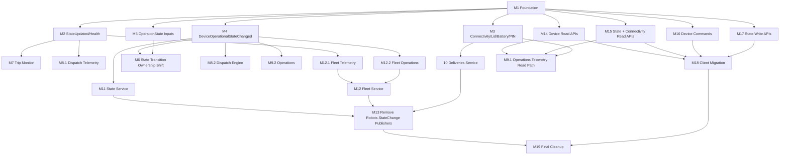

Design: [Device API Redesign [WIP]](https://www.notion.so/Device-API-Redesign-WIP-2e786fd0dcab8102a3f2fff97a772420?pvs=21)

**Note:** The plan and the design are **not aligned** and this is intentional. The design lays out all the things we want to change, regardless of the sequencing. This plan tries to be pragmatic about what can be changed without re-writing an unreasonable amount of code.

---

# Summary of Changes Covered

This plan covers:

- Building a new Device to ingest GreenGrass/DriveU/AWS IoT signals and publish normalized `Device.*` events.
- Provide a gRPC interface to expose all device-related state, and migrating all usages to the gRPC API.
- Provide a gRPC interface to handle all device-related operations such as writing to the device shadow, commands, and migrating all usages to the gRPC API.
- Simplifying the dependencies (for both events and API calls) to retrieve device-related data directly from the Device Service’s events and RPC endpoints.

## Out of scope

- Fleet API: Methods to retrieve data which combines the Device data with other systems’ data (trips, deployments, maintenance) is not included in this project.

## Decisions

- **Decision:** Replace `Robots.StateChange` with `Operations.DeviceOperationalStateChanged` (payload only: **fields with active consumers** — `hasFood`, `operationState`, `needsMaintenance`, `undergoingMaintenance`). 
  **Rationale:** Robots.StateChange houses the `OperationState` enum, which is hard to clean up (see [The tendrils of Operation State](https://www.notion.so/The-tendrils-of-Operation-State-2e886fd0dcab80558a23dcd99de253e6?pvs=21) for reference).
- **Decision:** Remove Operations’ ephemeral cache in favor of direct Device Service reads for telemetry/health/connectivity. 
  **Rationale:** Operations' ephemeral robot state is exposed through the HTTP API endpoint, which itself is consumed by Mission Control and MRO, and is used to determine [`robot readiness`](https://github.com/cocorobotics/delivery-platform/blob/ea850fcf2f5087c6f5c4c4dc93db1a05ad172636/service/operations/src/modules/robots/services/robots.service.ts#L700).
- **Decision:** Publish `Device.StateUpdated` (full device snapshots) instead of Heartbeats.
  **Rationale:** There are a few parts of the system that need to have an up-to-date snapshot of the device (Fleet, Dispatch), and having different types of events updating (overlapping) parts of the overall device snapshot makes it difficult to ensure that all of the different components are working with the same state. By having the Device Service publish all updates in the same stream, we eliminate the need for adding conflict resolution for every consumer.

## StateChangeEvent Field Usage

During planning, we audited the `StateChangeEvent` payload to identify how each field is consumed today. The table below lists **all fields**, where they are **written**, how they are **used**, and the keep/drop decision.

|Field|Writes|Usage|Decision|Explanation|
|---|---|---|---|---|
|`serial`|All publishers include it (e.g., [state transition subscriber](https://github.com/cocorobotics/delivery-platform/blob/a287c94475fb4da04a95a290db47794a083dd121/service/state/src/state/state-machine/listeners/state-transition.subscriber.ts#L66-L79)).|Key for persistence and routing in [Operations updateRobotState](https://github.com/cocorobotics/delivery-platform/blob/a287c94475fb4da04a95a290db47794a083dd121/service/operations/src/modules/robots/services/robots.service.ts#L594-L626) and Fleet legacy archive keys ([fleet consumer](https://github.com/cocorobotics/coco-services/blob/a287c94475fb4da04a95a290db47794a083dd121/fleet/internal/consumer/legacy_robots_consumer/robots_state_change.go#L37-L44)).|Keep|—|
|`driveable`|No writers found in delivery-platform; only accepted by consumers (e.g., [Operations handler](https://github.com/cocorobotics/delivery-platform/blob/a287c94475fb4da04a95a290db47794a083dd121/service/operations/src/modules/robots/handlers/robot-state-change-handler.ts#L52-L66)).|No read logic found; only persisted in [RobotStateHistory](https://github.com/cocorobotics/delivery-platform/blob/a287c94475fb4da04a95a290db47794a083dd121/service/operations/src/modules/robots/services/robots.service.ts#L594-L626) and Dispatch Engine cache ([processRobotSupply](https://github.com/cocorobotics/delivery-platform/blob/a287c94475fb4da04a95a290db47794a083dd121/service/dispatch-engine/src/modules/supply/service/supply.service.ts#L451-L466)).|Drop|Not written and no consumer logic uses it.|
|`hasFood`|Set on robot load/unload by [robot provider load](https://github.com/cocorobotics/delivery-platform/blob/a287c94475fb4da04a95a290db47794a083dd121/service/deliveries/src/modules/providers/robot/robot.service.ts#L565-L572) and cleared on trip completion by [pilot trips publisher](https://github.com/cocorobotics/delivery-platform/blob/a287c94475fb4da04a95a290db47794a083dd121/service/operations/src/modules/trips/publishers/pilot-trips.publisher.ts#L137-L143).|Fleet updates `FleetRobot.HasFood` and uses it to create empty-bot tasks on canceled deliveries ([legacy consumer](https://github.com/cocorobotics/coco-services/blob/a287c94475fb4da04a95a290db47794a083dd121/fleet/internal/consumer/legacy_robots_consumer/robots_state_change.go#L275-L291), [trip_transitioned](https://github.com/cocorobotics/coco-services/blob/a287c94475fb4da04a95a290db47794a083dd121/fleet/internal/consumer/legacy_trips_consumer/trip_transitioned.go#L100-L119)).|Keep|—|
|`location`|No `Robots.StateChange` publisher sets this field; only handled when present by [Fleet legacy consumer](https://github.com/cocorobotics/coco-services/blob/a287c94475fb4da04a95a290db47794a083dd121/fleet/internal/consumer/legacy_robots_consumer/robots_state_change.go#L52-L55).|Archived into `FleetLegacyRobotUpdate` when present (no downstream reads found).|Drop|Not populated by current publishers and only archived.|
|`locationId`|No `Robots.StateChange` publisher sets this field; only handled when present by [Fleet legacy consumer](https://github.com/cocorobotics/coco-services/blob/a287c94475fb4da04a95a290db47794a083dd121/fleet/internal/consumer/legacy_robots_consumer/robots_state_change.go#L52-L55).|Archived into `FleetLegacyRobotUpdate` when present (no downstream reads found).|Drop|Not populated by current publishers and only archived.|
|`operationState`|Published by the [state transition subscriber](https://github.com/cocorobotics/delivery-platform/blob/a287c94475fb4da04a95a290db47794a083dd121/service/state/src/state/state-machine/listeners/state-transition.subscriber.ts#L66-L79) and [pilot trip events](https://github.com/cocorobotics/delivery-platform/blob/a287c94475fb4da04a95a290db47794a083dd121/service/operations/src/modules/trips/publishers/pilot-trips.publisher.ts#L137-L143).|Stored in Operations history and returned via the robot status endpoint ([updateRobotState](https://github.com/cocorobotics/delivery-platform/blob/a287c94475fb4da04a95a290db47794a083dd121/service/operations/src/modules/robots/services/robots.service.ts#L594-L626), [getRobotStatus](https://github.com/cocorobotics/delivery-platform/blob/a287c94475fb4da04a95a290db47794a083dd121/service/operations/src/modules/robots/controllers/robots.controller.ts#L200-L203)).|Keep|—|
|`needsMaintenance`|Published by [state transitions](https://github.com/cocorobotics/delivery-platform/blob/a287c94475fb4da04a95a290db47794a083dd121/service/state/src/state/state-machine/listeners/state-transition.subscriber.ts#L66-L79) and [FO tasks](https://github.com/cocorobotics/delivery-platform/blob/a287c94475fb4da04a95a290db47794a083dd121/service/operations/src/modules/fo-tasks/fo-tasks.service.ts#L161-L180).|Blocks deploy/readiness in Ops ([fleet deploy gate](https://github.com/cocorobotics/delivery-platform/blob/a287c94475fb4da04a95a290db47794a083dd121/service/operations/src/modules/fleet-management/services/robot-fleet-management.service.ts#L139-L142), [readiness check](https://github.com/cocorobotics/delivery-platform/blob/a287c94475fb4da04a95a290db47794a083dd121/service/operations/src/modules/robots/services/robots.service.ts#L733-L740)), filters usable robots in Dispatch Engine ([usability check](https://github.com/cocorobotics/delivery-platform/blob/a287c94475fb4da04a95a290db47794a083dd121/service/dispatch-engine/src/modules/supply/service/supply.service.ts#L170-L176)), and affects Fleet dispatchability ([FleetRobot.Dispatchable](https://github.com/cocorobotics/coco-services/blob/a287c94475fb4da04a95a290db47794a083dd121/fleet/internal/entities/fleet_robot.go#L78-L88)).|Keep|—|
|`needsPickup`|Set by [FO tasks](https://github.com/cocorobotics/delivery-platform/blob/a287c94475fb4da04a95a290db47794a083dd121/service/operations/src/modules/fo-tasks/fo-tasks.service.ts#L161-L180).|No read logic found; only stored in Ops history and Dispatch Engine cache ([updateRobotState](https://github.com/cocorobotics/delivery-platform/blob/a287c94475fb4da04a95a290db47794a083dd121/service/operations/src/modules/robots/services/robots.service.ts#L594-L626), [processRobotSupply](https://github.com/cocorobotics/delivery-platform/blob/a287c94475fb4da04a95a290db47794a083dd121/service/dispatch-engine/src/modules/supply/service/supply.service.ts#L451-L466)).|Drop|Not used by any consumer logic; remove from `Operations.DeviceOperationalStateChanged`.|
|`needsMovement`|Set on trip activation by [pilot trips service](https://github.com/cocorobotics/delivery-platform/blob/a287c94475fb4da04a95a290db47794a083dd121/service/operations/src/modules/trips/services/pilot-trips.service.ts#L237-L243) and robot load by [robot provider load](https://github.com/cocorobotics/delivery-platform/blob/a287c94475fb4da04a95a290db47794a083dd121/service/deliveries/src/modules/providers/robot/robot.service.ts#L565-L572).|No read logic found; only stored in Ops history and Dispatch Engine cache ([updateRobotState](https://github.com/cocorobotics/delivery-platform/blob/a287c94475fb4da04a95a290db47794a083dd121/service/operations/src/modules/robots/services/robots.service.ts#L594-L626), [processRobotSupply](https://github.com/cocorobotics/delivery-platform/blob/a287c94475fb4da04a95a290db47794a083dd121/service/dispatch-engine/src/modules/supply/service/supply.service.ts#L451-L466)).|Drop|Not used by any consumer logic; remove from `Operations.DeviceOperationalStateChanged`.|
|`tripType`|Set by [pilot trips publisher](https://github.com/cocorobotics/delivery-platform/blob/a287c94475fb4da04a95a290db47794a083dd121/service/operations/src/modules/trips/publishers/pilot-trips.publisher.ts#L137-L143) and [robot provider load](https://github.com/cocorobotics/delivery-platform/blob/a287c94475fb4da04a95a290db47794a083dd121/service/deliveries/src/modules/providers/robot/robot.service.ts#L565-L572).|No read logic found; only stored in Ops history and Dispatch Engine cache ([updateRobotState](https://github.com/cocorobotics/delivery-platform/blob/a287c94475fb4da04a95a290db47794a083dd121/service/operations/src/modules/robots/services/robots.service.ts#L594-L626), [processRobotSupply](https://github.com/cocorobotics/delivery-platform/blob/a287c94475fb4da04a95a290db47794a083dd121/service/dispatch-engine/src/modules/supply/service/supply.service.ts#L451-L466)).|Drop|Trip semantics already flow through Trips/Attempts; no consumer reads this field.|
|`attemptCancellationReason`|Set by [FO requests service](https://github.com/cocorobotics/delivery-platform/blob/a287c94475fb4da04a95a290db47794a083dd121/service/operations/src/modules/fo-requests/fo-requests.service.ts#L152-L156).|No read logic found; only stored in Ops history and Dispatch Engine cache ([updateRobotState](https://github.com/cocorobotics/delivery-platform/blob/a287c94475fb4da04a95a290db47794a083dd121/service/operations/src/modules/robots/services/robots.service.ts#L594-L626), [processRobotSupply](https://github.com/cocorobotics/delivery-platform/blob/a287c94475fb4da04a95a290db47794a083dd121/service/dispatch-engine/src/modules/supply/service/supply.service.ts#L451-L466)).|Drop|Cancellation handling uses DB state plus `TripRescueRequired`/`TripUnrecoverable` events.|
|`undergoingMaintenance`|Set/cleared by [FO tasks](https://github.com/cocorobotics/delivery-platform/blob/a287c94475fb4da04a95a290db47794a083dd121/service/operations/src/modules/fo-tasks/fo-tasks.service.ts#L310-L316) and cleared on grounding changes by the [state transition subscriber](https://github.com/cocorobotics/delivery-platform/blob/a287c94475fb4da04a95a290db47794a083dd121/service/state/src/state/state-machine/listeners/state-transition.subscriber.ts#L71-L77).|Blocks deploy/readiness in Ops ([fleet deploy gate](https://github.com/cocorobotics/delivery-platform/blob/a287c94475fb4da04a95a290db47794a083dd121/service/operations/src/modules/fleet-management/services/robot-fleet-management.service.ts#L139-L142), [readiness check](https://github.com/cocorobotics/delivery-platform/blob/a287c94475fb4da04a95a290db47794a083dd121/service/operations/src/modules/robots/services/robots.service.ts#L733-L736)) and gates Dispatch Engine activation ([isRobotActivatable](https://github.com/cocorobotics/delivery-platform/blob/a287c94475fb4da04a95a290db47794a083dd121/service/dispatch-engine/src/modules/supply/service/supply.service.ts#L262-L265)).|Keep|—|

These decisions drive which fields we carry forward in `Device.StateUpdated` and `Operations.DeviceOperationalStateChanged` after `Robots.StateChange` is removed.

## Unused Events Analysis

The following events were analyzed and found to have **no consumers**:

|Event|Finding|Details|
|---|---|---|
|`IoT.HealthStateChanged`|**No consumers**|Published by State Service with the same payload as `IoT.Heartbeat` but routed by health status (`{serial}.{healthy|
|`Robots.State`|**Deprecated**|Full robot state snapshot republished by Dispatch Engine for Fleet Service. Will be replaced by `Device.StateUpdated` + `Operations.DeviceOperationalStateChanged`. See M11 for explicit deletion.|

# Outcome

By the end of this implementation plan, we will have:

- A fully implemented Device Service (not including any fleet-related functionality)
- Restricted delivery-platform dependencies to rely on Device.* events
- Operations will become the source of truth for operationState (currently also owned by State)
- Replaced `Robots.StateChange` with `Operations.DeviceOperationalStateChanged`, and removed `IoT.Heartbeat` after migration

---

# Methodology

This plan follows an incremental approach:

1. **Publish first** - Start publishing new events alongside old ones
2. **Migrate consumers** - Update consumers one-by-one to use new events
3. **Migrate APIs** - Move device-related endpoints to the new service
4. **Clean up** - Remove deprecated code after full migration

Each task should be:

- Small and focused (single PR per task where possible)
- Trackable via JIRA ticket
- Include TODO comments when we begin publishing a new event that overlaps an existing one (publisher cleanup tracking)
- Include a safety gate before switching an event source in production (shadow/metrics or feature flag)

Migration stance:

- Double publish when needed, but do not double subscribe
- Each consumer migration swaps the subscription in a single PR (old handler removed or unsubscribed - or use feature flags)
- Prefer shadow validation before switching event sources (new handler emits metrics/logs only)

Naming conventions:

- Exchange names use slash-delimited paths (e.g., `device/state-updated`, `device/driveu/connectivity-changed`)
- Routing keys use dot notation when structured; for DeviceEvents we keep routing keys as `{serial}` only

## Experiment Gating

Every change to consumers should be deployed using experiment/feature flags, such that we can easily revert a change if anything were to break.

### Experiment Metrics

To make experiment gating successful, we should ensure that the feature flags are added to all Datadog metrics to allow us to perform an A/B analysis and validate every change. Without these metrics, we’d need to do a 100% ramp, and do a before/after comparison, which is a lot riskier.

### Data Pipeline (AMQP → Data Lake)

The `data-pipeline` service consumes AMQP exchanges listed in the `EXCHANGES` env var and forwards them to Kinesis/S3. For every **new** exchange (including replacements), ensure:

- The exchange exists and is being published to in the target env.
- The exchange name (with env prefix, e.g., `prod/dispatch-engine/dispatch-update`) is added to `EXCHANGES` (semicolon-delimited).
- Track each new exchange added by this plan (e.g., `device.events`, `operations/device-operational-state-changed`) and verify ingestion in staging before disabling legacy streams.

### Device.StateUpdated (Temporary Stream)

`Device.StateUpdated` is a temporary, event-based stand-in for a future gRPC streaming API. It emits a **full device snapshot** and can be triggered by multiple upstream sources (IoT heartbeat, DriveU connectivity updates, or other state changes). The single-stream approach intentionally bundles health, connectivity, location, and other fields to reduce race conditions across multiple event streams.

---

# Milestones

## Milestone 1: Device Service Foundation

**Goal**: Set up the Device service within the existing TypeScript service so we can publish normalized events quickly.

### 1.1 Device Service (TypeScript) Scaffolding

- [ ] **M01-01**: Add AWS IoT SQS consumer in TypeScript
    - Configure SQS queue for IoT heartbeat messages (used to emit `Device.StateUpdated`)
    - Implement polling with backoff, visibility-timeout handling, and DLQ routing for poison messages
    - Add metrics/logging for lag, message age, processing time, error rate, and redrive counts
    - Persist normalized heartbeat payloads to Device storage before publishing events
- [ ] **M01-02**: Add DriveU webhook handler in TypeScript
    - HTTP endpoint for DriveU status callbacks
    - Authentication/validation middleware
    - Normalize and persist DriveU status updates in Device storage (source of truth for connectivity)
    - Emit updates that can trigger `Device.StateUpdated`

### 1.2 Data Layer

- [ ] **M01-03**: Define protobuf schemas for Device.* events
    - `Device.StateUpdated` (full snapshot; temporary stand-in for gRPC stream)
    - `Device.LidOpened` / `Device.LidClosed` / `Device.LidJammed`
    - `Device.EmergencyStop`
    - `Device.PinEntry`
    - `Device.CargoChanged` (deferred; requires device-reported cargo)
- [ ] **M01-04**: Set up device state storage
    - Redis-backed cache for device state to support Device Service read endpoints
    - Define schema for device snapshots
    - Implement get/set operations

---

## Milestone 2: Event Publishing - Device StateUpdated & Health

**Goal**: Start publishing `Device.StateUpdated` (full snapshot) and health-related events from the new service.

### 2.1 Device.StateUpdated

- [ ] **M02-01**: Implement state update parsing
    - Parse IoT heartbeat payload from SQS
    - Normalize to internal `Device` model
    - Handle schema versioning
- [ ] **M02-02**: Publish `Device.StateUpdated` event
    - Map internal model to protobuf
    - Publish to `device.events` exchange
    - Routing key: `{serial}`
    - Include `updated_fields` mask and `trigger_source` (heartbeat, DriveU, connectivity)
    - Publish on any upstream change that affects device state, including:
        - IoT heartbeat received
        - DriveU connectivity callback/status change
        - Connectivity state transitions (IoT/DriveU online/offline)
        - Component health changes if tracked outside heartbeat
    - Payload is a full device snapshot (location, battery, connectivity, component health, lid state, etc.)

### 2.2 Device Health Events

- [ ] **M02-03**: Implement component health tracking
    - Track previous component states per device
    - Detect state transitions (OK → FAULT, FAULT → OK)
    - Debounce rapid state changes (configurable threshold)
- [ ] **M02-04**: Publish `Device.HealthDegraded` event
    - Trigger on component status degradation
    - Include `component_name`, `status_code`, `fault_code`, `message`
    - Routing key: `{serial}`
- [ ] **M02-05**: Publish `Device.HealthRestored` event
    - Trigger on component recovery
    - Include `downtime_seconds`
    - Routing key: `{serial}`

---

## Milestone 3: Event Publishing - Connectivity & Lid Events

**Goal**: Ingest connectivity and publish lid-related events from the new service.

### 3.1 Connectivity Ingestion (No Event)

> Decision: We will not publish a connectivity change event. Device Service ingests IoT + DriveU connectivity signals, stores the latest connectivity state, and exposes RPCs for reads where needed.

- [ ] **M03-01**: Implement aggregated connectivity tracking in Device Service
    - Track online/offline transitions from both IoT heartbeats and DriveU webhooks
    - Compute overall connectivity status (online if any source is online)
    - Persist latest connectivity state per device
- [ ] **M03-02**: Expose connectivity read RPCs in Device Service
    - `GetRobotConnectivityOverall`
    - `ListRobotConnectivityHistory` (if historical view is required)

### 3.2 Lid Events

> Note: LidCycle.* events (LidCycle.Init, LidCycle.Complete, LidCycle.Timeout, LidCycle.Interrupt) are separate from Device.Lid* events and will remain untouched. LidCycle.* events track full lid cycle semantics with timing and reasons, while Device.Lid* events are point-in-time state changes from the device. Both serve different purposes and will coexist.

- [ ] **M03-03**: Parse lid state from heartbeat
    - Detect lid open/close transitions
    - Track lid open trigger (button, PIN, command, manual)
- [ ] **M03-04**: Publish `Device.LidOpened` event
    - Include `trigger`, `request_id` (if command-triggered)
    - Routing key: `{serial}`
- [ ] **TASK-019**: Publish `Device.LidClosed` event
    - Include `seconds_open`, `was_timeout`
    - Routing key: `{serial}`
- [ ] **M03-07**: Publish `Device.LidJammed` event
    - Trigger on lid mechanism fault
    - Include `fault_code`, `message`
    - Routing key: `{serial}`

### 3.3 Battery Events

- [ ] **M03-08**: Implement battery threshold tracking
    - Track battery level per device
    - Detect downward threshold crossings (20%, 5%)
    - Note: This mirrors current system behavior; future intent is to emit battery range events once range semantics are defined
- [ ] **M03-09**: Publish `Device.BatteryLow` event
    - Trigger at 20% threshold
    - Routing key: `{serial}`
    - Note: This is a stopgap; prefer range-based signals when available
- [ ] **M03-10**: Publish `Device.BatteryCritical` event
    - Trigger at 5% threshold
    - Routing key: `{serial}`
    - Note: This is a stopgap; prefer range-based signals when available

### 3.4 Pin Entry, Cargo & Emergency Stop Events

- [ ] **M03-11**: Publish `Device.PinEntry` event
    - Parse PIN entry from IoT messages
    - Routing key: `{serial}`
- [ ] **M03-12**: Defer `Device.CargoChanged` (requires device-reported cargo)
    - Keep `hasFood` as the legacy cargo signal in `Operations.DeviceOperationalStateChanged` for this migration
- [ ] **M03-13**: Publish `Device.EmergencyStop` event
    - Parse emergency stop from IoT messages
    - Include `source` (button, remote, system)
    - Routing key: `{serial}`

---

## Milestone 4: Robot State Events (History-Based)

**Goal**: Keep `robotStateHistory` as the source of truth in Operations while simplifying the robot state event payload.

### 4.1 Operations.DeviceOperationalStateChanged (Replacement for Robots.StateChange)

- [ ] **M04-01**: Publish `Operations.DeviceOperationalStateChanged` from Operations
    - _Definition of Done:_ Event is emitted based on `robotStateHistory` updates (or state transition events) in Operations.
    - Payload fields: `hasFood` (legacy), `operationState`, `needsMaintenance`, `undergoingMaintenance`
    - Routing key: `{serial}`
    - Double-publish with `Robots.StateChange` during migration; add TODOs for cleanup
    - Publish from the same Operations call sites that currently emit `Robots.StateChange`:
        - `robot-fleet-management.service.ts` (deploy/undeploy): [https://github.com/cocorobotics/delivery-platform/blob/32d08502ce026882ba65ce22062e5704399d0337/service/operations/src/modules/fleet-management/services/robot-fleet-management.service.ts](https://github.com/cocorobotics/delivery-platform/blob/32d08502ce026882ba65ce22062e5704399d0337/service/operations/src/modules/fleet-management/services/robot-fleet-management.service.ts)
        - `fo-requests.service.ts` (FO request creation): [https://github.com/cocorobotics/delivery-platform/blob/32d08502ce026882ba65ce22062e5704399d0337/service/operations/src/modules/fo-requests/fo-requests.service.ts](https://github.com/cocorobotics/delivery-platform/blob/32d08502ce026882ba65ce22062e5704399d0337/service/operations/src/modules/fo-requests/fo-requests.service.ts)
        - `fo-tasks.service.ts` (maintenance flags): [https://github.com/cocorobotics/delivery-platform/blob/32d08502ce026882ba65ce22062e5704399d0337/service/operations/src/modules/fo-tasks/fo-tasks.service.ts](https://github.com/cocorobotics/delivery-platform/blob/32d08502ce026882ba65ce22062e5704399d0337/service/operations/src/modules/fo-tasks/fo-tasks.service.ts)
        - `delivery.handlers.ts` (delivery termination): [https://github.com/cocorobotics/delivery-platform/blob/32d08502ce026882ba65ce22062e5704399d0337/service/operations/src/modules/fo-tasks/handlers/delivery.handlers.ts](https://github.com/cocorobotics/delivery-platform/blob/32d08502ce026882ba65ce22062e5704399d0337/service/operations/src/modules/fo-tasks/handlers/delivery.handlers.ts)
        - `pilot-trips.publisher.ts` (trip completion/cancel): [https://github.com/cocorobotics/delivery-platform/blob/32d08502ce026882ba65ce22062e5704399d0337/service/operations/src/modules/trips/publishers/pilot-trips.publisher.ts](https://github.com/cocorobotics/delivery-platform/blob/32d08502ce026882ba65ce22062e5704399d0337/service/operations/src/modules/trips/publishers/pilot-trips.publisher.ts)
        - `pilot-trips.repository.ts` (trip resumption): [https://github.com/cocorobotics/delivery-platform/blob/32d08502ce026882ba65ce22062e5704399d0337/service/operations/src/modules/trips/repositories/pilot-trips.repository.ts](https://github.com/cocorobotics/delivery-platform/blob/32d08502ce026882ba65ce22062e5704399d0337/service/operations/src/modules/trips/repositories/pilot-trips.repository.ts)
        - `pilot-trips.service.ts` (trip start): [https://github.com/cocorobotics/delivery-platform/blob/32d08502ce026882ba65ce22062e5704399d0337/service/operations/src/modules/trips/services/pilot-trips.service.ts](https://github.com/cocorobotics/delivery-platform/blob/32d08502ce026882ba65ce22062e5704399d0337/service/operations/src/modules/trips/services/pilot-trips.service.ts)
        - `robots.service.ts` (grounding): [https://github.com/cocorobotics/delivery-platform/blob/32d08502ce026882ba65ce22062e5704399d0337/service/operations/src/modules/robots/services/robots.service.ts](https://github.com/cocorobotics/delivery-platform/blob/32d08502ce026882ba65ce22062e5704399d0337/service/operations/src/modules/robots/services/robots.service.ts)
    - _Verification:_ Dispatch Engine and Operations handlers can consume the new payload with parity metrics

### ~~4.2 Deprecated: Service-Level State Events (Trip/Deployment/FoTask/Delivery)~~

~~Trip/Delivery/FoTask/Deployment events are no longer required because the simplified state-change event remains the primary signal. The tasks below are deprecated/unneeded.~~

- [ ] **~~TASK-025A**: Publish `TripEvents.Started` from Operations trip start flows~~ (deprecated)
- [ ] **~~TASK-025B**: Publish `TripEvents.Resumed` from Operations trip resume flows~~ (deprecated)
- [ ] **~~TASK-025C**: Publish `TripEvents.Cancelled` from Operations trip cancel flows~~ (deprecated)
- [ ] **~~TASK-025D**: Publish `TripEvents.Completed` from Operations trip complete flows~~ (deprecated)
- [ ] **~~TASK-025E**: Publish `DeploymentEvents.Deployed` and `DeploymentEvents.Undeployed`~~ (deprecated)
- [ ] **~~TASK-025F**: Publish `FoTaskEvents.Created` and `FoTaskEvents.Updated`~~ (deprecated)
- [ ] **~~TASK-025G**: Publish `DeliveryEvents.Loaded` and `DeliveryEvents.Unloaded`~~ (deprecated)

---

## Milestone 5: OperationState Derivation Inputs (Operations-Owned)

**Goal**: Define and implement the event inputs Operations must consume to keep `operationState` up-to-date after `Robots.StateChange` is removed.

**Matrix (source events → derived operationState):**

|Derived `operationState`|Source event(s) to consume|Primary owner|Notes|
|---|---|---|---|
|`ON_TRIP`|`Operations.TaskCreated` (JITP/RETURN/DEPLOYMENT)|Operations|Task creation triggers state transition to `ON_TRIP` today.|
|`ON_TRIP`|`Operations.TaskTransitioned` (DELIVERY → PENDING)|Operations|Delivery trip enters active lifecycle.|
|`PARKED`|`Operations.TaskTransitioned` (ANY trip → COMPLETED/CANCELLED)|Operations|Trip end returns robot to parked state.|
|`PARKED`|`Operations.DeploymentTripCompleted` or deployment completed/cancelled task|Operations|If deployments are modeled as tasks, use task transitions.|
|`OFF_DUTY`|`State.TransitionCompleted` (to OFF_DUTY)|State Service|Transition engine remains State for now.|
|`GROUNDED`|`State.TransitionCompleted` (to GROUNDED)|State Service|Grounding is driven by State transitions.|

> Note: State Service remains the transition engine for this migration phase (see Out of Scope / Future Phase). If Operations becomes the transition engine in a future phase, replace State.TransitionCompleted with Operations-issued transition events.

### 5.1 Subscriptions & Derivation Tasks

- [ ] **M05-01**: Subscribe to Operations trip/task lifecycle events for ON_TRIP/PARKED
    - `Operations.TaskCreated` (JITP/RETURN/DEPLOYMENT)
    - `Operations.TaskTransitioned` (DELIVERY → PENDING)
    - `Operations.TaskTransitioned` (ANY → COMPLETED/CANCELLED)
    - _Output:_ Update `robotStateHistory.operationState` (or publish `Operations.DeviceOperationalStateChanged`)
- [ ] **M05-02**: Subscribe to `State.TransitionCompleted` for GROUNDED/OFF_DUTY
    - Map `toState` → `operationState`
    - _Output:_ Update `robotStateHistory.operationState` (or publish `Operations.DeviceOperationalStateChanged`)
- [ ] **M05-03**: Replace Deliveries-driven `Robots.StateChange` with Operations-owned events
    - Use Deliveries domain events (e.g., Attempt/Provider transitions) to drive Operations trip/task state
    - Ensure `hasFood` is set via Operations update path (not Deliveries `Robots.StateChange`)
- [ ] **M05-04**: Add parity metrics for derived `operationState`
    - Compare derived `operationState` vs legacy `Robots.StateChange` during shadow mode
    - Alert on mismatch by serial + trip id

---

## Milestone 6: State Transition Ownership Shift

**Goal**: Keep State Service as the transition engine, but move state-change event publishing to Operations. State Service retains ownership of the state machine, transition validation, and `stateHistory` writes for this migration phase.

### 6.1 Stop State Service from Publishing Robots.StateChange

- [ ] **M06-01**: Disable `Robots.StateChange` publishing in State Service
    - Update `state-transition.subscriber.ts` to stop publishing `Robots.StateChange` (keep `State.TransitionCompleted`/`State.TransitionFailed`)
    - Ensure `robotStateHistory` writes remain intact during this phase
    - _Verification:_ State transitions still occur; no `Robots.StateChange` emitted from State

### 6.2 Operations Publishes DeviceOperationalStateChanged

- [ ] **M06-02**: Operations consumes `State.TransitionCompleted` and publishes `Operations.DeviceOperationalStateChanged`
    - Map the reduced payload from transition data + `robotStateHistory`
    - Continue double-publish with `Robots.StateChange` until consumers migrate
    - _Verification:_ Parity metrics match legacy `Robots.StateChange`

### 6.3 Prepare for Future State Service Changes

- [ ] **M06-03**: Move or duplicate `robotStateHistory` writes into Operations
    - Keep State Service writing history until Operations parity is verified
    - _Verification:_ History records match between State and Operations in shadow mode
- [ ] **M06-04**: Document State Service dependencies for future migration
    - Catalog remaining dependencies on `/state/:serial/request-transition` and state machine logic
    - State transition ownership migration is out of scope for this phase (see [Out of Scope / Future Phase](https://www.notion.so/Device-API-Implementation-Plan-2eb86fd0dcab8098a555c22d8980258f?pvs=21))

---

## Milestone 7: Consumer Migration - Trip Monitor

**Goal**: Migrate Trip Monitor to consume new Device.StateUpdated event.

### 7.1 Trip Monitor Updates

- [ ] **M07-01**: Replace IoT.Heartbeat subscription with `Device.StateUpdated`
    - Replace handler in `trip-monitor.handler.ts` (IoT.Heartbeat → Device.StateUpdated)
    - Permalink: [https://github.com/cocorobotics/delivery-platform/blob/32d08502ce026882ba65ce22062e5704399d0337/service/trip-monitor/src/modules/trip-monitor/trip-monitor.handler.ts#L19-L23](https://github.com/cocorobotics/delivery-platform/blob/32d08502ce026882ba65ce22062e5704399d0337/service/trip-monitor/src/modules/trip-monitor/trip-monitor.handler.ts#L19-L23)
    - Map `Device.StateUpdated` to existing `updateFromHeartbeat` interface
    - Add `updateFromDeviceHeartbeat` method (from PoC diff)
    - Movement detection is derived from `Device.StateUpdated`
    - Remove/unsubscribe the old IoT.Heartbeat handler in the same PR (no double subscribe)
- [ ] **TASK-027**: Add operation state derivation to Trip Monitor
    - Track deployment/trip state per serial
    - Implement `deriveOperationState` helper (from PoC diff)
    - Use `Operations.DeviceOperationalStateChanged` (or `robotStateHistory`) instead of Trip/Deployment events
- [ ] **M07-03**: Add TODO comment in IoT.Heartbeat publisher for deprecation cleanup
    - Add: `// TODO(JIRA-XXX): Remove IoT.Heartbeat publish after Device.StateUpdated migration verified`
    - Permalink: [https://github.com/cocorobotics/delivery-platform/blob/32d08502ce026882ba65ce22062e5704399d0337/service/state/src/iot-streamer/iot-streamer.service.ts#L574-L628](https://github.com/cocorobotics/delivery-platform/blob/32d08502ce026882ba65ce22062e5704399d0337/service/state/src/iot-streamer/iot-streamer.service.ts#L574-L628)

## Milestone 8: Consumer Migration - Dispatch Engine

**Goal**: Migrate Dispatch Engine to consume new events instead of `Robots.StateChange`.

### 8.1 Telemetry Migration (Device.StateUpdated)

- [ ] **M08-01**: Dispatch Engine telemetry → Device.StateUpdated
    - Replace `IoT.Heartbeat` subscription in `iot-heartbeat.handler.ts` with `Device.StateUpdated`
    - Ensure snapshot includes battery, health, connectivity, and location
    - _Definition of Done:_ Dispatch Engine uses `Device.StateUpdated` only; no IoT.Heartbeat dependency remains
    - _Verification:_ Metrics parity in shadow mode; manual validation that supply cache reflects battery/health/connectivity

### 8.2 Operations.DeviceOperationalStateChanged

- [ ] **M08-02**: Replace `Robots.StateChange` subscription with `Operations.DeviceOperationalStateChanged`
    - Replace handler in `robot-stage-change.handler.ts`
    - Permalink: [https://github.com/cocorobotics/delivery-platform/blob/32d08502ce026882ba65ce22062e5704399d0337/service/dispatch-engine/src/modules/eventsink/handlers/robot-stage-change.handler.ts#L1-L217](https://github.com/cocorobotics/delivery-platform/blob/32d08502ce026882ba65ce22062e5704399d0337/service/dispatch-engine/src/modules/eventsink/handlers/robot-stage-change.handler.ts#L1-L217)
    - Map fields: `operationState`, `needsMaintenance`, `undergoingMaintenance`, `hasFood`
    - Fields `tripType`, `attemptCancellationReason`, and `driveable` are unused and will not be in the new payload (see Unused Fields Analysis)
    - Safety: run in shadow mode first (metrics/logging only), compare counts vs legacy handler before switch
- [ ] **M08-03**: Add TODO comment in `Robots.StateChange` publisher(s) for cleanup
    - Add: `// TODO(JIRA-XXX): Remove Robots.StateChange publish after all Dispatch Engine consumers migrated`

---

## Milestone 9: Operations Telemetry Read Path Migration

**Goal**: Migrate Operations telemetry/readiness paths to Device Service RPCs (no cache).

### 9.1 Telemetry Read Path (Device Service RPCs)

- [ ] **M09-01**: Replace Operations read paths to call Device Service directly
    - `GET /robots`, `GET /robots/:serial/location`, readiness checks, and health reads should query Device Service RPCs
    - Require batched RPC usage for list endpoints (avoid N+1; use batch APIs)
    - Define RPC timeout policy + degradation behavior for slow/unavailable Device Service
    - Remove reliance on `RobotEphemeralDataService` for telemetry/health/connectivity
    - Replace `getEphemeralHealthInfo()` in readiness paths with Device API health (single-robot and batch variants)
    - Replace `getEphemeralState()` uses that only gate on `GROUNDED` by reading `robotStateHistory` (latest `operationState`)
    - Note: If readiness paths are latency-sensitive, consider **optional** `Device.StateUpdated` subscription in Operations as a fallback cache — but prefer Device API reads first
    - _Definition of Done:_ Operations read paths return Device Service-backed values with no Redis cache dependency
    - _Verification:_ Manual validation of location/battery/health/connectivity values in dev/staging
- [ ] **M09-02**: Remove Operations telemetry cache maintenance
    - Update call sites that currently read `RobotEphemeralDataService` (list, readiness, health, location)
    - Include `getRobotOperationalReadinessIssue()` and its call sites (loadable robots, deploy gating, open-lid checks), which read connectivity/health/state from the ephemeral cache
    - Remove `IoT.Heartbeat` and `Device.StateUpdated` handlers used solely for cache writes
    - Remove `State.ConnectivityOverallChanged` subscription in Operations
    - Remove `hydrateConnectivity()` cache priming
    - Remove `RobotEphemeralDataService` and related Redis keys once all callers are migrated
    - _Definition of Done:_ No event-driven cache updates remain in Operations for telemetry/connectivity/health

### 9.2 Operations.DeviceOperationalStateChanged

- [ ] **M09-03**: Replace `Robots.StateChange` subscription with `Operations.DeviceOperationalStateChanged`
    - Replace handler in `robot-state-change-handler.ts`
    - Permalink: [https://github.com/cocorobotics/delivery-platform/blob/32d08502ce026882ba65ce22062e5704399d0337/service/operations/src/modules/robots/handlers/robot-state-change-handler.ts#L52-L68](https://github.com/cocorobotics/delivery-platform/blob/32d08502ce026882ba65ce22062e5704399d0337/service/operations/src/modules/robots/handlers/robot-state-change-handler.ts#L52-L68)
    - Map fields: `operationState`, `needsMaintenance`, `undergoingMaintenance`, `hasFood`
    - Fields `tripType`, `attemptCancellationReason`, and `driveable` are unused and will not be in the new payload (see Unused Fields Analysis)
    - Remove/unsubscribe the old `Robots.StateChange` handler in the same PR
- [ ] **M09-04**: Add TODO comment in `Robots.StateChange` publisher(s) for cleanup
    - Add: `// TODO(JIRA-XXX): Remove Robots.StateChange publish after Operations consumers migrated`

---

## Milestone 10: Consumer Migration - Deliveries Service

**Goal**: Migrate Deliveries Service to consume new `Device.*` events for PIN entry and lid operations.

> Note: Deliveries Service consumes Robots.PinEntry, Robots.LidOpen, and Robots.LidClose for delivery flows. These should be replaced with the new Device.* equivalents published in Milestone 3.

### 10.1 PIN Entry Migration

- [ ] **M010-01**: Replace `Robots.PinEntry` subscription with `Device.PinEntry`
    - Replace handler in `deviceless.handler.ts`
    - Permalink: [https://github.com/cocorobotics/delivery-platform/blob/32d08502ce026882ba65ce22062e5704399d0337/service/deliveries/src/modules/deviceless/deviceless.handler.ts#L56-L63](https://github.com/cocorobotics/delivery-platform/blob/32d08502ce026882ba65ce22062e5704399d0337/service/deliveries/src/modules/deviceless/deviceless.handler.ts#L56-L63)
    - Map fields: `serial`, `requestId`, `expected`, `entered`, `lidOpened`, `timestamp`, `reason`
    - Remove/unsubscribe the old `Robots.PinEntry` handler in the same PR

### 10.2 Lid Events Migration

- [ ] **M010-02**: Replace `Robots.LidOpen` subscription with `Device.LidOpened`
    - Replace handler in `robot.handler.ts`
    - Permalink: [https://github.com/cocorobotics/delivery-platform/blob/32d08502ce026882ba65ce22062e5704399d0337/service/deliveries/src/modules/providers/robot/robot.handler.ts#L357-L368](https://github.com/cocorobotics/delivery-platform/blob/32d08502ce026882ba65ce22062e5704399d0337/service/deliveries/src/modules/providers/robot/robot.handler.ts#L357-L368)
    - Map fields from new event payload
    - Remove/unsubscribe the old `Robots.LidOpen` handler in the same PR
- [ ] **M010-03**: Replace `Robots.LidClose` subscription with `Device.LidClosed`
    - Replace handler in `robot.handler.ts`
    - Permalink: [https://github.com/cocorobotics/delivery-platform/blob/32d08502ce026882ba65ce22062e5704399d0337/service/deliveries/src/modules/providers/robot/robot.handler.ts#L371-L398](https://github.com/cocorobotics/delivery-platform/blob/32d08502ce026882ba65ce22062e5704399d0337/service/deliveries/src/modules/providers/robot/robot.handler.ts#L371-L398)
    - Map fields: `serial`, `trigger`, `timestamp` → `serial`, `seconds_open`, `was_timeout`
    - Remove/unsubscribe the old `Robots.LidClose` handler in the same PR
- [ ] **M010-04**: Add TODO comments in legacy lid event publishers for cleanup
    - Add: `// TODO(JIRA-XXX): Remove Robots.LidOpen/LidClose publish after Deliveries consumers migrated`

---

## Milestone 11: Consumer Migration - State Service (→ Lid Service)

**Goal**: Migrate State Service off `Robots.StateChange`; use `Operations.DeviceOperationalStateChanged` only if maintenance flags are still required.

### 11.1 Operations.DeviceOperationalStateChanged (If Still Needed)

- [ ] **M11-01**: Replace `Robots.StateChange` subscription with `Operations.DeviceOperationalStateChanged`
    - Replace handler in `robot-state.handler.ts`
    - Permalink: [https://github.com/cocorobotics/delivery-platform/blob/32d08502ce026882ba65ce22062e5704399d0337/service/state/src/state/robot-state.handler.ts#L18-L29](https://github.com/cocorobotics/delivery-platform/blob/32d08502ce026882ba65ce22062e5704399d0337/service/state/src/state/robot-state.handler.ts#L18-L29)
    - Update `needsMaintenance` shadow from the reduced payload; do not rely on event payloads for other fields
    - Remove/unsubscribe the old `Robots.StateChange` handler in the same PR
- [ ] **M11-02**: Drop direct event-driven maintenance updates if they are no longer required
    - Same handler file/permalink as above
    - If maintenance is derived elsewhere, remove event handlers entirely
- [ ] **M11-03**: Add TODO comment in `Robots.StateChange` publisher(s) for cleanup
    - Add: `// TODO(JIRA-XXX): Remove Robots.StateChange publish after State Service consumers migrated`

---

## Milestone 12: Consumer Migration - Fleet Service (Go)

**Goal**: Migrate Fleet Service (`coco-services/fleet`) to consume new events instead of `Robots.StateChange` and `IoT.Heartbeat`.

> Note: Fleet Service is an external Go service in the coco-services repository. It currently consumes Robots.StateChange, Robots.Deployment, and Robots.State to maintain robot state in DynamoDB.

### 12.1 Telemetry Migration (Device.StateUpdated)

- [ ] **M12-01**: Fleet Service telemetry → Device.StateUpdated
    - Subscribe to `Device.StateUpdated` for location, battery, health, and connectivity data
    - Update DynamoDB writes to use new payload structure
    - Code reference: [robots_state_change.go](https://github.com/cocorobotics/coco-services/blob/master/fleet/internal/consumer/legacy_robots_consumer/robots_state_change.go)
    - _Definition of Done:_ Fleet Service receives location/telemetry from `Device.StateUpdated`
    - _Verification:_ DynamoDB records show correct location data; metrics parity with legacy handler

### 12.2 Operations.DeviceOperationalStateChanged

- [ ] **M12-02**: Replace `Robots.StateChange` subscription with `Operations.DeviceOperationalStateChanged`
    - Subscribe to `Operations.DeviceOperationalStateChanged` for operational state fields
    - Map fields: `operationState`, `needsMaintenance`, `undergoingMaintenance`, `hasFood`
    - Fields `tripType`, `attemptCancellationReason`, and `driveable` are unused and will not be in the new payload (see Unused Fields Analysis)
    - Code reference: [robots_state_change.go](https://github.com/cocorobotics/coco-services/blob/master/fleet/internal/consumer/legacy_robots_consumer/robots_state_change.go)
    - _Definition of Done:_ Fleet Service uses new event for operational state
    - _Verification:_ DynamoDB `fleet-robots` table shows correct operational state; no regression in downstream queries

### 12.3 Robots.Deployment (Keep As-Is)

- [ ] **M12-03**: Verify `Robots.Deployment` subscription still works
    - Fleet Service should continue consuming `Robots.Deployment` for deployment location context
    - No changes needed unless `Robots.Deployment` is deprecated later
    - Code reference: [robots_deployment.go](https://github.com/cocorobotics/coco-services/blob/master/fleet/internal/consumer/legacy_robots_consumer/robots_deployment.go)

### 12.4 Cleanup Legacy Handlers

- [ ] **M12-04**: Remove `Robots.StateChange` handler from Fleet Service
    - After migration verified, remove legacy handler
    - Code reference: [robots_state_change.go](https://github.com/cocorobotics/coco-services/blob/master/fleet/internal/consumer/legacy_robots_consumer/robots_state_change.go)
- [ ] **M12-05**: Remove `Robots.State` handler and publisher
    - `Robots.State` is a full robot snapshot republished by Dispatch Engine for Fleet Service
    - **This event is deprecated** and will be deleted—replaced by `Device.StateUpdated` (telemetry) + `Operations.DeviceOperationalStateChanged` (operational state)
    - Remove handler from Fleet Service: [robots_state.go](https://github.com/cocorobotics/coco-services/blob/master/fleet/internal/consumer/legacy_robots_consumer/robots_state.go)
    - Remove publisher from Dispatch Engine: [amqp-publisher.service.ts](https://github.com/cocorobotics/delivery-platform/blob/32d08502ce026882ba65ce22062e5704399d0337/service/dispatch-engine/src/shared/amqp-publisher.service.ts#L65-L69)

---

## Milestone 13: Publisher Migration - Remove Robots.StateChange Publishers

**Goal**: Remove `publishRobotStateUpdated` calls from all services now that consumers use `Operations.DeviceOperationalStateChanged`.

### 13.1 Operations Service Cleanup

- [ ] **M13-01**: Remove `publishRobotStateUpdated` from `robot-fleet-management.service.ts`
    - Undeployment no longer needs to publish state change
    - Deployment no longer needs to publish state change
    - Permalink: [https://github.com/cocorobotics/delivery-platform/blob/32d08502ce026882ba65ce22062e5704399d0337/service/operations/src/modules/fleet-management/services/robot-fleet-management.service.ts](https://github.com/cocorobotics/delivery-platform/blob/32d08502ce026882ba65ce22062e5704399d0337/service/operations/src/modules/fleet-management/services/robot-fleet-management.service.ts)
- [ ] **M13-02**: Remove `publishRobotStateUpdated` from `fo-requests.service.ts`
    - FO request creation no longer needs to publish state change
    - Permalink: [https://github.com/cocorobotics/delivery-platform/blob/32d08502ce026882ba65ce22062e5704399d0337/service/operations/src/modules/fo-requests/fo-requests.service.ts](https://github.com/cocorobotics/delivery-platform/blob/32d08502ce026882ba65ce22062e5704399d0337/service/operations/src/modules/fo-requests/fo-requests.service.ts)
- [ ] **TASK-051**: Remove `publishRobotStateUpdated` from `fo-tasks.service.ts`
    - Task creation/completion no longer needs to publish state change
    - Permalink: [https://github.com/cocorobotics/delivery-platform/blob/32d08502ce026882ba65ce22062e5704399d0337/service/operations/src/modules/fo-tasks/fo-tasks.service.ts](https://github.com/cocorobotics/delivery-platform/blob/32d08502ce026882ba65ce22062e5704399d0337/service/operations/src/modules/fo-tasks/fo-tasks.service.ts)
- [ ] **M13-04**: Remove `publishRobotStateUpdated` from `delivery.handlers.ts`
    - Delivery termination no longer needs to publish state change
    - Permalink: [https://github.com/cocorobotics/delivery-platform/blob/32d08502ce026882ba65ce22062e5704399d0337/service/operations/src/modules/fo-tasks/handlers/delivery.handlers.ts](https://github.com/cocorobotics/delivery-platform/blob/32d08502ce026882ba65ce22062e5704399d0337/service/operations/src/modules/fo-tasks/handlers/delivery.handlers.ts)
- [ ] **TASK-053**: Remove `publishRobotStateUpdated` from `pilot-trips.publisher.ts`
    - Trip completion/cancellation no longer rely on robot state events; use `robotStateHistory`
    - Permalink: [https://github.com/cocorobotics/delivery-platform/blob/32d08502ce026882ba65ce22062e5704399d0337/service/operations/src/modules/trips/publishers/pilot-trips.publisher.ts](https://github.com/cocorobotics/delivery-platform/blob/32d08502ce026882ba65ce22062e5704399d0337/service/operations/src/modules/trips/publishers/pilot-trips.publisher.ts)
- [ ] **M13-05**: Remove `publishRobotStateUpdated` from `pilot-trips.repository.ts`
    - Trip resumption no longer relies on robot state events; use `robotStateHistory`
    - Permalink: [https://github.com/cocorobotics/delivery-platform/blob/32d08502ce026882ba65ce22062e5704399d0337/service/operations/src/modules/trips/repositories/pilot-trips.repository.ts](https://github.com/cocorobotics/delivery-platform/blob/32d08502ce026882ba65ce22062e5704399d0337/service/operations/src/modules/trips/repositories/pilot-trips.repository.ts)
- [ ] **M13-06**: Remove `publishRobotStateUpdated` from `pilot-trips.service.ts`
    - Trip start no longer relies on robot state events; use `robotStateHistory`
    - Permalink: [https://github.com/cocorobotics/delivery-platform/blob/32d08502ce026882ba65ce22062e5704399d0337/service/operations/src/modules/trips/services/pilot-trips.service.ts](https://github.com/cocorobotics/delivery-platform/blob/32d08502ce026882ba65ce22062e5704399d0337/service/operations/src/modules/trips/services/pilot-trips.service.ts)
- [ ] **M13-07**: Remove `publishRobotStateUpdated` from `robots.service.ts`
    - Grounding robot no longer needs separate state change publish
    - Permalink: [https://github.com/cocorobotics/delivery-platform/blob/32d08502ce026882ba65ce22062e5704399d0337/service/operations/src/modules/robots/services/robots.service.ts](https://github.com/cocorobotics/delivery-platform/blob/32d08502ce026882ba65ce22062e5704399d0337/service/operations/src/modules/robots/services/robots.service.ts)

### 13.2 Deliveries Service Cleanup

- [ ] **M13-08**: Remove `publishRobotStateUpdated` from `robot.service.ts`
    - Loading robot no longer relies on robot state events; use Deliveries.AttemptTransitioned/ProviderUpdated + APIs
    - Permalink: [https://github.com/cocorobotics/delivery-platform/blob/32d08502ce026882ba65ce22062e5704399d0337/service/deliveries/src/modules/providers/robot/robot.service.ts](https://github.com/cocorobotics/delivery-platform/blob/32d08502ce026882ba65ce22062e5704399d0337/service/deliveries/src/modules/providers/robot/robot.service.ts)
- [ ] **M13-09**: Remove `publishRobotStateUpdated` from `delivery.service.ts`
    - Rescue attempt failure no longer relies on robot state events; use Deliveries.AttemptTransitioned/ProviderUpdated + APIs
    - Permalink: [https://github.com/cocorobotics/delivery-platform/blob/32d08502ce026882ba65ce22062e5704399d0337/service/deliveries/src/modules/delivery/service/delivery.service.ts](https://github.com/cocorobotics/delivery-platform/blob/32d08502ce026882ba65ce22062e5704399d0337/service/deliveries/src/modules/delivery/service/delivery.service.ts)
- [ ] **M13-10**: Remove `publishRobotStateUpdated` method from `amqp-publisher.service.ts`
    - Permalink: [https://github.com/cocorobotics/delivery-platform/blob/32d08502ce026882ba65ce22062e5704399d0337/service/deliveries/src/shared/amqp-publisher.service.ts](https://github.com/cocorobotics/delivery-platform/blob/32d08502ce026882ba65ce22062e5704399d0337/service/deliveries/src/shared/amqp-publisher.service.ts)

### 13.3 State Service Cleanup

- [ ] **M13-11**: Remove `publishRobotStateUpdated` from `state-transition.subscriber.ts`
    - State transitions no longer need to publish Robots.StateChange
    - Permalink: [https://github.com/cocorobotics/delivery-platform/blob/32d08502ce026882ba65ce22062e5704399d0337/service/state/src/state/state-machine/listeners/state-transition.subscriber.ts](https://github.com/cocorobotics/delivery-platform/blob/32d08502ce026882ba65ce22062e5704399d0337/service/state/src/state/state-machine/listeners/state-transition.subscriber.ts)
- [ ] **M13-12**: Remove `publishRobotStateUpdated` method from `publisher.service.ts`
    - Permalink: [https://github.com/cocorobotics/delivery-platform/blob/32d08502ce026882ba65ce22062e5704399d0337/service/state/src/publisher/services/publisher.service.ts](https://github.com/cocorobotics/delivery-platform/blob/32d08502ce026882ba65ce22062e5704399d0337/service/state/src/publisher/services/publisher.service.ts)
- [ ] **M13-13**: Remove `PublisherService` dependency from `state-transition.service.ts`
    - Permalink: [https://github.com/cocorobotics/delivery-platform/blob/32d08502ce026882ba65ce22062e5704399d0337/service/state/src/state/state-transition.service.ts](https://github.com/cocorobotics/delivery-platform/blob/32d08502ce026882ba65ce22062e5704399d0337/service/state/src/state/state-transition.service.ts)

### 13.4 Operations Service Publisher Cleanup

- [ ] **M13-14**: Remove `publishRobotStateUpdated` method from Operations `publisher.service.ts`
    - Permalink: [https://github.com/cocorobotics/delivery-platform/blob/32d08502ce026882ba65ce22062e5704399d0337/service/operations/src/modules/publisher/services/publisher.service.ts](https://github.com/cocorobotics/delivery-platform/blob/32d08502ce026882ba65ce22062e5704399d0337/service/operations/src/modules/publisher/services/publisher.service.ts)

---

## Milestone 14: API Migration - Device Read gRPC Endpoints

**Goal**: Move device-related read endpoints to gRPC in the new Device service.

### 14.1 Device Info Endpoints (gRPC)

- [ ] **M14-01**: Implement `ListDevices` gRPC in Device
    - List devices with filtering
    - Data from device registry + cache
- [ ] **M14-02**: Implement `GetDevice` gRPC in Device
    - Single device details
    - Combine registry + latest state
- [ ] **M14-03**: Implement `BatchGetDeviceGps` gRPC in Device
    - Batch GPS locations from cache
- [ ] **M14-04**: Implement `GetLatestDeviceStates` gRPC in Device
    - Latest device states from cache

### 14.2 Heartbeat History Endpoints (gRPC)

- [ ] **M14-05**: Implement `ListDeviceHeartbeatHistory` gRPC in Device
    - Query historical heartbeat data
    - Support time range filtering
- [ ] **M14-06**: Implement `GetLatestDeviceHeartbeat` gRPC in Device
    - Latest heartbeat per device

### 14.3 Command History Endpoints (gRPC)

- [ ] **M14-07**: Implement `ListDeviceCommandResponses` gRPC in Device
    - Recent command responses
- [ ] **M14-08**: Implement `ListDeviceCommandRequests` gRPC in Device
    - Recent command requests
- [ ] **M14-09**: Implement `GetDeviceCommandResponse` gRPC in Device
    - Lookup by request ID

---

## Milestone 15: API Migration - State & Connectivity Read Endpoints

**Goal**: Keep operational state reads in Operations while moving device/state history and connectivity reads to Device Service.

### 15.1 Operations Operational State (HTTP or gRPC)

- [ ] **M15-01**: Add Operations endpoint to read derived operational state (if needed)
    - Current robot operational state
    - Derived from deployment + trip + issues (Operations-owned)

### 15.2 State History Endpoints (Device Service)

- [ ] **M15-02**: Implement `ListRobotStateHistory` gRPC in Device
    - State history query
    - Migrate from State Service

### 15.3 Connectivity Endpoints (Device Service)

- [ ] **M15-03**: Implement `GetRobotConnectivityOverall` gRPC in Device
    - Aggregated connectivity status
    - From DriveU + IoT sources
- [ ] **M15-04**: Implement `ListRobotConnectivityHistory` gRPC in Device
    - Connectivity history query

---

## Milestone 16: API Migration - Device Command gRPC Endpoints

**Goal**: Move device command endpoints to the new Device gRPC service.

### 16.1 Lid Commands (gRPC)

- [ ] **M16-01**: Implement `SendLidCommand` gRPC in Device
    - Direct lid command to device
    - Write to IoT shadow
- [ ] **M16-02**: Implement `SendLidCommandWithContext` gRPC in Device
    - Synchronous lid command with state context
    - Support PIN flow integration

### 16.2 Reset Commands (gRPC)

- [ ] **M16-03**: Implement `SendSoftReset` gRPC in Device
- [ ] **M16-04**: Implement `SendHardReset` gRPC in Device
- [ ] **M16-05**: Implement `SendModemReset` gRPC in Device
- [ ] **M16-06**: Implement `SendSwitchSimBackup` gRPC in Device
- [ ] **M16-07**: Implement `SendResetGps` gRPC in Device

### 16.3 Other Commands (gRPC)

- [ ] **M16-08**: Implement `SendLightsCommand` gRPC in Device
- [ ] **M16-09**: Implement `SignalLoadFailure` gRPC in Device
- [ ] **M16-10**: Implement `SendDoordashVerifyFailure` gRPC in Device
- [ ] **M16-11**: Implement `StartWebRtcAuth` gRPC in Device

---

## Milestone 17: API Migration - State Service Write gRPC Endpoints

**Goal**: Move state transition and PIN-related endpoints to Device gRPC.

### 17.1 State Transition (gRPC)

- [ ] **M17-01**: Implement `RequestRobotStateTransition` gRPC in Device
    - Device API acts as a proxy to State Service's transition engine
    - State Service remains the owner of transition validation (graph, guards, state machine logic)
    - Device API forwards requests to State Service's `/state/:serial/request-transition` endpoint
    - _Rationale:_ Single entry point for device operations while preserving State's transition ownership

### 17.2 PIN & Route Endpoints (gRPC)

- [ ] **M17-02**: Implement `SetUnlockPin` gRPC in Device
    - Temporary PIN for pickup flows
- [ ] **M17-03**: Implement `RemoveUnlockPin` gRPC in Device
    - Clear temporary PIN
- [ ] **M17-04**: Implement `SetRouteId` gRPC in Device
    - Associate robot with route

### 17.3 Shadow Write Endpoints (gRPC)

- [ ] **M17-05**: Implement `UpdateDeviceShadow` gRPC in Device
    - Write to the device's `status` named shadow in AWS IoT
    - Supports fields: `operation_state`, `dp_needs_maintenance`, `pin_unlock`, `route_id`
    - Also updates IoT thing `state` attribute for indexing (when `operation_state` is set)
    - Consolidates all shadow write operations behind Device API
    - Permalink (current shadow writes): [state.service.ts](https://github.com/cocorobotics/delivery-platform/blob/32d08502ce026882ba65ce22062e5704399d0337/service/state/src/state/state.service.ts#L210-L320)

---

## Milestone 18: Client Migration

**Goal**: Update all clients to use new Device gRPC endpoints (via internal client or API).

### 18.1 MRO Web

- [ ] **M18-01**: Update MRO to use Device for device endpoints
    - `useRobotsList.ts` (Permalink: [https://github.com/cocorobotics/delivery-platform/blob/32d08502ce026882ba65ce22062e5704399d0337/web/mro/src/features/device/modules/robots/api/useRobotsList.ts](https://github.com/cocorobotics/delivery-platform/blob/32d08502ce026882ba65ce22062e5704399d0337/web/mro/src/features/device/modules/robots/api/useRobotsList.ts))
    - `useRobotDetails.ts` (Permalink: [https://github.com/cocorobotics/delivery-platform/blob/32d08502ce026882ba65ce22062e5704399d0337/web/mro/src/features/device/modules/robots/api/useRobotDetails.ts](https://github.com/cocorobotics/delivery-platform/blob/32d08502ce026882ba65ce22062e5704399d0337/web/mro/src/features/device/modules/robots/api/useRobotDetails.ts))
    - `useRobotGeolocation.ts` (Permalink: [https://github.com/cocorobotics/delivery-platform/blob/32d08502ce026882ba65ce22062e5704399d0337/web/mro/src/features/device/modules/robots/api/useRobotGeolocation.ts](https://github.com/cocorobotics/delivery-platform/blob/32d08502ce026882ba65ce22062e5704399d0337/web/mro/src/features/device/modules/robots/api/useRobotGeolocation.ts))
    - `useRobotStateHistory.ts` (Permalink: [https://github.com/cocorobotics/delivery-platform/blob/32d08502ce026882ba65ce22062e5704399d0337/web/mro/src/features/device/modules/robots/api/state/useRobotStateHistory/useRobotStateHistory.ts](https://github.com/cocorobotics/delivery-platform/blob/32d08502ce026882ba65ce22062e5704399d0337/web/mro/src/features/device/modules/robots/api/state/useRobotStateHistory/useRobotStateHistory.ts))
    - `useRobotConnectivity.ts` (Permalink: [https://github.com/cocorobotics/delivery-platform/blob/32d08502ce026882ba65ce22062e5704399d0337/web/mro/src/features/device/modules/robots/api/state/useRobotConnectivity.ts](https://github.com/cocorobotics/delivery-platform/blob/32d08502ce026882ba65ce22062e5704399d0337/web/mro/src/features/device/modules/robots/api/state/useRobotConnectivity.ts))
    - `useRobotConnectivityHistory.ts` (Permalink: [https://github.com/cocorobotics/delivery-platform/blob/32d08502ce026882ba65ce22062e5704399d0337/web/mro/src/features/device/modules/robots/api/state/useRobotConnectivityHistory/useRobotConnectivityHistory.ts](https://github.com/cocorobotics/delivery-platform/blob/32d08502ce026882ba65ce22062e5704399d0337/web/mro/src/features/device/modules/robots/api/state/useRobotConnectivityHistory/useRobotConnectivityHistory.ts))
    - `useRobotHeartbeat.ts` (Permalink: [https://github.com/cocorobotics/delivery-platform/blob/32d08502ce026882ba65ce22062e5704399d0337/web/mro/src/features/device/modules/robots/api/useRobotHeartbeat.ts](https://github.com/cocorobotics/delivery-platform/blob/32d08502ce026882ba65ce22062e5704399d0337/web/mro/src/features/device/modules/robots/api/useRobotHeartbeat.ts))
    - `useRobotHealth.ts` (Permalink: [https://github.com/cocorobotics/delivery-platform/blob/32d08502ce026882ba65ce22062e5704399d0337/web/mro/src/features/device/modules/robots/api/useRobotHealth.ts](https://github.com/cocorobotics/delivery-platform/blob/32d08502ce026882ba65ce22062e5704399d0337/web/mro/src/features/device/modules/robots/api/useRobotHealth.ts))
    - `useRobotRawHeartbeat.ts` (Permalink: [https://github.com/cocorobotics/delivery-platform/blob/32d08502ce026882ba65ce22062e5704399d0337/web/mro/src/features/device/modules/robots/api/useRobotRawHeartbeat.ts](https://github.com/cocorobotics/delivery-platform/blob/32d08502ce026882ba65ce22062e5704399d0337/web/mro/src/features/device/modules/robots/api/useRobotRawHeartbeat.ts))
    - `useCommandsResponses.ts` (Permalink: [https://github.com/cocorobotics/delivery-platform/blob/32d08502ce026882ba65ce22062e5704399d0337/web/mro/src/features/device/modules/robots/api/commands/useCommandsResponses.ts](https://github.com/cocorobotics/delivery-platform/blob/32d08502ce026882ba65ce22062e5704399d0337/web/mro/src/features/device/modules/robots/api/commands/useCommandsResponses.ts))
    - `useCommandsRequests.ts` (Permalink: [https://github.com/cocorobotics/delivery-platform/blob/32d08502ce026882ba65ce22062e5704399d0337/web/mro/src/features/device/modules/robots/api/commands/useCommandsRequests.ts](https://github.com/cocorobotics/delivery-platform/blob/32d08502ce026882ba65ce22062e5704399d0337/web/mro/src/features/device/modules/robots/api/commands/useCommandsRequests.ts))
    - `useSendLidCommand.ts` (Permalink: [https://github.com/cocorobotics/delivery-platform/blob/32d08502ce026882ba65ce22062e5704399d0337/web/mro/src/features/device/modules/robots/api/commands/useSendLidCommand.ts](https://github.com/cocorobotics/delivery-platform/blob/32d08502ce026882ba65ce22062e5704399d0337/web/mro/src/features/device/modules/robots/api/commands/useSendLidCommand.ts))
    - `useChangeStateStatus.ts` (Permalink: [https://github.com/cocorobotics/delivery-platform/blob/32d08502ce026882ba65ce22062e5704399d0337/web/mro/src/features/device/modules/robots/api/state/useChangeStateStatus.ts](https://github.com/cocorobotics/delivery-platform/blob/32d08502ce026882ba65ce22062e5704399d0337/web/mro/src/features/device/modules/robots/api/state/useChangeStateStatus.ts))
    - Note: `useRobotState.ts` should move to the Operations operational-state endpoint (M15-01), not Device

### 18.2 Mission Control

- [ ] **M18-02**: Update Mission Control to use Device
    - `device.api.ts` (Permalink: [https://github.com/cocorobotics/delivery-platform/blob/32d08502ce026882ba65ce22062e5704399d0337/web/mission-control/src/api/device.api.ts](https://github.com/cocorobotics/delivery-platform/blob/32d08502ce026882ba65ce22062e5704399d0337/web/mission-control/src/api/device.api.ts))
    - `robot-state.api.ts` (Permalink: [https://github.com/cocorobotics/delivery-platform/blob/32d08502ce026882ba65ce22062e5704399d0337/web/mission-control/src/api/robot-state.api.ts](https://github.com/cocorobotics/delivery-platform/blob/32d08502ce026882ba65ce22062e5704399d0337/web/mission-control/src/api/robot-state.api.ts)) — operational state reads stay in Operations (M15-01)
    - `useRobotDetails.ts` (Permalink: [https://github.com/cocorobotics/delivery-platform/blob/32d08502ce026882ba65ce22062e5704399d0337/web/mission-control/src/features/device/api/robots/useRobotDetails.ts](https://github.com/cocorobotics/delivery-platform/blob/32d08502ce026882ba65ce22062e5704399d0337/web/mission-control/src/features/device/api/robots/useRobotDetails.ts))
    - `useRobotLatestStates.ts` (Permalink: [https://github.com/cocorobotics/delivery-platform/blob/32d08502ce026882ba65ce22062e5704399d0337/web/mission-control/src/features/device/api/robots/useRobotLatestStates.ts](https://github.com/cocorobotics/delivery-platform/blob/32d08502ce026882ba65ce22062e5704399d0337/web/mission-control/src/features/device/api/robots/useRobotLatestStates.ts))
    - `useCommandsResponses.ts` (Permalink: [https://github.com/cocorobotics/delivery-platform/blob/32d08502ce026882ba65ce22062e5704399d0337/web/mission-control/src/features/device/api/robots/commands/useCommandsResponses.ts](https://github.com/cocorobotics/delivery-platform/blob/32d08502ce026882ba65ce22062e5704399d0337/web/mission-control/src/features/device/api/robots/commands/useCommandsResponses.ts))
    - `useCommandsRequests.ts` (Permalink: [https://github.com/cocorobotics/delivery-platform/blob/32d08502ce026882ba65ce22062e5704399d0337/web/mission-control/src/features/device/api/robots/commands/useCommandsRequests.ts](https://github.com/cocorobotics/delivery-platform/blob/32d08502ce026882ba65ce22062e5704399d0337/web/mission-control/src/features/device/api/robots/commands/useCommandsRequests.ts))

### 18.3 Field Ops App

- [ ] **M18-03**: Update Field Ops app to use Device
    - `useReportBotIssue.ts` (Permalink: [https://github.com/cocorobotics/delivery-platform/blob/32d08502ce026882ba65ce22062e5704399d0337/client/field-ops/src/hooks/mutations/useReportBotIssue.ts](https://github.com/cocorobotics/delivery-platform/blob/32d08502ce026882ba65ce22062e5704399d0337/client/field-ops/src/hooks/mutations/useReportBotIssue.ts))
    - `useUpdateBotLid.ts` (Permalink: [https://github.com/cocorobotics/delivery-platform/blob/32d08502ce026882ba65ce22062e5704399d0337/client/field-ops/src/hooks/mutations/useUpdateBotLid.ts](https://github.com/cocorobotics/delivery-platform/blob/32d08502ce026882ba65ce22062e5704399d0337/client/field-ops/src/hooks/mutations/useUpdateBotLid.ts))
    - `useUpdateBotLights.ts` (Permalink: [https://github.com/cocorobotics/delivery-platform/blob/32d08502ce026882ba65ce22062e5704399d0337/client/field-ops/src/hooks/mutations/useUpdateBotLights.ts](https://github.com/cocorobotics/delivery-platform/blob/32d08502ce026882ba65ce22062e5704399d0337/client/field-ops/src/hooks/mutations/useUpdateBotLights.ts))
    - `useRobotLocation.ts` (Permalink: [https://github.com/cocorobotics/delivery-platform/blob/32d08502ce026882ba65ce22062e5704399d0337/client/field-ops/src/hooks/queries/useRobotLocation.ts](https://github.com/cocorobotics/delivery-platform/blob/32d08502ce026882ba65ce22062e5704399d0337/client/field-ops/src/hooks/queries/useRobotLocation.ts))

### 18.4 Pilot Web

- [ ] **M18-04**: Update Pilot web to use Device
    - `useSendSoftReset.tsx` (Permalink: [https://github.com/cocorobotics/delivery-platform/blob/32d08502ce026882ba65ce22062e5704399d0337/web/pilot/src/hooks/useSendSoftReset.tsx](https://github.com/cocorobotics/delivery-platform/blob/32d08502ce026882ba65ce22062e5704399d0337/web/pilot/src/hooks/useSendSoftReset.tsx))
    - `useSendModemReset.tsx` (Permalink: [https://github.com/cocorobotics/delivery-platform/blob/32d08502ce026882ba65ce22062e5704399d0337/web/pilot/src/hooks/useSendModemReset.tsx](https://github.com/cocorobotics/delivery-platform/blob/32d08502ce026882ba65ce22062e5704399d0337/web/pilot/src/hooks/useSendModemReset.tsx))
    - `useSendHardReset.tsx` (Permalink: [https://github.com/cocorobotics/delivery-platform/blob/32d08502ce026882ba65ce22062e5704399d0337/web/pilot/src/hooks/useSendHardReset.tsx](https://github.com/cocorobotics/delivery-platform/blob/32d08502ce026882ba65ce22062e5704399d0337/web/pilot/src/hooks/useSendHardReset.tsx))
    - `useSendSwitchSimBackup.tsx` (Permalink: [https://github.com/cocorobotics/delivery-platform/blob/32d08502ce026882ba65ce22062e5704399d0337/web/pilot/src/hooks/useSendSwitchSimBackup.tsx](https://github.com/cocorobotics/delivery-platform/blob/32d08502ce026882ba65ce22062e5704399d0337/web/pilot/src/hooks/useSendSwitchSimBackup.tsx))
    - `useSendResetGPS.tsx` (Permalink: [https://github.com/cocorobotics/delivery-platform/blob/32d08502ce026882ba65ce22062e5704399d0337/web/pilot/src/hooks/useSendResetGPS.tsx](https://github.com/cocorobotics/delivery-platform/blob/32d08502ce026882ba65ce22062e5704399d0337/web/pilot/src/hooks/useSendResetGPS.tsx))
    - `route.ts` (set-route-id) (Permalink: [https://github.com/cocorobotics/delivery-platform/blob/32d08502ce026882ba65ce22062e5704399d0337/web/pilot/src/experimental/lib/route.ts](https://github.com/cocorobotics/delivery-platform/blob/32d08502ce026882ba65ce22062e5704399d0337/web/pilot/src/experimental/lib/route.ts))

### 18.5 Merchant Fleet

- [ ] **M18-05**: Update Merchant Fleet to use Device
    - `useToggleRobotLid.tsx` (Permalink: [https://github.com/cocorobotics/delivery-platform/blob/32d08502ce026882ba65ce22062e5704399d0337/web/merchant-fleet/src/hooks/useToggleRobotLid.tsx](https://github.com/cocorobotics/delivery-platform/blob/32d08502ce026882ba65ce22062e5704399d0337/web/merchant-fleet/src/hooks/useToggleRobotLid.tsx))

### 18.6 Service-to-Service Clients

- [ ] **M18-06**: Update State Service to call Device for lid commands
    - `state.service.ts` → Device instead of direct Device Service (Permalink: [https://github.com/cocorobotics/delivery-platform/blob/32d08502ce026882ba65ce22062e5704399d0337/service/state/src/state/state.service.ts](https://github.com/cocorobotics/delivery-platform/blob/32d08502ce026882ba65ce22062e5704399d0337/service/state/src/state/state.service.ts))
- [ ] **M18-07**: Update Deliveries Service deviceless client
    - `deviceless.client.ts` → Device (Permalink: [https://github.com/cocorobotics/delivery-platform/blob/32d08502ce026882ba65ce22062e5704399d0337/service/deliveries/src/modules/deviceless/deviceless.client.ts](https://github.com/cocorobotics/delivery-platform/blob/32d08502ce026882ba65ce22062e5704399d0337/service/deliveries/src/modules/deviceless/deviceless.client.ts))
- [ ] **M18-08**: Update State Service to call Device API for shadow writes
    - Replace direct `AwsIotService.upsertShadow()` calls with Device API `UpdateDeviceShadow`
    - Affects: `addNewState()` (writes `operation_state`), `updateNeedsMaintenance()` (writes `dp_needs_maintenance`)
    - Affects: `setPin()`, `unsetPin()`, `setRouteId()` (already have Device API equivalents via M17-02/03/04, but shadow writes should go through M17-05)
    - Prerequisite for eventual State Service decommissioning
    - Permalink: [state.service.ts](https://github.com/cocorobotics/delivery-platform/blob/32d08502ce026882ba65ce22062e5704399d0337/service/state/src/state/state.service.ts#L210-L320)

---

## Milestone 19: Final Cleanup

**Goal**: Remove deprecated code, exchanges, and old services.

### 19.1 Remove Old Event Handlers

- [ ] **M19-01**: Remove `Robots.StateChange` handler from Dispatch Engine
    - Permalink: [https://github.com/cocorobotics/delivery-platform/blob/32d08502ce026882ba65ce22062e5704399d0337/service/dispatch-engine/src/modules/eventsink/handlers/robot-stage-change.handler.ts#L1-L217](https://github.com/cocorobotics/delivery-platform/blob/32d08502ce026882ba65ce22062e5704399d0337/service/dispatch-engine/src/modules/eventsink/handlers/robot-stage-change.handler.ts#L1-L217)
- [ ] **M19-02**: Remove `Robots.StateChange` handler from Operations Service
    - Permalink: [https://github.com/cocorobotics/delivery-platform/blob/32d08502ce026882ba65ce22062e5704399d0337/service/operations/src/modules/robots/handlers/robot-state-change-handler.ts#L52-L198](https://github.com/cocorobotics/delivery-platform/blob/32d08502ce026882ba65ce22062e5704399d0337/service/operations/src/modules/robots/handlers/robot-state-change-handler.ts#L52-L198)
- [ ] **M18-03**: Remove `Robots.StateChange` handler from State Service
    - Permalink: [https://github.com/cocorobotics/delivery-platform/blob/32d08502ce026882ba65ce22062e5704399d0337/service/state/src/state/robot-state.handler.ts#L17-L52](https://github.com/cocorobotics/delivery-platform/blob/32d08502ce026882ba65ce22062e5704399d0337/service/state/src/state/robot-state.handler.ts#L17-L52)
- [ ] **M19-04**: Remove `Robots.StateChange` and `Robots.State` handlers from Fleet Service (Go)
    - After M12 migration verified, remove legacy handlers from `coco-services/fleet`
    - Code references:
        - [robots_state_change.go](https://github.com/cocorobotics/coco-services/blob/master/fleet/internal/consumer/legacy_robots_consumer/robots_state_change.go)
        - [robots_state.go](https://github.com/cocorobotics/coco-services/blob/master/fleet/internal/consumer/legacy_robots_consumer/robots_state.go)
- [ ] **M19-05**: Remove `IoT.Heartbeat` handler from Trip Monitor (after Device.StateUpdated verified)
    - Permalink: [https://github.com/cocorobotics/delivery-platform/blob/32d08502ce026882ba65ce22062e5704399d0337/service/trip-monitor/src/modules/trip-monitor/trip-monitor.handler.ts#L19-L33](https://github.com/cocorobotics/delivery-platform/blob/32d08502ce026882ba65ce22062e5704399d0337/service/trip-monitor/src/modules/trip-monitor/trip-monitor.handler.ts#L19-L33)
- [ ] **M19-06**: Remove `IoT.HealthStateChanged` publish/handlers (unused)
    - Remove publisher in State Service and any downstream subscriptions
- [ ] **M19-07**: Remove `State.ConnectivityOverallChanged` handlers after Device connectivity reads are live
    - Operations and any remaining consumers should query Device Service RPCs instead

### 19.2 Remove Old Exchanges

- [ ] **M19-08**: Deprecate `Robots.StateChange` exchange
    - Mark as deprecated in `names.ts`
    - Schedule removal after monitoring period
    - Permalink: [https://github.com/cocorobotics/delivery-platform/blob/32d08502ce026882ba65ce22062e5704399d0337/lib/common/src/exchanges/names.ts#L139-L148](https://github.com/cocorobotics/delivery-platform/blob/32d08502ce026882ba65ce22062e5704399d0337/lib/common/src/exchanges/names.ts#L139-L148)
- [ ] **M19-09**: Remove `Robots.StateChange` from exchange definitions
    - After all consumers migrated
    - Permalinks:
        - [https://github.com/cocorobotics/delivery-platform/blob/32d08502ce026882ba65ce22062e5704399d0337/lib/common/src/exchanges/names.ts#L139-L148](https://github.com/cocorobotics/delivery-platform/blob/32d08502ce026882ba65ce22062e5704399d0337/lib/common/src/exchanges/names.ts#L139-L148)
        - [https://github.com/cocorobotics/delivery-platform/blob/32d08502ce026882ba65ce22062e5704399d0337/lib/common/src/exchanges/payload.types.ts#L706-L712](https://github.com/cocorobotics/delivery-platform/blob/32d08502ce026882ba65ce22062e5704399d0337/lib/common/src/exchanges/payload.types.ts#L706-L712)
        - [https://github.com/cocorobotics/delivery-platform/blob/32d08502ce026882ba65ce22062e5704399d0337/lib/common/src/exchanges/routing-keys.builders.ts#L192-L192](https://github.com/cocorobotics/delivery-platform/blob/32d08502ce026882ba65ce22062e5704399d0337/lib/common/src/exchanges/routing-keys.builders.ts#L192-L192)
        - [https://github.com/cocorobotics/delivery-platform/blob/32d08502ce026882ba65ce22062e5704399d0337/lib/common/src/exchanges/routing-keys.types.ts#L219-L219](https://github.com/cocorobotics/delivery-platform/blob/32d08502ce026882ba65ce22062e5704399d0337/lib/common/src/exchanges/routing-keys.types.ts#L219-L219)
- [ ] **M19-10**: Remove `IoT.HealthStateChanged` from exchange definitions
- [ ] **M19-11**: Remove `State.ConnectivityOverallChanged` from exchange definitions (after all consumers moved)

### 19.3 Service Cleanup

- [ ] **M19-12**: Remove telemetry processing from State Service
    - Move becomes Lid Service only
- [ ] **M19-13**: Remove connectivity handling from State Service
    - Moved to Device
- [ ] **M19-14**: Decommission the legacy Device Service
    - After Device has full coverage, and all consumers are updated, we should be able to turn down the legacy device service, and delete its code

### 19.4 Documentation

- [ ] **M19-15**: Update architecture documentation
    - Document Device service
    - Update event flow diagrams
    - Update API documentation
- [ ] **M19-16**: Remove all cleanup TODO comments
    - Search for `TODO(JIRA-XXX)` comments added during migration
    - Verify each is addressed
    - Remove comments

---

## Tracking & Cleanup Strategy

### TODO Comment Convention

During migration, add TODO comments in this format:

```tsx
// TODO(DEVICE-XXX): <description of cleanup needed>
// Remove after: <condition>

```

Preferred placement:

- In the legacy publisher for any event that now has a new overlapping event stream
- In `payload.types.ts` and `names.ts` where overlap exists (annotate intent and deprecation plan)
    - Permalink (`payload.types.ts`): [https://github.com/cocorobotics/delivery-platform/blob/32d08502ce026882ba65ce22062e5704399d0337/lib/common/src/exchanges/payload.types.ts#L662-L712](https://github.com/cocorobotics/delivery-platform/blob/32d08502ce026882ba65ce22062e5704399d0337/lib/common/src/exchanges/payload.types.ts#L662-L712)
    - Permalink (`names.ts`): [https://github.com/cocorobotics/delivery-platform/blob/32d08502ce026882ba65ce22062e5704399d0337/lib/common/src/exchanges/names.ts#L95-L148](https://github.com/cocorobotics/delivery-platform/blob/32d08502ce026882ba65ce22062e5704399d0337/lib/common/src/exchanges/names.ts#L95-L148)

### Cleanup Ticket Checklist

Create a single JIRA epic for cleanup tracking. Each cleanup task links to:

1. The file/function to be removed
2. The replacement (new handler/endpoint)
3. Verification criteria before removal

### Verification Criteria

Before removing old code:

1. New handlers receiving events (metrics)
2. No errors in new handlers for 7 days
3. Feature parity verified in staging
4. Old handler receives no events (or only duplicates)

---

## Risk Mitigation

### Dual Publishing

During migration, both old and new events will be published:

- Device publishes new events
- State Service continues publishing old events
- Consumers gradually migrate to new events
- Old publishing removed only after all consumers migrated

### Feature Flags

Consider feature flags for:

- `device.publish-events`: Enable new event publishing
- `device.api-enabled`: Enable new API endpoints
- Per-consumer flags to switch event source
- Shadow mode: new handlers should emit metrics/logs only for parity checks before switching behavior
- Mutual exclusivity: add the same flag to both old and new consumers so only one processes events at a time

### Rollback Plan

1. If new event handlers fail, old handlers remain as fallback
2. API endpoints can be reverted via routing config
3. Old exchanges/queues retained during migration period

---

## Out of Scope / Future Phase

The following are intentionally deferred from this migration to maintain focus on the primary goals: single-responsibility services and single ownership of device-related functionality.

### State Machine / Transition Engine Migration

**Current state:** State Service owns the state machine that validates and applies device operational state transitions (`OFF_DUTY`, `PARKED`, `ON_TRIP`, `GROUNDED`). This includes:

- The transition graph (`robot-graph.ts`) defining allowed state transitions
- Transition validation logic (checking if a transition is valid from the current state)
- Guards that can block transitions
- State history writes to the database
- Shadow writes for `operation_state`

**Decision:** State Service remains the transition engine for this migration phase. The Device API (M17-01) acts as a proxy to State Service, forwarding transition requests rather than implementing transition logic.

**Rationale:**

- The state machine is tightly coupled to State Service's database (`stateHistory`, `transitionRequest` tables) and event system
- Migrating the transition engine would require significant refactoring with limited immediate benefit
- The primary goal of this migration is single-responsibility ownership of device telemetry and events, not operational state transitions
- State transitions have few external consumers; the complexity of migration outweighs the benefits for this phase

**Future considerations:** If/when Operations needs to own state transitions entirely, a dedicated migration plan should address:

- Moving the transition graph definition to Operations
- Moving guard logic to Operations
- Moving `stateHistory` writes to Operations
- Replacing `State.TransitionCompleted` events with Operations-issued transition events
- Updating Device API to proxy to Operations instead of State

### OperationState Cleanup

**Current state:** `operationState` is a derived field that exists in multiple places:

- Written to device shadow as `operation_state`
- Published in `Robots.StateChange` (being replaced by `Operations.DeviceOperationalStateChanged`)
- Stored in `robotStateHistory`

**Decision:** This migration focuses on event consolidation (`Operations.DeviceOperationalStateChanged`) rather than fundamental redesign of `operationState` semantics.

**Future considerations:** A future phase could:

- Evaluate whether `operationState` should be device-reported vs. backend-derived
- Consider whether the shadow write is still necessary or if consumers should rely on events
- Simplify the state model if operational needs change

---

## Milestone Dependencies

